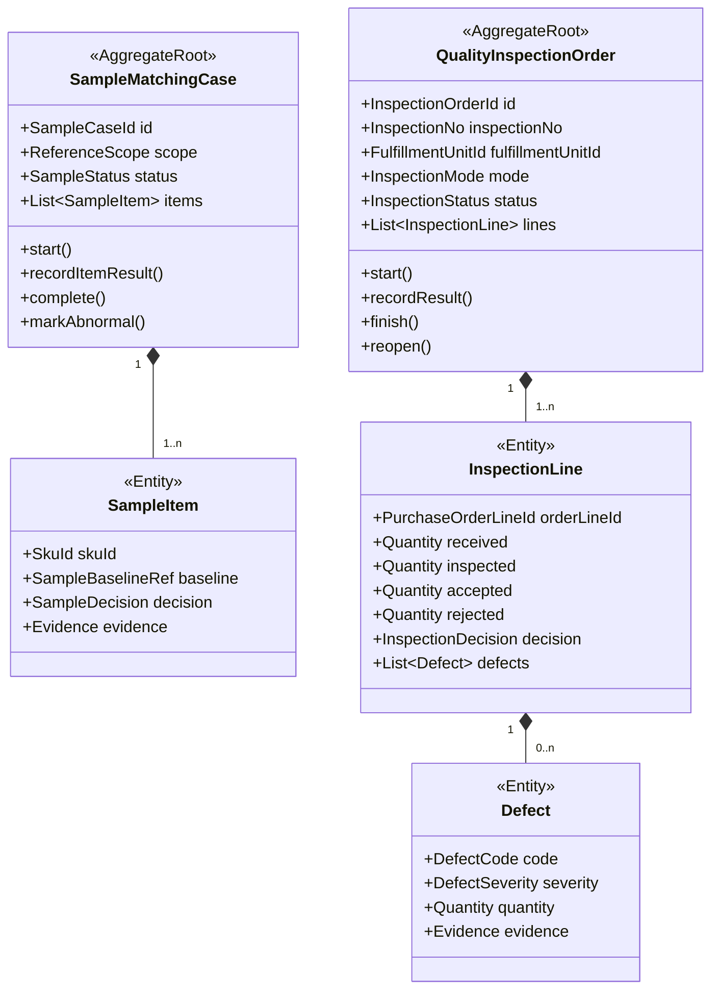

# 质量检验上下文详细设计（第二版）

## 1. 业务目标

质量检验上下文（Quality Inspection）管理样品对比、到货检验、不良品记录和质量处置，回答：

> 实际交付的货物是否符合约定标准，哪些数量可以接收，哪些需要拒收或让步接收。

## 2. 边界

拥有：

- 是否需要对样、抽检或全检的质量规则。
- 对样任务、样品基线和对样结论。
- 质检单、质检明细、不良原因和证据。
- 合格、拒收、返工、让步接收等质量决定。

不拥有：

- PO 商业审批。
- 仓库实际收货和库存状态。
- 供应商资质与商检资料。
- 差异赔付和财务扣款。

质量结果可以触发仓储、结算和协同动作，但不能直接修改对方数据表。

## 3. 聚合



对样和到货质检是两个聚合：对样可能发生在生产或发运前；质检针对实际到货/收货批次。

## 4. 核心不变量

1. 质检单必须关联一个明确的 `fulfillmentUnitId` 和来源单号。
2. 质检行只能引用该批次实际包含的订单行。
3. `inspectedQuantity <= receivedQuantity`。
4. `acceptedQuantity + rejectedQuantity <= receivedQuantity`。
5. 拒收数量大于零时必须记录原因和证据。
6. 所有必检行提交结论后才能完成质检单。
7. 抽检/全检模式及标准在开始后形成版本快照。
8. 已完成质检的更正必须 `reopen` 并保留原结论。
9. `CONCESSION_ACCEPTED` 必须记录审批或授权依据。

## 5. 状态

对样：

```text
NOT_STARTED → IN_PROGRESS → PASSED
                         ↘ ABNORMAL
                         ↘ NOT_ARRIVED
```

质检单：

```text
PENDING → IN_PROGRESS → PENDING_DECISION → COMPLETED
                       ↘ SUSPENDED
COMPLETED → REOPENED → IN_PROGRESS
```

质检行决定：

- `ACCEPTED`
- `REJECTED`
- `PARTIALLY_ACCEPTED`
- `CONCESSION_ACCEPTED`
- `REWORK_REQUIRED`

## 6. 命令

- `EvaluateQualityRequirements`
- `CreateSampleMatchingCase`
- `RecordSampleItemResult`
- `CompleteSampleMatching`
- `CreateInspectionFromReceipt`
- `StartQualityInspection`
- `RecordInspectionLineResult`
- `RecordDefect`
- `SubmitInspectionDecision`
- `FinishQualityInspection`
- `ReopenQualityInspection`

## 7. 事件

- `SampleMatchingRequired`
- `SampleMatchingPassed`
- `SampleMatchingAbnormal`
- `QualityInspectionRequired`
- `QualityInspectionStarted`
- `InspectionLineAccepted`
- `InspectionLineRejected`
- `QualityInspectionCompleted`
- `QualityInspectionReopened`
- `GoodsAcceptedForSettlement`
- `GoodsRejectedByQuality`

`GoodsAcceptedForSettlement` 按订单行携带可结算数量，不要求结算上下文理解质检内部枚举。

## 8. 端口

- `QualityStandardPort`
- `GoodsCatalogPort`
- `ReceiptBatchPort`
- `SampleBaselinePort`
- `EvidenceStoragePort`
- `QualityAuthorizationPort`
- `QualityEventOutboxPort`

## 9. 数据表

- `quality_sample_case`
- `quality_sample_item`
- `quality_inspection_order`
- `quality_inspection_line`
- `quality_defect`
- `quality_evidence`
- `quality_decision_log`

图片和报告保存文件引用，不把二进制内容写入聚合表。

## 10. 旧模型迁移

现有 `scm-order-service` 已有较强的对样和质检模型。重构目标是把完整的质量检验上下文迁入新采购服务的 `qualityinspection` 模块，同时保持它与 `ordering` 聚合隔离：

| 旧模型 | 新模型 |
|---|---|
| `rt_quality_inspection` | `QualityInspectionOrder` |
| `rt_quality_inspection_detail` | `InspectionLine` |
| `rt_quality_inspection_defective` | `Defect` |
| Sample Management | `SampleMatchingCase` |
| 采购单/装柜明细来源枚举 | `ReferenceScope + fulfillmentUnitId` |
| 单一已质检状态 | 质检单状态 + 行决定 |

迁移步骤：

1. 冻结旧对样/质检接口、状态和消息契约，建立 `legacyorderquality` ACL。
2. 将历史数据迁入新质量表，使用旧单号作为 `legacyReference`。
3. 通过旧事件或 CDC 增量同步，并进行质检单、明细、拒收数量和附件差异校验。
4. 先影子执行新质量规则，再按来源类型切换写入：采购订单、装柜明细、仓间调拨。
5. 新模块成为唯一写入方后，由兼容事件维持旧查询，最终停止旧质量表写入。

迁入同一个服务不代表并入 `PurchaseOrder` 聚合。`ordering` 与 `qualityinspection` 仍通过应用端口和事件协作，禁止直接修改对方表。
