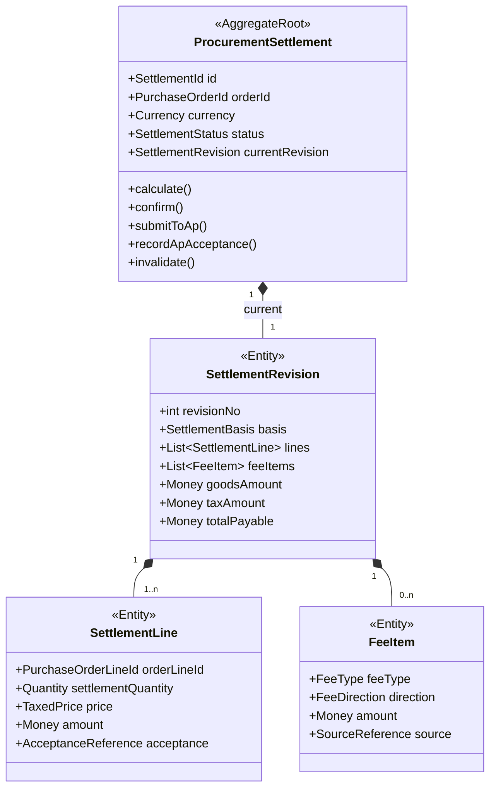

# 采购结算上下文详细设计（第二版）

## 1. 业务目标

采购结算上下文（Procurement Settlement）把采购订单、价格变更、验收数量、费用和差异事实转换为可提交给 AP 的应付依据。

它回答：

- 本次按什么数量和价格结算。
- 包含哪些商品金额、税额和附加费用。
- 当前计算版本是否已确认并提交财务。

它不负责实际付款。

## 2. 边界

拥有：

- 结算依据快照及其来源版本。
- 商品、物料、赠品和路线费用计算。
- 税额、含税/不含税金额和币种汇总。
- 结算版本、确认与提交 AP 的状态。

不拥有：

- PO 商业条款的原始事实。
- 仓库和质检原始数量。
- 财务付款、核销和银行流水。

## 3. 聚合



已确认版本不直接覆盖。发生调价、补入库或质检更正时创建新的 `SettlementRevision`。命令事务只加载当前有效版本；历史版本作为不可变审计记录由查询仓储读取，避免聚合随结算次数持续膨胀。

## 4. 结算依据

`SettlementBasis` 至少记录：

- PO 及订单版本。
- 订单行价格版本。
- 可结算数量来源事件和版本。
- 质检接收/拒收数量。
- 差异处理结果。
- 税率与税务规则版本。
- 路线、交付条款和费用规则版本。

这样可以解释“为什么这次应付金额是这个数”，并支持重算。

## 5. 核心不变量

1. 一个结算聚合只处理一个供应商、采购主体和币种组合。
2. 结算数量不得超过已验收数量与允许预付数量之和。
3. 拒收数量不能进入普通应付行。
4. 同一来源事实版本只能入账一次。
5. `含税金额 = 不含税金额 + 税额`，遵守统一舍入规则。
6. 已确认版本不可原地修改，只能生成新版本或冲销。
7. 提交 AP 前所有费用项必须有类型和来源。
8. AP 幂等键使用 `settlementId + revisionNo`。

## 6. 状态

```text
WAITING_FOR_BASIS
→ CALCULATED
→ CONFIRMED
→ SUBMITTING_TO_AP
→ AP_ACCEPTED
→ SETTLED
```

辅助状态：

- `RECALCULATION_REQUIRED`
- `AP_REJECTED`
- `INVALIDATED`

`SETTLED` 由财务/AP 事件投影，不代表采购结算上下文执行了付款。

## 7. 命令

- `InitializeSettlement`
- `ApplyAcceptedQuantity`
- `ApplyPriceAdjustment`
- `ApplyFeeFact`
- `RecalculateSettlement`
- `ConfirmSettlementRevision`
- `SubmitSettlementToAp`
- `RecordApAcceptance`
- `RecordApRejection`
- `InvalidateSettlement`

## 8. 事件

消费：

- `PurchaseOrderEffective`
- `PurchaseOrderPriceAdjusted`
- `PurchaseOrderTerminated`
- `GoodsAcceptedForSettlement`
- `GoodsInbounded`
- `ProcurementDiscrepancyResolved`

发布：

- `ProcurementSettlementInitialized`
- `SettlementCalculated`
- `SettlementRecalculationRequired`
- `SettlementConfirmed`
- `SettlementSubmittedToAp`
- `SettlementAcceptedByAp`
- `SettlementRejectedByAp`

## 9. 领域策略与端口

策略：

- `SettlementQuantityPolicy`
- `GiftSettlementPolicy`
- `TaxCalculationPolicy`
- `RouteFeePolicy`
- `DdpFeePolicy`
- `TransitFeePolicy`
- `CabinetFeePolicy`

端口：

- `PurchaseOrderCommercialSnapshotPort`
- `AcceptanceFactPort`
- `TaxRulePort`
- `FeeFactPort`
- `AccountsPayablePort`
- `SettlementEventOutboxPort`

策略按费用类型组合，不再把所有路线差异塞入一条继承链。

## 10. 数据表

- `procurement_settlement`
- `procurement_settlement_revision`
- `procurement_settlement_line`
- `procurement_settlement_fee_item`
- `procurement_settlement_source_fact`
- `procurement_settlement_submission`

`source_fact` 对来源事件建立唯一约束，保证重放不重复计费。

## 11. 旧模型迁移

| 旧模型 | 新模型 |
|---|---|
| `rt_order_fee_info` | 结算行与费用项 |
| `PoSettlementInfo` | 结算计算输入快照 |
| `SettlementContext/Handler/Strategy` | 明确的领域策略组合 |
| `csfStatus` | AP 提交流程状态 |
| PO/PSO 状态决定计费 | 来源事实和规则版本决定计费 |

历史迁移必须保留旧计算时间、数量、金额和推送状态，同时补充 `basisVersion = LEGACY`。
