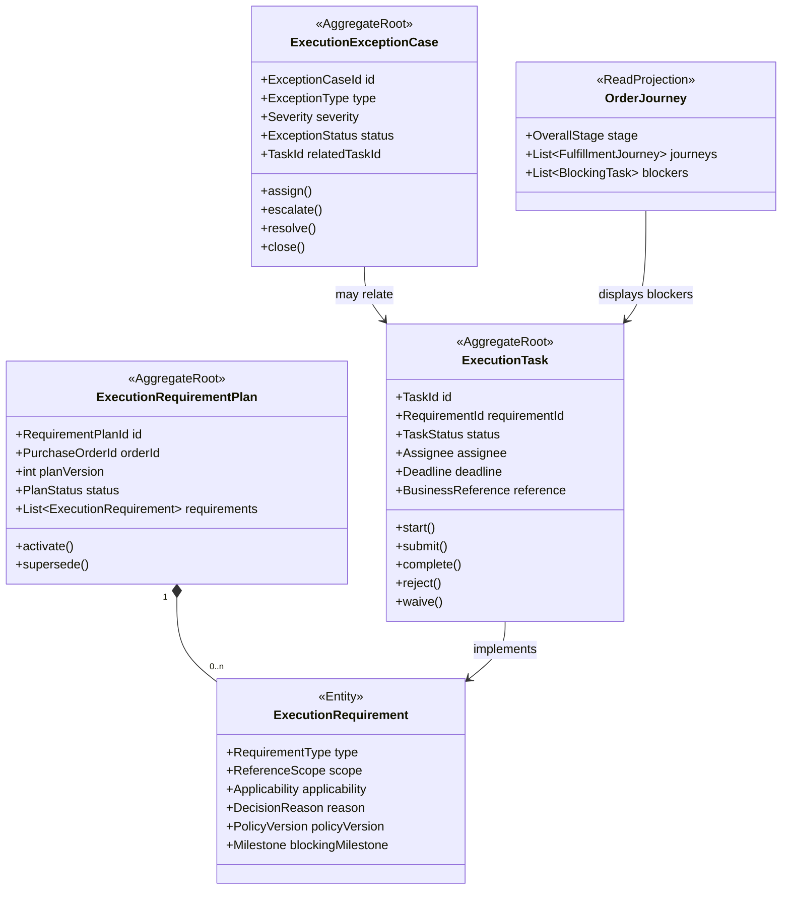

# 采购履约协同上下文详细设计（第二版）

## 1. 业务目标

采购履约协同上下文（Procurement Fulfillment Collaboration）组织采购、供应商、仓储、物流和质量人员完成跨上下文工作。

它回答：

- 这张订单需要完成哪些事项。
- 谁负责、何时完成、阻塞哪个节点。
- 当前有哪些超期或异常。
- 各发运批次走到哪个里程碑。

## 2. 边界

拥有：

- 履约要求计划和规则决策快照。
- 协同任务、负责人、截止时间和任务状态。
- 豁免、催办、升级和通知记录。
- 任务或旅程偏差产生的异常事项。
- 订单旅程和里程碑投影。

不拥有：

- 资质文件、质检报告。
- 仓储预约单、装柜单、发运单。
- PO 商业状态。
- 外部系统事实的原始状态。

## 3. 聚合与投影



要求计划、任务和异常分别是独立聚合，避免一个 PO 的大量任务造成巨大事务边界。旅程是可重建投影。

## 4. 核心不变量

1. 同一 `orderId + orderVersion` 只有一个有效要求计划。
2. 每条要求必须记录适用结论、判断原因和规则版本。
3. `NOT_REQUIRED` 要求不能生成执行任务。
4. 相同 `requirementId + taskType + scopeId` 只能有一个活动任务。
5. 外部任务状态只能由来源事件或授权人工操作更新。
6. `WAIVED` 必须记录原因、操作人和审批引用。
7. 相同偏差业务键只能生成一个未关闭异常。
8. 已发生的旅程里程碑不可删除；更正使用反向或更正事件。

## 5. 任务与异常状态

任务：

```text
NOT_STARTED → IN_PROGRESS → SUBMITTED → COMPLETED
                         ↘ REJECTED → IN_PROGRESS
NOT_STARTED / IN_PROGRESS / REJECTED → WAIVED
```

异常：

```text
OPEN → ASSIGNED → PROCESSING → RESOLVED → CLOSED
                       ↘ ESCALATED → PROCESSING
```

任务完成后，关联异常可以自动进入 `RESOLVED`，但是否关闭可由规则或责任人确认。

## 6. 要求类型

- `WAREHOUSE_RESERVATION`
- `SAMPLE_IMAGE_UPLOAD`
- `QUALIFICATION_DOCUMENT_UPLOAD`
- `CONTAINER_LOADING`
- `SAMPLE_MATCHING`
- `QUALITY_INSPECTION`
- `COMMODITY_INSPECTION`

作用范围必须明确：

- `ORDER`
- `ORDER_LINE`
- `SHIPMENT`
- `RECEIPT_BATCH`

约仓、装柜和质检通常不能只使用 `ORDER` 范围。

## 7. 命令

- `BuildExecutionRequirementPlan`
- `ReevaluateExecutionRequirements`
- `CreateExecutionTasks`
- `AssignExecutionTask`
- `SubmitExecutionTask`
- `CompleteExecutionTask`
- `RejectExecutionTask`
- `WaiveExecutionTask`
- `OpenExecutionException`
- `AssignExecutionException`
- `EscalateExecutionException`
- `ResolveExecutionException`
- `SendFollowupReminder`
- `ProjectJourneyMilestone`

## 8. 事件

消费：

- `PurchaseOrderEffective`
- `PurchaseOrderChanged`
- `SupplierShipmentDispatched`
- `WarehouseReservationCompleted`
- `ContainerLoaded`
- `QualificationTaskChanged`
- `SampleMatchingChanged`
- `QualityInspectionChanged`
- `GoodsReceived`
- `GoodsInbounded`

发布：

- `ExecutionRequirementPlanCreated`
- `ExecutionTaskCreated`
- `ExecutionTaskCompleted`
- `ExecutionTaskWaived`
- `DispatchGateChanged`
- `ExecutionExceptionOpened`
- `ExecutionExceptionEscalated`
- `ExecutionExceptionResolved`
- `JourneyMilestoneProjected`

## 9. 端口

- `RequirementPolicyPort`
- `ExternalTaskReferencePort`
- `AssigneeDirectoryPort`
- `NotificationPort`
- `EscalationRulePort`
- `BusinessCalendarPort`
- `CollaborationEventOutboxPort`

要求策略由资质、质量、仓储和物流领域提供；协同上下文负责保存本次订单的决策快照。

## 10. 数据表

- `po_execution_requirement_plan`
- `po_execution_requirement`
- `po_execution_task`
- `po_execution_task_evidence`
- `po_execution_exception`
- `po_execution_followup_record`
- `po_journey`
- `po_journey_milestone`

定时扫描只负责发现到期任务并发出领域命令，不能直接批量改状态。

## 11. 旧模型迁移

| 旧能力 | 新模型 |
|---|---|
| `PoNodeStatusService` | 任务状态 + 旅程投影 |
| `PurchaseOrderReadyService` | 要求计划与供应商任务查询 |
| `rt_exception_record` | `ExecutionExceptionCase` |
| `rt_purchase_overdue` | 里程碑 SLA 与异常 |
| `rt_followup_notice_record` | `FollowupRecord` |
| 资质/商检/约仓/装柜状态列 | 对应任务或里程碑 |

详细的要求判断、阻塞规则和物流节点计算见 [[15-履约要求任务与订单旅程设计-第二版]]。

