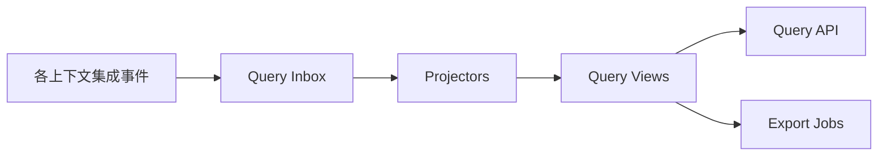

# 采购查询上下文详细设计（第二版）

## 1. 业务目标

采购查询上下文（Procurement Query）把七个上下文和外部系统的事实组织成面向用户的列表、详情、工作台、看板和导出视图。

它只回答“现在显示什么”，不决定业务是否允许执行。

## 2. 边界

拥有：

- 查询视图结构和投影逻辑。
- 搜索、分页、排序和导出。
- 数据水位、投影重建和差异校验。
- 面向角色的数据权限过滤。

不拥有：

- 任何命令状态机。
- PO、任务、质检或结算事实。
- 通过页面编辑反向直接更新读表。

## 3. 读模型

### 3.1 采购订单列表

`PurchaseOrderListView`：

- PO 基础信息、供应商、目的地和金额。
- 订单状态、审批状态。
- 履约总体阶段。
- 必做任务完成数、阻塞任务数。
- 异常数量和最高严重级别。
- 结算状态。

### 3.2 采购订单详情

`PurchaseOrderDetailView`：

```text
order
├── lines[]
├── sourceRequisitions[]
├── changes[]
├── supplierCommitments[]
├── shipments[]
├── qualitySummary
├── settlementSummary
├── requirements[]
├── tasks[]
├── exceptions[]
└── journeys[]
```

### 3.3 工作台

- `PlannerWorkbenchView`：待审批、待分配供应商、待转 PO。
- `BuyerWorkbenchView`：待提交、审批驳回、待处理异常。
- `SupplierWorkbenchView`：待确认、待上传、待发货任务。
- `QualityWorkbenchView`：待对样、待质检、异常质检。
- `SettlementWorkbenchView`：待计算、待确认、AP 驳回。

## 4. 投影架构



每类事件由独立 projector 处理：

- `PlanningProjector`
- `OrderingProjector`
- `SupplierFulfillmentProjector`
- `QualityProjector`
- `SettlementProjector`
- `CollaborationProjector`

## 5. 投影规则

1. 以 `eventId` 幂等。
2. 以 `aggregateVersion` 防止旧事件覆盖新数据。
3. 跨聚合不假设全局事件顺序。
4. 缺少前置数据时进入 pending projection，等待补偿或重放。
5. 视图字段必须记录来源上下文和最后事件版本。
6. 投影逻辑必须可从事件或权威快照重建。

## 6. 查询一致性

普通列表接受最终一致。用户刚完成命令后的详情需要读己之写时，采用：

- 命令响应直接返回必要结果。
- 响应携带 `writeVersion`。
- 查询接口支持等待投影水位达到该版本，设置短超时。
- 超时则返回“处理中”及当前水位，不回退到跨服务实时拼装。

不建议在列表请求中同步调用供应商、仓储、质量和结算服务。

## 7. 查询接口

- `GET /purchase-orders`
- `GET /purchase-orders/{orderNo}`
- `GET /purchase-orders/{orderNo}/execution`
- `GET /workbenches/planner`
- `GET /workbenches/buyer`
- `GET /workbenches/supplier`
- `GET /workbenches/quality`
- `GET /workbenches/settlement`
- `POST /purchase-orders/exports`
- `GET /query-projection/watermark`

筛选条件使用稳定业务字段，禁止允许客户端传任意 SQL 列名或排序表达式。

## 8. 数据表与索引

- `q_purchase_order_list`
- `q_purchase_order_detail`
- `q_purchase_order_line`
- `q_purchase_order_execution`
- `q_supplier_workbench`
- `q_buyer_workbench`
- `q_quality_workbench`
- `q_settlement_workbench`
- `q_projection_inbox`
- `q_projection_checkpoint`
- `q_projection_failure`

常用组合索引按真实查询验证，例如：

```text
(buyer_org_id, order_status, created_at)
(supplier_id, fulfillment_stage, promised_date)
(destination_id, next_milestone, expected_at)
(exception_severity, exception_status, owner_id)
```

## 9. 权限

读模型冗余：

- 采购组织。
- 供应商 ID。
- 国家/区域。
- 数据所属人与协同参与人。

查询前按用户数据范围构建过滤条件。不能先查出全部数据再在 Java 内存中过滤。

敏感字段如价格、税率、供应商银行信息按角色控制字段返回。

## 10. 导出

导出使用查询快照：

1. 创建导出任务并保存查询条件和权限快照。
2. 记录开始时的投影水位。
3. 分页读取读模型生成文件。
4. 保存文件引用和导出审计。

导出不能重新执行领域规则，也不能为补字段实时调用多个下游服务。

## 11. 监控与重建

指标：

- 各 projector 延迟和失败数。
- 当前事件水位及最大滞后。
- pending projection 数量。
- 列表/详情 P95 和 P99。
- 读模型与权威源抽样差异率。

重建：

- 按视图和业务时间分区重建。
- 新旧版本使用蓝绿表或版本列。
- 校验通过后原子切换查询版本。

## 12. 旧模型迁移

以下逻辑迁入查询上下文：

- `PurchaseOrderService` 中列表和详情 DTO 拼装。
- `HomePageService`。
- 供应商首页、异常看板和统计。
- Excel/PDF 查询和导出数据准备。

迁移期间可以从旧表初始化读模型，再消费新旧事件增量更新。查询上下文不得成为新命令的写入入口。

