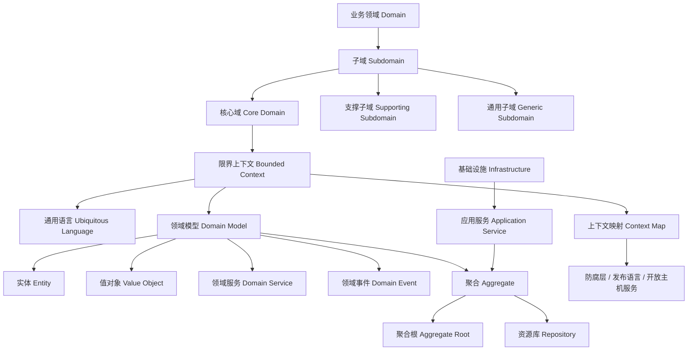

---
aliases:
  - DDD核心概念地图
tags:
  - DDD
  - 领域建模
---

# DDD核心概念地图

## 这个文件的作用

这个文件是“地图”，不是“正文”。它帮助你在读章节之前先知道各个概念的位置关系。你不需要在这里把每个概念都学透，只需要知道：

- 哪些概念属于战略设计。
- 哪些概念属于战术设计。
- 哪些概念负责架构隔离。
- 哪些概念负责跨上下文集成。
- 读某一章时，它在整张图的哪个位置。

使用方式：

```text
读章节前：先看地图，知道这一章讲的是哪一块
读章节中：遇到术语时回来定位
读章节后：检查这一章和其他概念的关系
```

## 一句话总览

DDD 的主线是：用通用语言描述业务，用限界上下文划清模型边界，用聚合保护业务一致性，用架构把技术细节隔离在领域模型外面。



## 战略设计

| 概念 | 初学者解释 | 判断问题 |
|---|---|---|
| 领域 | 业务问题空间，不是系统菜单 | 这个系统到底在帮业务解决什么问题？ |
| 子域 | 领域内部的能力分区 | 哪些能力最核心，哪些只是辅助？ |
| 核心域 | 最能形成业务差异化的部分 | 这个能力做不好，公司是否会失去竞争力？ |
| 限界上下文 | 一个模型和一套语言的边界 | 同一个词在这里是否只有一个清晰含义？ |
| 通用语言 | 业务和开发共同使用的模型语言 | 代码、文档、会议里是否使用同一批词？ |
| 上下文映射 | 多个上下文之间的关系图 | 两个模型之间是合作、依赖、遵奉，还是需要翻译？ |

## 战术设计

| 概念 | 初学者解释 | 判断问题 |
|---|---|---|
| 实体 | 有身份、有生命周期的业务对象 | 换了属性以后，它还是不是同一个对象？ |
| 值对象 | 用值描述的不可变概念 | 两个对象值相同，是否就可视为相同？ |
| 领域服务 | 不自然属于某个实体/值对象的领域行为 | 这个操作是业务规则，还是技术动作？ |
| 领域事件 | 业务上已经发生、值得其他部分知道的事实 | 这件事发生后，其他人/系统是否要响应？ |
| 模块 | 按业务概念组织模型代码的容器 | 包名是否表达业务语言，而不是纯技术分层？ |
| 聚合 | 事务一致性边界 | 哪些对象必须在一次业务操作中保持一致？ |
| 工厂 | 封装复杂创建过程 | 创建对象是否需要保护业务规则或隐藏复杂性？ |
| 资源库 | 保存和获取聚合的集合式接口 | 调用方是否把它当数据库查询器误用了？ |

## DDD 和传统三层 CRUD 的区别

| 维度 | 传统 CRUD 思路 | DDD 思路 |
|---|---|---|
| 起点 | 数据表 | 业务语言和业务规则 |
| 服务层 | 事务脚本、流程编排、SQL 包装 | 应用服务编排用例，领域规则放模型内 |
| 对象 | DTO/Entity 常常只是字段容器 | 实体和值对象承载行为和不变量 |
| 边界 | 按系统或表划分 | 按限界上下文和聚合划分 |
| 集成 | 直接共享表、共享对象、共享接口 | 通过上下文映射、事件、防腐层、发布语言集成 |

## 初学者最重要的顺序

1. 先能说清楚业务词汇。
2. 再能划出限界上下文。
3. 再能识别实体和值对象。
4. 再能设计聚合边界。
5. 最后再考虑 Repository、ORM、消息、缓存、REST、CQRS。

## 常见误解

- 误解：用了 Entity、Repository 就是 DDD。
  正解：没有通用语言和限界上下文，通常只是 DDD-Lite。
- 误解：DDD 一定很重，只适合大系统。
  正解：DDD 首先是一种控制复杂度的思维，复杂业务的小系统也需要。
- 误解：领域模型必须和数据库表一一对应。
  正解：领域模型表达业务概念，数据库只是持久化方案。
- 误解：所有业务逻辑都放 service。
  正解：属于实体或值对象的不变量应放回模型内部。
