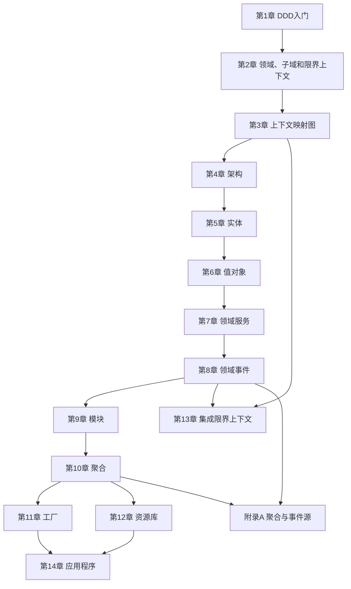

---
aliases:
  - IDDD逐章精读总览
  - 实现领域驱动设计逐章精读审核
tags:
  - DDD
  - 章节精读
  - 学习导航
---

# 逐章精读总览与审核

> 这个文件是 `02-逐章精读` 的入口。它不替代任何章节，而是告诉你每章为什么读、读完要产出什么、章节之间如何连接。

## 审核结论

当前逐章精读内容可以继续使用，但学习方式需要更明确。

已经具备：

- 每章一个独立文件，覆盖第1章到第14章和附录A。
- 每章都有学习目标、核心概念、初学者解释、Java落地、常见误区、练习和阅读检查。
- 战略设计、战术设计、架构、集成、应用层之间有双链连接。

还需要注意：

- 不要把章节当成百科词条孤立阅读，要按依赖关系推进。
- 每章读完必须有产出，否则容易停留在“看懂了”的错觉。
- 主题复盘在 `03-主题复盘`，不要和逐章精读混用。
- 代码落地在 `05-工程落地`，不要过早用代码细节替代建模思考。

## 推荐阅读依赖

## 每章读完要产出什么

| 章节 | 读完要能回答 | 最小产出 |
|---|---|---|
| [[01-第01章-DDD入门]] | 我的项目为什么需要或不需要 DDD？ | 一段“项目复杂度说明” |
| [[02-第02章-领域子域和限界上下文]] | 我的业务有哪些子域和模型边界？ | 子域划分表、限界上下文列表 |
| [[03-第03章-上下文映射图]] | 上下文之间谁依赖谁，谁翻译谁？ | 一张上下文映射图 |
| [[04-第04章-架构]] | 架构是否保护了领域模型？ | 一张分层/六边形架构草图 |
| [[05-第05章-实体]] | 哪些对象有身份和生命周期？ | 一个实体生命周期表 |
| [[06-第06章-值对象]] | 哪些基础字段应变成业务值？ | 3个值对象设计 |
| [[07-第07章-领域服务]] | 哪些行为不属于单个实体/值对象？ | 一个领域服务判断说明 |
| [[08-第08章-领域事件]] | 哪些业务事实值得发布？ | 命令-事件-消费者表 |
| [[09-第09章-模块]] | 代码包是否体现通用语言？ | 一个按业务概念组织的包结构 |
| [[10-第10章-聚合]] | 哪些规则必须强一致？ | 一个聚合设计说明 |
| [[11-第11章-工厂]] | 哪些创建过程需要封装规则？ | 一个工厂方法设计 |
| [[12-第12章-资源库]] | Repository 是否面向聚合而不是表？ | 一个 Repository 接口 |
| [[13-第13章-集成限界上下文]] | API、事件、防腐层如何选择？ | 一个集成决策表 |
| [[14-第14章-应用程序]] | 应用服务如何编排用例？ | 一个应用服务流程 |
| [[15-附录A-聚合与事件源]] | 是否真的需要事件源？ | 一个事件源适用性判断 |

## 精读完成标准

读完一章不等于完成一章。完成一章至少满足：

1. 能用自己的话解释本章核心概念。
2. 能说出本章反对的常见错误做法。
3. 能给出一个真实项目例子。
4. 能完成本章的最小产出。
5. 能把产出链接到 [[01-初学者阅读日志]]。

## 审核后的优化建议

后续如果继续深化，优先做这三件事：

1. 给每章增加一个真实业务案例，例如订单、库存、售后、仓储。
2. 给第5-12章补更多 Java 代码片段，尤其是聚合、Repository、应用服务之间的协作。
3. 结合你自己的项目，再新增一个“供应链/零售业务 DDD 实战案例”目录。

## 关联

- [[00-实现领域驱动设计-学习导航]]
- [[01-初学者阅读日志]]
- [[02-DDD核心概念地图]]
- [[01-DDD落地练习-以项目管理SaaS为例]]
- [[01-Java落地代码骨架]]
