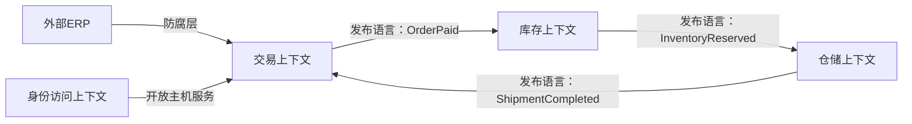
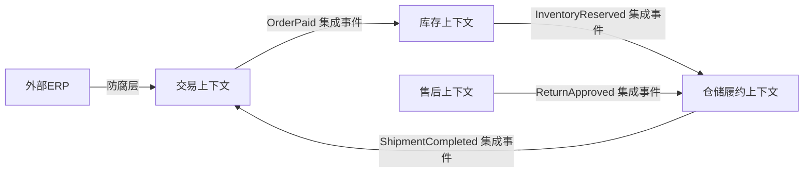

---
aliases:
  - IDDD第3章上下文映射图
  - 上下文映射图
tags:
  - DDD
  - 章节精读
  - 上下文映射
  - 战略设计
---

# 第03章：上下文映射图

> 本章目标：学会描述多个限界上下文之间的关系，避免模型边界画出来之后又在集成时被打穿。

## 本章在全书中的位置

第2章解决“边界在哪里”，第3章解决“边界之间怎么相处”。上下文映射图不是系统部署图，也不是服务调用链图，它是模型关系图。

## 一句话理解

上下文映射图描述不同限界上下文之间的协作、依赖、翻译和保护关系。

## 本章精读路线

读本章时，不要只记关系名称，而要学会为每条系统关系做判断：

```text
谁是上游？
谁是下游？
谁定义语言？
谁承担变化成本？
是否需要翻译？
是否允许共享？
失败时谁负责补偿？
```

上下文映射图的重点不是画得漂亮，而是把这些关系说清楚。

## 从系统调用图升级为上下文映射图

系统调用图通常长这样：

```text
订单服务 → 库存服务 → 仓储服务 → 通知服务
```

上下文映射图要多回答三类问题：

| 维度 | 系统调用图 | 上下文映射图 |
|---|---|---|
| 语义关系 | 谁调用谁 | 谁定义模型语言，谁翻译谁 |
| 组织关系 | 服务依赖 | 团队合作、上下游、供应方客户方 |
| 演进关系 | 接口调用 | 变化如何传播，边界如何保护 |

例如“交易上下文通知库存上下文”还不够，要说明它通过 `OrderPaid` 事件发布已支付事实，库存上下文只接收必要信息，不依赖交易订单内部模型。

## 关系选择指南

| 场景 | 推荐关系 |
|---|---|
| 外部系统模型混乱，但必须接入 | 防腐层 |
| 上游能力稳定，要服务多个下游 | 开放主机服务 + 发布语言 |
| 两个团队共同负责一个很小的稳定模型 | 共享内核 |
| 下游没有能力影响上游，只能接受 | 遵奉者 |
| 两个上下文都很核心，且必须频繁协作 | 合作关系 |
| 集成成本高，业务收益低 | 各行其道 |
| 遗留系统没有边界，什么都混在一起 | 大泥球，先隔离再重构 |

## 防腐层的翻译粒度

防腐层不只是字段改名。它可能包含：

- 名称翻译：`sku_code` → `SkuId`
- 类型翻译：字符串金额 → `Money`
- 语义翻译：外部 `status=2` → 本地 `PaymentCompleted`
- 模型拆分：外部 `OrderDTO` → 本地 `SalesOrder`、`FulfillmentRequest`
- 规则屏蔽：外部无效状态不进入本地模型

如果只是把 DTO 拷贝一遍，通常还不算真正防腐。

## 为什么需要上下文映射

真实系统里，没有哪个上下文能完全孤立存在。交易要通知库存，库存要通知仓储，仓储要回传发货结果，售后要读取订单和履约信息。

如果不显式设计关系，集成会慢慢退化为：

- 直接共享数据库
- 复制对方 DTO
- 到处写字段转换
- 下游被上游模型牵着走
- 核心域被外部系统污染

上下文映射图的价值是让这些关系可见、可讨论、可治理。

## 常见上下文关系

| 关系 | 解释 | 适用场景 | 风险 |
|---|---|---|---|
| 合作关系 | 两个团队共同演进接口和模型 | 双方目标一致、沟通顺畅 | 依赖沟通质量 |
| 共享内核 | 少量模型共享 | 共享范围很小且稳定 | 容易扩大成大共享模型 |
| 客户方-供应方 | 下游依赖上游 | 上游提供明确能力 | 下游受上游排期影响 |
| 遵奉者 | 下游接受上游模型 | 上游强势，改造成本可接受 | 下游模型可能不自然 |
| 防腐层 | 下游翻译上游模型 | 外部模型粗糙或不受控 | 增加翻译成本 |
| 开放主机服务 | 上游提供稳定协议 | 多个下游接入 | 需要版本治理 |
| 发布语言 | 公开交换格式 | 事件、API、文件交换 | 设计不当会泄漏内部模型 |
| 各行其道 | 不做或少做集成 | 集成收益小于成本 | 可能重复建设 |
| 大泥球 | 边界混乱 | 遗留系统常见 | 需要逐步隔离 |

## 防腐层最重要

防腐层不是“写个 adapter”这么简单，它的目的是保护本地通用语言。

```text
外部系统模型
→ 翻译
→ 本地上下文语言
→ 本地领域模型
```

例如外部 ERP 只有一个 `OrderDTO`，本地可能需要拆成：

- `PurchaseOrder`
- `SalesOrder`
- `FulfillmentOrder`
- `ReturnOrder`

如果直接沿用 ERP 的 `OrderDTO`，本地模型就被外部语言污染了。

## 上下文映射示例



每条线都要回答：

- 上游是谁？
- 下游是谁？
- 关系类型是什么？
- 用 API、事件、批处理还是共享库？
- 下游是否需要防腐层？
- 失败和重试怎么处理？

## Java落地

防腐层可以放在 infrastructure 或 acl 包：

```text
trade
  infrastructure
    acl
      erp
        ErpOrderClient
        ErpOrderTranslator
        ErpOrderDTO
```

领域层只接触本地语言：

```java
public record ExternalOrderSnapshot(
    String externalOrderNo,
    String buyerCode,
    Money totalAmount
) {
}
```

不要让 `ErpOrderDTO` 出现在领域层。

## 事件作为发布语言

领域事件可以成为上下文之间的发布语言，但要稳定、清晰、少泄漏内部实现。

好的事件名：

- `OrderPaid`
- `InventoryReserved`
- `ShipmentCompleted`

不好的事件名：

- `OrderTableUpdated`
- `OrderStatusChangedTo2`
- `SyncOrderMessage`

前者是业务事实，后者是技术细节或内部状态。

## 常见误区

- 把上下文映射图画成微服务调用图。
- 只画箭头，不说明关系类型。
- 所有集成都用同步接口。
- 外部 DTO 直接进入本地领域模型。
- 为了复用共享核心域模型。
- 事件设计过大，变成另一个共享数据库。

## 本章练习

选择一个系统，画出至少 4 个上下文：

| 上下文 | 上游/下游 | 关系类型 | 集成方式 | 是否需要防腐层 |
|---|---|---|---|---|
|  |  |  | API/事件/批处理 |  |

然后为每条关系写一句解释：

```text
交易上下文通过 OrderPaid 事件通知库存上下文，因为库存只需要知道订单已支付这个事实，不需要直接依赖交易订单模型。
```

## 阅读检查

- 我能解释防腐层解决什么问题吗？
- 我能区分发布语言和内部领域模型吗？
- 我能为每条上下文关系命名关系类型吗？
- 我知道什么时候不应该共享模型吗？

## 深化精读补充

### 逐节精读抓手

| 阅读块 | 要抓住的问题 | 学习产出 |
|---|---|---|
| 为什么需要上下文映射 | 边界之间如何协作 | 上下文关系列表 |
| 合作/共享/上下游 | 团队和模型谁依赖谁 | 关系类型标注 |
| 防腐层 | 如何保护本地模型语言 | 翻译规则 |
| 发布语言/开放主机服务 | 如何稳定对外暴露能力 | API或事件契约 |

### 供应链上下文映射示例



这张图不是调用链图。每条线都要写清：

- 交易上下文发布 `OrderPaid`，只表达订单已支付这个事实，不暴露交易订单内部结构。
- 库存上下文消费 `OrderPaid` 后自行决定如何预占，不接受交易上下文直接修改库存。
- 仓储上下文消费 `InventoryReserved` 后创建出库任务，不直接读取库存表。
- 外部 ERP 进入交易上下文必须经过防腐层，不能让 ERP 的订单状态污染本地订单模型。

### 集成关系决策模板

```text
关系名称：
上游上下文：
下游上下文：
关系类型：合作关系 / 客户方-供应方 / 防腐层 / 发布语言 / 开放主机服务 / 遵奉者
交换信息：
技术方式：API / 事件 / 批处理 / 文件
本地模型保护方式：
失败处理：
版本兼容：
```

### 防腐层例子

外部 ERP 返回：

```text
status = "2"
order_type = "A"
amount = "100.00"
currency = "RMB"
```

本地不应该直接使用这些字段，而是翻译成：

```text
ExternalOrderSnapshot
PaymentState
Money
TradeOrderType
```

这一步就是模型翻译，不是简单字段复制。

### 判断是否进入下一章

进入第4章前，你应该已经能说清楚哪些上下文需要同步 API，哪些上下文适合用事件，哪些上下文必须做防腐层。

## 关联

- [[02-第02章-领域子域和限界上下文]]
- [[01-战略设计-领域子域限界上下文与上下文映射]]
- [[04-第04章-架构]]
- [[11-第11章-工厂]]
