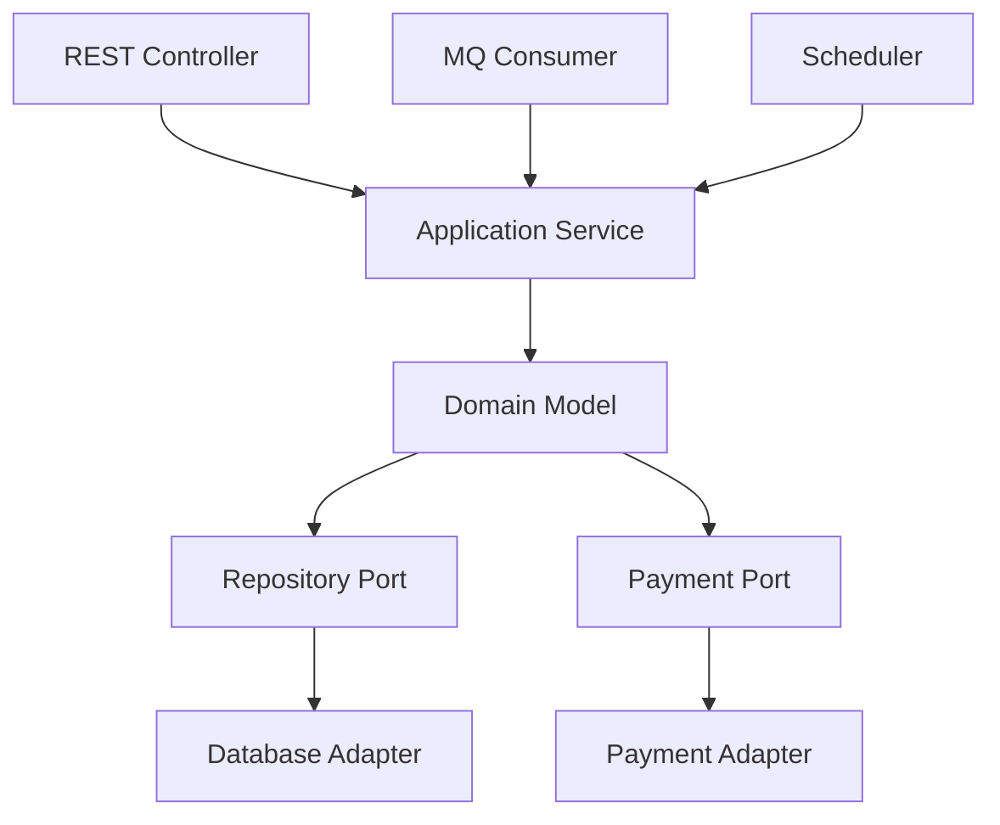

---
aliases:
  - IDDD第4章架构
  - DDD架构
tags:
  - DDD
  - 章节精读
  - 架构
  - 六边形架构
---

# 第04章：架构

> 本章目标：理解架构怎样保护领域模型，而不是让领域模型被框架、数据库和中间件牵着走。

## 本章在全书中的位置

前面三章关注战略设计，第4章把战略设计放进架构环境里。DDD 不排斥架构模式，但它要求架构为领域模型服务。

## 一句话理解

好的架构把领域模型放在中心，让 Web、数据库、消息、外部系统都通过清晰边界接入。

## 本章精读路线

读第4章时要不断问一个问题：这个架构选择是在保护领域模型，还是在替代领域模型？

很多团队会迷恋架构名词：

- 分层架构
- 六边形架构
- REST
- CQRS
- 事件驱动
- Saga
- 事件源

但 DDD 的关注点是：这些架构能否让业务规则保持清晰、可测试、可演进。

## 四层职责更细拆

| 层 | 可以做 | 不应该做 |
|---|---|---|
| 接口层 | 参数接收、协议转换、基础校验 | 写核心业务规则 |
| 应用层 | 用例编排、事务、权限、调用领域对象 | 维护聚合不变量 |
| 领域层 | 业务行为、状态流转、不变量、领域事件 | 调数据库、发HTTP、依赖框架细节 |
| 基础设施层 | ORM、MQ、缓存、第三方接口、文件 | 决定业务语义 |

一个简单判断：如果把 Spring、MyBatis、Kafka 都换掉，领域层大部分代码应该还能表达业务。

## 依赖方向示意

```text
interfaces  → application → domain
infrastructure → application/domain 的接口
domain 不依赖 infrastructure
```

领域层可以定义接口：

```java
public interface PaymentGateway {
    PaymentResult pay(PaymentRequest request);
}
```

基础设施层实现接口：

```java
public class AlipayPaymentGateway implements PaymentGateway {
}
```

这就是依赖倒置在 DDD 中的常见用法。

## 架构模式选择不要过度

| 场景 | 简单选择 | 复杂后再考虑 |
|---|---|---|
| 普通命令处理 | 分层 + 聚合 | CQRS |
| 单系统内部协作 | 应用事件 | MQ事件驱动 |
| 简单状态保存 | 当前状态持久化 | 事件源 |
| 短流程事务 | 本地事务 | Saga |
| 简单查询 | QueryService | 独立读模型/搜索引擎 |

DDD 不要求你一开始用所有高级架构。先让模型正确，再逐步增强架构。

## 分层架构

经典分层：

| 层 | 职责 |
|---|---|
| 接口层 | HTTP、RPC、MQ、定时任务等入口 |
| 应用层 | 用例编排、事务、权限、幂等、事件发布 |
| 领域层 | 业务概念、规则、不变量、领域事件 |
| 基础设施层 | 数据库、缓存、消息、外部系统、文件 |

关键不是目录，而是依赖方向：领域层不应该依赖基础设施层。

## 依赖倒置

领域层定义自己需要的能力：

```java
public interface OrderRepository {
    Optional<Order> findById(OrderId id);
    void save(Order order);
}
```

基础设施层实现它：

```java
public class MyBatisOrderRepository implements OrderRepository {
}
```

这样领域模型不需要知道 MyBatis、JPA、Redis、HTTP Client。

## 六边形架构

六边形架构也叫端口与适配器。它的核心是把领域模型放在中心。



端口是领域或应用需要的抽象，适配器是具体技术实现。

## REST与DDD

REST 是接口风格，不是领域模型。

错误倾向：

- 把 REST Resource 直接当聚合。
- URL 设计决定领域对象结构。
- DTO 直接进入领域层。

正确做法：

```text
HTTP Request
→ Request DTO
→ Command
→ Application Service
→ Domain Model
```

REST 负责对外表达，领域模型负责业务规则。

## CQRS

CQRS 将命令和查询分离。

| 类型 | 关注点 | 模型 |
|---|---|---|
| 命令 | 改变状态、保护规则 | 写模型、聚合 |
| 查询 | 读取数据、适配页面 | 读模型、DTO、视图 |

适合 CQRS 的信号：

- 写入规则复杂，读取形态也复杂。
- 页面查询和聚合结构差异很大。
- 报表、搜索、列表需要专门优化。
- 读写扩展需求不同。

不适合为了“高级”而使用 CQRS。

## 事件驱动架构

事件驱动适合跨上下文传播已经发生的业务事实。

示例：

```text
OrderPaid
→ InventoryReserved
→ ShipmentCreated
→ ShipmentCompleted
```

每个上下文只处理自己关心的事件，不共享内部模型。

## Saga / 长时处理过程

Saga 用来协调跨聚合、跨服务、跨事务的长流程。

例如：

```text
支付完成
→ 预占库存
→ 创建出库单
→ 通知用户
```

这个流程不应强行塞进一个数据库事务，而应通过状态机、事件或流程编排实现最终一致。

## 事件源

事件源用事件序列保存状态变化，而不是只保存当前状态。它适合对历史、审计、回放要求很高的模型，但复杂度也高。

先学会聚合和领域事件，再考虑事件源。

## Java项目落地结构

```text
order
  interfaces
    rest
    mq
  application
    command
    dto
    OrderApplicationService
  domain
    model
    service
    event
    repository
  infrastructure
    persistence
    messaging
    client
```

## 常见误区

- 领域层依赖 Spring、MyBatis、JPA 注解过重。
- 应用服务承担大量业务规则。
- Repository 变成通用查询 DAO。
- 事件被当成万能解耦工具。
- CQRS 用在简单 CRUD 上，增加复杂度。
- REST DTO 直接在领域模型中流转。

## 本章练习

画出你当前项目的架构流：

```text
入口
→ 应用服务
→ 领域对象
→ 资源库接口
→ 资源库实现
→ 数据库
```

并标出：

- 哪些依赖方向不合理？
- 哪些业务规则写错了层？
- 哪些 DTO 泄漏进领域层？
- 哪些查询应该拆成读模型？

## 阅读检查

- 我能解释六边形架构为什么适合 DDD 吗？
- 我能区分应用服务和领域服务吗？
- 我知道 CQRS 的成本吗？
- 我能判断一个流程是否适合事件驱动吗？

## 深化精读补充

### 逐节精读抓手

| 阅读块 | 要抓住的问题 | 学习产出 |
|---|---|---|
| 分层和依赖倒置 | 领域模型如何不依赖技术细节 | 依赖方向图 |
| 六边形架构 | 外部世界如何通过端口适配器接入 | 端口/适配器清单 |
| REST和DDD | API资源是否等于领域对象 | DTO到Command映射 |
| CQRS | 读写模型何时分离 | 命令模型和查询模型划分 |
| 事件驱动/Saga | 跨上下文流程如何最终一致 | 事件流和补偿策略 |

### 供应链架构落地示例

以“订单支付后预占库存”为例：

```text
接口层：PaymentCallbackController 接收支付回调
应用层：TradeApplicationService 标记订单已支付
领域层：Order.markPaid() 保护订单状态规则并产生 OrderPaid
基础设施层：OrderRepository 保存订单，EventPublisher 发布事件
库存上下文：InventoryApplicationService 消费 OrderPaid 并调用 Inventory.reserve()
```

关键点：

- 支付回调 DTO 不进入 `Order` 聚合。
- `Order` 不调用库存服务。
- 库存不直接读取交易订单表。
- 事件发布是应用层或基础设施层职责，不是聚合直接发 MQ。

### 六边形架构清单

```text
输入适配器：
- REST Controller
- MQ Consumer
- Scheduler

应用端口：
- SubmitOrderUseCase
- MarkOrderPaidUseCase

领域模型：
- Order
- Inventory
- ShipmentOrder

输出端口：
- OrderRepository
- PaymentGateway
- DomainEventPublisher

输出适配器：
- MyBatisOrderRepository
- AlipayPaymentGateway
- RocketMqDomainEventPublisher
```

### 本章学习产出模板

```text
用例名称：

入口适配器：
应用服务：
领域对象：
领域端口：
基础设施适配器：
产生的事件：
是否需要读模型：
是否需要Saga/流程编排：
```

### 判断是否进入下一章

进入战术设计前，你要能说清楚领域模型在架构中的位置。否则后面实体、值对象、聚合会很容易被 ORM、Controller DTO 或数据库表结构绑架。

## 关联

- [[02-架构与DDD]]
- [[03-第03章-上下文映射图]]
- [[05-第05章-实体]]
- [[12-第12章-资源库]]
