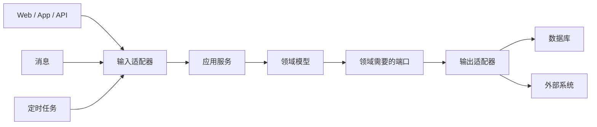

---
aliases:
  - 架构与DDD
tags:
  - DDD
  - 架构
  - 六边形架构
---

# 架构与DDD

## 这个文件的作用

这个文件是第4章的主题复盘，不是第4章正文。正式学习请先读 [[04-第04章-架构]]。

读完第4章后，再用这个文件回答一个问题：我当前项目的架构是在保护领域模型，还是让领域模型被框架、数据库、接口和消息中间件牵着走？

## 核心判断

架构不是 DDD 的替代品。好的架构应该保护领域模型，让模型少受数据库、Web 框架、消息中间件、缓存和第三方系统影响。

## 书中关注的架构风格

| 架构/模式 | 初学者理解 | 和 DDD 的关系 |
|---|---|---|
| 分层架构 | 表现层、应用层、领域层、基础设施层 | 最常见，但容易让 service 层变胖 |
| 依赖倒置 | 高层策略不依赖低层细节 | 让领域模型不直接依赖数据库和框架 |
| 六边形架构 | 领域模型在中心，外部通过端口和适配器接入 | 很适合表达“技术围绕业务” |
| SOA | 通过服务暴露业务能力 | 服务边界应尊重限界上下文 |
| REST | 用资源和 HTTP 约束设计接口 | 不能把 REST 资源误当领域模型 |
| CQRS | 命令和查询职责分离 | 适合复杂读写模型不同的场景 |
| 事件驱动 | 通过事件连接不同处理方 | 适合领域事件和上下文集成 |
| Saga/长时处理过程 | 跨事务、跨服务的流程协调 | 不要用一个大事务吞掉多个聚合 |
| 事件源 | 用事件序列重建状态 | 适合行为历史很重要的聚合 |

## 六边形架构的直觉



关键点：

- 应用服务负责用例编排。
- 领域模型负责业务规则。
- 基础设施负责技术实现。
- 外部系统模型不能直接污染领域模型。

## Java 项目中的建议分层

```text
com.example.order
  application
    OrderApplicationService
    command
    dto
  domain
    model
      order
      payment
    service
    event
    repository
  infrastructure
    persistence
    messaging
    client
  interfaces
    rest
    consumer
```

注意：这只是一个起点。包名最终要服从通用语言和限界上下文，而不是机械复制。

## 常见错误

- 把 controller、service、mapper 当成业务边界。
- 所有业务逻辑都堆在 application service。
- 领域对象只有 getter/setter，没有行为。
- Repository 暴露任意查询，退化成 DAO。
- 让数据库表结构决定聚合边界。
- 跨多个聚合做强事务，导致模型难以伸缩。

## 阅读检查

- 我能指出项目中哪些代码属于应用层、领域层、基础设施层吗？
- 领域层是否依赖 Spring、MyBatis、JPA、Redis、HTTP Client？
- 一个业务用例是否能从入口走到聚合，再走到资源库？
- 外部系统数据进入本系统时是否经过翻译？

## 关联

- [[01-战略设计-领域子域限界上下文与上下文映射]]
- [[架构设计师/5.软件架构设计/5.4. 软件架构风格]]
