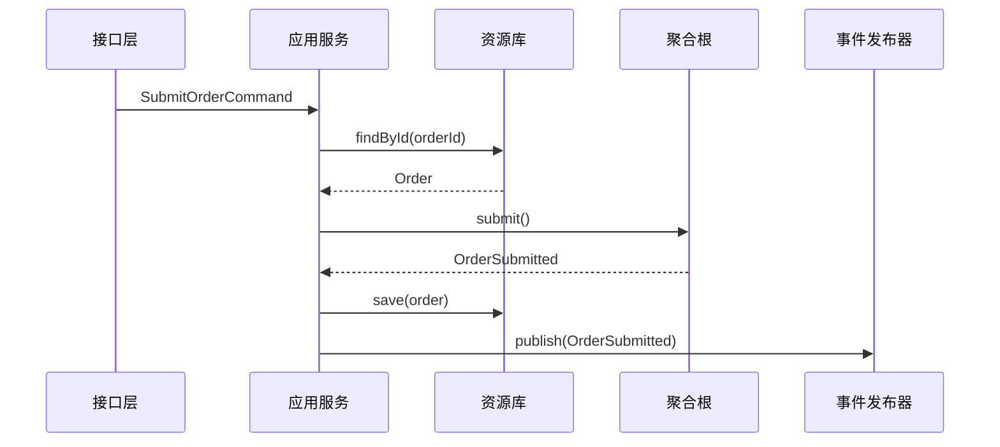

---
aliases:
  - DDD聚合工厂资源库应用服务
tags:
  - DDD
  - 聚合
  - Repository
  - 应用服务
---

# 聚合、工厂、资源库与应用服务

## 这个文件的作用

这个文件是第10-14章的工程落地复盘，不是章节替代品。正式学习请分别读：

- [[10-第10章-聚合]]
- [[11-第11章-工厂]]
- [[12-第12章-资源库]]
- [[13-第13章-集成限界上下文]]
- [[14-第14章-应用程序]]

读完这些章节后，再用这个文件把“一个业务用例如何从接口进入、调用应用服务、修改聚合、保存资源库、发布事件”串起来。

## 聚合是什么

聚合是一组相关对象的一致性边界。聚合根是外部访问这个边界的唯一入口。

初学者不要把聚合理解成“对象包含对象”的数据结构。它真正回答的是：

- 哪些规则必须在一次业务操作里保持一致？
- 外部代码只能通过哪个对象修改这组对象？
- 哪些对象可以最终一致，不必放进同一个事务？

## 聚合设计规则

| 规则 | 含义 |
|---|---|
| 聚合尽量小 | 小聚合更容易维护事务和并发 |
| 通过聚合根访问内部对象 | 外部不能绕过根直接改内部对象 |
| 聚合之间通过身份引用 | 不要随意持有另一个聚合对象 |
| 一个事务通常只修改一个聚合 | 跨聚合协作优先考虑领域事件和最终一致性 |
| 聚合保护不变量 | 规则必须由聚合方法维护，而不是散落在 service 里 |

## 聚合设计模板

| 项 | 内容 |
|---|---|
| 聚合名称 |  |
| 聚合根 |  |
| 内部实体 |  |
| 值对象 |  |
| 必须保护的不变量 |  |
| 允许的命令 |  |
| 产生的领域事件 |  |
| 需要的资源库 |  |

## 工厂

工厂用于封装复杂创建过程，尤其当创建对象时必须满足业务规则。

适合使用工厂的场景：

- 创建聚合需要多个参数和规则校验。
- 创建过程不想暴露给调用方。
- 创建时要选择不同子类型或策略。
- 创建逻辑本身属于领域语言。

## 资源库

资源库不是 DAO 的新名字。它是聚合的集合式接口。

| DAO 思路 | Repository 思路 |
|---|---|
| 面向表和 SQL | 面向聚合 |
| 暴露很多字段级查询 | 暴露业务需要的获取方式 |
| 调用方知道持久化细节 | 调用方只知道领域概念 |
| 可能返回任意数据结构 | 通常返回聚合根 |

资源库接口通常放在领域层，实现放在基础设施层。

```java
public interface OrderRepository {
    Optional<Order> findById(OrderId id);
    void save(Order order);
}
```

## 应用服务

应用服务负责编排一个用例，但不承载核心业务规则。

典型流程：

```text
接收命令
→ 加载聚合
→ 调用聚合方法
→ 保存聚合
→ 发布领域事件
→ 返回结果
```

如果应用服务里出现大量 `if/else` 业务规则，通常意味着领域模型太贫血。

## 端到端调用示意



## 阅读检查

- 这个聚合到底保护了哪些不变量？
- 为什么这些对象必须放在同一个聚合里？
- 是否有跨聚合事务可以改成领域事件？
- Repository 是否暴露了过多数据库细节？
- 应用服务是否只是编排，而不是业务规则中心？

## 关联

- [[03-战术设计-实体值对象领域服务领域事件]]
- [[02-架构与DDD]]
