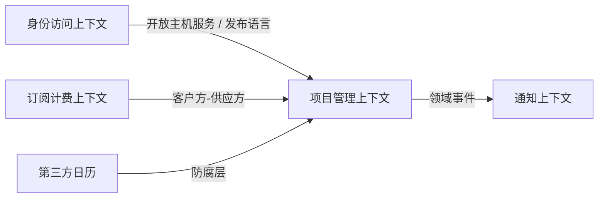

---
aliases:
  - DDD落地练习
tags:
  - DDD
  - 练习
  - SaaS
---

# DDD落地练习：以项目管理SaaS为例

> 这不是复述书中的案例，而是把书里的学习线索转成可操作练习。目标是让你边读边建模。

## 这个文件的作用

这个文件是练习场，不是知识讲解。它的作用是让你把章节里的概念真的“用一次”。

DDD 不是靠看懂定义学会的，而是靠反复做这些判断学会的：

- 这个能力是核心域、支撑子域还是通用子域？
- 这个词在不同上下文中是不是同义？
- 这个对象应该是实体还是值对象？
- 这个规则需要聚合强一致保护吗？
- 这个跨上下文动作应该同步调用还是发布事件？

读完相关章节后，回来做对应练习。不要一开始就试图把这个文件读完。

## 场景设定

一个多租户项目管理 SaaS，支持团队管理、产品待办项、Sprint、任务分配、进度跟踪、成员权限和通知。

## 练习1：识别子域

| 子域 | 类型 | 理由 |
|---|---|---|
| 敏捷项目管理 | 核心域 | 产品价值主要来自项目管理体验和协作模型 |
| 身份与访问 | 通用子域/支撑子域 | 很重要，但通常不是业务差异化核心 |
| 通知 | 支撑子域 | 支持协作，但不是核心模型 |
| 计费与订阅 | 支撑子域 | SaaS 商业化必需 |

你的任务：

- [ ] 再补充 2 个子域。
- [ ] 判断每个子域是否值得自研。
- [ ] 标出最需要领域专家参与的子域。

## 练习2：划分限界上下文

| 限界上下文 | 核心语言 | 可能的模型 |
|---|---|---|
| 项目管理上下文 | 项目、Sprint、待办项、任务、燃尽图 | Project、Sprint、BacklogItem、Task |
| 身份访问上下文 | 租户、用户、角色、权限 | Tenant、User、Role、Permission |
| 通知上下文 | 通知、订阅、渠道、模板 | Notification、Subscription、Channel |
| 订阅计费上下文 | 套餐、订阅、账单、支付 | Plan、Subscription、Invoice |

你的任务：

- [ ] 找出“用户”在不同上下文中的不同含义。
- [ ] 找出“项目”是否只属于一个上下文。
- [ ] 写出每个上下文不应该知道的外部概念。

## 练习3：画上下文映射

你的任务：

- [ ] 哪些上下文是上游？
- [ ] 哪些地方需要防腐层？
- [ ] 哪些集成适合 API，哪些适合事件？

## 练习4：识别命令和领域事件

| 命令 | 领域事件 |
|---|---|
| 创建项目 | 项目已创建 |
| 创建 Sprint | Sprint 已创建 |
| 分配任务 | 任务已分配 |
| 完成任务 | 任务已完成 |
| 关闭 Sprint | Sprint 已关闭 |

你的任务：

- [ ] 为每个命令写出前置条件。
- [ ] 为每个事件写出订阅方。
- [ ] 判断是否需要最终一致性。

## 练习5：设计一个聚合

候选聚合：`Sprint`

| 项 | 示例 |
|---|---|
| 聚合根 | Sprint |
| 内部实体 | SprintTask |
| 值对象 | SprintGoal、DateRange |
| 不变量 | Sprint 结束日期不能早于开始日期；已关闭 Sprint 不能新增任务 |
| 命令 | plan、addTask、completeTask、close |
| 事件 | SprintPlanned、TaskAddedToSprint、SprintClosed |

你的任务：

- [ ] 判断 `Task` 是否应该是 `Sprint` 内部实体，还是独立聚合。
- [ ] 判断 `BacklogItem` 是否应该被 `Sprint` 直接持有。
- [ ] 写出一个跨聚合协作流程。

## 迁移到你的项目

如果把这个练习迁移到供应链、订单、库存、售后或 WMS 场景，可以按这个顺序：

1. 找核心域：哪个能力最影响业务竞争力。
2. 找歧义词：订单、库存、仓库、履约、退货在不同团队中是否含义不同。
3. 划上下文：交易、库存、仓储、售后、结算是否需要不同模型。
4. 画映射：哪些上下文必须防腐，哪些上下文可以发布事件。
5. 设计聚合：找必须强一致的业务规则。

## 关联

- [[01-战略设计-领域子域限界上下文与上下文映射]]
- [[04-聚合工厂资源库与应用服务]]
