---
aliases:
  - DDIA核心概念地图
tags:
  - DDIA
  - 架构
---

# DDIA 核心概念地图

## 一句话总览

数据密集型系统 = **应用层** + **多种数据系统组合**；设计核心是 **可靠性 / 可伸缩性 / 可维护性**，在 **复制、分区、事务、一致性** 之间做权衡。

```mermaid
flowchart TB
  subgraph app [应用层]
    A[业务逻辑 / API]
  end

  subgraph data [数据系统层]
    DB[(OLTP 数据库)]
    Cache[(缓存)]
    Search[(搜索索引)]
    MQ[消息队列 / 日志]
    OLAP[(分析 / 数仓)]
  end

  subgraph foundations [Part I 基石]
    M[数据模型]
    S[存储引擎]
    E[编码与演化]
  end

  subgraph distributed [Part II 分布式]
    R[复制 Replication]
    P[分区 Partitioning]
    T[事务 Transactions]
    F[故障 Faults]
    C[一致性 Consistency]
  end

  subgraph derived [Part III 衍生]
    B[批处理 Batch]
    ST[流处理 Stream]
    I[数据集成 Integration]
  end

  A --> DB & Cache & Search & MQ
  DB --> foundations
  DB --> distributed
  MQ --> derived
  OLAP --> derived
```



## Part I：单机视角的基石

| 概念 | 含义 | 设计时问 |
|---|---|---|
| 可靠性 | 故障下仍正确服务 | 容忍哪种故障？如何检测与恢复？ |
| 可伸缩性 | 负载增长时性能可接受 | 负载参数是什么？瓶颈在哪？ |
| 可维护性 | 长期演进成本低 | 新人能否快速理解？变更是否局部？ |
| 数据模型 | 关系 / 文档 / 图 | 一对多、多对多关系多吗？ |
| 存储引擎 | B+树 / LSM / 列存 | 读多还是写多？分析还是事务？ |
| 编码演化 | Avro/Protobuf、Schema | 前后端、多服务如何兼容升级？ |

## Part II：分布式视角

| 概念 | 含义 | 常见实现 |
|---|---|---|
| 复制 | 同一份数据多副本 | MySQL 主从、Redis 主从 |
| 分区 | 数据拆到多节点 | 分库分表、Kafka 分区 |
| 事务 | 多步操作的原子与隔离 | 本地 ACID、Seata 2PC |
| 部分失效 | 网络/进程/磁盘单独坏 | 超时、重试、熔断 |
| 线性一致性 | 像只有一个副本 | 通常代价高，慎用 |
| 共识 | 节点对某值达成一致 | Raft（etcd）、ZooKeeper |

## Part III：衍生数据

| 概念 | 含义 | 典型工具 |
|---|---|---|
| 物化视图 | 预计算查询结果 | Redis 缓存、ES 索引 |
| 批处理 | 有界数据、高吞吐 | Spark、Hive |
| 流处理 | 无界事件、低延迟 | Flink、Kafka Streams |
| CDC | 捕获数据库变更 | Canal、Debezium |
| 事件溯源 | 状态 = 事件折叠 | EventStore、自建 Outbox |

## 复制 lag 与用户体验（第 5 章核心）

| 保证 | 用户感知 |
|---|---|
| 读己之所写 | 刚提交的数据，刷新能看到 |
| 单调读 | 不会时间倒流 |
| 一致前缀读 | 因果顺序不乱 |
| 尾部一致性 | 不同用户看到相同最终状态 |

## 事务隔离级别速览（第 7 章）

| 级别 | 防止 |
|---|---|
| 读已提交 RC | 脏读 |
| 快照隔离 SI | 不可重复读（MVCC） |
| 可重复读 RR | 同上（MySQL 默认） |
| 可串行化 | 幻读、写偏斜等全部异常 |

## 一致性光谱（第 9 章）

```text
弱一致 ──────────────────────────────► 线性一致
最终一致    因果一致    顺序一致    线性一致
   │            │           │            │
  AP 友好    会话/版本向量   单分区有序   强但贵
```

## 与 CAP 的关系（书中态度）

- CAP 常被**滥用**；更实用的是：在**分区发生**时，在**延迟 / 一致 / 可用**之间选权衡。
- 多数业务系统：**分区罕见**，更应关注**复制延迟**和**运维复杂度**。

## 常见误解

| 误解 | 正解 |
|---|---|
| NoSQL 一定比 SQL 快 | 取决于访问模式与存储引擎 |
| 最终一致 = 可以乱 | 需要定义「多快、什么顺序、用户能否感知」 |
| 分布式事务 = 必须用 2PC | 可 Saga、Outbox、幂等、对账 |
| 加缓存就能解决性能 | 先找瓶颈；缓存带来一致性与失效问题 |

## 章节依赖关系

```text
第1章（目标）→ 第2–4章（单机基础）
第5–6章（复制+分区）→ 第7章（事务）→ 第8–9章（故障+共识）
第10–11章（批/流）→ 第12章（集成与未来）
```
