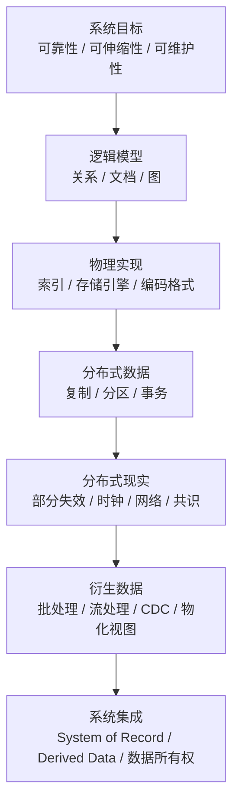
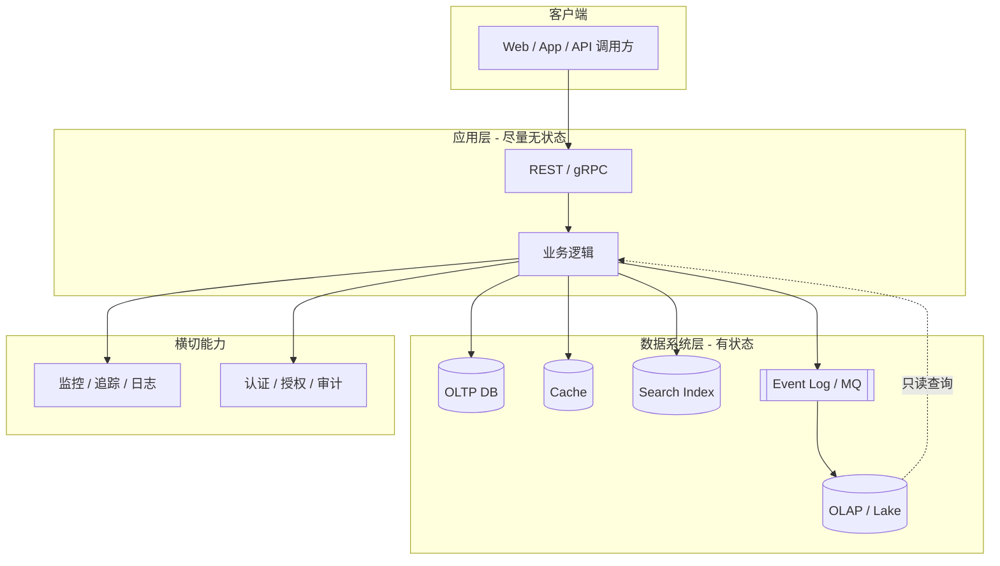
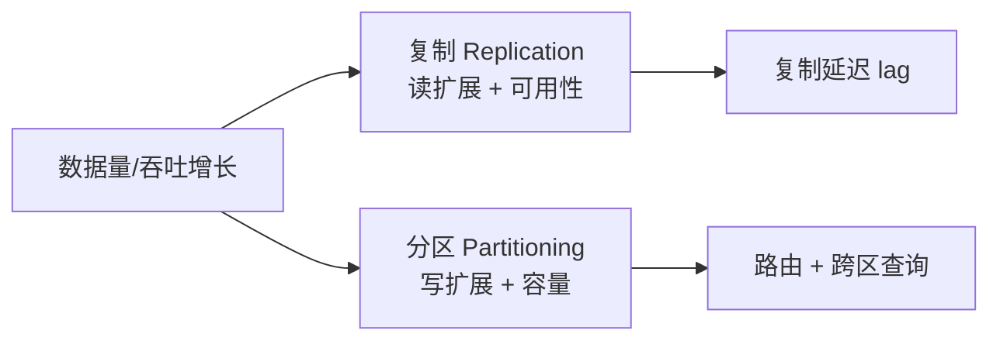
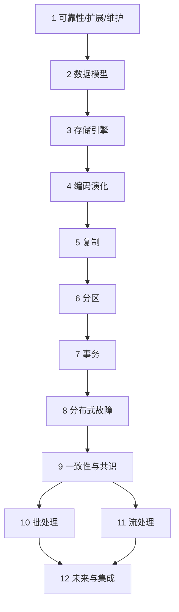

---
aliases:
  - DDIA核心概念地图
tags:
  - DDIA
  - 架构
---

# DDIA 核心概念地图

> **地图 ≠ 百科**。定位概念关系与阅读顺序；完整定义见 [[05-概念定义详解]]，逐章机制见 [[00-逐章精读总览与索引]]。

术语命名统一参考 [[03-术语卡片]]；想快速建立主干，先读 [[06-核心概念精炼与掌握路线]]。

## 一句话总览

数据密集型系统 = **无状态应用** + **多种有状态数据系统**；设计是在 **可靠性 / 可伸缩性 / 可维护性** 约束下，对 **复制、分区、事务、一致性、集成** 做权衡。

## 架构推理总公式

```text
数据系统设计
= 业务不变量
+ 访问模式
+ 负载参数
+ 故障模型
+ 一致性需求
+ 演化成本
```

不要从工具名开始推理。MySQL、MongoDB、Redis、Kafka、Flink 都只是机制；真正的设计输入是系统必须保护什么、承受什么负载、接受什么故障表现，以及未来如何变化。

## 全书主线



## 系统分层全景



**关键原则**（第 12 章）：OLTP 是 **System of Record**；Cache/Search/OLAP 多为 **Derived Data**。

---

## Part I：单机基石（第 1–4 章）

### 第 1 章：系统目标

| 维度 | 核心问题 | 关键指标 |
|---|---|---|
| **Reliability** | fault 时能否避免 failure？ | MTTF, MTTR, RPO, RTO, 可用性 |
| **Scalability** | 负载增长如何应对？ | 负载参数, throughput, p99 |
| **Maintainability** | 能否长期演进？ | 可操作性, 简单性, 可演化性 |

### 第 2 章：逻辑层 — 数据模型

```text
访问模式决定模型
    │
    ├─ 多对多 + 复杂 JOIN ──► 关系模型 (SQL)
    ├─ 一对多嵌套 + 灵活 Schema ──► 文档模型 (MongoDB)
    └─ 多跳关系遍历 ──► 图模型 (Neo4j)
```

### 第 3 章：物理层 — 存储引擎

```text
工作负载决定引擎
    │
    ├─ 点查 + 短事务 + 范围扫描 ──► B+Tree (InnoDB)
    ├─ 高写入 + 顺序写 ──► LSM-Tree (RocksDB/Cassandra)
    └─ 大扫描 + 聚合 ──► 列存 (ClickHouse)
```

**放大效应**：读放大、写放大、空间放大（LSM 必考）。

### 第 4 章：边界层 — 编码演化

```text
数据流路径
    │
    ├─ DB ◄──► 应用 (ORM/DTO)
    ├─ 服务 ◄──RPC──► 服务 (Protobuf/gRPC)
    └─ 服务 ◄──MQ──► 服务 (Avro/Kafka)
```

每种路径需 **向后/向前兼容** 策略。

---

## Part II：分布式数据（第 5–9 章）

### 扩展的两根支柱



### 第 5 章：复制

| 拓扑 | 写 | 冲突 | 场景 |
|---|---|---|---|
| Leader-Follower | 单 Leader | 无 | MySQL 主从 |
| Multi-Leader | 多 Leader | 需解决 | 多数据中心 |
| Leaderless | Quorum | 版本合并 | Dynamo/Cassandra |

**四种读保证**（设计 API 必写）：

| 保证 | 定义 |
|---|---|
| Read your writes | 读到自己刚写的 |
| Monotonic reads | 不时间倒流 |
| Consistent prefix | 因果序不乱 |
| Eventual | 最终所有人相同 |

### 第 6 章：分区

| 策略 | 优点 | 风险 |
|---|---|---|
| Key Range | 范围查询 | 热点（最新数据） |
| Hash | 均匀 | 丧失范围查询 |
| 复合键 | 租户内有序 | 设计复杂 |

### 第 7 章：事务

```text
并发控制
    │
    ├─ 弱隔离 (RC/SI/RR) ──► 高性能，可能有写偏斜
    └─ Serializable (2PL/SSI) ──► 正确，性能代价
```

**写偏斜**：RR/SI 下最常漏测的 bug → 见 [[07-第07章-事务]]。

### 第 8 章：分布式独特故障

| 单机假设 | 分布式现实 |
|---|---|
| 要么成功要么失败 | **部分失效** |
| 超时可判断死亡 | **延迟无界** |
| 时钟可用于排序 | **Clock skew + GC pause** |

### 第 9 章：一致性与共识

```text
一致性强度光谱
最终一致 ──► 因果 ──► 顺序 ──► 线性一致
  便宜/可用          贵/低可用

共识 (Raft) ──► Leader 选举 + 日志复制
2PC ──► 跨库原子提交（阻塞、慎用）
Saga ──► 本地事务 + 补偿（最终一致）
```

---

## Part III：衍生数据（第 10–12 章）

### 批 vs 流

| | 批处理 | 流处理 |
|---|---|---|
| 数据 | 有界 | 无界 |
| 延迟 | 分钟~小时 | 毫秒~秒 |
| 引擎 | Spark/Hive | Flink/Kafka Streams |
| 用途 | 报表、训练、校正 | 实时、CDC、CEP |

### 集成模式（第 11–12 章）

```text
System of Record (MySQL)
        │
        ├── CDC/binlog ──► Kafka ──► ES / Redis / 数仓
        │
        └── Outbox 表 ──► MQ ──► 下游微服务
```

**禁止**：应用双写 DB + ES 无补偿。

---

## 设计决策快速路径

| 你在问 | 先看章节 | 再看复盘 |
|---|---|---|
| 选 SQL 还是 NoSQL？ | 2, 3 | [[01-数据模型与存储选型]] |
| 读写分离怎么保证读正确？ | 5 | [[02-复制分区与扩展性]] |
| 分库分表键怎么选？ | 6 | [[02-复制分区与扩展性]] |
| 要不要分布式事务？ | 7, 9 | [[03-事务一致性与分布式共识]] |
| 消息会不会丢/重？ | 8, 11 | [[04-批处理流处理与数据集成]] |
| 微服务数据怎么拆？ | 12 | [[04-批处理流处理与数据集成]] |

---

## 与 DDD 概念地图的对位

| DDD | DDIA |
|---|---|
| 限界上下文 | 服务边界 + 独立 schema |
| 聚合 | 本地事务边界 |
| 领域事件 | 集成事件 / Kafka 消息 |
| 防腐层 | RPC DTO / ACL 适配 |
| 上下文映射 | 数据同步模式（CDC/Saga/API） |

---

## 章节依赖（学习顺序）



---

## 常见误解（全书级）

| 误解 | 正解 | 见 |
|---|---|---|
| CAP 三选二贴标签 | 讨论具体一致性模型与延迟 | 9 |
| NoSQL = 快 | 看访问模式与引擎 | 2, 3 |
| 缓存 = 性能银弹 | 一致性与失效问题 | 5, 11 |
| 2PC = 分布式事务标准 | 优先 Saga/Outbox | 7, 9 |
| 最终一致 = 随便 | 需定义 lag、顺序、读保证 | 5, 9 |

## 重读时只问五类问题

| 问题 | 对应 DDIA 概念 |
|---|---|
| 这个系统的正确性边界是什么？ | 事务、隔离级别、不变量、线性一致性 |
| 这个系统的负载形态是什么？ | 负载参数、延迟百分位、吞吐、读写放大 |
| 哪份数据是真相源？ | System of Record、Derived Data、CDC、Outbox |
| 故障时允许用户看到什么？ | 复制延迟、读保证、部分失效、超时、重试 |
| 未来变化时谁最难改？ | 数据模型、编码兼容、Schema 演化、运维复杂度 |

## 读完后的验收标准

- 能用一张图解释当前项目的数据流：真相源、缓存、搜索、消息、数仓分别在哪里。
- 能为核心读 API 标注读保证：读己之所写、单调读、一致前缀或最终一致。
- 能为核心写 API 写出业务不变量、事务边界、幂等键和补偿方式。
- 能说明为什么选择某个存储/消息/流处理方案，以及放弃了什么。
- 能识别“看起来是中间件问题，其实是数据所有权或一致性语义没定义”的场景。

## 延伸阅读

- 定义百科：[[05-概念定义详解]]
- 术语索引：[[03-术语卡片]]
- 评审清单：[[04-架构设计决策清单]]
