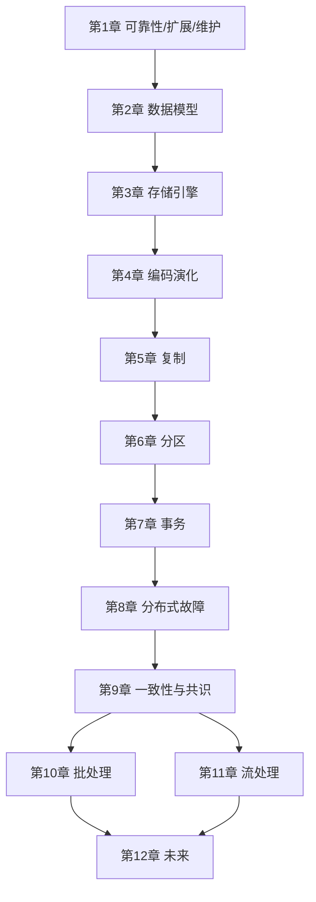

---
aliases:
  - DDIA逐章精读总览
tags:
  - DDIA
  - 章节精读
  - 学习导航
---

# 逐章精读总览与索引

> `02-逐章精读` 的入口。**全书 12 章均已扩展至 550–710 行「设计手册级」深度**（合计约 8000 行）：概念定义、书中目录映射、书中案例、机制专题（含 mermaid）、算法流程、产品对照、深度 FAQ、设计模式与反模式、Java 对照、练习与阅读检查。详细定义见 [[05-概念定义详解]]。

## 全书结构

| Part | 章节 | 核心问题 | 精读文件 | 篇幅 |
|---|---|---|---|---|
| I 基石 | 1 | 好系统的目标是什么？ | [[01-第01章-可靠性可伸缩性可维护性]] | ~598 行 |
| I | 2 | 数据如何建模与查询？ | [[02-第02章-数据模型与查询语言]] | ~676 行 |
| I | 3 | 数据如何物理存储与索引？ | [[03-第03章-存储与检索]] | ~654 行 |
| I | 4 | 格式如何演化？ | [[04-第04章-编码与演化]] | ~678 行 |
| II 分布式 | 5 | 多副本如何复制？ | [[05-第05章-复制]] | ~696 行 |
| II | 6 | 数据如何分区扩展？ | [[06-第06章-分区]] | ~683 行 |
| II | 7 | 并发与事务如何保证？ | [[07-第07章-事务]] | ~611 行 |
| II | 8 | 分布式有何独特故障？ | [[08-第08章-分布式系统的麻烦]] | ~624 行 |
| II | 9 | 一致性与共识如何实现？ | [[09-第09章-一致性与共识]] | ~663 行 |
| III 衍生 | 10 | 批处理如何派生数据？ | [[10-第10章-批处理]] | ~647 行 |
| III | 11 | 流处理与日志如何统一？ | [[11-第11章-流处理]] | ~659 行 |
| III | 12 | 未来架构如何集成？ | [[12-第12章-数据系统的未来]] | ~710 行 |

## 推荐阅读依赖

## 每章读完最小产出

| 章节 | 读完要能回答 | 最小产出 |
|---|---|---|
| 1 | 我们系统的负载参数与 p99 目标是？ | SLA 表：RTO/RPO/延迟 |
| 2 | 主访问模式适合哪种模型？ | 实体关系 + 模型选型一页纸 |
| 3 | OLTP 瓶颈在索引还是磁盘？ | 慢查询 Top3 与索引方案 |
| 4 | API/消息 Schema 如何兼容升级？ | 版本策略 + 迁移步骤 |
| 5 | 读路径需要哪些读保证？ | 读保证矩阵（按 API） |
| 6 | 分区键与热点策略？ | 分区键设计文档 |
| 7 | 业务不变量与隔离级别？ | 异常场景表 + 隔离级别选型 |
| 8 | 超时/重试/时钟怎么用？ | 弹性策略配置表 |
| 9 | 哪些操作要线性一致？ | 一致性级别按接口标注 |
| 10 | 报表是否脱离 OLTP？ | 批处理血缘图 |
| 11 | 真相源与衍生视图同步链？ | CDC/Outbox 架构图 |
| 12 | 微服务数据所有权？ | System of Record 清单 |

## 12 章重读卡片

| 章节 | 本章问题 | 概念链 | 最容易混淆的点 |
|---|---|---|---|
| 1 | 什么叫“好”的数据系统 | fault -> failure；load parameter -> latency/throughput；operability/simplicity/evolvability | 可伸缩性不是“能加机器”，而是负载增长时性能如何变化 |
| 2 | 数据模型如何影响表达能力和演化成本 | 业务对象 -> 关系形态 -> 数据模型 -> 查询语言 -> schema 演化 | 文档模型适合整体读取的聚合，不等于 NoSQL 更灵活 |
| 3 | 数据库如何把写入变成未来可查的结构 | WAL/日志 -> 索引 -> B-Tree/LSM -> 读写放大 -> OLTP/OLAP | 索引不是免费加速器，它会增加写入、空间和维护成本 |
| 4 | 新旧代码和新旧数据如何共存 | 编码格式 -> schema -> 兼容性 -> rolling upgrade -> 数据流 | 服务已发版不等于数据已迁移完成 |
| 5 | 多副本如何提升可用性并处理不一致 | leader/follower -> replication lag -> read guarantees -> conflict resolution | 主从复制不自动保证刚写完就能从从库读到 |
| 6 | 数据量和写入量增长时如何拆分数据 | partition key -> range/hash/composite -> secondary index -> rebalancing -> routing | 分区键是业务访问模式的一部分，不是单纯数据库字段 |
| 7 | 并发读写下如何保护业务不变量 | ACID -> weak isolation -> anomalies -> MVCC -> serializability | RR/SI 不等于可串行化，写偏斜仍可能发生 |
| 8 | 分布式系统为什么不能套用单机直觉 | partial failure -> timeout -> clock skew -> process pause -> fencing | 超时只能说明“不知道发生了什么”，不能证明对方失败 |
| 9 | 故障下多个节点如何对关键事实达成一致 | linearizability -> ordering -> total order broadcast -> consensus -> atomic commit | 线性一致性和可串行化不是同一个概念 |
| 10 | 如何可靠处理大规模有界数据集 | Unix pipeline -> MapReduce -> shuffle/sort -> dataflow -> fault tolerance | 批处理不是过时技术，它提供可重算、可审计、可修复能力 |
| 11 | 如何处理持续到来的无界事件流 | event log -> messaging -> CDC -> event time/window -> stream join -> exactly-once | 队列强调分发，日志强调保留和重放 |
| 12 | 多个数据系统如何组成可演化应用 | unbundling database -> system of record -> derived data -> end-to-end correctness -> ownership | 微服务拆库后，一致性问题只是转移到事件和流程里 |

## 精读完成标准

1. 能**用自己的话**解释本章 5 个核心概念（见 [[05-概念定义详解]] 对应章节）。
2. 能画出本章涉及的**架构图或流程图**至少 1 张。
3. 能列出 **3 个常见误区** 并在当前项目中找到对应风险。
4. 可选：在对应章节笔记末尾加 `# 我的项目` 段落；或完成 [[04-学习任务清单]] 自测。

## 每章统一结构（设计手册级）

| 模块 | 用途 |
|---|---|
| 书中目录与小节映射 | 对照 Vonng 译本，按书阅读时定位笔记 |
| 核心概念定义 | 链到 [[05-概念定义详解]] |
| 机制深度 + 对照表 | 原理、权衡、公式 |
| 书中案例与场景 | Kleppmann 经典例子（Twitter、LinkedIn、写偏斜等） |
| 算法与流程 | 伪代码、mermaid 时序图 |
| 与具体产品对照 | MySQL/Kafka/Flink/etcd 等 |
| 深度 FAQ | 8–10 个高频疑问 |
| 设计模式与反模式 | 可直接用于评审 |
| Java 实践 + 练习 + 阅读检查 | 落地与自测 |

## 章节深度说明

全书 **12 章均为 550–710 行**；扩展内容**追加**在原有正文之后，不替换原结构。Part II 第 7 章重点补充：异常时间线、PG vs MySQL RR、谓词锁、物化防写偏斜。

## 章节概念索引（速查）

| 概念 | 首见章节 | 详解 |
|---|---|---|
| Fault / Failure | 1 | [[05-概念定义详解#可靠性]] |
| p99 延迟 | 1 | [[05-概念定义详解#性能指标]] |
| 关系/文档/图模型 | 2 | [[05-概念定义详解#数据模型]] |
| B+Tree / LSM | 3 | [[05-概念定义详解#存储引擎]] |
| WAL / SSTable | 3 | [[05-概念定义详解#存储引擎]] |
| Schema 兼容 | 4 | [[05-概念定义详解#编码演化]] |
| 读己之所写 | 5 | [[05-概念定义详解#复制与读保证]] |
| Quorum (W,R,N) | 5 | [[05-概念定义详解#Quorum]] |
| 分区键 / 再平衡 | 6 | [[05-概念定义详解#分区]] |
| MVCC / 写偏斜 | 7 | [[05-概念定义详解#事务与隔离]] |
| 2PC / Saga | 7, 9 | [[05-概念定义详解#分布式事务]] |
| 线性一致性 | 9 | [[05-概念定义详解#一致性级别]] |
| Raft / 共识 | 9 | [[05-概念定义详解#共识]] |
| MapReduce / Shuffle | 10 | [[05-概念定义详解#批处理]] |
| CDC / 事件溯源 | 11 | [[05-概念定义详解#流处理]] |
| Unbundling | 12 | [[05-概念定义详解#数据集成]] |
