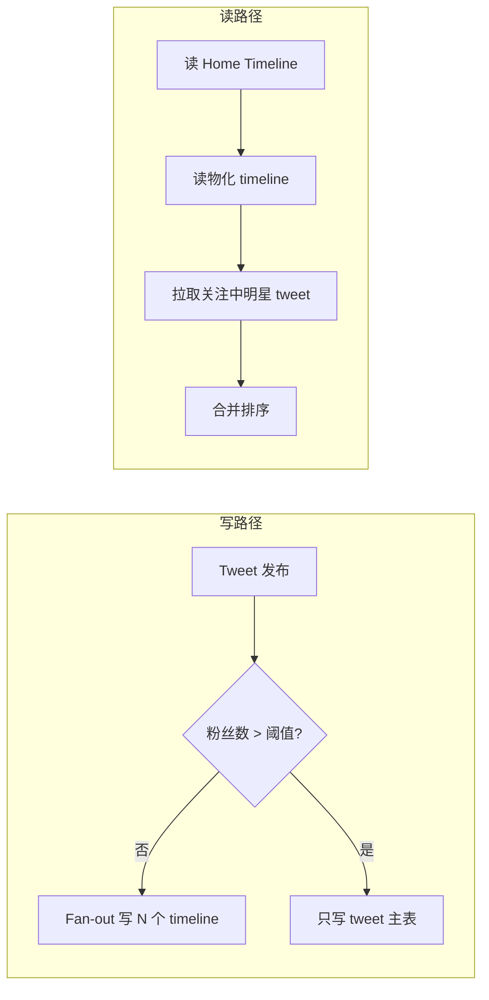
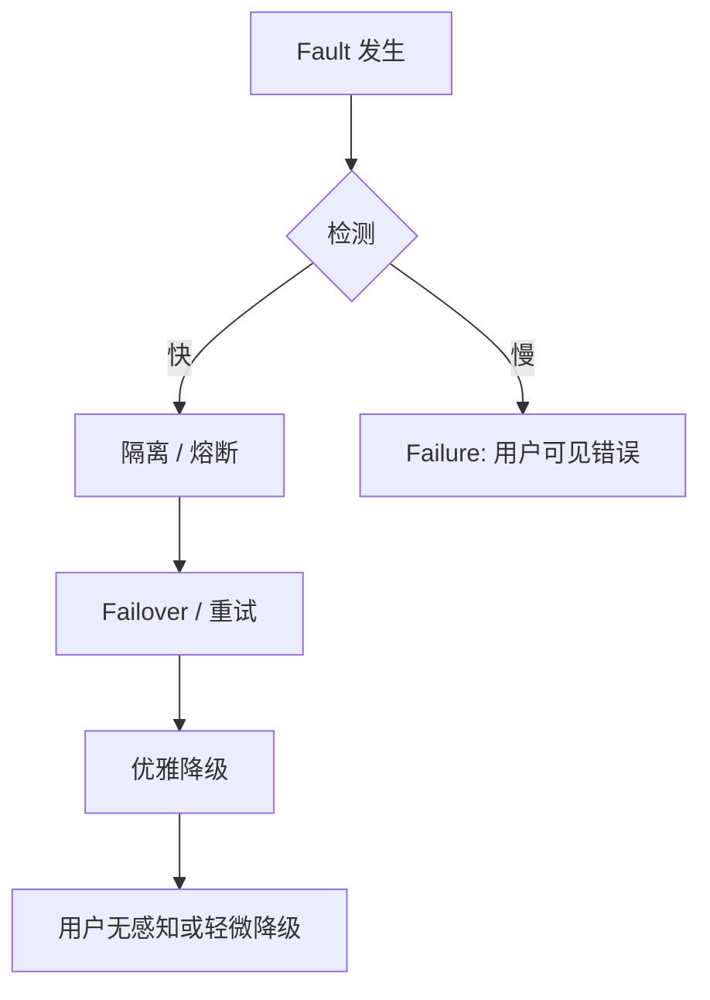
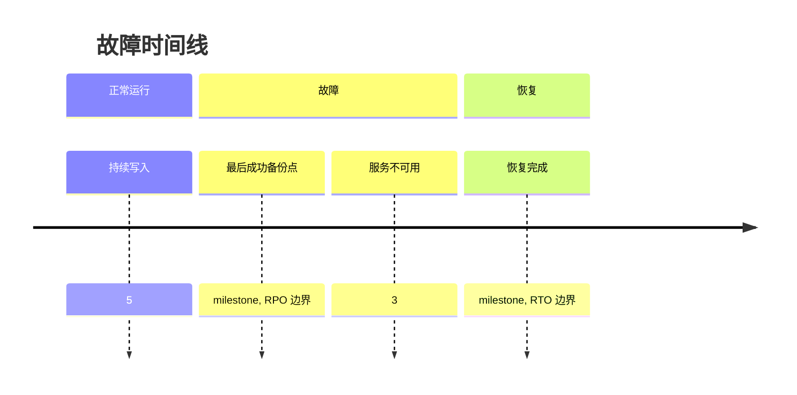

---
aliases:
  - DDIA第1章
tags:
  - DDIA
  - 章节精读
  - 可靠性
---

# 第 01 章：可靠性、可伸缩性、可维护性

> 本章目标：建立评价数据系统的**三维框架**；学会用**负载参数**和**百分位延迟**描述需求，而非 vague「高并发」。

## 本章在全书中的位置

全书「元章节」。后续每一章的技术选型，最终都回到：**是否提升可靠性、是否支撑扩展、是否可长期维护**。详见 [[00-逐章精读总览与索引]]。

## 初学者先抓住一句话

**数据密集型应用**的主要挑战是**数据**（量、复杂度、变化速度）；设计目标是在 **可靠性、可伸缩性、可维护性** 之间做可接受的权衡。

## 核心概念定义

| 概念                 | 定义             | 详解                 |
| ------------------ | -------------- | ------------------ |
| Data-intensive     | 数据是主要挑战的应用     | [[05-概念定义详解#可靠性]]  |
| Fault              | 组件偏离正常         | 不等于用户可见失效          |
| Failure            | 用户感知的服务失败      | 容错目标是降低 failure 概率 |
| Load parameter     | 量化负载的指标        | QPS、读写比、粉丝分布等      |
| Latency percentile | p50/p95/p99 延迟 | 比均值更能反映体验          |

## 关于数据系统的思考

### 数据系统 ≠ 单个数据库

典型现代应用组合多种存储与处理系统：

```text
客户端
  → API 网关 / 应用服务器（无状态）
      → OLTP 数据库（MySQL/PG）
      → 缓存（Redis）
      → 搜索（Elasticsearch）
      → 消息队列（Kafka/RocketMQ）
      → OLAP / 数仓（离线报表）
      → 对象存储（文件/备份）
```

**架构师职责**：为每种**工作负载**选对工具，并理解组合后的**故障模式**与**一致性边界**。

### 计算密集型 vs 数据密集型

| | 计算密集型 | 数据密集型 |
|---|---|---|
| 瓶颈 | CPU、GPU | 数据量、I/O、复杂度 |
| 例子 | 视频编码、科学仿真 | 社交 feed、电商、搜索 |
| 扩展焦点 | 并行算法 | 分区、复制、索引、缓存 |

## 可靠性 Reliability

### 形式化直觉

**Reliable system**：在**出现故障（fault）**时仍能**正确工作**（避免 **failure**）。

### 故障分类与应对

| 类型 | 典型 fault | 设计模式 |
|---|---|---|
| **硬件** | 磁盘坏、机架断电、网卡故障 | 冗余磁盘、多 AZ、无单点 |
| **软件** | Bug、OOM、死锁、级联超时 | 测试、隔离舱、熔断、限流 |
| **人为** | 误删、错误配置、错误发布 | 最小权限、审计、备份、蓝绿/金丝雀 |

### 可靠性指标

| 指标 | 含义 |
|---|---|
| **MTTF** | 平均无故障时间 |
| **MTTR** | 平均修复时间 |
| **可用性** | 近似 MTTF/(MTTF+MTTR)；99.9% ≈ 年 downtime 8.76h |
| **RPO** | Recovery Point Objective，可接受丢多少数据 |
| **RTO** | Recovery Time Objective，可接受停多久 |

### 容错设计原则

1. **故障必然发生**——设计假设组件会坏。
2. **快速检测 + 自动切换** 优于追求完美预防。
3. **优雅降级**：部分功能不可用 ≠ 全站崩溃。
4. **混沌工程**：主动注入 fault 验证假设。

## 可伸缩性 Scalability

### 定义

当**负载增加**时，系统能继续满足性能目标的能力；通过**加资源**（通常 horizontal scaling）应对。

### 描述性能（必会）

| 指标 | 适用场景 | 注意 |
|---|---|---|
| **Throughput** | 批处理、峰值 QPS | 饱和后不再线性增长 |
| **Response time** | 交互式 API | 关注分布，非均值 |
| **p50** | 典型用户 | 中位数 |
| **p95 / p99** | SLA、尾部体验 | 扩容有时反而恶化 p99（排队） |
| **Utilization** | 容量规划 | 高利用率 → 排队延迟上升 |

**排队论直觉**：资源利用率接近 100% 时，延迟急剧上升；为 p99 留 headroom。

### 扩展路径

```text
1. 垂直扩展 Scale-up     → 更强 CPU/内存/SSD，简单但有上限
2. 无共享 Scale-out       → 多节点 + 分区（第 6 章）
3. 读扩展                 → 复制 + 缓存（第 5 章）
4. 功能拆分               → 微服务 + 专用存储（第 12 章）
```

### 阿姆达尔定律（直觉）

并行化只能加速**可并行部分**；存在串行瓶颈时，加机器收益递减——先找**串行热点**（单 Key、单 leader）。

### 避免过早优化

- 不必第一天分片；但应：**无状态应用、清晰边界、可观测、Schema 可演化**。
- **过早分片** 会锁死 Flexibility 并增加运维负担。

## 可维护性 Maintainability

| 子维度 | 定义 | 实践 |
|---|---|---|
| **Operability 可操作性** | 运维团队能否平稳运行 | 监控、告警、Runbook、追踪 |
| **Simplicity 简单性** | 复杂度可控 | 避免过度抽象；清晰模块边界 |
| **Evolvability 可演化性** | 需求变化时易改 | 松耦合、测试、Schema 演化（第 4 章） |

### 复杂度来源

- **状态**（尤其分布式状态）是复杂度主因。
- **隐式假设**（「从库延迟可忽略」）会在规模上爆炸。

## 架构设计检查清单

### 可靠性

- [ ] 单点组件清单？是否有 failover？
- [ ] RPO/RTO 是否书面化？
- [ ] 备份是否定期恢复演练？
- [ ] 发布是否可快速回滚？

### 可伸缩性

- [ ] 负载参数是否量化（峰值 QPS、数据增长率）？
- [ ] p99 延迟 SLA？
- [ ] 10x 增长时第一瓶颈组件？

### 可维护性

- [ ] 新人能否 1 周内安全改核心链路？
- [ ] 是否有分布式追踪关联请求？
- [ ] 配置/特性开关是否支持渐进发布？

## 常见误区

| 误区 | 正解 |
|---|---|
| 「我们还没到 Google 规模不用考虑扩展」 | 数据模型与边界早期错误，后期改成本极高 |
| 只监控 CPU 平均值 | 必须看 p99、磁盘 I/O、复制 lag |
| 把可用性等同于「不宕机」 | 还包括**错误结果**、**数据损坏** |
| 无状态应用 = 无状态系统 | 状态在 DB/MQ/缓存，复杂度仍在 |

## 与 Java 后端

| 主题 | 实践 |
|---|---|
| 无状态应用 | Session 外置 Redis；水平扩 Pod |
| p99 | Micrometer percentile；链路追踪慢 span |
| GC 与 tail latency | ZGC/Shenandoah；堆大小与 STW 监控 |
| 容错 | Resilience4j retry/circuit breaker |
| 人为 fault | Flyway 迁移；生产变更审批 |

### SRE 黄金信号与本章映射

Google SRE 提出的四个黄金信号，可直接映射到本章三维：

| 黄金信号 | 定义 | 对应章节维度 | 监控示例 |
|---|---|---|---|
| **Latency** | 请求耗时分布 | 可伸缩性 | p50/p95/p99 by endpoint |
| **Traffic** | 需求压力 | 可伸缩性 | QPS、消息 lag、连接数 |
| **Errors** | 失败请求率 | 可靠性 | 5xx 率、超时率、业务错误码 |
| **Saturation** | 资源逼近上限程度 | 可伸缩性 + 可靠性 | CPU、磁盘 IO、连接池使用率 |

```text
SLI（指标）→ SLO（目标）→ SLA（合同）

例：
  SLI: 首页 API p99 延迟
  SLO: 99% 的请求在 30 天内 p99 < 300ms
  SLA: 对客户的赔偿条款（若违反 SLO）
```

**与错误预算（Error Budget）**：可用性 SLO 99.9% 意味着约 0.1% 可「挥霍」于快速迭代、实验性发布——平衡**可靠性**与**可演化性**（可维护性子维度）。

### 负载描述模板（架构评审用）

```markdown
## 系统负载说明书（示例）

### 负载参数
- 峰值写 QPS：2,000（促销期间 8,000）
- 读写比：85% 读 / 15% 写
- 数据量：当前 500GB，年增长 40%
- 关键分布：Top 0.1% 用户贡献 30% 读流量（热点）

### 性能目标
- 核心下单 API：p99 < 200ms，p50 < 50ms
- 搜索 API：p99 < 500ms（允许更重）

### 可靠性目标
- 可用性：99.95%（月）
- RPO：5 分钟（异步复制）
- RTO：15 分钟（自动 failover）

### 10x 增长预测
- 第一瓶颈：订单库写入 + 热点 SKU 行锁
- 缓解：读写分离 + 缓存 + 分区（第 6 章）
```

### 可维护性深度：演化性检查表

| 检查项 | 差的表现 | 好的表现 |
|---|---|---|
| 模块边界 | 改 A 必改 B、C、D | 接口稳定，内部可重构 |
| 测试 | 无集成测试，靠手工 | 核心链路自动化 + 契约测试 |
| 配置 | 改配置要重新编译 | 外部化配置 + 特性开关 |
| 数据 Schema | 改列要停服 | Expand-Contract（第 4 章） |
| 文档 | 只有口头传说 | Runbook + ADR 决策记录 |
| 依赖 | 隐式循环依赖 | 清晰 DAG，版本 pinned |

## 书中目录与小节映射

> 对照 Vonng 译本《数据密集型应用系统设计》第 1 章结构；便于翻书时定位笔记段落。

| 书中章节 / 小节 | 本书核心论点 | 本笔记对应段落 |
|---|---|---|
| **关于数据系统的思考** | 数据系统 ≠ 单个 DB；是多种存储与处理组件的组合 | [[#关于数据系统的思考]]、[[#计算密集型 vs 数据密集型]] |
| **可靠性** | Fault 必然发生；目标是避免用户可见 Failure | [[#可靠性 Reliability]]、[[#故障分类与应对]] |
| **可伸缩性** | 用负载参数描述需求；百分位延迟比均值重要 | [[#可伸缩性 Scalability]]、[[#描述性能（必会）]] |
| **可维护性** | Operability / Simplicity / Evolvability 三子维度 | [[#可维护性 Maintainability]] |
| **小结** | 三维互相牵制；描述负载而非 vague「高并发」 | [[#本章小结]]、[[#架构设计检查清单]] |

**全书语境**：第 1 章是**元框架**——后续第 2–12 章的每一项技术决策，最终都要回到「是否损害或增强这三维」。阅读时建议把本章概念当作**评审 checklist**，而非一次性背完。

---

## 书中案例与场景

### 案例一：Twitter 时间线（Home Timeline）扩展

Kleppmann 用 Twitter 说明：**同一业务功能，负载参数不同，架构完全不同**。

#### 两种实现思路

| 方案 | 机制 | 写路径 | 读路径 | 适用负载 |
|---|---|---|---|---|
| **Fan-out on write（推模型）** | 用户发帖时，把 tweet 写入所有粉丝的 timeline 缓存 | 发帖 O(粉丝数) | 读首页 O(1) 读缓存 | 普通用户、读多 |
| **Fan-out on read（拉模型）** | 发帖只写 tweet 表；读首页时聚合关注列表的 tweet | 发帖 O(1) | 读首页 O(关注数) | 明星用户（百万粉丝） |

#### 明星用户（Celebrities）混合策略

```text
普通用户发帖 → fan-out on write → Redis timeline per follower
明星用户发帖 → 只写 tweet 表，不 fan-out
读首页时：
  1. 读自己的 fan-out timeline（已物化）
  2. UNION 关注列表中「明星」的最新 tweet（实时拉）
  3. 合并排序返回
```

**架构启示**：

1. **负载参数必须量化**：粉丝分布（Pareto/幂律）决定能否纯推模型。
2. **没有银弹**：Twitter 最终是**混合**——说明扩展常是「分情况处理」而非单一算法。
3. **与第 6 章分区呼应**：按 `user_id` 分区 timeline 缓存；明星是**热点 Key**（第 6 章再详述）。
4. **可维护性代价**：混合模型运维复杂——需识别明星阈值、降级策略、缓存一致性。



### 案例二：响应时间与百分位数（Percentiles）

书中强调：**运维与产品应关注延迟分布，而非平均值**。

#### 场景设定

某 API 在 1 秒内处理 100 个请求，延迟（ms）分布如下：

| 分位 | 值 | 含义 |
|---|---|---|
| p50 | 50ms | 一半用户 ≤ 50ms |
| p95 | 200ms | 5% 用户 ≥ 200ms |
| p99 | 500ms | 1% 用户 ≥ 500ms |
| p999 | 2000ms | 0.1% 用户 ≥ 2s |
| 均值 | ~80ms | **被大量快请求拉低，掩盖尾部** |

**为何均值误导**：若 99 个请求 50ms、1 个请求 5s，均值 ≈ 99ms——看起来「还行」，但 1% 用户经历 5 秒，足以流失。

#### SLA 表述对比

| 差 | 好 |
|---|---|
| 「API 平均响应 < 100ms」 | 「p99 < 500ms，p50 < 50ms」 |
| 「高可用」 | 「99.95% 月度可用，RPO 5min，RTO 30min」 |

#### 扩容与 p99 的悖论

```text
负载上升 → 队列变长 → p50 可能尚可，p99 急剧恶化
加机器 → 若热点未消除，p99 仍差
有时「加资源」反而因重平衡、GC 抖动使 p99 更差
```

→ 监控必须**分路径、分百分位**；容量规划为 p99 留 headroom（利用率 < 70–80% 常见经验值）。

---

## 机制深度专题

### 专题一：Fault → Failure 的防御纵深



| 层级 | 机制 | 例子 |
|---|---|---|
| **预防** | 冗余、混沌测试 | 多 AZ、定期 game day |
| **检测** | 健康检查、SLO 告警 | K8s liveness、Prometheus |
| **遏制** | 熔断、限流、舱壁 | Resilience4j、Sentinel |
| **恢复** | 自动切换、回滚 | Patroni failover、蓝绿发布 |
| **降级** | 关非核心功能 | 推荐关闭、只读模式 |

**关键洞见**：容错不是「永不宕机」，而是**缩小 failure 的 blast radius** 与 **缩短 MTTR**。

### 专题二：排队论与尾部延迟

```ascii
利用率 ρ = 到达率 λ / 服务率 μ

ρ → 0.5   延迟平稳
ρ → 0.7   p99 开始抬头
ρ → 0.9   p99 急剧上升（排队主导）
ρ → 1.0   队列无限增长（理论）
```

**实践含义**：

- 为 **p99 SLA** 预留容量，不能按「平均 QPS」把机器跑满。
- **共享资源**（线程池、连接池、同机多服务）会互相污染尾部——需舱壁隔离。
- **GC STW**、**慢磁盘**、**锁竞争** 往往只影响尾部——平均值看不出。

### 专题三：RPO / RTO 与可靠性经济学



| 目标 | 越严格 | 成本 |
|---|---|---|
| RPO → 0 | 同步复制、双活 | 延迟↑、复杂度↑ |
| RTO → 分钟级 | 热备、自动 failover | 资源冗余 |
| 99.999% | 年 downtime 5min | 工程 + 基础设施投入指数上升 |

**设计原则**：按**业务关键性分级**——支付核心 RPO≈0；报表可 RPO=24h。避免全系统按最高标准建设。

---

## 算法与流程

### 延迟百分位采集（客户端 / 服务端）

```text
算法：在线近似百分位（如 HdrHistogram / T-Digest）

on_request_complete(latency_ms):
  histogram.record(latency_ms)

report_metrics():
  emit("latency_p50", histogram.getValueAtPercentile(50))
  emit("latency_p95", histogram.getValueAtPercentile(95))
  emit("latency_p99", histogram.getValueAtPercentile(99))
```

**注意**：

- 百分位需足够**样本量**；低 QPS 时 p99 波动大。
- **按 endpoint 分桶**，勿全站混合（慢接口稀释快接口）。
- 同时记录 **error rate**——只报成功请求的 p99 会自欺欺人。

### 容量规划流程

```text
1. 定义负载参数
   └─ 峰值 QPS、读写比、数据增长率、粉丝/分区分布

2. 建立基准
   └─ 压测单实例吞吐与 p99；记录饱和点

3. 外推目标负载
   └─ 目标 QPS / 单实例能力 = 实例数（加 30–50% headroom）

4. 识别串行瓶颈（阿姆达尔）
   └─ 单 leader、单分片热点、全局锁

5. 验证尾部
   └─ 压测看 p99 而非均值；故障注入看 failover 后 p99

6. 文档化 SLA + 扩容触发器
   └─ CPU>70% 或 p99>阈值 → 自动扩容 / 告警
```

### 故障演练（Game Day）流程

```text
1. 选定 fault 类型（杀 Pod、断网、磁盘只读、依赖超时）
2. 定义成功标准（RTO 内恢复、p99 恢复、无数据损坏）
3. 非生产先行 → 生产小范围（金丝雀 AZ）
4. 记录 MTTR、发现检测盲区
5. 更新 Runbook 与监控
```

---

## 与具体产品对照

| 产品 / 平台 | 可靠性 | 可伸缩性 | 可维护性 |
|---|---|---|---|
| **Kubernetes** | 多副本、健康检查、Pod 重启 | HPA/VPA 水平扩；有状态需 StatefulSet + PVC | 声明式 YAML、滚动发布 |
| **AWS RDS / Aurora** | Multi-AZ failover、自动备份 | 读副本扩展读；分片需应用层或 Aurora Limitless | 参数组、Performance Insights |
| **Redis Cluster** | 主从 + Sentinel / Cluster 故障转移 | 分片扩内存；热点 Key 需业务拆分 | 慢查询、内存碎片监控 |
| **Kafka** | 副本 + ISR；min.insync.replicas | 分区数扩展吞吐；消费者水平扩 | Schema Registry、滞后监控 |
| **Nginx / Envoy** | 多实例 + LB 健康检查 | 无状态水平扩 | 配置热加载、access log |
| **Micrometer + Prometheus** | — | — | p50/p95/p99 histogram；SLO 仪表盘 |
| **Resilience4j** | 熔断、重试、限流 | 舱壁隔离线程池 | 指标暴露、可配置策略 |

### Java/Spring 生态对照

| 场景 | 产品选型 | 本章维度 |
|---|---|---|
| 无状态 API 扩缩 | K8s Deployment + HPA | 可伸缩性 |
| Session 粘性 | Redis + Spring Session | 可靠性（failover 时 session 不丢） |
| 慢依赖保护 | Resilience4j `@CircuitBreaker` | 可靠性（防级联 failure） |
| 发布 | Spring Boot + 蓝绿/金丝雀（Argo Rollouts） | 可维护性 + 可靠性 |
| 追踪尾部 | Micrometer Tracing + Tempo/Jaeger | 可维护性（定位 p99 根因） |

---

## 深度 FAQ

**Q1：Fault 和 Failure 到底怎么记？**  
A：Fault 是组件**偏离预期**（磁盘坏、Bug、配置错）；Failure 是**用户感知到**服务不好用（5xx、超时、错数据）。容错是让系统在 fault 下仍避免 failure。

**Q2：99.9% 和 99.99% 差多少？**  
A：99.9% ≈ 年 downtime **8.76 小时**；99.99% ≈ **52.6 分钟**；99.999% ≈ **5.26 分钟**。每多一个 9，成本通常显著上升。

**Q3：为什么扩容后 p99 反而变差？**  
A：常见原因：数据重平衡、缓存冷启动、热点未打散、GC 在新节点上更频繁、负载均衡策略不均。应看**分实例**百分位。

**Q4：「无状态应用」是否意味着系统简单？**  
A：否。状态外置到 DB/Redis/Kafka 后，**分布式状态**的复杂度仍在——复制 lag、一致性、缓存失效等问题不消失。

**Q5：垂直扩展何时停止？**  
A：单机 CPU/内存/磁盘有上限；且垂直扩展有**天花板**（NUMA、单机故障 blast radius 大）。数据密集型系统最终多走水平扩展 + 分区。

**Q6：MTTR 和 MTTF 哪个更容易优化？**  
A：实践中 **MTTR** 往往更易缩短（自动化 failover、好 Runbook、可观测性）；MTTF 受硬件与软件缺陷限制。可用性 ≈ MTTF/(MTTF+MTTR)，降 MTTR 性价比高。

**Q7：Twitter 案例对普通业务有何启发？**  
A：识别**负载偏斜**（幂律分布）：少数热点用户/Key 决定架构。设计时问「最坏的那个用户/Key 长什么样？」

**Q8：如何向非技术方解释 p99？**  
A：「100 个用户里，最慢的那 1 个等多长时间」——比「平均」更贴近「最差体验用户」。

**Q9：混沌工程是否只适合大公司？**  
A：小规模也可做**可控演练**（杀单个 Pod、注入延迟）——关键是验证假设，而非追求 Netflix 级别工具链。

**Q10：三维冲突时如何取舍？**  
A：无固定公式。通常：**可靠性底线**（支付、安全）> **可维护性**（长期成本）> **可伸缩性**（可渐进优化）。早期过度为扩展牺牲简单性，常导致不可维护。

---

## 设计模式与反模式

### 设计模式

| 模式 | 机制 | 适用 |
|---|---|---|
| **Shared-Nothing** | 节点独立，通过消息/分区协作 | 水平扩展无状态服务 |
| **Cell-based Architecture** | 按用户分 Cell，故障隔离 | 大规模多租户 |
| **Bulkhead（舱壁）** | 线程池/连接池隔离 | 防慢依赖拖垮全局 |
| **Circuit Breaker** | 失败达阈值则快速失败 | 下游故障时保护本服务 |
| **Graceful Degradation** | 关非核心功能保核心 | 过载或部分 fault |
| **Idempotency Key** | 重试不重复副作用 | 可靠性 + 网络不确定 |
| **Health Check + Auto-heal** | LB 摘不健康实例 | K8s / 云 LB 标准做法 |

### 反模式

| 反模式 | 问题 | 正解 |
|---|---|---|
| **单点一切** | 一个 DB、一个 Redis 扛全站 | 冗余 + failover |
| **只监控平均值** | 尾部体验恶化不可见 | p50/p95/p99 + 分接口 |
| **无 Runbook 的告警** | 凌晨叫醒人却不知怎么办 | 告警关联 Runbook |
| **把可用性当唯一指标** | 返回错误数据也算「在线」 | 正确性、延迟纳入 SLA |
| **过早分片** | 运维负担、跨分片查询难 | 先垂直扩 + 读副本 + 缓存 |
| **忽略人为 fault** | 误删库、错误配置 | 最小权限、备份演练、审批 |
| **雪崩式重试** | 下游挂时重试放大负载 | 指数退避 + 熔断 |
| **无容量上限的队列** | 内存撑爆、延迟无限增长 | 有界队列 + 背压 |

### 生产事故复盘框架（关联三维）

```text
1. 时间线：何时 fault？何时用户感知 failure？何时恢复？
2. 负载：事故时 Traffic 是否异常？Saturation 哪项打满？
3. 根因：硬件 / 软件 / 人为？单点？级联？
4. MTTR：检测耗时？决策耗时？修复耗时？
5. 改进：每项改进映射到 R/S/M 哪一维
   - 加冗余 → Reliability
   - 加缓存/分片 → Scalability
   - 加 Runbook/测试 → Maintainability
```

| 真实事故类型 | 常见根因 | 预防模式 |
|---|---|---|
| 全站不可用 | 单点 DB、证书过期 | 冗余 + 自动化续期告警 |
| 部分用户超时 | 热点 Key、GC STW | 分区 + 舱壁 + p99 监控 |
| 数据错误 | 错误发布、迁移脚本 | 金丝雀、备份演练、审计 |
| 缓慢恶化 | 磁盘满、连接泄漏 | Saturation 告警、限连接 |

---

## 本章练习

1. 为你负责的系统写一张 **SLA 表**（可用性、p50/p95/p99、RPO/RTO）。
2. 列出 **3 个单点** 及缓解方案（含检测与 failover 时间）。
3. 画出现有架构的 **数据系统组件图**（不止 MySQL），标出每组件的故障模式。
4. **Twitter 时间线**：假设你负责社交 Feed，粉丝分布呈幂律（Top 1% 用户拥有 50% 粉丝）。设计 fan-out 策略并说明明星用户阈值如何选取。
5. 从 APM（SkyWalking/Jaeger/Micrometer）导出某 API **最近 24h 延迟直方图**，计算 p50/p95/p99，对比均值并写一段分析。
6. 做一次 **故障 tabletop 演练**：场景为「主库宕机 30 分钟」，按时间线写出检测、决策、恢复、对外沟通步骤，并估算 RTO 是否达标。
7. 用 **阿姆达尔定律** 分析系统中一个串行步骤（如全局 ID 生成、单 leader 写入）对整体扩展的限制，估算加 10 倍机器后的理论加速比上限。

## 阅读检查

- [ ] 能区分 fault 与 failure，并各举 2 例
- [ ] 能解释为何 p99 比平均值重要
- [ ] 能说出 MTTR 与可用性的关系
- [ ] 能列举数据密集型应用的 4 类组件
- [ ] 能描述 Twitter fan-out on write vs read 的权衡
- [ ] 能解释明星用户混合策略的必要性
- [ ] 能写出利用率与排队延迟的直觉关系
- [ ] 能定义 RPO、RTO 并说明如何影响架构成本
- [ ] 能列举可靠性三维（硬件/软件/人为）各 2 种 fault
- [ ] 能说出可维护性三子维度（Operability/Simplicity/Evolvability）及实践
- [ ] 能解释「过早分片」的风险
- [ ] 能说出至少 3 种防级联 failure 的模式（熔断、限流、舱壁等）

## 本章小结

- 好系统三维：可靠、可扩展、可维护；互相牵制。
- 用**负载参数 + 百分位延迟**沟通需求。
- 数据系统是多组件组合；故障与一致性是组合问题。

## 相关笔记

- [[05-概念定义详解#可靠性]]
- [[02-第02章-数据模型与查询语言]]
- [[04-架构设计决策清单]]
