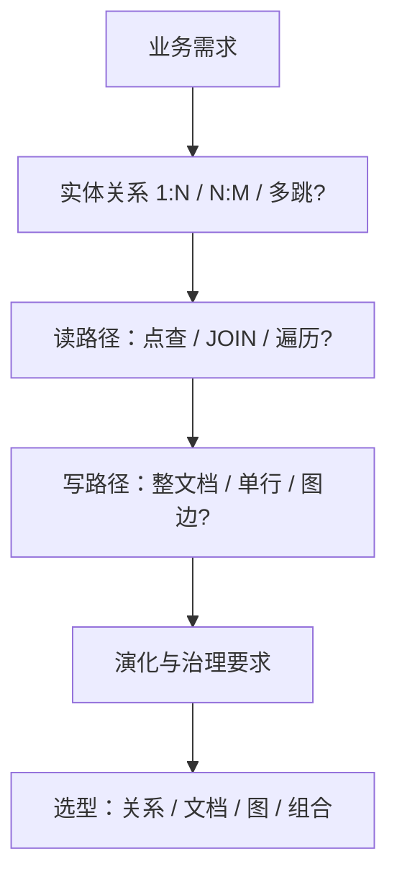
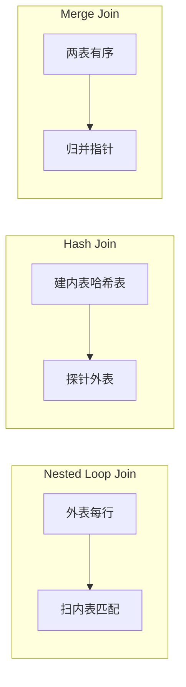

---
aliases:
  - DDIA第2章
tags:
  - DDIA
  - 章节精读
  - 数据模型
  - 查询语言
---

# 第 02 章：数据模型与查询语言

> 本章目标：理解**数据模型是思维工具**——选型取决于实体关系与访问模式，而非「新一定比旧好」；能在设计评审中用**访问模式**论证模型选择。

## 本章在全书中的位置

Part I 基础。数据模型决定**应用代码结构、查询方式、扩展路径**；后续存储引擎（第 3 章）、编码演化（第 4 章）都建立在「存什么、怎么查」之上。详见 [[00-逐章精读总览与索引]]。

## 初学者先抓住一句话

**关系模型**擅长多对多联结；**文档模型**擅长一对多嵌套局部读；**图模型**擅长多跳关系遍历——没有银弹，只有**访问模式与规范化**的权衡。

## 核心概念定义

详见 [[05-概念定义详解#数据模型]]。

| 概念              | 一句话              | 详解                            |
| --------------- | ---------------- | ----------------------------- |
| Relational      | 表 + 外键 + JOIN    | [[05-概念定义详解#关系模型 Relational]] |
| Document        | 自包含 JSON/BSON 文档 | [[05-概念定义详解#文档模型 Document]]   |
| Graph           | 顶点 + 边 + 遍历      | [[05-概念定义详解#图模型 Graph]]       |
| Normalization   | 消除冗余、依赖分解        | 见下文                           |
| Schema-on-write | 写入时强制结构          | 关系库典型                         |
| Schema-on-read  | 读取时解释结构          | 文档库典型                         |

---

## 关系模型 Relational — 深度

### 形式化定义

**关系（Relation）**：一组**元组（行）**的集合，每行符合固定 **Schema（属性名 + 类型）**。  
**关系代数**：选择 σ、投影 π、联结 ⋈、并 ∪、差 −——SQL 的语义基础。

### 规范化 Normalization

| 范式 | 要求 | 消除的问题 | 例子 |
|---|---|---|---|
| **1NF** | 原子值、无重复组 | 数组/嵌套列 | `phone1, phone2` → 独立表 |
| **2NF** | 1NF + 非主属性完全依赖主键 | 部分依赖 | 复合主键下只依赖其中一列 |
| **3NF** | 2NF + 非主属性不传递依赖主键 | 传递依赖 | `(order_id → user_id → user_name)` 拆 user 表 |
| **BCNF** | 每个决定因素都是候选键 | 更严格 3NF | 教师-课程-教室依赖链 |

**设计启示**：规范化**减少写放大与更新异常**（插入/删除/修改异常）；**反规范化**是为读性能**有意冗余**，需接受一致性维护成本。

### 多对多 Many-to-Many

关系模型的**天然优势**：

```text
users ←→ user_groups ←→ groups
         (junction table)

SQL:
SELECT u.name, g.name
FROM users u
JOIN user_groups ug ON u.id = ug.user_id
JOIN groups g ON g.id = ug.group_id
WHERE u.id = 123;
```

**联结 Join 类型**：

| 类型 | 语义 | 典型用途 |
|---|---|---|
| INNER JOIN | 两边都匹配才输出 | 标准关联 |
| LEFT JOIN | 保留左表全部行 | 可选关联（如「含未分组用户」） |
| 自联结 | 同表不同别名 | 组织树、好友链一层 |

---

## 文档模型 Document — 深度

### 形式化直觉

**文档** = 自包含的键值树（JSON/BSON）；**一对多**常**嵌套数组**；**引用**用 ID 或 `$ref` 风格，跨文档一致性由应用保证。

### 嵌套 vs 引用

| 模式 | 结构 | 适合 | 风险 |
|---|---|---|---|
| **嵌套** | `order { lines: [...] }` | 头行一起读、行数有限 | 文档膨胀、16MB 上限（Mongo） |
| **引用** | `order_id` 存于 line 文档 | 行独立更新、跨订单查询 | 需 `$lookup` 或应用层 JOIN |
| **混合** | 热字段嵌套 + 冷数据引用 | 订单头+近期行嵌套，历史行分表 | 查询路径变复杂 |

### JSON 文档的常见问题

| 问题 | 机制 | 后果 |
|---|---|---|
| **Schema 隐式** | 无 DB 级约束 | 同字段类型不一致（`age: 25` vs `"25"`） |
| **文档过大** | 嵌套评论/日志无限增长 | 读写整文档变慢、迁移痛苦 |
| **部分更新** | 整文档替换 vs 字段级 `$set` | 并发写覆盖（last-write-wins） |
| **多对多弱** | 数组存 ID 列表 | 双向查询需冗余或 `$lookup` |
| **跨文档事务** | Mongo 4.0+ 多文档 TX | 有性能与范围限制 |

### 文档模型中的多对多

```json
// 反模式：用户文档内嵌所有 group_id（难查「某 group 有哪些 user」）
{ "_id": "u1", "group_ids": ["g1", "g2", "g3", ...] }

// 较好：junction 集合（类关系表）
{ "user_id": "u1", "group_id": "g2" }
```

→ 此时文档库**退化为宽表关系库**，应诚实评估是否该用 SQL。

---

## 图模型 Graph — 深度

### 形式化定义

**属性图 Property Graph**：**顶点（Vertex）** 带标签与属性；**边（Edge）** 有类型、方向、属性。  
**遍历** = 沿边多跳扩展；**路径查询**是核心能力。

### 与关系库对比

| 场景 | 关系库 | 图库 |
|---|---|---|
| 1 跳好友 | `JOIN friends` 简单 | 均可 |
| 3 跳「可能认识的人」 | 3 次 JOIN 或递归 CTE，SQL 冗长 | Cypher `*1..3` 自然 |
| 最短路径 | 应用层 BFS 或 pgRouting | 原生算法 |
| 百万行 CRUD | 成熟索引 | 未必更优 |
| 固定报表 | SQL 聚合成熟 | 非主战场 |

### Cypher 概念示例（非完整语法，理解 traversals）

```cypher
// 找 Alice 关注的人中，也被 Bob 关注的人（2 跳模式匹配）
MATCH (alice:Person {name: 'Alice'})-[:FOLLOWS]->(p:Person)<-[:FOLLOWS]-(bob:Person {name: 'Bob'})
RETURN p.name

// 可变长度路径：3 度以内
MATCH (me:Person {id: $uid})-[:FOLLOWS*1..3]->(fof:Person)
RETURN DISTINCT fof
```

**Gremlin**：命令式遍历（`g.V().out('knows').out('knows')`）；**SPARQL**：RDF 三元组语义。

### 其他图表示

| 表示 | 机制 | 场景 |
|---|---|---|
| **邻接表** | 边表 `(from, to)` | 关系库可模拟 1 跳 |
| **物化路径 Materialized Path** | 存 `path='/1/4/9/'` | 树形层级、祖先查询 |
| **嵌套集 Nested Sets** | `left/right` 区间 | 只读树、少更新 |
| **Cypher 原生** | 索引 + 指针遍历 | 多跳、模式匹配 |

**物化路径示例**：

```text
categories:
  id=9, name='Laptops', path='/1/4/9/'

查子树: WHERE path LIKE '/1/4/9/%'
查祖先: 解析 path 分段
```

→ 更新移动节点需**批量改 path**；适合**读多写少**的类目树。

---

## 三种模型机制对照

| 维度 | 关系 Relational | 文档 Document | 图 Graph |
|---|---|---|---|
| **核心抽象** | 表 + 行 + 外键 | 文档树 | 顶点 + 边 |
| **1:N** | FK 或 JOIN | 嵌套数组 | 边连接 |
| **N:M** | 联结表 + JOIN | 弱（junction 集合） | 多条边，遍历自然 |
| **Schema** | 强，schema-on-write | 灵活，schema-on-read | 中等 |
| **典型查询** | 过滤 + JOIN + 聚合 | 点查整文档 | 模式匹配 + 路径 |
| **事务** | 成熟 ACID | 视产品（Mongo 4.0+） | 视产品 |
| **扩展** | 分库分表、只读副本 | 分片 | 图分区难 |
| **代表** | PostgreSQL, MySQL | MongoDB, CouchDB | Neo4j, JanusGraph |

---

## 查询语言：声明式 vs 命令式

### 定义

| 类型 | 定义 | 例子 |
|---|---|---|
| **声明式 Declarative** | 描述**要什么结果**，不指定算法 | SQL, Cypher, ES DSL |
| **命令式 Imperative** | 描述**逐步如何取数** | Java 循环 + ORM、Gremlin 链 |
| **函数式/聚合** | MapReduce、SQL 窗口函数 | 大数据批处理 |

### 为何声明式重要

```text
SQL: SELECT region, SUM(amount) FROM orders WHERE year=2024 GROUP BY region

命令式等价（伪代码）:
  map = {}
  for row in scan_entire_orders_table:   // 优化器不会这么干
    if row.year == 2024:
      map[row.region] += row.amount
```

**优化器**可：选索引、改 JOIN 顺序、下推过滤、并行——应用层手写循环**难以自动优化**。

### JSON/XML 查询

| 语言/扩展 | 模型 | 特点 |
|---|---|---|
| **JSONPath / jq** | 文档路径 | `$.store.book[*].author` |
| **MongoDB Query** | 文档 + 聚合管道 | `$match`, `$group`, `$lookup` |
| **XPath / XQuery** | XML 树 | 早期 Web 服务；Schema XSD 严格 |
| **SQL JSON 扩展** | 关系 + JSON 列 | PostgreSQL `->>` , MySQL `JSON_EXTRACT` |

**JSON vs XML 选型（本章视角）**：

| | JSON | XML |
|---|---|---|
| 可读性 | 好 | 冗长 |
| Schema | 常无（或 JSON Schema） | XSD/DTD 成熟 |
| 工具链 | Web/API 默认 | 企业 SOA、文档交换 |
| 演化 | 灵活但易类型漂移 | 严格但变更成本高 |

---

## 设计决策框架

```text
1. 实体关系拓扑
   └─ 主要是 1:N 嵌套？→ 文档候选
   └─ 大量 N:M、多表 JOIN？→ 关系
   └─ 多跳遍历、模式匹配？→ 图

2. 读模式（最重要）
   └─ 点查单实体 / 局部嵌套？
   └─ 跨实体过滤聚合 / 报表？
   └─ 图遍历 / 推荐 / 权限继承链？

3. 写模式
   └─ 整文档替换 vs 单行字段更新？
   └─ 是否需要 DB 级外键、唯一、CHECK？

4. 演化与治理
   └─ Schema 变更频率？谁承担兼容（第 4 章）？

5. 团队与生态
   └─ 运维、备份、监控、ORM 成熟度
```

### 案例走查

| 业务 | 推荐倾向 | 理由 |
|---|---|---|
| 电商订单头+行 | 关系 或 文档嵌套（行 < 100） | 一起读；跨用户统计用 SQL |
| 用户配置 / CMS | 文档 | Schema 多变、单用户点查 |
| 社交 Feed 关系 | 关系 + 缓存 或 图 | 多跳推荐用图；简单关注用关系 |
| 权限 RBAC 继承 | 图 或 闭包表（关系） | 继承链查询 |
| 产品目录树 | 物化路径 / 嵌套集 / 文档嵌套 | 读多写少 |

---

## 架构设计检查清单

- [ ] 是否因「NoSQL 快」选文档库，却大量需要 JOIN / 聚合？
- [ ] 嵌套文档是否无限增长（评论、日志、审计）导致文档 > 1MB？
- [ ] 同一业务概念是否在多个服务各存一份不同结构（缺少 System of Record）？
- [ ] 查询逻辑是否散落在 10 个微服务内存里，无法 DB 侧优化？
- [ ] 图数据库是否用于「其实只需 1 跳 JOIN」的场景（过度工程）？
- [ ] JSON 字段是否缺少应用层校验，导致类型漂移？

---

## 与 Java 后端

### MyBatis

| 实践 | 说明 |
|---|---|
| 显式 SQL | 复杂 JOIN、报表可控 |
| N+1 | `collection` 懒加载 vs 一条 JOIN 查全 |
| 动态 SQL | `<if>` 拼条件，防 SQL 注入用 `#{}` |

### JPA / Hibernate

| 实践 | 说明 |
|---|---|
| 对象图 vs 关系 | `@OneToMany` 默认 lazy，循环中触发 N+1 |
| `@ManyToMany` | 隐式联结表，大数据量改显式实体 |
| 二级缓存 | 读多写少场景；与复制 lag 叠加需谨慎 |

```java
// 反模式：循环内 lazy load
orders.forEach(o -> o.getLines().size()); // N+1

// 较好：JOIN FETCH 或 @EntityGraph
@Query("SELECT o FROM Order o JOIN FETCH o.lines WHERE o.userId = :uid")
List<Order> findWithLines(@Param("uid") Long uid);
```

### MongoDB（Spring Data）

| 实践 | 说明 |
|---|---|
| 嵌套 vs 引用 | 按访问模式设计；避免 `$lookup` 替代 SQL |
| 部分更新 | `Update.set("status", "PAID")` 而非整文档 replace |
| 事务 | 4.0+  replica set；跨分片事务有代价 |
| 索引 | 复合索引顺序匹配查询前缀 |

### 多模型并存

```text
OLTP: MySQL（真相源）
  → Canal CDC → Elasticsearch（搜索）
  → Redis（缓存）
```

见第 12 章 **Unbundling the Database**；勿让 ES 承担事务写。

---

## 常见误区

| 误区 | 正解 |
|---|---|
| NoSQL = 不要 Schema | 只是 schema-on-read；应用仍要校验 |
| 文档库一定比 SQL 快 | 无索引的全表扫描一样慢；JOIN 模拟更慢 |
| ORM 可以屏蔽数据模型 | 错误模型 + ORM = 隐藏 N+1 与 monster query |
| 图数据库万能 | 简单 CRUD 与固定报表非其强项 |
| 规范化总是对的 | 读路径固定时可反规范化，但要文档化冗余更新 |
| XML 已死 | 特定行业（金融报文、出版）仍大量 XML |

---

## 书中目录与小节映射

> 对照 Vonng 译本第 2 章结构。

| 书中章节 / 小节 | 核心内容 | 本笔记对应段落 |
|---|---|---|
| **关系模型的诞生** | 关系代数、SQL 历史地位 | [[#关系模型 Relational — 深度]] |
| **文档模型** | JSON 嵌套、Schema-on-read | [[#文档模型 Document — 深度]] |
| **图模型** | 顶点/边、遍历与 Cypher | [[#图模型 Graph — 深度]] |
| **三种模型的比较** | 无银弹；访问模式决定选型 | [[#三种模型机制对照]]、[[#设计决策框架]] |
| **查询语言** | 声明式 vs 命令式 | [[#查询语言：声明式 vs 命令式]] |
| **MapReduce 与分布式** | 大数据批处理查询（全书第 10 章再展开） | 本章仅作对比提及 |
| **小结** | 数据模型是应用基础 | [[#本章小结]] |

**阅读提示**：本章不教你「该用 MySQL 还是 Mongo」，而是教你**如何用实体关系与访问模式论证选型**——这是架构评审中最常被问、也最容易被流行度绑架的决策。

---

## 书中案例与场景

### 案例一：LinkedIn 个人资料 — 文档 vs 关系

Kleppmann 用 LinkedIn Profile 说明**同一业务实体，不同模型表达力不同**。

#### 关系型表达

```text
users(id, name, headline, ...)
positions(id, user_id, company, title, start_date, end_date)
educations(id, user_id, school, degree, ...)
skills(id, user_id, skill_name)
recommendations(id, user_id, from_user_id, text, ...)
```

- **优点**：每项经历独立更新；跨用户技能统计 `GROUP BY skill_name` 自然。
- **缺点**：读完整 Profile 需多次 JOIN 或宽 JOIN；应用层组装对象繁琐。

#### 文档型表达

```json
{
  "_id": "user:123",
  "name": "Alice",
  "headline": "Senior Engineer",
  "positions": [
    { "company": "Acme", "title": "SWE", "start": "2020-01" }
  ],
  "educations": [ ... ],
  "skills": ["Java", "Kafka"],
  "recommendations": [ { "from": "user:456", "text": "..." } ]
}
```

- **优点**：**一次读取**得完整 Profile（局部性）；Schema 灵活加字段。
- **缺点**：更新嵌套数组中一项需读-改-写整文档；`skills` 反查「谁会 Java」需全表扫描或额外索引。

#### 架构结论

| 访问模式 | 更优模型 |
|---|---|
| 展示 Profile 页（读多、整页） | 文档嵌套 |
| 「拥有技能 X 的用户」搜索 | 关系或独立 `skills` 集合 |
| 经历频繁局部更新 | 关系或文档内引用拆分 |

→ LinkedIn 类系统常见 **多模型并存**：Profile 展示用文档/宽表；搜索与推荐用关系或图。

### 案例二：SQL vs NoSQL 辩论 — 书中立场

Kleppmann **不站队**，而是拆解辩论中的偷换概念：

| 常见说法 | 书中澄清 |
|---|---|
| 「NoSQL 更快」 | 性能取决于**访问模式与索引**，非模型标签；无索引的 Mongo 一样慢 |
| 「NoSQL 不要 Schema」 | 是 **schema-on-read**；Schema 责任转移到应用，并未消失 |
| 「SQL 不能扩展」 | 读扩展（复制）、写扩展（分区）SQL 库大量实践；CAP 讨论在第 5–9 章 |
| 「选一个模型管一切」 | 现代架构常 **Polyglot Persistence**（第 12 章 Unbundling） |

**辩论正确打开方式**：先列**实体关系拓扑**与**读写路径**，再选模型——而非先选「SQL 或 NoSQL」阵营。



---

## 机制深度专题

### 专题一：规范化与反规范化的经济学

```text
写路径成本 = 更新行数 × 索引维护数
读路径成本 = JOIN 深度 × 数据量 × 是否命中索引

规范化：写便宜、读可能贵（多表 JOIN）
反规范化：读便宜、写贵（冗余同步、一致性风险）
```

| 场景 | 倾向 | 例子 |
|---|---|---|
| 写多读少、强一致 | 规范化 | 账务、库存 |
| 读多写少、报表固定 | 反规范化 | 宽表、物化视图 |
| 读路径固定可缓存 | 可反规范化 + 缓存 | 商品详情页 |

### 专题二：JOIN 的物理实现直觉（衔接第 3 章）



- **优化器**根据统计信息选算法——声明式 SQL 的价值在此。
- 应用层「循环查 N 次」≈ Nested Loop N+1——通常最差。

### 专题三：图遍历 vs SQL 递归

```text
3 跳好友（SQL 递归 CTE）:
  WITH RECURSIVE friends AS (
    SELECT friend_id, 1 AS depth FROM follows WHERE user_id = $me
    UNION ALL
    SELECT f.friend_id, fr.depth + 1
    FROM follows f JOIN friends fr ON f.user_id = fr.friend_id
    WHERE fr.depth < 3
  ) SELECT * FROM friends;

Cypher:
  MATCH (me:Person {id: $me})-[:FOLLOWS*1..3]->(fof) RETURN fof
```

| 维度 | SQL 递归 | Cypher |
|---|---|---|
| 可读性 | 深度增加时复杂 | 路径长度自然表达 |
| 优化 | 依赖 DB 实现 | 图索引原生 |
| 适用深度 | 1–2 跳尚可 | 多跳推荐、权限继承 |

---

## 算法与流程

### 访问模式驱动的模型选型流程

```text
function choose_data_model(entities, access_patterns):
  topology = analyze_relationships(entities)  // 1:N, N:M, tree, graph

  for pattern in access_patterns:
    if pattern.type == "single_entity_read":
      score.document += weight(pattern.frequency)
    if pattern.type == "multi_table_join" or pattern.type == "aggregation":
      score.relational += weight(pattern.frequency)
    if pattern.type == "variable_hop_traversal":
      score.graph += weight(pattern.frequency)

  if topology.has_heavy_N_to_M and score.relational dominant:
    return RELATIONAL (+ optional search index)
  if topology.mostly_1_to_N_nested and score.document dominant:
    return DOCUMENT
  if score.graph >> others:
    return GRAPH
  return POLYGLOT  // 多模型组合，明确 System of Record
```

### 物化路径维护算法

```text
// 插入子节点 child 到 parent 下
function insert_node(parent_id, child):
  parent_path = SELECT path FROM categories WHERE id = parent_id
  child.path = parent_path + child.id + '/'
  INSERT categories (id, name, path) VALUES (...)

// 移动子树（读少写多场景慎用）
function move_subtree(node_id, new_parent_id):
  old_path = SELECT path FROM categories WHERE id = node_id
  new_base = SELECT path FROM categories WHERE id = new_parent_id
  new_path = new_base + node_id + '/'
  UPDATE categories
    SET path = REPLACE(path, old_path, new_path)
    WHERE path LIKE old_path || '%'   // 批量更新整棵子树
```

### 文档部分更新 vs 整文档替换

```text
// 整文档替换（易丢并发更新）
read doc → modify in memory → write full doc   // last-write-wins

// 字段级更新（Mongo $set）
UPDATE users SET profile.headline = $h WHERE _id = $id

// 乐观锁
UPDATE users SET ..., version = version + 1
  WHERE _id = $id AND version = $expected
```

---

## 与具体产品对照

| 产品 | 模型定位 | 典型强项 | 注意 |
|---|---|---|---|
| **PostgreSQL** | 关系 + JSONB + 全文 + 扩展 PostGIS | 复杂查询、事务、扩展生态 | JSONB 不是文档库替代品 |
| **MySQL 8** | 关系 + JSON 列 | OLTP、成熟运维 | 复杂分析不如 PG |
| **MongoDB** | 文档 | 灵活 Schema、嵌套读 | 多表 JOIN 用 `$lookup` 性能差 |
| **CouchDB** | 文档 + MVCC | 离线同步、多主 | 查询能力弱于 Mongo |
| **Neo4j** | 属性图 | Cypher 多跳 | 非 OLTP 全能 |
| **JanusGraph** | 图 + 后端可插拔 | 大规模图 | 运维复杂 |
| **Elasticsearch** | 文档/倒排 | 全文搜索、聚合 | 非事务真相源 |
| **RedisJSON** | 内存文档 | 热数据嵌套 | 持久化与容量限制 |

### Java ORM 与模型匹配

| 栈 | 最适配模型 | 常见坑 |
|---|---|---|
| **JPA/Hibernate** | 关系 | N+1、懒加载风暴 |
| **MyBatis** | 关系 + 手写 SQL | 动态 SQL 维护 |
| **Spring Data MongoDB** | 文档 | 把 Mongo 当 MySQL 用 JOIN |
| **Spring Data Neo4j** | 图 | 与 JPA 混用事务边界 |

---

## 深度 FAQ

**Q1：什么时候文档模型明显优于关系？**  
A：实体是**自包含聚合**（订单头+行、用户配置）、读路径以**整棵子树点查**为主、Schema 变更频繁且可接受应用层校验。

**Q2：MongoDB 的 `$lookup` 能否替代 SQL JOIN？**  
A：小数据量可以；大数据量时**无查询优化器深度 JOIN 优化**，常不如 SQL。若频繁 `$lookup`，应重新评估是否该用关系库。

**Q3：3NF 是否总是必要？**  
A：OLTP 核心表建议规范化；只读报表、缓存宽表可反规范化。关键是**有意识**并文档化冗余更新责任。

**Q4：图数据库何时不值得？**  
A：仅 1 跳关系、固定 SQL 报表、无多跳遍历需求——图 DB 运维成本不划算。

**Q5：声明式查询为何利于性能？**  
A：优化器可见全局计划，可选索引、JOIN 顺序、谓词下推、并行——应用层循环难以自动做这些。

**Q6：JSON 和 XML 在 2024 年如何选？**  
A：新 API 默认 JSON；金融报文、出版、遗留 SOAP 仍 XML。混合系统用适配层转换。

**Q7：多对多在文档库中的最佳实践？**  
A：独立 **junction 集合**（类联结表），而非双向嵌套 ID 数组——否则双向查询某一端极痛苦。

**Q8：LinkedIn Profile 能否只用一种模型？**  
A：可以但需妥协：纯文档则技能搜索难；纯关系则 Profile 页组装成本高。大厂多 **Polyglot**。

**Q9：Schema-on-read 的风险？**  
A：同字段类型漂移（`age: 25` vs `"25"`）、无 DB 约束导致脏数据、多服务各解各的 Schema。

**Q10：如何向团队解释「没有银弹」？**  
A：用**同一业务**画两种模型下的读写 SQL/JSON 各一段，对比行数、更新路径、报表难度——比抽象辩论有效。

---

## 设计模式与反模式

### 设计模式

| 模式 | 说明 |
|---|---|
| **Aggregate Root（DDD）** | 文档边界与一致性单元对齐 |
| **Junction Table / 联结集合** | N:M 标准解法 |
| **Materialized Path** | 读多写少树形层级 |
| **Closure Table** | 关系库模拟图多跳 |
| **CQRS 读写分离** | 写模型规范化、读模型反规范化宽表 |
| **Polyglot Persistence** | 各工作负载专用存储 |
| **API Composition** | 微服务下内存 JOIN（需接受延迟与一致性问题） |

### 反模式

| 反模式 | 后果 |
|---|---|
| **无限嵌套文档** | 评论/日志塞进用户文档 → 16MB 上限、读写放大 |
| **用文档库存账务** | 缺事务/约束 → 一致性问题 |
| **ORM 隐藏错误模型** | N+1 monster query |
| **为图而图** | 1 跳 JOIN 上图库 |
| **双向嵌套 ID 数组** | N:M 查询不对称、更新痛苦 |
| **无 System of Record** | 多服务各存一份结构不同的「用户」 |
| **把 ES 当主库** | 丢数据、无 ACID |

---

## 本章练习

1. 为你负责的一个业务画 **ER 图**，标出 1:N、N:M；分别写出关系型 Schema 与文档型 JSON 各一版。
2. 设计「组织架构树」：比较**物化路径、嵌套集、闭包表、图模型**四种方案的读写 SQL/Cypher。
3. 找一段生产 SQL 或 Mongo 聚合，说明为何是**声明式**以及优化器/引擎能做什么。
4. 列举一个**不适合**文档嵌套的场景并论证。
5. **LinkedIn Profile 演练**：设计 Profile 存储，支持（a）整页读取 < 50ms（b）「拥有 Kafka 技能的用户」搜索。写出是否拆集合、索引策略。
6. 对一条存在 **N+1** 的 JPA 代码做 `EXPLAIN` 对比：改为 `JOIN FETCH` 前后的查询次数与延迟。
7. 模拟 **SQL vs NoSQL 评审**：给定「电商订单+订单行+跨用户报表」需求，写一页选型论证（禁止只说「NoSQL 快」）。

## 阅读检查

- [ ] 能解释 3NF 要消除什么异常
- [ ] 能说明文档模型如何处理（或无法处理）多对多
- [ ] 能对比声明式与命令式查询的优化差异
- [ ] 能写出一个 2 跳 Cypher/MATCH 模式的业务含义
- [ ] 能说出物化路径的更新代价
- [ ] 能用访问模式论证 SQL vs Mongo 选型
- [ ] 能复述 LinkedIn Profile 文档 vs 关系的权衡
- [ ] 能说明书中对「SQL vs NoSQL 辩论」的立场
- [ ] 能列举至少 2 种 JOIN 物理算法及优化器意义
- [ ] 能解释 schema-on-write 与 schema-on-read 区别
- [ ] 能说出图模型相对 SQL 的核心优势场景
- [ ] 能识别「无限嵌套文档」反模式及后果

---

## 本章小结

- 数据模型是**思维工具**；影响代码、查询、扩展、演化全链路。
- **关系**强在 N:M 与联结；**文档**强在 1:N 嵌套局部读；**图**强在多跳遍历。
- 选型核心 = **访问模式 + 规范化/反规范化权衡**，不是流行度。
- 声明式查询把优化交给引擎；避免把 DB 当 dumb storage。

## 相关笔记

- [[05-概念定义详解#数据模型]]
- [[03-数据模型与存储选型]]
- [[02-第03章-存储与检索]]
- [[04-第04章-编码与演化]]
