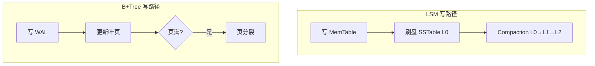
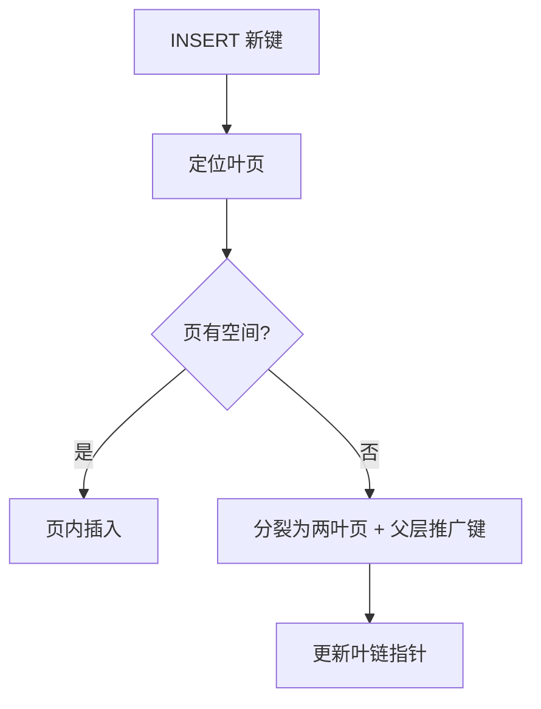

---
aliases:
  - DDIA第3章
tags:
  - DDIA
  - 章节精读
  - 存储引擎
  - 索引
---

# 第 03 章：存储与检索

> 本章目标：理解数据库**内部**如何用索引与日志组织数据，以便做出**索引设计、分库、引擎选型**决策；能解释慢查询与放大效应根因。

## 本章在全书中的位置

Part I 基础。第 2 章选**逻辑模型**；本章揭示**物理实现**——为何 LSM 写快、B+Tree 读稳；WAL/Compaction 机制直接关联第 5 章复制与恢复。详见 [[00-逐章精读总览与索引]]。

## 初学者先抓住一句话

**OLTP** 优化点查与短事务；**OLAP** 优化大规模扫描聚合——引擎结构完全不同；**索引从不免费**。

## 核心概念定义

详见 [[05-概念定义详解#存储引擎]]。

| 概念 | 一句话 | 详解 |
|---|---|---|
| WAL | 先写日志再改数据 | [[05-概念定义详解#WAL（Write-Ahead Log）]] |
| SSTable | 有序不可变键值文件 | [[05-概念定义详解#SSTable（Sorted String Table）]] |
| LSM-Tree | 内存表 + 多层 SSTable + Compaction | [[05-概念定义详解#LSM-Tree]] |
| B+Tree | 页为单位平衡树，范围查询友好 | [[05-概念定义详解#B-Tree / B+Tree]] |
| Read/Write Amplification | 一次逻辑 IO 触发的物理 IO 倍数 | 见下文 |

---

## 驱动数据库的数据结构

### 最简单的存储：追加日志

```text
写: append(key, value) → segment file
读: 从头到尾 scan，取最后一次出现的 key  → O(n)，需 compaction
```

**问题**：读太慢 → 引入**索引**。

---

## 哈希索引 Hash Index

### 机制

```text
内存 HashMap: key → byte_offset（在 segment 中的位置）
磁盘: 只追加写 segment（顺序写，快）
后台: 合并 segment，丢弃重复 key 的旧值
```

| 优点 | 缺点 |
|---|---|
| 点查 O(1) 索引 + 一次磁盘读 | **不支持范围查询**（key 无序） |
| 写入顺序 IO | 内存需装下全部 key |
| 崩溃恢复：重放 segment 重建索引 | 键很多时内存压力大 |

**代表**：Bitcask（Riak）、部分时序/缓存场景。

**适用**：键值点查、全量 key 可进内存、无需 `WHERE age BETWEEN 20 AND 30`。

---

## SSTable 与 LSM-Tree

### SSTable 定义

**Sorted String Table**：磁盘上**按键排序、不可变**的键值文件；含 **index + bloom filter**（可选）加速查找。

### 写入路径

```text
1. 写 → MemTable（内存有序结构，如 skiplist/red-black tree）
2. MemTable 满 → 刷盘为 SSTable L0（有序文件）
3. 后台 Compaction：合并多层 SSTable → L1, L2, ...
4. 删除 = 写入 tombstone 标记
```

### 读取路径

```text
查 key:
  1. 先查 MemTable
  2. 再查 L0 SSTable（可能多个，需检查）
  3. 逐层向下，Bloom filter 跳过不含 key 的文件
  4. 合并结果取最新版本
```

### Compaction 策略

| 策略 | 机制 | 读放大 | 写放大 | 空间放大 |
|---|---|---|---|---|
| **Size-tiered** | 相近大小文件合并 | 较高 | 较低 | 较高（重复 key 多份） |
| **Leveled**（LevelDB/RocksDB） | 每层总大小十倍，L0→L1 键不重叠 | 较低 | 较高 | 较低 |
| **Universal** | 折中 | 中 | 中 | 中 |

**写放大 Write Amplification**：逻辑写 1 次，Compaction 重写同数据 N 次。  
**读放大 Read Amplification**：查 1 key 需读多个 SSTable。  
**空间放大 Space Amplification**：旧版本/tombstone 未合并前占额外空间。

> **三放大权衡**：LSM **写优化**的代价是后台 Compaction CPU/IO 与读路径复杂度。

**代表**：LevelDB、RocksDB、Cassandra、HBase、RocksDB-MyRocks。

---

## B-Tree / B+Tree

### 页 Page 结构

```text
                    [ 根页 16KB ]
                   /      |      \
          [内页]            [内页]           [内页]
         /  |  \          /  |  \
    [叶页][叶页][叶页]  [叶页][叶页]  ...   ← 叶页链表，支持范围扫描

每页（如 4KB/16KB）:
  - 页头: checksum, LSN
  - 槽位目录 + 键值对（叶页）或 子页指针（内页）
```

**B+Tree 特点**（InnoDB、PostgreSQL）：

- **内页只存键**，数据只在**叶页** → 内页扇出大，树矮。
- **叶页双向链表** → `WHERE id BETWEEN 100 AND 200` 顺序扫描。
- **更新**：原地修改页或 **Copy-on-Write**（PostgreSQL）；页满则**分裂**，过少则**合并**。

### 与 LSM 对比

| 维度 | LSM-Tree | B+Tree |
|---|---|---|
| 写路径 | 顺序写 MemTable + 刷盘 | 随机写页（WAL 顺序） |
| 读路径 | 多层 SSTable + Bloom | 树高通常 3–4 层 |
| 写吞吐 | 高 | 中（随机写） |
| 读延迟 | 变层数影响，需 tuning | 较稳定 |
| 范围扫描 | 支持（有序 SSTable） | 优秀（叶链） |
| 典型场景 | 写密集、时序、Wide-column | 通用 OLTP |

---

## WAL（Write-Ahead Log）

> MySQL InnoDB 的 Redo 实现详见专篇 → [[Senior Java Engineer/3-数据库/2001-InnoDB-Redo日志与崩溃恢复|InnoDB Redo 日志与崩溃恢复]]

### 机制

```text
1. 事务修改 → 先 append WAL 记录（顺序写）
2. WAL fsync（按 durability 策略）
3. 更新内存中的 MemTable / B-Tree 页（脏页）
4. 后台 checkpoint 刷脏页；崩溃后重放 WAL
```

| 作用 | 说明 |
|---|---|
| **Durability** | 已提交事务不因 crash 丢 |
| **顺序写** | 将随机页写转为日志顺序写 |
| **复制基础** | binlog/redo log 即复制源（第 5 章） |

**组提交 Group Commit**：多事务 WAL 一次 fsync，摊薄 IO 成本。

---

## InnoDB 聚簇索引 Clustered Index

### 机制

```text
主键 B+Tree 叶页 = 完整行数据（聚簇）
二级索引叶页 = 主键值（回表查聚簇索引）

INSERT 顺序主键 → 页尾追加，少分裂
随机主键 UUID → 页分裂频繁，碎片多
```

| 概念 | 说明 |
|---|---|
| **聚簇索引** | 表数据按主键 B+Tree 存储；一表一聚簇 |
| **二级索引** | 独立 B+Tree，叶存主键 → **回表** |
| **覆盖索引** | 索引含查询全部列 → **无需回表** |
| **最左前缀** | 复合索引 `(a,b,c)` 可用 `a` 或 `a,b`，不可用单独 `b` |

**设计启示**：

- 高频查询建**覆盖索引**减少回表。
- 主键选**单调递增**（雪花 ID、自增）减少分裂。
- 二级索引每增一个 → 每次写多维护一棵 B+Tree。

---

## 读放大与写放大 — 精讲

| 术语 | 定义 | LSM 例子 | B+Tree 例子 |
|---|---|---|---|
| **写放大** | 1 次逻辑写触发的物理写次数 | Compaction 重写 | 页分裂、WAL + 脏页刷盘 |
| **读放大** | 1 次逻辑读触发的物理读次数 | 查 6 层 SSTable | 非覆盖索引回表 |
| **空间放大** | 磁盘占用 / 逻辑数据量 | 多版本共存 | 页填充率 < 100% |

**SARGable**（Search ARGument ABLE）：谓词能否**有效利用索引**。

| SARGable ✓ | 非 SARGable ✗ |
|---|---|
| `WHERE create_time >= '2024-01-01'` | `WHERE YEAR(create_time) = 2024` |
| `WHERE status = 'PAID'` | `WHERE UPPER(name) = 'FOO'`（函数包列） |
| `WHERE user_id = 123 AND order_id > 1000`（复合索引左前缀） | `WHERE user_id + 1 = 124` |

→ 索引失效 = 全表扫描 = 读放大爆炸。

---

## OLTP vs OLAP

| | OLTP | OLAP |
|---|---|---|
| **访问模式** | 少量行，索引点查，短事务 | 大量行，扫描 + 聚合 |
| **存储布局** | **行存** Row-oriented | **列存** Column-oriented |
| **Schema** | 规范化（3NF） | **星型/雪花** 维度模型 |
| **索引** | B+Tree 二级索引 | 列压缩字典、位图 |
| **典型系统** | MySQL, PostgreSQL | ClickHouse, Redshift, BigQuery |
| **查询** | 毫秒级点查 | 秒~分钟级报表 |

**HTAP**（Hybrid）：同一系统兼顾；需理解**并非免费**——资源争抢、隔离复杂。

---

## 列存储 Column-Oriented

### 机制

```text
行存: [row1: id,name,age] [row2: id,name,age] ...
列存: [id: 1,2,3,...] [name: a,b,c,...] [age: ...]

同列数据相邻 → 高压缩（字典、RLE、位打包）
查询 SELECT AVG(age) → 只读 age 列
向量化: SIMD 一次处理一批值
```

| 优点 | 缺点 |
|---|---|
| 聚合/扫描极快 | 点查整行需拼多列 |
| 高压缩比 | 写入需更新多列文件（LSM 列存可缓解） |
| 适合 BI | 不适合高频单行 UPDATE |

---

## 星型模式 Star Schema

```text
         dim_date
              |
fact_sales ---- dim_product
              |
         dim_customer

事实表 fact: 度量（amount, qty）+ 外键
维度表 dim: 描述属性（product_name, category）
```

| 模型 | 结构 | 用途 |
|---|---|---|
| **星型** | 事实表 + 扁平维度表 | 简单 JOIN，BI 友好 |
| **雪花** | 维度再规范化 | 省空间，JOIN 更多 |

**与 OLTP 对比**：OLAP **反规范化**换扫描性能；勿在 OLTP 库跑大星型 JOIN 报表。

---

## 其他索引类型（简述）

| 类型 | 机制 | 场景 |
|---|---|---|
| **全文索引** | 倒排表 term → doc ids | Elasticsearch, InnoDB FULLTEXT |
| **地理空间** | R-Tree / Geohash | 附近的人 |
| **UUID 索引** | 同 B+Tree，但随机插入性能差 | 考虑有序 UUID |

---

## 架构设计检查清单

- [ ] 高频查询是否有**覆盖索引**或合适复合索引？
- [ ] WHERE 条件是否 **SARGable**（无函数包列）？
- [ ] 是否在 OLTP 库跑大报表拖垮 buffer pool / 复制 lag？
- [ ] 写入是否触发**过多二级索引**更新？
- [ ] 是否了解所用 DB 是 **LSM 还是 B+Tree**（调优参数不同）？
- [ ] 深分页 `LIMIT 1000000, 20` 是否改为 **Seek**（`WHERE id > last_id`）？
- [ ] 主键是否随机 UUID 导致页分裂（应用层有序 ID）？

---

## 与 Java 后端

| 主题 | 实践 |
|---|---|
| **InnoDB** | 聚簇索引 = 主键；`EXPLAIN` 看 type=index/ALL |
| **MyBatis 分页** | 深分页用游标；PageHelper 大 offset 仍慢 |
| **RocksDB/MyRocks** | MySQL 可选 LSM 引擎；写密集场景 |
| **ES** | 倒排 + doc values；**非**事务真相源 |
| **ClickHouse JDBC** | 批量 INSERT；避免单行高频 UPDATE |
| **连接池** | 慢查询占连接 → 全站阻塞；设 query timeout |

```sql
-- 覆盖索引示例
CREATE INDEX idx_user_status_amount ON orders(user_id, status, amount);
-- SELECT amount FROM orders WHERE user_id=? AND status='PAID'  → 无需回表
```

---

## 常见误区

| 误区 | 正解 |
|---|---|
| 索引越多越好 | 每次写维护所有索引；写放大上升 |
| 加内存就能解决慢查询 | 全表扫描 + 大数据量仍会拖垮 |
| LSM 一定比 B+Tree 快 | 读-heavy、未 tuning Compaction 可能更慢 |
| OLAP 库当 OLTP 用 | 列存不擅长高并发单行更新 |
| `SELECT *` 无害 | 破坏覆盖索引，多读无关列 |
| redo log = binlog | redo 崩溃恢复（页级 WAL）；binlog 复制/PITR（逻辑日志）；见 [[Senior Java Engineer/3-数据库/2001-InnoDB-Redo日志与崩溃恢复|2001 Redo]]、[[Senior Java Engineer/3-数据库/2002-MySQL-Binlog-Relay与主从复制|2002 Binlog/Relay]] |
| Redo 能修复一切宕机 | 仅恢复**未刷盘的页变更**；Torn Page 需 **Doublewrite**；查缓存/内存状态不恢复 |

---

## 书中目录与小节映射

> 对照 Vonng 译本第 3 章结构。

| 书中章节 / 小节 | 核心内容 | 本笔记对应段落 |
|---|---|---|
| **驱动数据库的数据结构** | 日志、索引基本动机 | [[#驱动数据库的数据结构]] |
| **哈希索引** | Bitcask 风格、点查、无范围 | [[#哈希索引 Hash Index]] |
| **SSTable 与 LSM-Tree** | MemTable、Compaction、三放大 | [[#SSTable 与 LSM-Tree]] |
| **B-Tree** | 页结构、分裂合并、范围扫描 | [[#B-Tree / B+Tree]] |
| **B-Tree 与 LSM-Tree 比较** | 读写权衡 | [[#与 LSM 对比]] |
| **其他索引结构** | 全文、多维索引简述 | [[#其他索引类型（简述）]] |
| **事务处理还是分析？** | OLTP vs OLAP | [[#OLTP vs OLAP]] |
| **数据仓库** | 星型/雪花、列存 | [[#列存储 Column-Oriented]]、[[#星型模式 Star Schema]] |
| **小结** | 索引从不免费 | [[#本章小结]] |

---

## 书中案例与场景

### 案例一：B-Tree vs LSM-Tree 权衡

Kleppmann 用对比表说明**没有 universally better 的引擎**：

| 场景 | 倾向引擎 | 原因 |
|---|---|---|
| 读多写少、范围查询 | **B+Tree**（InnoDB、PG） | 读路径稳定、叶链范围扫描优 |
| 写密集、顺序写 | **LSM**（RocksDB、Cassandra） | MemTable 批量刷盘、顺序 IO |
| 混合负载 | 需压测 + tuning | Compaction 策略决定 LSM 读性能 |



### 案例二：Email Inbox 索引

书中用邮箱解释 **OLTP 索引设计**：

```text
需求：
  - 按 inbox 查某用户邮件，按 received_at 降序（最新在前）
  - 按 message_id 点查单封
  - 按 thread_id 聚合会话

索引设计（关系库）：
  PRIMARY KEY (message_id)
  INDEX idx_inbox (user_id, received_at DESC)   -- 首页列表
  INDEX idx_thread (thread_id, received_at)
```

| 查询 | 命中索引 | 说明 |
|---|---|---|
| `WHERE user_id=? ORDER BY received_at DESC LIMIT 50` | `idx_inbox` | 避免 filesort |
| `WHERE message_id=?` | PK | 点查 |
| 未索引 `WHERE subject LIKE '%foo%'` | 全表扫描 | 需全文索引 |

**启示**：索引跟随**最高频访问路径**；二级索引每个都增加写放大。

### 案例三：列存用于分析（数据仓库）

```text
查询：SELECT region, SUM(amount) FROM sales_fact WHERE year=2024 GROUP BY region

行存 OLTP：扫描所有列 → IO 大
列存 OLAP：只读 amount、region、year 列 → 压缩高、向量化聚合快
```

| 维度 | 行存 InnoDB | 列存 ClickHouse |
|---|---|---|
| `SELECT * WHERE id=1` | 快 | 需拼列 |
| `SUM(amount) GROUP BY region` 亿行 | 慢 | 快 |
| 高频单行 UPDATE | 擅长 | 不擅长 |

---

## 机制深度专题

### 专题一：LSM Compaction 深度

```ascii
时间线 ──────────────────────────────────────────────►

T1: MemTable 满 → Flush → L0 文件 [A-D], [C-F]  (键范围可重叠)
T2: 读 key C → 查 MemTable → L0 两个文件都可能要查 → 读放大
T3: Compaction → L1  [A-F] 键不重叠
T4: 读 key C → MemTable → L0 → L1 最多各查一遍 → 读放大降低
T5: 后台持续 Compaction → 写放大（同一数据多次重写）
```

| Compaction 策略 | 写放大 | 读放大 | 空间放大 | 代表 |
|---|---|---|---|---|
| Size-tiered | 低 | 高 | 高 | Cassandra STCS |
| Leveled | 高 | 低 | 低 | RocksDB、LevelDB |
| FIFO | 最低 | 最高 | 中 | 时序 TTL 场景 |

**运维可见症状**：Compaction 落后 → 读延迟上升、磁盘空间膨胀（tombstone 未清理）。

### 专题二：B+Tree 页分裂与碎片



- **顺序主键**（自增、雪花）：页尾追加，分裂少。
- **随机 UUID 主键**：页分裂频繁、**空间碎片**、buffer pool 污染。

### 专题三：列存编码与向量化

```text
列 age: [25,25,25,30,30,45,45,45,45,...]

编码：
  Dictionary: 25→0, 30→1, 45→2  → [0,0,0,1,1,2,2,2,2]
  RLE: (25,3)(30,2)(45,4)
  Bit packing: 小整数压位

执行：
  SIMD 一次加载 256 位 → 并行比较/累加 → SUM/AVG 极快
```

---

## 算法与流程

### LSM 读取路径伪代码

```text
function lsm_get(key):
  if key in MemTable:
    return MemTable[key]  // 含 tombstone 则视为不存在

  for sstable in L0_files_ordered_by_recency:
    if bloom_filter_may_contain(sstable, key):
      val = sstable.get(key)
      if val found: return val

  for level in L1..Ln:
    candidate = find_in_level(level, key)  // 每层键范围不重叠
    if candidate: return candidate

  return NOT_FOUND
```

### B+Tree 范围扫描伪代码

```text
function btree_range_scan(start_key, end_key):
  leaf = find_leaf(start_key)
  while leaf != null:
    for row in leaf.rows_in_range(start_key, end_key):
      yield row
    if leaf.max_key >= end_key: break
    leaf = leaf.next_leaf  // 叶链
```

### InnoDB 二级索引回表流程

```text
function query_with_secondary_index(user_id, status):
  // INDEX (user_id, status, amount)
  rows = secondary_index.seek(user_id, status)
  for each row in rows:
    pk = row.primary_key
    full_row = clustered_index.get(pk)   // 回表：第二次 B+Tree 查找
    yield full_row

// 覆盖索引：SELECT amount ... → 无需回表
```

### Email Inbox 分页（Seek 法）

```text
// 反模式：OFFSET 深分页
SELECT * FROM emails WHERE user_id=? ORDER BY received_at DESC LIMIT 1000000, 20

// Seek：利用索引
SELECT * FROM emails
  WHERE user_id=? AND received_at < :last_seen
  ORDER BY received_at DESC LIMIT 20
```

---

## 与具体产品对照

| 产品 | 引擎类型 | 关键机制 | 调优入口 |
|---|---|---|---|
| **MySQL InnoDB** | B+Tree | 聚簇索引、redo/undo、buffer pool、doublewrite | `EXPLAIN`、索引、主键选择；Redo 详见 [[Senior Java Engineer/3-数据库/2001-InnoDB-Redo日志与崩溃恢复|2001 Redo 专篇]] |
| **PostgreSQL** | B-Tree + 多种索引 | Heap + 索引、VACUUM、MVCC | `EXPLAIN ANALYZE`、autovacuum |
| **MyRocks** | LSM on MySQL | RocksDB 替换 InnoDB | Compaction、写密集 |
| **RocksDB** | LSM | Leveled compaction、Column Family | `rocksdb.stats`、并行 compaction |
| **LevelDB** | LSM | 经典 leveled | 嵌入式 KV |
| **Cassandra** | LSM (SSTable) | 宽列、可调一致性 | compaction 策略、memtable |
| **HBase** | LSM | 基于 HDFS、Region 分区 | Region split、compaction |
| **ClickHouse** | 列存 + MergeTree | 分区、物化视图、向量化 | 避免单行 UPDATE |
| **Elasticsearch** | 倒排 + doc values | Segment、merge | 非事务主库 |
| **SQLite** | B-Tree | 嵌入式、单写 | 适合边缘非高并发 |

### Kafka 日志 vs 数据库日志

| | Kafka 日志 | DB WAL |
|---|---|---|
| 目的 | 消息传递、事件溯源 | 崩溃恢复、durability |
| 消费 | 多消费者独立 offset | 内部重放 |
| 保留 | 可配置 TTL | checkpoint 后截断 |

---

## 深度 FAQ

**Q1：为什么 LSM 写快？**  
A：写入先落**内存 MemTable**，批量**顺序刷盘**；随机写转为顺序写。代价是 Compaction 的写放大与读路径多层查找。

**Q2：B+Tree 随机写为何慢？**  
A：即使 WAL 顺序，脏页刷盘常是**随机 IO**（除非整页顺序插入）；页分裂进一步增加 IO。

**Q3：什么是写放大 10x？**  
A：逻辑写 1GB 数据，Compaction 过程中物理写了 10GB——SSD 寿命与 IO 带宽需按放大倍数规划。

**Q4：覆盖索引为何能省 IO？**  
A：二级索引叶页已含查询所需全部列，无需再查聚簇索引——少一次 B+Tree 遍历。

**Q5：为何 `WHERE YEAR(created_at)=2024` 慢？**  
A：函数包列导致**非 SARGable**，优化器无法用 `created_at` 索引，变全表扫描。

**Q6：列存为何不适合 OLTP 点查？**  
A：一行数据分散在多列文件中，读整行需**多次 IO + 拼装**；高频 UPDATE 需改多列文件。

**Q7：HTAP 是否一劳永逸？**  
A：否。资源争抢、隔离复杂、两套优化目标冲突——很多团队仍 **OLTP + OLAP 分离**（CDC 到数仓）。

**Q8：Email 索引为何用 `(user_id, received_at DESC)`？**  
A：匹配最高频「收件箱列表」谓词+排序，避免额外排序（filesort）。

**Q9：tombstone 是什么？**  
A：LSM 中删除 = 写特殊标记；Compaction 时才物理清除——删除后空间可能暂不释放。

**Q10：redo log 和 binlog 区别（MySQL）？**  
A：redo 用于 **InnoDB 崩溃恢复**（物理页级）；binlog 用于**复制与归档**（逻辑/行级）。双写协议保证一致性。

---

## 设计模式与反模式

### 设计模式

| 模式 | 说明 |
|---|---|
| **覆盖索引** | 减少回表 |
| **最左前缀复合索引** | 多条件查询一条索引 |
| **Seek 分页** | 替代深 OFFSET |
| **单调递增主键** | 减少 B+Tree 分裂 |
| **OLTP/OLAP 分离** | CDC → 列存数仓 |
| **读写分离** | 报表走只读副本 |
| **冷热分离** | 热数据 InnoDB、归档对象存储 |

### 反模式

| 反模式 | 后果 |
|---|---|
| 索引泛滥 | 写放大、缓冲池污染 |
| `SELECT *` | 破坏覆盖索引 |
| 函数包列 | 索引失效 |
| 随机 UUID 主键 | 页分裂、碎片 |
| OLTP 库跑大报表 | 复制 lag、业务抖动 |
| 深分页 OFFSET | 扫描丢弃百万行 |
| 忽视 Compaction | LSM 读延迟恶化 |

---

## 本章练习

1. 画 **LSM 写入 + Compaction** 与 **B+Tree 页分裂** 各一张时序图。
2. 给定查询 `WHERE DATE(created_at) = '2024-06-01'`，说明为何非 SARGable 及改写方式。
3. 设计订单表索引：查询 `(user_id, status)` 过滤 + `created_at` 排序。
4. 解释 InnoDB **回表** 与 **覆盖索引** 对读放大的影响。
5. **Email Inbox**：为 `emails(user_id, received_at, message_id, thread_id, subject)` 设计索引，支持收件箱列表、单封点查、线程聚合三种查询，用 `EXPLAIN` 验证。
6. 对比 **RocksDB leveled** 与 **Cassandra size-tiered** 在三放大上的差异，写一段你负责系统的选型论证。
7. 将一条 **OLTP 大报表** 查询迁移到 ClickHouse：画 CDC 链路，说明星型模型如何映射。

## 阅读检查

- [ ] 能解释 WAL 的作用与顺序写优势
- [ ] 能说明 LSM 三层放大及 Compaction 权衡
- [ ] 能描述 B+Tree 页分裂与叶链范围扫描
- [ ] 能解释聚簇索引与二级索引回表
- [ ] 能对比行存与列存适用场景
- [ ] 能说出星型模式中事实表与维度表职责
- [ ] 能定义 SARGable 并举反例
- [ ] 能复述 B-Tree vs LSM 书中核心权衡
- [ ] 能设计 Email Inbox 类复合索引
- [ ] 能解释 tombstone 与空间回收延迟
- [ ] 能说出 Seek 分页相对 OFFSET 的优势
- [ ] 能区分 redo log 与 binlog（MySQL）

---

## 本章小结

- 存储引擎决定**读写曲线**；选型看访问模式（读/写/范围/聚合）。
- **哈希**点查快无范围；**LSM** 写优化；**B+Tree** 读稳范围强。
- **WAL** 是 durability 与复制的基础；理解 Compaction 理解 lag 与 IO 毛刺。
- **OLTP/OLAP 分离**是成熟架构；索引设计关注写放大与 SARGable。
- InnoDB 聚簇索引影响主键选择与回表成本。

## 相关笔记

- [[05-概念定义详解#存储引擎]]
- [[03-数据模型与存储选型]]
- [[05-第05章-复制]]
- [[06-第06章-分区]]
