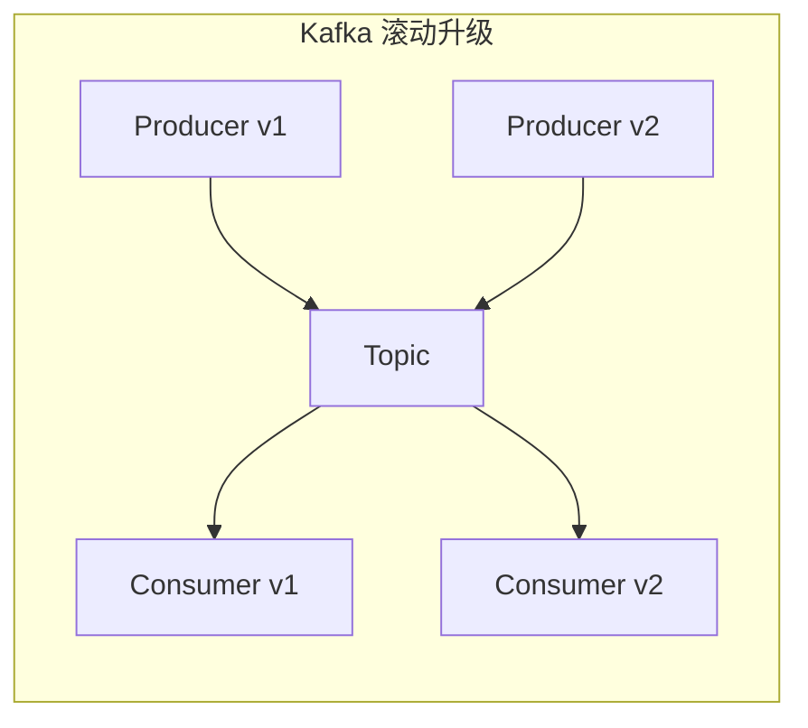
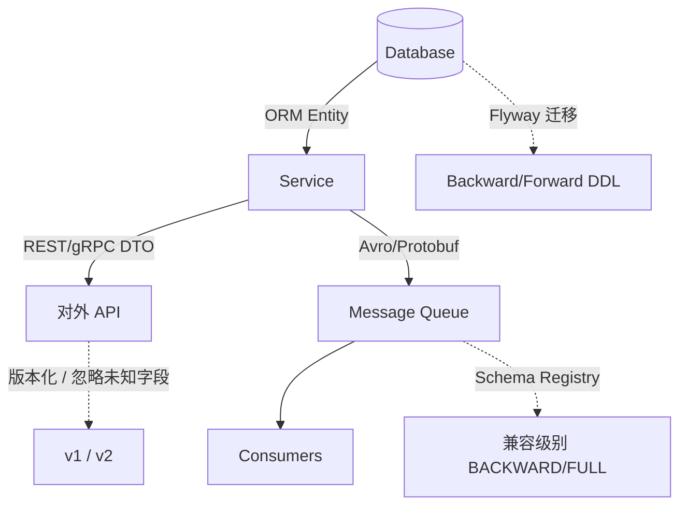

---
aliases:
  - DDIA第4章
tags:
  - DDIA
  - 章节精读
  - 编码演化
  - Schema
---

# 第 04 章：编码与演化

> 本章目标：掌握服务升级、多版本共存时，**数据格式与 Schema 如何向前/向后兼容**；能在架构评审中画出**数据流**并指定兼容责任方。

## 本章在全书中的位置

Part I 收尾。第 2–3 章定模型与存储；本章解决**时间维度**——应用频繁发版时数据如何演化。与第 11 章流处理、第 12 章事件驱动架构紧密相关。详见 [[00-逐章精读总览与索引]]。

## 初学者先抓住一句话

应用会频繁升级，**存储与消息中的数据格式**必须能演化；否则每次发版都是数据库迁移灾难或消费者大面积 crash。

## 核心概念定义

详见 [[05-概念定义详解#编码演化]]。

| 概念 | 一句话 | 详解 |
|---|---|---|
| Backward compatible | 新代码读旧数据 | [[05-概念定义详解#向后兼容 / 向前兼容]] |
| Forward compatible | 旧代码读新数据 | 同上 |
| Schema-on-write | 写入时强制结构 | 关系库迁移 |
| Schema-on-read | 读取时解释结构 | 文档库 + 应用校验 |
| Schema Registry | 集中管理 Schema 版本 | Kafka 生态 |

---

## 编码格式全面对比

| 维度 | JSON | XML | Protocol Buffers | Avro | Thrift |
|---|---|---|---|---|---|
| **编码** | 文本 UTF-8 | 文本，标签重复 | 二进制，字段 tag | 二进制，Schema 分离 | 二进制 |
| **Schema** | 可选 JSON Schema | XSD/DTD 严格 | `.proto` 编译 | `.avsc` / IDL | `.thrift` IDL |
| **自描述** | 是（字段名在 payload） | 是 | 否（需 .proto） | 否（读写需 Schema） | 否 |
| **体积** | 大 | 更大 | 小 | **最小**（无 tag 名） | 小 |
| **解析速度** | 慢 | 慢 | 快 | 快 | 快 |
| **演化** | 灵活无强制 | XSD 变更重 | tag 编号规则 | **读写 Schema 独立** | 类似 Protobuf |
| **动态类型** | 天然 | 天然 | 弱 | **强**（需 Schema） | 弱 |
| **RPC 生态** | REST 默认 | SOAP 遗产 | **gRPC** | Kafka Connect | 早期 RPC |
| **典型场景** | 公开 API、配置 | 企业报文、出版 | 微服务内部 | **Kafka、大数据** | 跨语言遗留 |

### JSON 细节

```json
{
  "userId": 123,
  "userName": "alice",
  "tags": ["vip", "beta"]
}
```

| 优点 | 缺点 |
|---|---|
| 人类可读、浏览器原生 | 无类型强制、`"123"` vs `123` |
| 调试友好 | 数字精度（>2^53）、无 Date 标准 |
| 广泛工具 | 大 payload、解析 CPU |

### XML 细节

```xml
<user id="123"><name>alice</name></user>
```

- **属性 vs 元素** 语义混乱；命名空间复杂。
- **优势**：成熟 Schema 验证（XSD）、XPath、行业报文标准（SWIFT、UBL）。
- **趋势**：新 API 极少选 XML；遗留系统集成仍常见。

### Protocol Buffers

```protobuf
message User {
  reserved 2;           // 已删字段号保留
  int64 user_id = 1;
  string user_name = 3; // 新增字段，新 tag
  optional string nick = 4;
}
```

- 字段用 **tag 编号**（1–15 占 1 字节）。
- **不能改 tag 类型**；删字段需 `reserved`。

### Avro

```json
// Writer schema v2
{"type":"record","name":"User","fields":[
  {"name":"user_id","type":"long"},
  {"name":"user_name","type":"string"},
  {"name":"email","type":["null","string"],"default":null}
]}
```

- Payload **不含字段名**；读时用 **writer schema + reader schema** 解析（Schema Resolution）。
- **Kafka** 默认搭配 Schema Registry；** Hadoop** 生态标准。

### Thrift

- Facebook 起源；支持多种协议（Binary、Compact、JSON）。
- 与 Protobuf 类似 tag 机制；生态上 gRPC/Protobuf 更占新项目。

---

## Schema 演化规则（精讲）

### 兼容性术语

| 术语 | 定义 | 升级场景 |
|---|---|---|
| **向后兼容 Backward** | **新 Reader** 读 **旧 Writer** 数据 | 先升级消费者 |
| **向前兼容 Forward** | **旧 Reader** 读 **新 Writer** 数据 | 滚动升级期间老实例仍运行 |
| **完全兼容 Full** | 两者同时 | 理想 Kafka Schema 策略 |

### Protobuf / Thrift 规则

| 操作 | 向后兼容 | 向前兼容 | 要求 |
|---|---|---|---|
| **添加字段**（新 tag） | ✓ | ✓ | 新字段 `optional` 或有默认值 |
| **删除字段** | ✓（若新代码不用） | ✓（若旧数据无该字段） | **reserved** 旧 tag |
| **改字段名** | ✓（只看 tag） | ✓ | 名字不影响二进制 |
| **改 tag 编号** | ✗ | ✗ | 等同新字段 + 旧数据误解析 |
| **改字段类型** | ✗ | ✗ | 可能 silent corruption |

### Avro 规则

| 操作 | 机制 |
|---|---|
| 添加字段（default） | Reader 无此字段 → 用 default |
| 删除字段 | Reader 有、Writer 无 → 忽略 |
| 改字段名 | **aliases** 别名匹配 |
| Union 扩展 | 谨慎；需双方 Schema Registry 协调 |

### 关系库 Schema 演化

| 策略 | 工具 | 说明 |
|---|---|---|
| **Schema-on-write** | Flyway/Liquibase | 版本化 DDL，`V001__add_email.sql` |
| **扩列迁移** | 加列 → 双写 → 切读 → 删旧 | 大表在线迁移 |
| **可空新列** | `ALTER ADD COLUMN nullable` | 避免全表 rewrite（视引擎） |

---

## 数据流的类型

### 数据流视角

```text
         ┌─────────────┐
         │  Database   │
         └──────┬──────┘
                │ ORM / JDBC
         ┌──────▼──────┐
         │   Service   │◄──── REST/gRPC ────► Other Service
         └──────┬──────┘
                │ publish
         ┌──────▼──────┐
         │  Message Q  │──────► Consumer(s)
         └─────────────┘
```

**关键问题**：Schema 变更时，**谁负责兼容**？DB？API？消息格式？

---

### 1. 数据库 ↔ 服务（REST/RPC）

```text
Service A 写 DB（行结构 v2）
Service B 读同一表（代码仍 v1）→ 可能 crash 或误读新列
```

| 模式 | 兼容责任 | 实践 |
|---|---|---|
| **共享数据库**（反模式） | 所有服务同步发版 | 加可空列；旧服务忽略 |
| **API 隔离** | 服务封装 DB；API 版本化 | `/v1/users` vs `/v2/users` |
| **DTO 映射** | 服务内 Entity ≠ 对外 Contract | 禁止 DB 列直接暴露 API |

**Java 实践**：

- Entity 加字段 `@Column(nullable=true)`；旧代码不映射新字段。
- API 用 **DTO** + `@JsonIgnoreProperties(ignoreUnknown=true)`。

---

### 2. 服务间异步消息（MQ）

```text
Producer v2 发 {userId, userName, email}
Consumer v1 只认 {userId, userName}  → 需 forward compatible
```

| 组件 | 作用 |
|---|---|
| **Schema Registry** | 存 Avro/Protobuf schema；校验兼容性 |
| **兼容性级别** | BACKWARD / FORWARD / FULL |
| **CI 检查** | schema:compatibility 任务阻断 breaking change |

```text
Confluent 流程:
  Producer 注册 schema id=5
  Message header: [magic byte][schema id][avro payload]
  Consumer 拉 schema id=5 解码
```

---

### 3. 持久化事件日志（Event Log）

**Kafka 作为 System of Record**（联系第 11 章）：

```text
Topic orders-events:
  t1: OrderCreated {orderId, items, ...}
  t2: OrderPaid {orderId, amount, ...}
  ...
  重放 → 重建读模型 / 新服务 catch-up
```

| 要求 | 说明 |
|---|---|
| **Schema 版本链** | 历史消息永存；新 consumer 读 3 年前事件 |
| **Upcasting** | 读时把 v1 事件升档到 v2 内存模型 |
| **单写原则** | DB 为真相源时，事件由 **CDC** 产生（第 11 章） |

---

## 面向服务的事件 Service-Oriented Events

### 与 REST 对比

| | REST/RPC | 事件驱动 |
|---|---|---|
| 耦合 | 调用方需知被调方 | 发布者不知消费者 |
| 演化 | API 版本 | Schema + 多 consumer 独立升级 |
| 时序 | 同步 | 异步；**最终一致** |
| 重放 | 难 | 日志天然支持 |

### 事件 schema 设计原则

1. **事件名 + 版本**：`OrderCreatedV1` 或 schema registry version。
2. **只增不减字段**（优先）；删用 deprecated + 保留 tag。
3. **语义清晰**：`OrderPaid` vs 泛化 `OrderUpdated`。
4. **幂等 consumer**：`eventId` 去重。
5. **不要**在事件里塞 giant blob；大附件用引用。

```json
{
  "eventId": "evt_8f3a...",
  "eventType": "OrderPaid",
  "schemaVersion": 2,
  "occurredAt": "2024-06-01T10:00:00Z",
  "payload": {
    "orderId": "ord_123",
    "amount": 9900,
    "currency": "CNY"
  }
}
```

---

## 模式演化策略汇总

| 策略 | 机制 | 适用 |
|---|---|---|
| **Schema-on-write** | DDL 迁移脚本 | 关系 OLTP |
| **Schema-on-read** | 应用层多版本解析 | 文档、JSON 列 |
| **双写** | 新旧字段/表同时写 | 大迁移过渡期 |
| **Expand-Contract** | 加新 → 迁移读 → 删旧 | 零停机重构 |
| **Schema Registry** | 集中兼容校验 | Kafka/Avro |

### Expand-Contract 示例

```text
Phase 1: ADD COLUMN email_v2; 双写 name + email_v2
Phase 2: 所有 reader 切 email_v2
Phase 3: DROP COLUMN email_v1
```

---

## 架构设计检查清单

- [ ] 公开 API 是否暴露内部 DB 字段结构（阻碍演化）？
- [ ] Kafka 消息是否有 **Schema Registry** 与兼容策略（BACKWARD/FULL）？
- [ ] 移动端 / 老客户端是否仍在访问旧 API（需 forward compatible）？
- [ ] 是否用「删列改类型」而非「加新列 + 迁移」？
- [ ] 多服务**共享表**时，Schema 变更是否协调发版？
- [ ] 事件是否可重放 6 个月前数据（Schema 版本链）？
- [ ] CI 是否检测 Protobuf/Avro **breaking change**？

---

## 与 Java 后端

| 技术栈 | 实践 |
|---|---|
| **Protobuf + gRPC** | `.proto` 进 Git；buf breaking 检测 |
| **Jackson** | `@JsonIgnoreProperties(ignoreUnknown=true)`；`@JsonInclude(NON_NULL)` |
| **Flyway/Liquibase** | 迁移与代码同 repo；禁止手工改生产 |
| **Avro + Kafka** | Confluent Schema Registry；`SpecificRecord` 代码生成 |
| **Spring Cloud Stream** | `spring.kafka.consumer.properties.schema.registry.url` |
| **MapStruct** | Entity ↔ DTO ↔ Event 分层映射 |

```java
// API DTO：向前兼容未知字段
@JsonIgnoreProperties(ignoreUnknown = true)
public record UserResponse(Long userId, String userName) {}

// 事件 consumer：按 schema version 分支（尽量少用）
switch (event.schemaVersion()) {
  case 1 -> handleV1(event);
  case 2 -> handleV2(event);
  default -> log.warn("Unknown schema {}", event.schemaVersion());
}
```

---

## 常见误区

| 误区 | 正解 |
|---|---|
| JSON 不需要版本 | 字段语义变更等同 breaking change |
| 删 Protobuf 字段可复用 tag | 必须用 reserved，否则旧数据误解析 |
| 共享 DB 最省事 | Schema 耦合所有服务发版节奏 |
| Avro 不需要 Schema Registry | 生产环境必须集中管理 writer/reader schema |
| 事件越大越好 | 大 payload 拖慢 MQ；用引用 + 懒加载 |
| REST 不用考虑演化 | 移动端长生命周期，API 需 v1/v2 并存 |

---

## 书中目录与小节映射

> 对照 Vonng 译本第 4 章结构。

| 书中章节 / 小节 | 核心内容 | 本笔记对应段落 |
|---|---|---|
| **编码的演化** | 应用频繁升级下的格式兼容 | [[#Schema 演化规则（精讲）]] |
| **JSON/XML/二进制编码** | 文本 vs 二进制权衡 | [[#编码格式全面对比]] |
| **Avro** | Writer/Reader Schema、Schema Resolution | Avro 细节段 |
| **Protocol Buffers / Thrift** | Tag 编号、reserved | Protobuf 细节段 |
| **数据流管道** | DB、RPC、MQ 三条路径 | [[#数据流的类型]] |
| **小结** | 演化能力是可维护性核心 | [[#本章小结]] |

---

## 书中案例与场景

### 案例一：Avro Schema 演化实例

#### Writer v1 → Reader v2（向后兼容 Backward）

```json
// Writer Schema v1（生产者在跑）
{"type":"record","name":"User","fields":[
  {"name":"user_id","type":"long"},
  {"name":"user_name","type":"string"}
]}

// Reader Schema v2（新消费者）
{"type":"record","name":"User","fields":[
  {"name":"user_id","type":"long"},
  {"name":"user_name","type":"string"},
  {"name":"email","type":["null","string"],"default":null}
]}
```

**解析过程（Schema Resolution）**：

```text
读 payload 时按 writer schema 解码字段位置
reader 多出的 email → 无数据 → 填 default null
→ 新代码读旧消息：成功（Backward）
```

#### Writer v2 → Reader v1（向前兼容 Forward）

```text
旧消费者只有 user_id, user_name 字段定义
新 writer 多写 email 字段
旧 reader 解码时忽略未知字段（Avro 默认行为）
→ 旧代码读新消息：成功（Forward）
```

### 案例二：Protobuf 演化实例

```protobuf
// v1
message User {
  int64 user_id = 1;
  string user_name = 2;
}

// v2：添加可选字段
message User {
  int64 user_id = 1;
  string user_name = 2;
  optional string email = 3;  // 新 tag，旧代码跳过未知 tag
}

// v3：删除字段（危险若复用 tag）
message User {
  reserved 2;  // 禁止复用 user_name 的 tag
  int64 user_id = 1;
  optional string email = 3;
}
```

| 操作 | 结果 |
|---|---|
| v2 writer → v1 reader | v1 跳过 tag 3 → **Forward OK** |
| v1 writer → v2 reader | email 默认空 → **Backward OK** |
| 删 tag 2 未 reserved，新字段复用 tag 2 | 旧数据把 int 当 string 解析 → **数据损坏** |

### 案例三：Schema 兼容性场景矩阵

| 场景 | 升级顺序 | 需要兼容性 | 典型策略 |
|---|---|---|---|
| Kafka 消费者先升级 | 新 reader、旧 writer | **Backward** | 新字段带 default |
| 滚动发布，新老 producer 并存 | 旧 reader、新 writer | **Forward** | 只加 optional 字段 |
| 长期事件重放（6 个月前消息） | 任意 | **Full** | Schema Registry FULL 策略 |
| 移动端 API | 老 App 不升级 | **Forward** | API 响应只加字段不删 |
| DB 共享表多服务 | 各服务不同版本 | Backward + Forward | 加可空列、Expand-Contract |



---

## 机制深度专题

### 专题一：Avro Schema Resolution 深度

```ascii
Writer fields:  [user_id: long][user_name: string]
Binary payload:  [8 bytes    ][len+utf8     ]  ← 无字段名，仅顺序与类型

Reader fields:   [user_id][user_name][email default null]
Resolution:      按名字匹配 → email 缺失 → null
```

**为何 Avro 体积小**：无 JSON 字段名重复；无 Protobuf tag 逐字段开销（依赖 schema 顺序）。

**风险**：无 Schema Registry 时，writer/reader schema 不一致 → **静默解析错误**。

### 专题二：三条数据流的兼容责任



| 路径 | 兼容机制 | 失败模式 |
|---|---|---|
| DB ↔ Service | 可空新列、双写 | 旧代码读新列 ORM 映射失败 |
| Service ↔ Service | API 版本、Protobuf | 删字段老客户端 crash |
| MQ | Schema Registry | breaking change 阻断发布 |

### 专题三：Expand-Contract 时间线

```ascii
Phase Expand ─────────────────────────────────────────►
  T0: ADD COLUMN email_new NULLABLE
  T1: 应用双写 email_old + email_new
  T2: 后台 job 回填历史数据
  T3: 所有 reader 切 email_new

Phase Contract ───────────────────────────────────────►
  T4: 停止写 email_old
  T5: DROP COLUMN email_old
```

---

## 算法与流程

### Protobuf 字段解析伪代码

```text
function decode_protobuf(bytes, schema):
  pos = 0
  result = {}
  while pos < len(bytes):
    tag_wire = read_varint(bytes, pos)
    field_number = tag_wire >> 3
    wire_type = tag_wire & 0x7
    field_def = schema.get_field(field_number)
    if field_def is null:
      skip_field(wire_type)   // 未知 tag：向前兼容关键
    else:
      result[field_def.name] = read_value(wire_type, field_def.type)
  return result
```

### Schema Registry 兼容性检查

```text
function check_compatibility(new_schema, previous_schemas, level):
  for prev in previous_schemas:
    if level includes BACKWARD:
      assert can_read(new_schema, prev)   // 新 reader 读旧 writer
    if level includes FORWARD:
      assert can_read(prev, new_schema)   // 旧 reader 读新 writer
  return OK or REJECT
```

### Expand-Contract 迁移流程

```text
1. EXPAND
   ALTER TABLE users ADD COLUMN status_v2 VARCHAR(32) NULL;
   deploy app_v2: write both status (int) and status_v2 (string)
   deploy app_v2: read status_v2 prefer, fallback status

2. MIGRATE
   batch job: UPDATE users SET status_v2 = map_int_to_string(status)
              WHERE status_v2 IS NULL

3. CONTRACT
   deploy app_v3: read/write only status_v2
   ALTER TABLE users DROP COLUMN status;
   ALTER TABLE users RENAME status_v2 TO status;
```

---

## 与具体产品对照

| 产品 | 编码 / Schema | 兼容机制 |
|---|---|---|
| **Confluent Schema Registry** | Avro/Protobuf/JSON Schema | BACKWARD/FORWARD/FULL |
| **Apache Kafka** | 字节序列 + schema id | 消费者按 id 拉 schema |
| **gRPC + Protobuf** | `.proto` 编译 | buf breaking、reserved |
| **Apache Avro** | `.avsc` / IDL | Writer/Reader resolution |
| **Jackson (JSON)** | 注解 + 应用 discipline | `@JsonIgnoreProperties` |
| **Flyway / Liquibase** | SQL DDL 版本链 | 迁移顺序不可逆 |
| **MongoDB** | schema-on-read | 应用校验 + JSON Schema 可选 |
| **PostgreSQL** | schema-on-write | `ALTER` 在线迁移工具（pg_repack） |
| **Buf** | Protobuf lint + breaking | CI 阻断 |
| **Spring Cloud Stream** | binder + schema registry | Kafka Streams serde |

### Kafka 消息字节布局（Confluent 格式）

```text
[0x00 magic][4-byte schema id][avro payload bytes...]
         │              │
         │              └── Registry 返回 Writer Schema
         └── 版本标识
```

---

## 深度 FAQ

**Q1：Backward 和 Forward 哪个更重要？**  
A：取决于升级顺序。Kafka 常先升消费者 → **Backward**；滚动发布新老 producer 并存 → **Forward**；理想 **Full**。

**Q2：JSON 如何实现兼容？**  
A：无内置机制——靠**只加字段不删**、`@JsonIgnoreProperties(ignoreUnknown=true)`、API 版本化。语义变更（`userId` 改 `user_id`）等同 breaking。

**Q3：为何 Protobuf 删字段必须 reserved？**  
A：二进制靠 tag 识别字段；复用 tag 会让旧数据按新类型解析 → 静默损坏。

**Q4：Avro 为何必须 Schema Registry？**  
A：Payload 无字段名；消费者必须拿到**准确 writer schema** 才能解码。

**Q5：共享数据库为何是反模式？**  
A：Schema 变更耦合所有服务发版节奏——一个团队加列，另一团队 ORM 可能挂。

**Q6：事件里放完整 User 对象好吗？**  
A：不好——事件应 **fact 化**（`OrderPaid`），避免 giant blob；大附件用 URL 引用。

**Q7：REST 需要版本号吗？**  
A：移动端长生命周期需要 `/v1` `/v2` 并存；内部微服务可用 Protobuf 兼容规则。

**Q8：schema-on-read 能替代迁移吗？**  
A：不能——只是推迟 Schema 约束；脏数据积累后治理成本更高。

**Q9：Thrift 还值得新项目用吗？**  
A：维护存量可以；新项目多选 **gRPC/Protobuf** 或 **Avro/Kafka** 生态。

**Q10：如何做 CI 阻断 breaking change？**  
A：`buf breaking`、`schema:compatibility:check`（Confluent）、对比 `.proto`/`.avsc` git diff 规则。

---

## 设计模式与反模式

### 设计模式

| 模式 | 说明 |
|---|---|
| **Expand-Contract** | 零停机 Schema 迁移 |
| **Schema Registry** | 集中兼容校验 |
| **DTO 隔离** | Entity ≠ API Contract |
| **Event Versioning** | `OrderCreatedV1` 或 schema id |
| **Upcasting** | 读时升档旧事件到现模型 |
| **CDC 发事件** | DB 为真相源，事件由 binlog 产生 |
| **Tolerant Reader** | 忽略未知字段 |

### 反模式

| 反模式 | 后果 |
|---|---|
| 共享数据库多服务写 | Schema 耦合、发版协调地狱 |
| 删 Protobuf tag 不 reserved | 旧数据误解析 |
| API 暴露 DB 列名 | 阻碍重构 |
| 事件当通用 Update | 语义模糊、难消费 |
| 无兼容性 CI | 生产 consumer 大面积挂 |
| 大字段塞进 Kafka | 吞吐下降、compaction 痛苦 |
| 手工改生产 DDL | 环境漂移 |

---

## 本章练习

1. 设计 `User` 从 v1（仅 name）到 v2（加 email）的 **Protobuf** 与 **Avro** 演化，说明兼容性。
2. 画你项目的**数据流图**（DB → Service → MQ → Consumer），标 Schema 责任边界。
3. 写一个 **Expand-Contract** 计划：把 `status: int` 改为 `status: enum string`。
4. 对比 REST 与 Kafka 事件在**滚动升级**时的兼容策略差异。
5. **Avro 演练**：给出 Writer v1 二进制 payload 结构说明，Reader v2 加 `phone` 带 default，手写 Schema Resolution 步骤。
6. 配置 **Confluent Schema Registry** `BACKWARD_TRANSITIVE` 策略，故意提交 breaking schema，记录拒绝原因并修复。
7. 为你负责系统选一种编码（JSON/Protobuf/Avro），写**兼容性公约**一页（加删改字段规则、CI 检查、升级顺序）。

## 阅读检查

- [ ] 能区分 backward 与 forward compatible
- [ ] 能说出 Protobuf 添加/删除字段的规则
- [ ] 能解释 Avro 为何 payload 更小（无字段名）
- [ ] 能描述 Schema Registry 在 Kafka 中的角色
- [ ] 能列举三种数据流路径及各自兼容责任
- [ ] 能说明面向服务事件 vs REST 的耦合差异
- [ ] 能解释 Expand-Contract 三阶段
- [ ] 能_walk through_ Avro writer v1 → reader v2 的 resolution
- [ ] 能解释 reserved tag 的必要性
- [ ] 能说出 FULL 兼容对 Kafka 长期重放的意义
- [ ] 能识别共享数据库反模式
- [ ] 能列举 Tolerant Reader 在 JSON/Java 中的实现方式

---

## 本章小结

- **演化能力是可维护性核心**；数据格式选择影响性能、兼容、工具链。
- **二进制格式**（Protobuf/Avro）靠 tag/Schema 规则实现兼容；**JSON** 靠应用 discipline。
- **数据流路径**决定谁承担兼容：DB 迁移、API 版本、Schema Registry。
- **事件日志**支持独立升级 consumer；Schema 版本链必须长期可解码。
- 优先 **加字段不删改**；大迁移用 Expand-Contract。

## 相关笔记

- [[05-概念定义详解#编码演化]]
- [[11-第11章-流处理]]
- [[01-Java后端与DDIA概念对照]]
- [[02-第02章-数据模型与查询语言]]
