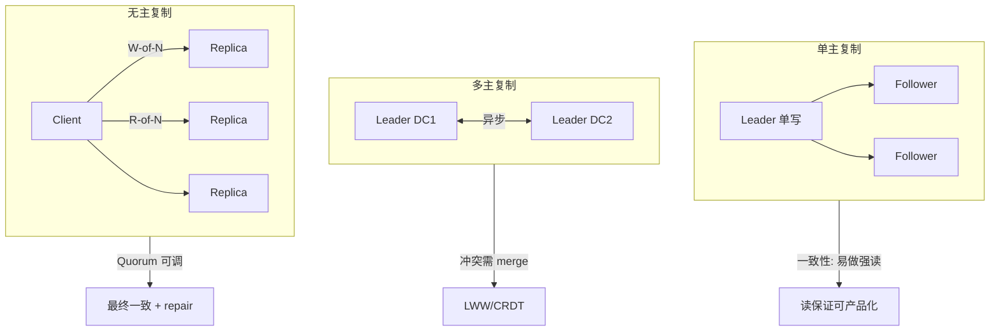
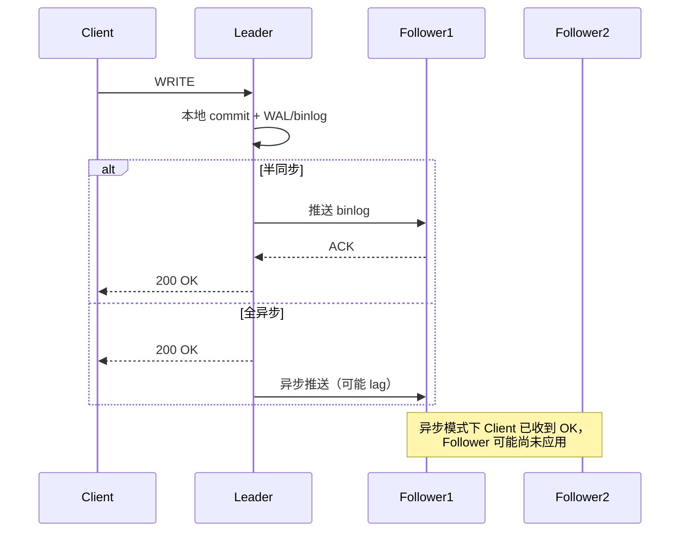
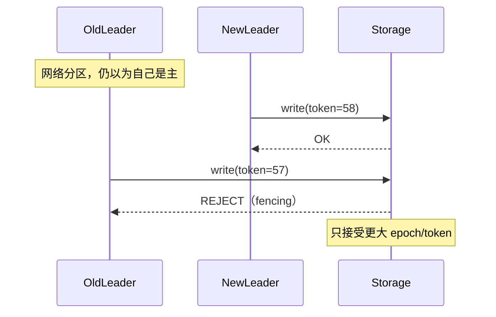

---
aliases:
  - DDIA第5章
tags:
  - DDIA
  - 章节精读
  - 复制
  - 一致性
---

# 第 05 章：复制

> 本章目标：理解复制如何提升**可用性与读扩展**，以及**复制延迟 lag** 带来的各种一致性问题与解法；能在设计文档中写清每个读 API 的**读保证级别**。

## 本章在全书中的位置

Part II 开端。第 3 章 WAL/日志是复制源；本章解决**多副本**；与第 6 章分区、第 7 章事务、第 9 章共识衔接。详见 [[00-逐章精读总览与索引]]。

## 初学者先抓住一句话

**主从复制**让读扩展变简单，但异步 lag 会让用户看到「刚提交的数据不见了」——必须按业务**显式定义读保证**，而非假设「从库差不多就行」。

## 核心概念定义

详见 [[05-概念定义详解#复制与读保证]]、[[05-概念定义详解#Quorum]]。

| 概念 | 一句话 | 详解 |
|---|---|---|
| Leader / Follower | 单写多读 | [[05-概念定义详解#Leader-Based Replication]] |
| Replication Lag | 从库落后主库的时间 | [[05-概念定义详解#Replication Lag 带来的异常]] |
| Quorum | W+R>N 读写副本重叠 | [[05-概念定义详解#Quorum]] |
| Split brain | 多节点同时认为自己是 Leader | 见下文 |

---

## 领导者与追随者 Leader-Follower

### 架构

```text
         写请求
            │
            ▼
        ┌────────┐
        │ Leader │ ──复制日志──► Follower 1
        └────────┘ ──复制日志──► Follower 2
            ▲
         读（可选）
         
读请求 → Follower（扩展读）或 Leader（强一致读）
```

### 复制日志机制

| 数据库 | 日志类型 | 机制 |
|---|---|---|
| **MySQL** | **binlog**（逻辑或行格式） | Follower IO 线程拉 binlog → **relay log** → SQL 线程重放；详见 [[Senior Java Engineer/3-数据库/2002-MySQL-Binlog-Relay与主从复制|2002 Binlog/Relay 专篇]] |
| **PostgreSQL** | WAL 物理/逻辑 | 流复制：WAL 段推送 |
| **Redis** | 命令流 | 主传命令给从，从重放 |
| **MongoDB** | oplog |  capped collection，tailable cursor |

**关键**：Follower 按**与 Leader 相同顺序**应用日志 → 理论上副本一致（lag 除外）。

### 同步 vs 异步复制

| 模式 | 机制 | RPO | 可用性 | 延迟 |
|---|---|---|---|---|
| **异步 Async** | Leader 不等 Follower | >0（主挂可能丢未复制写） | 高 | 低 |
| **同步 Sync** | 至少 N Follower 确认才 ACK | ≈0 | 降（Follower 挂则写阻塞） | 高 |
| **半同步 Semi-sync** | 至少 1 Follower 确认 | 折中 | 折中 | 中 |

```text
MySQL 半同步: 主写 binlog → 等一个从 ACK → 返回客户端
全同步: 等多数从 → 类似共识（第 9 章）
```

**设计启示**：

- **金融写路径**常要同步或等 binlog 持久。
- **读扩展**用异步从库，但必须处理 lag 一致性。

---

## 复制延迟问题 — 四种读保证（精讲）

### 问题场景

```text
T1: 用户 POST /profile {name: "Bob"}  → Leader 写入成功，返回 200
T2: 用户 GET /profile                 → 路由到 Follower（仍 name="Alice"）
用户: 「数据丢了！」
```

→ 不是丢数据，是**读到了旧副本**。

### 四种客户端读保证

详见 [[05-概念定义详解#四种客户端读保证（书中核心）]]。

#### 1. 读己之所写 Read Your Writes

**定义**：同一用户**总能读到自己刚写入**的内容（不保证读别人最新写）。

| 实现 | 机制 |
|---|---|
| 读 Leader | 写后读走主库 |
| 用户路由 | `hash(user_id) % replicas` 写读同一副本 |
| 跟踪 lag | 写时记 `replication_offset`；读从库时只选 `offset >= 写入值` 的副本 |
| 会话 stickiness | 网关层绑定 replica |

**Java 示例思路**：

```java
// 写后读主（ShardingSphere hint 或 @Transactional 内读）
writeToMaster(user);
readFromMaster(user);  // 同一请求链

// 或：写后短窗口读主
if (System.currentTimeMillis() - lastWriteTime < 1000) {
  readFromMaster();
}
```

#### 2. 单调读 Monotonic Reads

**定义**：同一用户**不会先读新再读旧**（时间倒流）。

```text
反例:
  请求1 → Follower A (lag 0)  读到 v2
  请求2 → Follower B (lag 5s) 读到 v1  ← 用户体验混乱
```

| 实现 | 机制 |
|---|---|
| **固定副本** | 同 user_id 永远路由同一 Follower |
| **Monotonic token** | 客户端带上次读到的 version；副本拒绝回退 |

→ 比「读己之所写」**更弱**（不要求立刻读到自己的写，但要求不倒退）。

#### 3. 一致前缀读 Consistent Prefix Reads

**定义**：若写入 B **因果依赖**于 A，则读者**先看到 A 再看到 B**。

```text
对话场景:
  A: 提问 "今天天气？"
  B: 回答 "晴天"（依赖 A）

错误: 读者先看到 B 再看到 A
```

| 实现 | 机制 |
|---|---|
| **单分区有序** | 因果相关写同一 partition key |
| **Version / Lamport** | 携带 causal metadata 路由 |
| **读 Leader** | 单副本顺序 |

→ 跨用户场景；**评论串、对话、审批流**需要。

#### 4. 线性一致读 / 尾部一致

**线性一致（Linearizability）**：读必返回**最新已提交写**（最强，第 9 章详述）。  
**最终一致**：停止写入足够久后，所有副本收敛相同（**尾部一致**口语常指这个）。

| 级别 | 强度 | 典型场景 |
|---|---|---|
| 最终一致 | 最弱 | 点赞数、浏览量 |
| 读己之所写 | 单用户 | 个人资料编辑 |
| 单调读 | 单用户时序 | Feed 刷新 |
| 一致前缀 | 因果链 | 聊天、评论 |
| 线性一致 | 最强 | 分布式锁、库存扣减 |

> **设计文档必写**：每个读 API 对应上表哪一级。

---

## 故障切换与 Split Brain

### Leader 故障

```text
1. Follower 检测 Leader 心跳超时
2. 选举新 Leader（需共识，第 9 章 Raft）
3. 客户端切到新 Leader
4. 旧 Leader 若仍活（网络分区）→ Split Brain 风险
```

### Split Brain（脑裂）

**定义**：**两个节点同时认为自己是 Leader** 并接受写 → 数据分叉，难以合并。

| 预防 | 机制 |
|---|---|
| **Quorum 投票** | 只有多数派分区可选主 |
| **Fencing Token** | 存储拒绝旧 Leader 的写（[[05-概念定义详解#Fencing Token]]） |
| **STONITH** | 强制 kill 旧主 |
| **Epoch 号** | 新主 epoch 更大；旧主写带小 epoch 被拒 |

**RPO/RTO**：

| 指标 | 异步复制 | 同步复制 |
|---|---|---|
| **RPO** | 可能丢最后几秒写 | ≈0 |
| **RTO** | 选举 + 提升时间 | 类似 |

→ **必须演练** failover；「理论上会自动切换」不够。

---

## 多主复制 Multi-Leader

### 架构

```text
DC1: Leader A ◄──异步──► Leader B :DC2
       │                      │
    Follower               Follower
```

**场景**：多数据中心、离线协作（日历）、CDN 边缘写。

### 冲突不可避免

```text
DC1: SET counter = 1  (本地 Leader)
DC2: SET counter = 2  (本地 Leader，同时)
→ 两写并发，无单一全局顺序
```

### 冲突解决策略

| 策略 | 机制 | 缺点 |
|---|---|---|
| **LWW Last-Write-Wins** | 时间戳大者胜 | 丢写；时钟不可靠 |
| **版本向量** | 检测并发写，交给应用 | 复杂；需 merge UI |
| **主副本 per key** | `hash(key)` 归属某 DC 写 | 跨 DC 写该 key 需路由 |
| **CRDT** | 数学可合并数据结构 | 仅特定类型（计数器、集合） |
| **自定义合并** | 如「合并两个待办列表」 | 业务逻辑 |

**不适合**：银行余额强一致计数、库存（除非 shard 单写）。

---

## 无主复制 Leaderless（Dynamo 风格）

### 机制

```text
Client 并行写 N 个副本（协调者可选）
Client 读 R 个副本，按 version 合并取最新
```

**无 Leader** → 任何副本可接受读写（高可用优先）。

### Quorum 条件

详见 [[05-概念定义详解#Quorum]]。

**N** = 副本数；**W** = 写确认数；**R** = 读响应数。

**若 W + R > N**：读写集合**必有交集** → 读至少命中一个含最新写的副本（在 version 比较正确前提下）。

| 配置 | N | W | R | 容忍故障 | 说明 |
|---|---|---|---|---|---|
| 强默认 | 3 | 2 | 2 | 1 节点 | 常见 |
| 写优化 | 3 | 1 | 3 | 读修复补 | 写快读慢 |
| 读优化 | 3 | 3 | 1 | 写阻塞 | 少用 |

**Sloppy Quorum + Hinted Handoff**：

```text
正常: 写 N=3 个 designated 副本
节点 down: 临时写 fallback 节点（sloppy）
节点恢复: fallback 把数据 handoff 回 designated
```

→ **可用性**优先于 strict quorum；短暂违反 W+R>N 语义。

### Read Repair

```text
读 R 个副本 → 发现 version 不一致
→ 客户端（或协调者）把新值写回旧副本
```

- **读路径修复**；延迟低但只修复被读到的 key。

### Anti-Entropy

```text
后台进程（Merkle tree 比对）扫描副本差异 → 批量同步
```

- **全量修复**；慢但覆盖未读 key。

| 机制 | 触发 | 范围 | 延迟 |
|---|---|---|---|
| Read repair | 读请求 | 被读 key | 低 |
| Anti-entropy | 后台周期 | 全库 | 高 |

**代表**：Cassandra、DynamoDB、Riak、VoltDB 部分模式。

### 并发写与版本

```text
v1: {value: A, ts: 100}
v2: {value: B, ts: 101}  → LWW 取 B

并发（无因果）:
v1: {value: A, vc: [1,0]}
v2: {value: B, vc: [0,1]}  → 版本向量检测冲突，应用 merge
```

---

## 三种复制模式对照

| 维度 | 单主 | 多主 | 无主 |
|---|---|---|---|
| 写入口 | 唯一 Leader | 多 Leader | 任意副本 |
| 读扩展 | Follower | 各 DC Follower | R-of-N |
| 冲突 | 无（单序） | 需解决 | 需 version merge |
| 一致性 | 易做强读 | 弱 | Quorum 可调 |
| 故障切换 | 选举新主 | 部分自主 | 天然无单点 |
| 代表 | MySQL, PG, Redis | CouchDB 多主 | Cassandra |

---

## 架构设计检查清单

- [ ] 读写分离是否**未处理 lag**？用户投诉「数据丢了」？
- [ ] 每个读 API 是否文档化**读保证级别**？
- [ ] 缓存与 DB 双写顺序是否导致脏读（先更新缓存再 DB）？
- [ ] 主从切换 **RPO/RTO** 是否演练过？Split brain 防护？
- [ ] 从库是否跑大报表导致 **lag 拉大**？
- [ ] 半同步超时降级异步时，是否告警？
- [ ] Canal/CDC 是否从 **Leader 日志**派生，避免应用双写？

---

## 与 Java 后端

| 场景 | 实践 |
|---|---|
| **MySQL 读写分离** | ShardingSphere `readwrite-splitting`；写后 `@MasterRouteOnly` |
| **Spring @Transactional** | 事务内读走主（同一连接） |
| **Redis 主从** | 读从可能旧；`WAIT` 命令同步（Redis 3.0+） |
| **Canal → MQ → ES** | binlog 单写；衍生索引最终一致 |
| **Cassandra** | `LOCAL_QUORUM` vs `ONE`；lightweight TX 慎用 |
| **JPA 二级缓存** | 与 DB 复制 lag 叠加 → 更旧数据 |

```java
// ShardingSphere 强制读主 Hint
try (HintManager hint = HintManager.getInstance()) {
    hint.setWriteRouteOnly();
    return userRepository.findById(userId);
}
```

---

## 常见误区

| 误区 | 正解 |
|---|---|
| 有从库就能分担所有读 | 强一致读仍需主或 quorum |
| 同步复制 = 不会丢数据 | 需多数派 + 正确 failover |
| LWW 足够 | 时钟漂移丢写；需版本向量或单主 |
| W+R>N 保证线性一致 | 还需 version 比较 + 无 sloppy 期间读 |
| 双写 DB+缓存最简单 | 用 CDC 单写 DB，异步更新缓存 |
| Split brain 很少发生 | 网络分区 + 错误运维会发生；要 fencing |

---

## 书中目录与小节映射

| 书中章节 | 核心主题 | 本笔记对应节 |
|---|---|---|
| **5.1 领导者与追随者** | 单主复制架构、同步/异步 | [[#领导者与追随者 Leader-Follower]] |
| **5.2 复制日志的实现** | binlog、WAL、statement vs row | [[#复制日志机制]] |
| **5.3 复制延迟问题** | 四种读保证 | [[#复制延迟问题 — 四种读保证（精讲）]] |
| **5.4 多主复制** | 冲突、LWW、CRDT | [[#多主复制 Multi-Leader]] |
| **5.5 无主复制** | Quorum、Read repair | [[#无主复制 Leaderless（Dynamo 风格）]] |
| **5.6 本章小结** | 模式对照 | [[#三种复制模式对照]] |

**阅读顺序建议**：先掌握单主 + lag 读保证（5.1–5.3）→ 再看多主冲突（5.4）→ 最后 Quorum（5.5）。5.3 是面试与架构文档最高频考点。

---

## 书中案例 — MySQL 主从与 Read-After-Write

### 案例背景（书中 Twitter 风格场景）

用户更新个人资料后立刻刷新页面，请求被负载均衡打到**从库**，读到更新前的旧头像/昵称。用户感知为「数据丢失」，实际是 **replication lag** 导致读到旧副本。

### MySQL Leader-Follower 复制链路

```text
Client                    Leader (Primary)              Follower (Replica)
  │                              │                              │
  │── UPDATE users SET ... ─────▶│                              │
  │                              │── 写 InnoDB + binlog ────────│
  │◀── 200 OK ───────────────────│                              │
  │                              │── binlog dump ──────────────▶│ IO Thread 拉取
  │                              │                              │ SQL Thread 重放
  │── SELECT ... ──────────────────────────────────────────────▶│（可能 lag 100ms~数秒）
  │◀── 旧数据 ───────────────────────────────────────────────────│
```

### 关键参数与观测

| 观测项 | MySQL 命令/指标 | 含义 |
|---|---|---|
| 复制延迟 | `SHOW REPLICA STATUS` → `Seconds_Behind_Source` | 从库落后秒数（近似） |
| 半同步 | `rpl_semi_sync_master_enabled` | 至少 1 从 ACK 才返回 |
| GTID | `GTID_EXECUTED` | 全局事务 ID，便于 failover 一致性 |
| 并行复制 | `replica_parallel_workers` | 从库 SQL 线程并行，减 lag |

### Read-After-Write 三种工程解法

```text
方案 A — 写后读主（最简单）
  POST /profile → Master
  GET  /profile → Master（同 session 或写后 1s 窗口）

方案 B — 会话 stickiness
  hash(session_id) → 固定 Follower
  写时记录 binlog position；读时选 position >= 写入值的副本

方案 C — 版本号校验
  写返回 {version: 42}
  读从库带 min_version=42；未满足则 fallback 主库
```

**Java 落地**：ShardingSphere `hint.setWriteRouteOnly()`；Spring 事务内读同一连接（天然走主）。

---

## 机制深度专题

### 复制拓扑与一致性光谱



### 同步复制内部时序



### Split Brain 与 Fencing 时序



---

## 算法与流程

### Quorum 读/写步骤（N=3, W=2, R=2）

**写路径**：

```text
1. Client 计算 key 的 N 个 designated replica（一致性哈希 / 分区表）
2. 并行发送写请求到 N 个副本（或协调者代发）
3. 等待 W 个副本 ACK（含 version/timestamp）
4. 返回成功；未达 W 则失败或降级（sloppy quorum）
```

**读路径**：

```text
1. 并行读 R 个副本
2. 收集各副本 version vector / timestamp
3. 取「最新」version（LWW 或应用 merge 并发版本）
4. 若发现 stale 副本 → 可选 read repair（异步写回旧副本）
5. 返回合并结果
```

**W+R>N 证明（N=3,W=2,R=2）**：写集合至少 2 节点，读集合至少 2 节点，总共 3 节点 → 必有一节点同时在读写集合 → 读必命中至少一个含最新写的副本（在 version 比较正确前提下）。

### Failover 流程（单主 MySQL 风格）

```text
Phase 1 — 检测
  1.1 心跳超时 / 复制 IO 线程断开
  1.2 多数 Follower 或 Orchestrator 确认 Leader 不可达

Phase 2 — 选举
  2.1 选 lag 最小、GTID 最新的 Follower
  2.2 提升为新 Leader（STOP REPLICA; RESET REPLICA ALL; 或 Orchestrator 自动）
  2.3 递增 epoch / fencing token

Phase 3 — 切换
  3.1 更新 VIP / DNS / Proxy 路由到新 Leader
  3.2 旧 Leader 若复活 → STONITH 或拒绝写入（fencing）
  3.3 其余 Follower CHANGE REPLICATION SOURCE 到新 Leader

Phase 4 — 验证
  4.1 检查 GTID 集合无分叉
  4.2 业务探活写读
  4.3 告警解除，记录 RTO
```

**RPO 决策点**：异步复制 failover 可能丢失 Leader 上未复制的最后一批事务；半同步/组复制可逼近 RPO≈0。

### Read Repair vs Anti-Entropy 决策树

```text
副本不一致被发现
  ├─ 在读路径上？ → Read Repair（低延迟，仅修复被读 key）
  └─ 长期未读 key？ → Anti-Entropy 后台扫描（Merkle tree 比对）
```

---

## 与具体产品对照

| 产品 | 复制模式 | 日志/机制 | 读保证实践 | 注意点 |
|---|---|---|---|---|
| **MySQL** | 单主（Group Replication 例外） | binlog row/statement | 读写分离 + 写后读主 | `Seconds_Behind_Source` 非精确；大事务 lag 尖刺 |
| **PostgreSQL** | 单主流复制 | WAL 物理/逻辑 | 热备只读 + 写后读主 | 逻辑复制可表级；冲突少 |
| **Redis** | 单主 + 从 | 命令传播 | `WAIT numreplicas timeout` 同步 | 从库读可能旧；WAIT 阻塞写 |
| **MongoDB** | 副本集（单主选举） | oplog | readPreference: primary/secondary | 写关注 writeConcern 可调 |
| **Cassandra** | 无主 | commit log + SSTable | `LOCAL_QUORUM` / `ONE` | Lightweight TX 非真正跨行事务 |
| **CouchDB** | 多主可选 | 修订版 `_rev` | 冲突需应用 merge | 离线优先场景 |

### MySQL 读写分离对照

| 组件 | 路由策略 | 写后读主 |
|---|---|---|
| ShardingSphere | readwrite-splitting | Hint / 事务内连接 |
| MyCat | 注解 `/*master*/` | 手动标记 |
| ProxySQL | query rules | 会话变量 `last_insert_id` 跟踪 |
| 应用层 | AbstractRoutingDataSource | ThreadLocal 标记 |

### Seata 与复制的关系

Seata AT/TCC/Saga 解决**跨服务/跨库**分布式事务，**不替代**主从 lag 读保证。常见组合：

- 本地事务 commit 后，从库 lag 导致读不到 → **应用层写后读主**，与 Seata 无关。
- Canal 消费 binlog 驱动 ES/MQ → **CDC 单写**，避免应用双写与复制 lag 叠加脏读。

---

## 深度 FAQ

**Q1：半同步复制超时降级异步，业务如何感知？**  
A：MySQL 半同步超时后会自动切回异步，此时 RPO 突然变大。必须监控 `Rpl_semi_sync_master_status` 与告警；金融场景应阻塞写而非静默降级。

**Q2：`Seconds_Behind_Source=0` 是否代表无 lag？**  
A：不一定。该值是估算，且只反映 SQL 线程应用进度；大事务应用期间可能跳变。应用层应用 binlog position / GTID 精确比较。

**Q3：W+R>N 为何仍可能读到旧值？**  
A：Sloppy quorum 期间、并发写未全部完成、LWW 时钟漂移、读未做 version merge——任一都会破坏语义。Quorum 是必要条件非充分条件。

**Q4：多主复制适合电商库存吗？**  
A：不适合全局 counter。应 shard 单写（每 SKU 单分区单主）或乐观锁 + 单主。多主适合日历、文档协作等可 merge 场景。

**Q5：Read repair 会放大写负载吗？**  
A：会。热点 key 每次读都可能触发 repair 写。需限速或交给 anti-entropy 批量处理。

**Q6：GTID failover 比 file+position 强在哪？**  
A：GTID 全局唯一标识事务，failover 后从库自动找缺失事务补全，减少人工对位错误与分叉。

**Q7：Redis `WAIT` 与 MySQL 半同步区别？**  
A：WAIT 是客户端命令，阻塞等 N 个从确认；半同步是服务端插件，对应用透明。两者都增加写延迟。

**Q8：CDC（Canal）应该连主还是从？**  
A：必须连**主库 binlog**（或 relay 的源头）。从库 binlog 可能不完整或延迟，且 failover 后位点难对齐。

**Q9：四种读保证能否同时满足？**  
A：线性一致蕴含其余三者。工程上常分层：强一致读走主，弱一致读走从 + 会话 stickiness 保单调读。

**Q10：复制与缓存一致性如何叠加？**  
A：Cache-Aside：写 DB → 删缓存。若读从库 + 读缓存，可能 cache 新、DB 旧或反之。写后读主 + 写后删缓存 + 短 TTL 组合更稳。

---

## 设计模式与反模式

### 推荐模式

| 模式 | 场景 | 要点 |
|---|---|---|
| **CDC 单写** | DB + ES/缓存 | binlog → MQ → 下游；避免应用双写 |
| **写后读主** | 用户资料、订单详情 | 同请求链或时间窗口 |
| **会话 stickiness** | Feed、时间线 | 同 user 固定副本，保单调读 |
| **Quorum 可调** | 多 AZ Cassandra | 写路径 `LOCAL_QUORUM`，读路径按 SLA 降级 |
| **Fencing + Epoch** | 自动 failover | 存储拒绝旧 epoch 写 |
| **版本向量 merge** | 多主协作文档 | 检测并发，UI 提示冲突 |

### 反模式

| 反模式 | 后果 | 替代 |
|---|---|---|
| 所有读走从库不设保证 | 「数据丢了」客诉 | 按 API 标注读保证级别 |
| 双写 DB + Redis | 不一致、难修复 | CDC 或写 DB 后删缓存 |
| LWW 做金融余额 | 时钟漂移丢写 | 单主 + 行锁 / 乐观锁 |
| 无演练的自动 failover | 脑裂、双主写 | Orchestrator + fencing + 演练 |
| W=1,R=1 以为高可用 | 读写不交，丢更新 | 至少 W+R>N |
| 从库跑大报表不隔离 | lag 拖累在线读 | 只读分析副本 / OLAP |

---

## 本章练习

1. 为用户资料 API 设计：**读己之所写** + **单调读** 的路由策略（画图）。
2. 给定 N=3,W=2,R=2，证明读写集合必交；若 W=1,R=1 会怎样？
3. 描述 **Read repair** 与 **Anti-entropy** 各适合什么 lag 场景。
4. 多主复制下，两个 DC 同时改同一 counter，LWW 与 CRDT 各会怎样？
5. 画出 MySQL 半同步复制从 Client 写入到 Follower ACK 的完整时序图。
6. 设计 Twitter 发帖后刷新 Feed 的读保证：发帖者需读己之所写，其他用户可接受最终一致——写出路由规则。
7. 给定 3 节点 Cassandra N=3,W=2,R=2，节点 1 宕机，写是否仍成功？读呢？
8. Failover 演练清单：写 10 步操作与回滚方案。
9. 对比 Canal 与 Debezium 作为 CDC 源时，为何都必须读 Leader binlog。
10. 你的项目有哪些读 API？为每个标注读保证级别（四种之一）。

---

## 阅读检查

- [ ] 能解释 binlog/WAL 复制顺序意义
- [ ] 能对比同步/异步/半同步的 RPO 与可用性
- [ ] 能定义并举例四种读保证
- [ ] 能说明 Split brain 成因与 fencing
- [ ] 能解释 W+R>N 及 sloppy quorum
- [ ] 能对比 read repair 与 anti-entropy
- [ ] 能列举多主冲突解决三种策略
- [ ] 能画出 Quorum 读写步骤（N=3,W=2,R=2）
- [ ] 能描述 MySQL failover 四阶段流程
- [ ] 能说明 CDC 为何必须连 Leader binlog
- [ ] 能对照 ShardingSphere / Redis WAIT 的写后读主方案
- [ ] 能区分四种读保证的强度与适用 API

---

## 本章小结

- 复制是**可用性与读扩展**基础；**lag 是异步复制默认代价**。
- **读保证必须产品化**：读己之所写、单调读、一致前缀、线性一致。
- **单主**最简单；**多主**要冲突解决；**无主**靠 quorum + repair。
- 故障切换关注 **RPO/RTO** 与 **Split brain**；日志复制是 CDC 基础。
- Java 读写分离：**写后读主**或会话 stickiness 是常见解法。

## 相关笔记

- [[05-概念定义详解#复制与读保证]]
- [[05-概念定义详解#Quorum]]
- [[03-复制分区与扩展性]]
- [[09-第09章-一致性与共识]]
- [[06-第06章-分区]]
