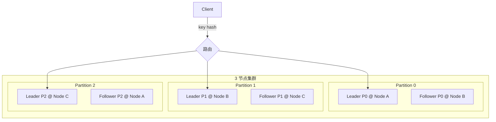
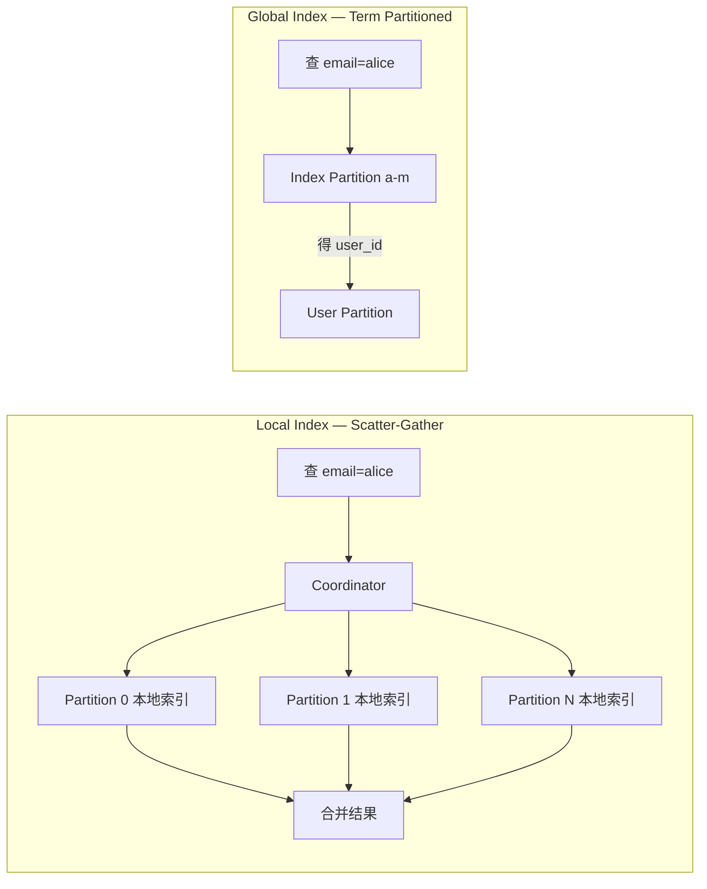
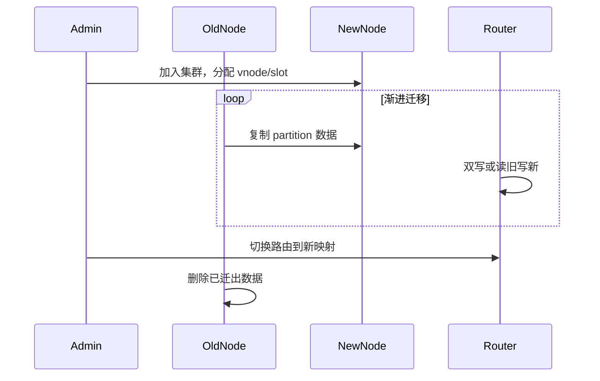

---
aliases:
  - DDIA第6章
tags:
  - DDIA
  - 章节精读
  - 分区
  - Sharding
---

# 第 06 章：分区

> 本章目标：理解如何把数据拆到多节点以**水平扩展**，以及**分区键、再平衡、路由、二级索引**的设计陷阱；能识别热点与跨分区查询成本。

## 本章在全书中的位置

Part II。第 5 章复制提供**每分区多副本**；本章解决**数据如何切分**。分区 + 复制 = 扩展又容错。与第 7 章跨分区事务、第 9 章路由共识衔接。详见 [[00-逐章精读总览与索引]]。

## 初学者先抓住一句话

**分区（Sharding）** 解决单机容量与吞吐上限；**选错分区键**会导致热点与跨分区事务地狱——分区键 = 数据局部性 + 负载均衡。

## 核心概念定义

详见 [[05-概念定义详解#分区]]。

| 概念 | 一句话 | 详解 |
|---|---|---|
| Partition / Shard | 按 key 拆分子集 | [[05-概念定义详解#Partition / Shard]] |
| Partition Key | 决定行归属哪个分区 | 下文 |
| Rebalancing | 节点变化时迁移分区 | [[05-概念定义详解#Rebalancing]] |
| Hot Spot | 某分区 QPS/数据量远高于其他 | 下文 |
| Consistent Hashing | 环上 hash 减迁移量 | 下文 |

---

## 分区与复制结合

```text
         Partition 0          Partition 1
Node A: [P0 Leader]         [P1 Follower]
Node B: [P0 Follower]       [P1 Leader]
Node C: [P0 Follower]       [P1 Follower]

每个分区通常有 N 副本（第 5 章）
Leader 分散在不同节点 → 写负载分散
```

**关键**：分区解决**容量**；复制解决**可用性与读扩展**。

---

## 键值数据的分区策略

### 1. Key Range 范围分区

```text
Partition 0:  key 0000 – 0FFF
Partition 1:  key 1000 – 1FFF
Partition 2:  key 2000 – 2FFF
```

| 优点 | 缺点 |
|---|---|
| **范围扫描**高效 `WHERE id BETWEEN ...` | **热点**：最新时间戳集中在尾部 range |
| 按 key 有序，适合 LSM | 需手动 split 热点 range |
| HBase、Bigtable 典型 | 负载不均风险 |

**热点例子**：

```text
分区键 = timestamp（毫秒）
→ 所有新写打到「最新」分区 → 单节点 IO 爆
```

---

### 2. Hash 哈希分区

```text
partition_id = hash(key) mod num_partitions
# 或 consistent hashing（见下文）
```

| 优点 | 缺点 |
|---|---|
| **负载较均匀** | **丧失范围查询**（除非 key 设计复合） |
| 随机分布 | 扩容需 rehash（固定分区数可缓解） |
| Cassandra、DynamoDB 默认 | 相邻 key 不在相邻节点 |

**代表**：`hash(user_id) % 128` → 128 个固定分区。

---

### 3. 复合键 Composite Key

```text
Cassandra: PRIMARY KEY ((tenant_id, date), event_id)
           └─ partition key ─┘  └ clustering ─┘

同一 tenant+date 内 event_id 有序
不同 tenant 分散到不同分区
```

| 设计 | 效果 |
|---|---|
| `(tenant_id, record_id)` | 租户内范围查；租户间均匀 |
| `(user_id, timestamp)` | 用户时间线局部性 |
| `(category, product_id)` | 类目内扫描 |

**原则**：**高基数**字段放 partition key 前半；访问模式决定 clustering 顺序。

---

### 策略对照表

| 策略 | 均匀性 | 范围查询 | 热点风险 | 典型 |
|---|---|---|---|---|
| Key Range | 低~中 | ✓ | 高（尾部） | HBase |
| Hash | 高 | ✗（纯 hash） | 低（celebrity 除外） | Cassandra |
| 复合键 | 可调 | 分区内 ✓ | 中（tenant 过大） | 多租户 SaaS |

---

## 热点 Key Hot Spot

### 成因

| 类型 | 例子 |
|---|---|
| **幂律分布** |  celebrity 用户、爆款 SKU |
| **错误分区键** | 按 `status`（仅几种值）分区 |
| **时间戳分区** | 按日/按小时，当前窗口集中写 |
| **全局计数器** | 单 key `view_count` |

### 缓解策略

| 策略 | 机制 | 适用 |
|---|---|---|
| **随机后缀** | `key#random(0..99)` 拆 100 片，读时 merge | 写热点计数 |
| **拆分计数器** | `views:shard:0..N` 求和 | 浏览量 |
| **异步聚合** | 写 Kafka → Flink 聚合 → 写 DB | 实时性可降 |
| **缓存 + 单线程** | 热点读走 Redis | 读热点 |
| **Key 加盐 Salting** | hash 加随机前缀 | 写分散 |
| **Range split** | 手动分裂大 range | HBase 运维 |

```text
反模式: partition_key = "GLOBAL_PROMO_2024"
正模式: partition_key = hash(user_id) 或 promo_id + user_id
```

---

## 分区与次级索引 Secondary Index

分区后：**主键查**只需路由一个分区；**二级索引查**变复杂。

详见 [[05-概念定义详解#次级索引与分区]]。

### Local Index（Document Partitioned）

```text
索引与主文档存同一分区

Partition 0: users + local index on email
Partition 1: users + local index on email

查 email=alice@x.com → 不知在哪个分区 → Scatter-Gather 问所有分区
```

| 优点 | 缺点 |
|---|---|
| 写快（本地更新） | 全局查询 **O(分区数)** |
| 无跨分区写 | 延迟高、成本高 |

### Global Index（Term Partitioned）

```text
独立索引按索引值分区

email_index 分区:
  P0: a* – m*
  P1: n* – z*

查 email=alice → 路由 index 分区 P0 → 得 user_id → 路由 user 分区
```

| 优点 | 缺点 |
|---|---|
| 全局查询快 | **写需跨分区**（主文档 + 索引分区） |
| 类似独立索引服务 | 一致性、延迟复杂 |

### Scatter-Gather

```text
Coordinator 并行问 N 个分区 → 合并排序 → 返回 Top-K

成本 ∝ 分区数；ES、Cassandra 二级索引常见痛点
```

| 方案 | 全局查询 | 写路径 |
|---|---|---|
| Local 索引 | Scatter-Gather | 单分区 |
| Global 索引 | 单跳索引分区 | 跨分区双写 |
| 外部搜索引擎 | ES 集群 | CDC 异步（推荐报表/搜索） |

---

## 分区再平衡 Rebalancing

**目标**：节点增删时迁移数据，且：

1. **迁移量小**（非全量 reshuffle）
2. **不影响在线请求**（或最小化）
3. **负载均匀**

### 策略对比

| 策略 | 机制 | 优点 | 缺点 |
|---|---|---|---|
| **固定分区数** | 如 1024 分区；节点变只迁分区 | rehash 范围小 | 初始分区数难估 |
| **动态分裂** | 大分区 split 为两个 | 适应增长 | 元数据复杂（HBase） |
| **按比例** | 每节点分区数 ∝ 容量 | 灵活 | 实现复杂 |
| **Consistent Hashing** | 环上 vnode | 增删节点只迁相邻 | 实现与运维门槛 |

### 固定分区数（推荐思路）

```text
num_partitions = 1024（远大于节点数）
node 3台 → 每节点 ~341 分区
扩到 6台 → 每节点 ~170 分区，迁移约一半分区
```

→ 分区数**固定**，节点数变化只改变**分区→节点映射**。

### Consistent Hashing 一致性哈希

```text
         hash ring
    N1 ●─────────● N2
        ╲       ╱
         ╲     ╱
          ● N3

key → hash(key) → 顺时针最近 node
每物理节点多个 vnode → 负载更匀
```

| 操作 | 迁移量 |
|---|---|
| 加节点 | 仅相邻 vnode 的 key |
| 减节点 | 其 vnode 数据迁到后继 |
| vs `mod N` | mod N 几乎全量重分布 |

**代表**：Cassandra（partitioner + token）、Dynamo、Memcached 客户端。

### Rebalancing 过程注意

- **渐进迁移**：双写 / 背景 copy / 切换路由。
- **读可用**：迁移中旧节点仍服务未迁 key。
- **避免 thundering herd**：批量限速。

---

## 请求路由 Request Routing

客户端如何知道 `key → partition → node`？

### 三种模式

| 模式 | 机制 | 例子 |
|---|---|---|
| **任意节点转发** | 客户端连任意节点，由集群转发 | Redis Cluster、Cassandra |
| **路由层** | 独立 proxy/gateway 查表转发 | Twemproxy、Vitess、ShardingSphere-Proxy |
| **客户端感知** | 客户端缓存 partition map，直连 | Kafka client、Cassandra driver、ES client |

```text
模式1:
  Client → Node B → (key 属 P0) → 转发 Node A

模式2:
  Client → Proxy → 查 metadata → Node A

模式3:
  Client 本地 partition map → 直连 Node A
```

### 元数据传播

| 方式 | 机制 |
|---|---|
| **Gossip** | 节点间 epidemic 传播（Cassandra） |
| **ZooKeeper / etcd** | 集中存储 partition→node 映射 |
| **Coordinator 服务** | 独立 metadata 集群 |

**故障**：路由 stale → 404 或 redirect；需 **version** 与刷新机制。

---

## 跨分区操作

| 操作 | 难度 | 解法 |
|---|---|---|
| 单 key 读写 | 易 | 路由一分区 |
| 多 key 事务 | 难 | 避免；或 2PC/XA（第 7/9 章） |
| 全局聚合 | 中 | Scatter-Gather；或预聚合 |
| 全局唯一 | 难 | 全局索引或协调服务 |
| 外键跨分区 | 难 | 应用层校验；弃外键 |

**Saga / 按实体聚合**：业务上把需原子性的数据放**同一分区**（同 user_id）。

---

## 架构设计检查清单

- [ ] 分区键是否**高基数**且与**主要访问模式**一致？
- [ ] 是否存在**时间戳尾部写**或**低基数 status** 热点？
- [ ] 二级索引查询是否意外变成**全集群 Scatter-Gather**？
- [ ] 是否需要**跨分区事务**？能否 Saga / 同 key 聚合？
- [ ] 扩容 **rebalancing** 是否自动化？是否演练过？
- [ ] 路由 metadata 过期时行为是否定义（retry/redirect）？
- [ ] celebrity 热点是否有 **split counter / 随机后缀** 方案？

---

## 与 Java 后端

| 场景 | 实践 |
|---|---|
| **ShardingSphere** | `user_id` 分片；避免按 `create_time` 单分片 |
| **MyCat/Vitess** | 中间件路由 vs 客户端路由 |
| **Kafka** | 分区数 = 最大并行 consumer 数；key 决定有序边界 |
| **Elasticsearch** | 分片数创建后难改；reindex 成本高，**规划前置** |
| **Redis Cluster** | hash slot 16384；`hash tag {userId}` 共 slot |
| **Spring @ShardingKey** | 注解指定分片键，防全路由 |

```java
// Kafka：同一 orderId 进同一分区保证有序
kafkaTemplate.send("orders", order.getOrderId(), event);

// Redis Cluster hash tag：同一用户 key 同 slot
String key = "{user:" + userId + "}:session";
```

### 分库分表常见键

| 业务 | 分区键 | 理由 |
|---|---|---|
| 订单 | `user_id` 或 `order_id` | 用户维度查询局部性 |
| 消息 | `conversation_id` | 会话内有序 |
| 日志 | `tenant_id + date` | 租户隔离 + 时间范围 |
| 反例 | `province` | 低基数，热点省份 |

---

## 常见误区

| 误区 | 正解 |
|---|---|
| 分片越多越好 | 每分片有开销；metadata、scatter 成本上升 |
| 按时间分片永远合理 | 当前窗口热点；历史分区只读 |
| 二级索引「免费」 | 全局查昂贵；写路径跨分区 |
| 一致性哈希消除 rebalancing | 只是减迁移量，仍需迁移 |
| 跨分区 JOIN 可接受 | 延迟 × 分区数；用 ES/宽表/冗余 |
| Kafka 分区可随意减 | 只能增；规划前置 |

---

## 书中目录与小节映射

| 书中章节 | 核心主题 | 本笔记对应节 |
|---|---|---|
| **6.1 分区与复制结合** | 每分区多副本 | [[#分区与复制结合]] |
| **6.2 键值数据的分区** | Key range vs Hash | [[#键值数据的分区策略]] |
| **6.3 分区与次级索引** | Local vs Global 索引 | [[#分区与次级索引 Secondary Index]] |
| **6.4 分区再平衡** | 固定分区、一致性哈希 | [[#分区再平衡 Rebalancing]] |
| **6.5 请求路由** | 三种路由模式 | [[#请求路由 Request Routing]] |
| **6.6 本章小结** | 跨分区操作代价 | [[#跨分区操作]] |

**阅读顺序建议**：分区策略（6.2）→ 热点（本章专题）→ 二级索引（6.3，最易踩坑）→ 再平衡与路由（6.4–6.5）。

---

## 书中案例 — Cassandra 与 Redis Cluster 分区

### 案例 1：Cassandra 复合分区键（书中多租户场景）

```text
CREATE TABLE events (
  tenant_id uuid,
  event_date date,
  event_id uuid,
  payload text,
  PRIMARY KEY ((tenant_id, event_date), event_id)
);

写入: tenant=A, date=2024-01-01 → 路由到 Partition X
同 tenant 同 date 内 event_id 有序（clustering key）
不同 tenant 分散到不同 partition → 避免单 tenant 独占（若 tenant 不大）
```

**热点风险**：超大 tenant 的单一 `event_date` 分区仍可能成为热点 → 需进一步拆分（如加 hour 到 partition key）。

### 案例 2：Redis Cluster Hash Slot

```text
16384 个 hash slot 映射到 N 个 master 节点
key → CRC16(key) mod 16384 → slot → node

Hash Tag: {user:123}:session 与 {user:123}:cart 同 slot
  → 同用户多 key 可 MULTI/事务（同 slot 内）
  → 跨 slot 无原生事务
```

### 案例 3：书中 celebrity 用户热点

某明星 user_id 粉丝亿级，按 `user_id` hash 后仍**单分区**承载全部粉丝关系 → 写/读 QPS 打满单节点。

**解法**：`follower_id` 随机后缀分片，读时 scatter-gather 合并计数。

### Cassandra vs Redis Cluster 对照

| 维度 | Cassandra | Redis Cluster |
|---|---|---|
| 分区单位 | partition（token range） | hash slot 16384 |
| 副本 | 每 partition N 副本 | 每 master 1+ replica |
| 再平衡 | token 迁移 / vnodes | slot 迁移 `CLUSTER SETSLOT` |
| 二级索引 | local index（scatter） | 无原生全局二级索引 |
| 跨分区事务 | LWT 单行/partition | 同 slot 才支持 MULTI |
| 热点缓解 | 复合键拆分 | hash tag + 应用层分片 |

---

## 机制深度专题

### 分区 + 复制拓扑



### 二级索引查询路径



### Rebalancing 渐进迁移



---

## 算法与流程

### Consistent Hashing 增删节点

```text
初始: 3 物理节点，每节点 256 vnode → 768 环上点
key K → hash(K) → 顺时针最近 vnode → 所属物理节点

加 Node D（256 vnode）:
  1. 在环上插入 D 的 256 个 vnode
  2. 仅「落在 D 的 vnode 之前、原后继 vnode 之后」的 key 需迁移
  3. 迁移量 ≈ 1/(N+1) 总数据（理想均匀）

减 Node B:
  1. B 的 vnode 从环移除
  2. 原 B 负责的 key 迁移到顺时针后继
  3. 迁移量 ≈ B 的分担比例
```

**对比 `hash(key) mod N`**：N 变化时几乎**全部 key** 重映射 → 缓存雪崩、全集群迁移。

### Scatter-Gather 全局查询步骤

```text
1. Coordinator 解析查询（如 WHERE status='ACTIVE'）
2. 若无 global index → 向所有 partition 并行发子查询
3. 各 partition 本地扫描 / local index 过滤
4. Coordinator 合并（排序、Top-K、聚合）
5. 返回结果

成本: O(分区数) 网络往返 + O(总数据) 最坏扫描
```

### 固定分区数 Rebalancing

```text
num_partitions = 1024（固定）
nodes = [A, B, C]  →  mapping: 341+341+342 partitions

扩到 4 节点 [A,B,C,D]:
  1. 重算 mapping: 每节点 ~256 partitions
  2. 仅「partition→node 映射变化」的分区迁移
  3. 迁移期间: 旧 node 仍服务未迁 partition
  4. 切换: 原子更新 metadata version
  5. 验证: 抽样 key 路由正确性
```

---

## 与具体产品对照

| 产品 | 分区策略 | 再平衡 | 路由 | 二级索引 |
|---|---|---|---|---|
| **Cassandra** | Murmur3 partitioner + token | vnode 增删 | driver 感知 / any-node 转发 | local（scatter） |
| **DynamoDB** | partition key hash | 自动 | SDK 路由 | GSI（global，异步） |
| **Redis Cluster** | 16384 slot | `CLUSTER SETSLOT` | smart client / MOVED redirect | 无 |
| **Kafka** | topic partition | 手动增 partition | consumer group + key | 无（靠 key 有序） |
| **Elasticsearch** | primary shard hash | 加节点 re-route | client 路由 | 原生 inverted index |
| **HBase** | key range region | region split/merge | meta 表 + ZK | 有限 |
| **ShardingSphere** | 分片算法 configurable | 扩容 resharding | proxy 或 jdbc driver | 绑定分片键 |

### ShardingSphere 分片键实践

```java
// 标准分片：user_id 决定库表
@ShardingKey("user_id")
public Order findByOrderId(Long orderId, Long userId);

// 反模式：仅 order_id 查询但未带 user_id → 全路由（scatter-gather 到所有分片）
```

### Seata 与分区

- **AT 模式**：要求 undo_log 与业务表**同库**；跨分片 = 跨库 → 需 XA 或 Saga。
- **Saga**：按 aggregate root 设计，每步单分区本地事务 + 补偿。
- **最佳实践**：把需原子性的操作聚合到**同一 partition key**（同 user_id），避免 2PC。

---

## 深度 FAQ

**Q1：分区数是不是越多越好？**  
A：否。每 partition 有 metadata、文件句柄、scatter 成本。Kafka 分区过多导致 consumer 协调开销；ES shard 过多导致 cluster state 膨胀。

**Q2：按时间分区为何是常见反模式？**  
A：当前时间窗口集中所有写 → 尾部热点；历史分区只读但仍占运维。应 `hash(id)` 或 `(tenant, date)` 复合。

**Q3：Cassandra 的 LOCAL_QUORUM 与 ONE 如何选？**  
A：写 `LOCAL_QUORUM`（同 DC 多数派）平衡延迟与持久；读 ONE 适合可 stale 的计数；强一致读需 `SERIAL` 或更高。

**Q4：Redis hash tag 滥用有何风险？**  
A：过多 key 强制同 slot → 单节点热点。仅把需原子操作的 key 组用 tag。

**Q5：Global 二级索引写路径为何复杂？**  
A：写主文档 + 写索引 partition = 跨分区双写；需分布式事务或异步最终一致（DynamoDB GSI）。

**Q6：跨分区 JOIN 能否用 ShardingSphere 解决？**  
A：Binding table 仅限相同分片键的表 JOIN；否则广播表或应用层组装。延迟 × 分片数。

**Q7：Kafka partition 数能否减少？**  
A：不能（只能增）。规划前置：partition 数 = 最大并行 consumer 数。

**Q8：ES 分片创建后为何难改？**  
A：reindex 全量迁移成本高。创建 index 时按数据量规划 primary shard 数。

**Q9：celebrity 热点随机后缀，读如何合并？**  
A：写 `views:{id}:{0..99}` 分散；读并行 GET 100 key 求和；或用 HyperLogLog / 异步聚合。

**Q10：分区与复制 Leader 如何分散？**  
A：每 partition 的 Leader 轮转到不同物理节点，避免所有写打同一台机器。

---

## 设计模式与反模式

### 推荐模式

| 模式 | 场景 | 要点 |
|---|---|---|
| **固定分区数** | 预期扩容 | 1024 分区 >> 节点数 |
| **复合分区键** | 多租户 SaaS | 高基数字段在前 |
| **Hash tag 共 slot** | Redis 同用户多 key | 仅必要 key 组 |
| **CDC → ES** | 全局搜索 | 避免 DB local index scatter |
| **Binding table** | 同 user 订单+明细 JOIN | ShardingSphere |
| **随机后缀分片** | 全局计数热点 | 读 merge |
| **预聚合** | 大盘统计 | Flink/Kafka 流聚合 |

### 反模式

| 反模式 | 后果 | 替代 |
|---|---|---|
| `partition_key = status` | 低基数热点 | hash(id) |
| `partition_key = 当前日期` | 尾部写热点 | 复合键 + hash |
| 二级索引当 MySQL 索引用 | 全集群 scatter | ES / GSI |
| 跨分区外键 | 无法 enforce | 应用校验 |
| `mod N` 扩容 | 全量 remapping | 固定分区 / consistent hash |
| 无 metadata 版本的路由 | stale 404 | version + redirect |

---

## 本章练习

1. 设计多租户 SaaS 的 **partition key**（租户隔离 + 避免大 tenant 热点）。
2. 画 **consistent hashing** 加/减节点时的 key 迁移范围。
3. 对比 **local vs global 二级索引** 在「按 email 查用户」场景的读写路径。
4. 给定 celebrity 用户写热点，设计 **随机后缀 + 读合并** 方案。
5. 为订单系统选择 partition key：`user_id` vs `order_id` vs `(merchant_id, date)`，写出查询模式与权衡。
6. Redis Cluster 中 `{user:42}:session` 与 `{user:42}:cart` 为何同 slot？跨用户事务如何实现？
7. Kafka 20 分区、5 consumer，最大并行度？若 consumer 扩到 25 呢？
8. 设计 ES + MySQL 架构：哪些查询走 ES，哪些走 DB 主键？CDC 链路如何画？
9. ShardingSphere 扩容从 4 库到 8 库，数据迁移步骤与双写窗口如何设计？
10. 画出 Scatter-Gather 查询的 Coordinator 时序图（5 个 partition）。

---

## 阅读检查

- [ ] 能对比 Key Range 与 Hash 分区优缺点
- [ ] 能解释复合键中 partition key 与 clustering key
- [ ] 能列举三种热点缓解策略
- [ ] 能说明 Scatter-Gather 成本来源
- [ ] 能解释固定分区数 vs consistent hashing
- [ ] 能对比三种请求路由模式
- [ ] 能说明为何跨分区事务应尽量避免
- [ ] 能对照 Cassandra 与 Redis Cluster 分区机制
- [ ] 能描述 consistent hashing 增删节点的迁移量
- [ ] 能解释 DynamoDB GSI 与 Cassandra local index 差异
- [ ] 能设计 celebrity 热点的随机后缀方案
- [ ] 能说明 Seata Saga 与分区键设计的关系

---

## 本章小结

- **分区是水平扩展必经之路**；增加运维、查询、事务复杂度。
- **分区键设计** = 数据局部性 + 负载均衡；避免低基数与时间尾部热点。
- **二级索引**：local 写快查慢（scatter）；global 查快写复杂。
- **Rebalancing**：固定分区数 + consistent hashing 减迁移；需渐进与演练。
- **路由**：客户端感知 vs 代理 vs 转发；metadata 一致性关键。
- 与**复制**结合：每分区多副本，Leader 分散，才既扩展又容错。

## 相关笔记

- [[05-概念定义详解#分区]]
- [[03-复制分区与扩展性]]
- [[05-第05章-复制]]
- [[07-第07章-事务]]
- [[03-第03章-存储与检索]]
