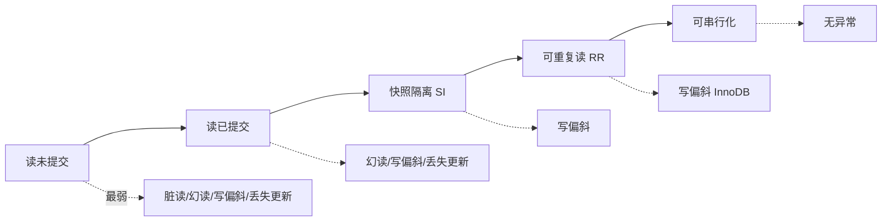
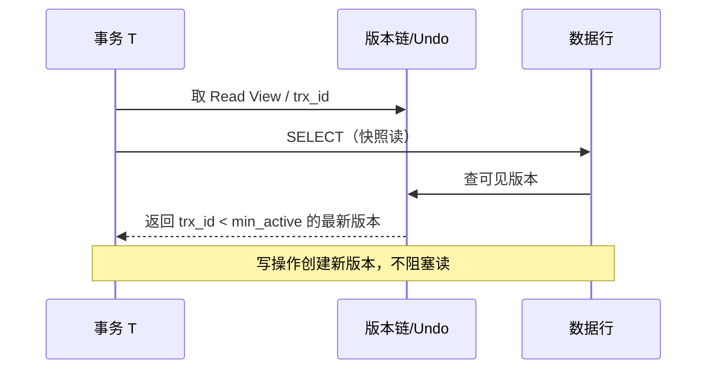
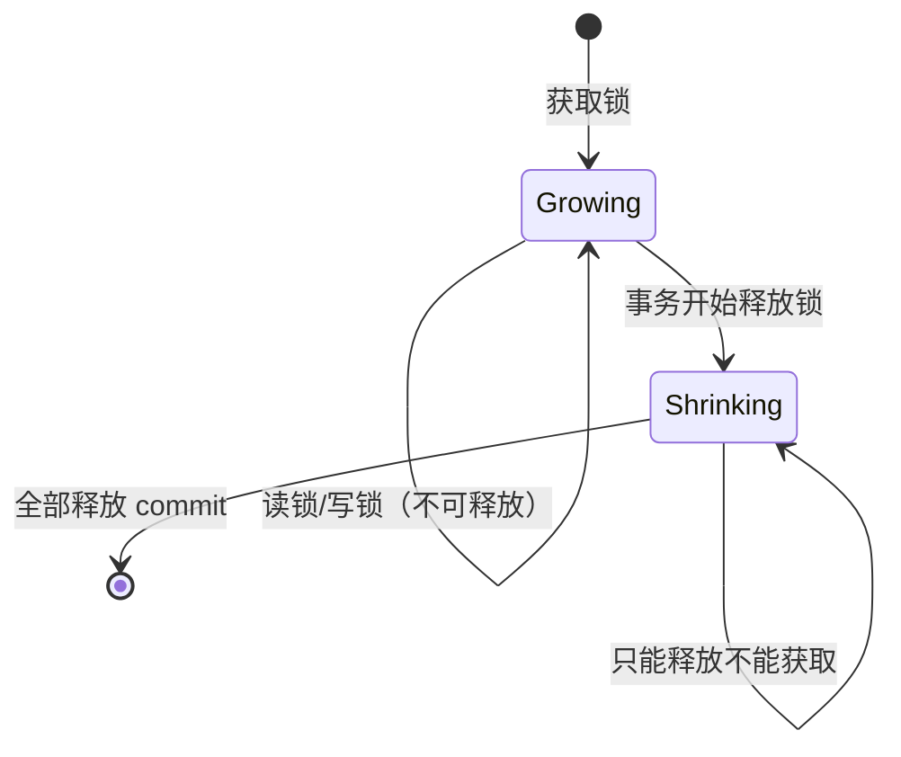
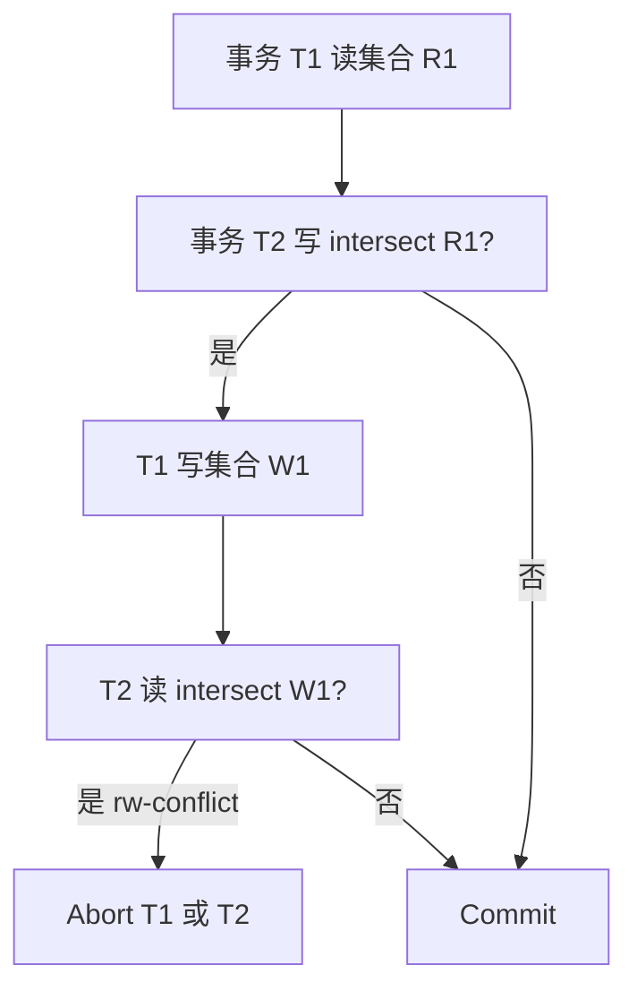

---
aliases:
  - DDIA第7章
tags:
  - DDIA
  - 章节精读
  - 事务
---

# 第 07 章：事务

> 本章目标：精确掌握 **ACID、隔离级别、异常现象、MVCC、写偏斜**；能在设计文档中写清「允许哪种并发异常」。

## 本章在全书中的位置

Part II 核心。复制（第 5 章）与分区（第 6 章）解决**扩展**；事务解决**并发正确性**。分布式事务延伸到第 9 章。

## 初学者先抓住一句话

**事务**把多步操作绑成逻辑单元；**隔离级别**决定并发下等价于哪一种串行顺序——级别越低，异常越多、性能越好。

## 核心概念定义

详见 [[05-概念定义详解#事务与隔离]]。

| 概念 | 一句话 |
|---|---|
| Transaction | 全部成功或全部失败的逻辑工作单元 |
| Isolation | 并发事务互不干扰的程度 |
| MVCC | 多版本并发控制，读快照、写新版本 |
| Write skew | 基于相同快照的并发写破坏全局不变量 |

## ACID 精讲

| 字母 | 正式含义 | 实现机制 | 常见误解 |
|---|---|---|---|
| **A** Atomicity | 全 commit 或全 abort | undo log / 回滚 | 「部分成功」需应用避免 |
| **C** Consistency | 不变量成立 | 约束、应用逻辑 | **不是**「ACID 的 C = 强一致」 |
| **I** Isolation | 并发等价串行 | 锁 / MVCC / SSI | 各级别防不同异常 |
| **D** Durability | 提交后持久 | WAL + fsync + 复制 | 复制异步时 RPO>0 |

**Consistency 关键**：数据库保证外键、唯一、非空等；**业务规则**（如「至少一名医生值班」）需应用 + 合适隔离级别共同保证。

## 弱隔离级别详解

### 读未提交 Read Uncommitted

- 几乎不用；可能**脏读**。

### 读已提交 Read Committed（RC）

**机制**：

- 读：仅见**已提交**版本（每语句新快照或锁）。
- 写：覆盖已提交值。

**防止**：脏读。  
**仍可能**：不可重复读、幻读、写偏斜、丢失更新。

**代表**：Oracle 默认、PostgreSQL 默认、SQL Server 默认。

### 快照隔离 Snapshot Isolation（SI）

**机制（MVCC）**：

- 事务开始（或首语句）取 **consistent snapshot**。
- 读不阻塞写；写创建新版本。
- 提交时检测**写冲突**（首写获胜或 abort）。

**防止**：脏读、不可重复读（快照内）。  
**仍可能**：**写偏斜**、幻读（视实现）。

**注意**：PostgreSQL/Oracle 的 **Repeatable Read 实际实现为 SI**，与 SQL 标准 RR 不完全相同。

### 可重复读 Repeatable Read（MySQL InnoDB）

**机制**：

- **快照读**（普通 SELECT）：MVCC 一致快照。
- **当前读**（`SELECT ... FOR UPDATE`、`INSERT`）：加锁。
- **间隙锁 Gap lock** + **next-key lock**：防幻读（同一索引范围）。

**防止**：脏读、不可重复读、多数幻读场景。  
**仍可能**：**写偏斜**（经典考题）。

### 写偏斜 Write Skew — 必须掌握

**场景 1：值班医生**

```text
不变量：至少 1 名医生在岗
初始：Alice ✓  Bob ✓

T1: 读 Alice 在岗、Bob 在岗 → 将 Alice 设为不在岗
T2: 读 Alice 在岗、Bob 在岗 → 将 Bob 设为不在岗
提交后：0 人在岗 —— 各事务单独看都合法
```

**场景 2：会议室预订**

```text
不变量：同一会议室时段不能两人预订
T1: 查 10:00-11:00 无预订 → 预订 Alice
T2: 查 10:00-11:00 无预订 → 预订 Bob
```

**场景 3：库存（两行）**

```text
不变量：item_A + item_B >= 1
T1: 读 A=1,B=1 → 将 A 减到 0
T2: 读 A=1,B=1 → 将 B 减到 0
```

**解法**：

| 方法 | 说明 |
|---|---|
| 可串行化 | 最强 |
| 显式锁范围 | `SELECT ... FOR UPDATE` 锁覆盖不变量涉及所有行 |
| 物化冲突 | 引入「计数器行」单行更新（如 `ON_CALL_COUNT`） |
| 约束 + 数据库 | CHECK 约束（若 DB 支持且可表达） |

### 串行化 Serializable

**定义**：并发执行结果等价于**某种串行顺序**。

| 实现 | 机制 | 优点 | 缺点 |
|---|---|---|---|
| **实际串行** | 单线程处理事务 | 简单正确 | 吞吐低 |
| **两阶段锁 2PL** | 读/写锁，阶段一加锁、阶段二释放 | 经典可串行化 | 死锁、锁范围大 |
| **SSI** | 乐观 MVCC + 检测 rw-dependency | PostgreSQL 提供 | 冲突时 abort 重试 |

**SSI 直觉**：若 T1 读过的数据被 T2 修改，且 T1 要写的数据被 T2 读过，则 abort 其一。

## 完整异常 × 隔离级别矩阵

| 异常 | RU | RC | SI | RR(InnoDB) | Serializable |
|---|---|---|---|---|---|
| 脏读 | ✓ | ✗ | ✗ | ✗ | ✗ |
| 不可重复读 | ✓ | ✓ | ✗ | ✗ | ✗ |
| 幻读 | ✓ | ✓ | 视实现 | 多数 ✗ | ✗ |
| 写偏斜 | ✓ | ✓ | ✓ | ✓ | ✗ |
| 丢失更新 | ✓ | ✓ | 部分 | 部分 | ✗ |

✓ = 仍可能发生；✗ = 该级别防止

## 丢失更新 Lost Update

| 解法 | 机制 |
|---|---|
| 原子写 | `UPDATE SET x = x + 1` |
| 乐观锁 | version 字段 CAS |
| 悲观锁 | `FOR UPDATE` |
| 自动合并 | CRDT（特定数据类型） |

## 长事务的危害

- MVCC 保留旧版本 → **undo 链变长** → 慢查询、空间膨胀。
- 锁持有久 → 阻塞、死锁。
- **规则**：事务尽可能短；只读大查询用快照从库或 `READ ONLY`。

## 架构设计检查清单

- [ ] 每个核心不变量是否文档化？
- [ ] 不变量映射到隔离级别或显式锁？
- [ ] 是否测过写偏斜场景？
- [ ] `@Transactional` 是否包含 RPC/HTTP？
- [ ] 分布式「大事务」是否应拆 Saga？

## 与 Java 后端

### Spring 事务

```java
@Transactional(
    isolation = Isolation.REPEATABLE_READ,
    rollbackFor = Exception.class,
    timeout = 5
)
```

| 传播行为 | 场景 |
|---|---|
| REQUIRED | 默认，加入当前事务 |
| REQUIRES_NEW | 独立事务（日志、审计） |
| NOT_SUPPORTED | 挂起事务（非 DB 操作） |

**陷阱**：同类内 `this.method()` 调用**不走代理**，事务不生效。

### MySQL InnoDB

| 概念 | 说明 |
|---|---|
| 聚簇索引 | 主键 B+Tree，行存叶子 |
| 当前读 vs 快照读 | `LOCK IN SHARE MODE` / `FOR UPDATE` |
| gap lock | RR 下防幻读 |
| auto-commit | 单语句隐式事务 |

### 选型建议

| 业务 | 隔离级别 |
|---|---|
| 一般 CRUD | RC 或 RR（MySQL 默认 RR） |
| 金融账务 | RR + 显式锁 或 Serializable |
| 只读报表 | RC + 只读从库 |

## 常见误区

| 误区 | 正解 |
|---|---|
| RR = 没有并发问题 | **写偏斜**仍在 |
| 加了 `@Transactional` 就安全 | 传播、自调用、跨库均可能失效 |
| 隔离级别越高越好 | 性能与死锁代价上升 |
| DB 的 C 会保证业务一致 | 应用不变量自己保证 |

---

## 书中目录与小节映射

| 书中章节 | 核心主题 | 本笔记对应节 |
|---|---|---|
| **7.1 ACID** | 四字母真实含义 | [[#ACID 精讲]] |
| **7.2 弱隔离级别** | RU/RC/SI/RR | [[#弱隔离级别详解]] |
| **7.3 可串行化** | 2PL、SSI | [[#串行化 Serializable]] |
| **7.4 本章小结** | 异常矩阵 | [[#完整异常 × 隔离级别矩阵]] |

**阅读顺序建议**：ACID（纠正 C 的误解）→ 各级别机制 → **写偏斜**（7.2 核心）→ 串行化实现（2PL/SSI）。

---

## 书中案例 — 写偏斜与隔离异常

### 案例 1：值班医生（Write Skew，书中经典）

**不变量**：`COUNT(on_call=true) >= 1`

```text
初始状态: Alice(on_call=T), Bob(on_call=T)  →  count=2

时间线:
T1 BEGIN ──────────────────────────────────────────────
T2       │ T1: SELECT count WHERE on_call → 2 ✓
T3       │ T2 BEGIN
T4       │     T2: SELECT count WHERE on_call → 2 ✓  （同一快照）
T5       │ T1: UPDATE Alice SET on_call=false
T6       │     T2: UPDATE Bob SET on_call=false
T7       │ T1: COMMIT ✓
T8       │     T2: COMMIT ✓
T9 结果: count=0 —— 违反不变量
```

**为何 RR/SI 防不住**：两事务读到的快照都显示「还有另一人在岗」，各自写不同行，**无写-写冲突**触发 abort。

### 案例 2：会议室预订（幻读类）

```text
不变量: 同一 room + 时段唯一预订

T1: SELECT * FROM bookings WHERE room=1 AND slot='10:00' → 空
T2:     SELECT * FROM bookings WHERE room=1 AND slot='10:00' → 空
T1: INSERT (room=1, slot='10:00', user=Alice)
T2:     INSERT (room=1, slot='10:00', user=Bob)  → 可能 UNIQUE 约束拦截
```

InnoDB RR + gap lock 可防；SI 下可能两 INSERT 都成功（若无唯一约束）。

### 案例 3：丢失更新（Lost Update）

```text
counter=10
T1: READ 10 → WRITE 11  （+1）
T2: READ 10 → WRITE 11  （+1，覆盖 T1）
期望 12，实际 11
```

**解法**：`UPDATE SET x=x+1` 原子写 / 乐观锁 version / `FOR UPDATE`。

### 异常现象完整时间线对照

#### 脏读 Dirty Read（RU 可能发生）

```text
T1: UPDATE balance=1000 (未提交)
T2: READ balance=1000     ← 脏读
T1: ROLLBACK → balance 回原值
T2 读到的 1000 从未存在
```

#### 不可重复读 Non-repeatable Read（RC 可能发生）

```text
T1: READ balance=500
T2: UPDATE balance=600; COMMIT
T1: READ balance=600      ← 同事务内两次读不同
```

#### 幻读 Phantom Read（RC/SI 可能发生）

```text
T1: SELECT * FROM orders WHERE amount>100 → 3 rows
T2: INSERT order amount=200; COMMIT
T1: SELECT * FROM orders WHERE amount>100 → 4 rows  ← 幻影行
```

InnoDB RR + next-key lock 对**同一索引范围**加锁可防；快照隔离下第二次 SELECT 仍见 3 rows（快照内无幻读，但 INSERT 冲突另论）。

---

## 机制深度专题 — 各级别实现原理

### 隔离级别光谱



### MVCC 快照读流程（PostgreSQL / InnoDB 快照读）



**Read View 规则（InnoDB 简化）**：

- 行的 `trx_id` < 事务 min_trx_id → 可见
- 行的 `trx_id` >= 事务 max_trx_id → 不可见，沿 undo 链找旧版本
- 在 [min, max) 内：若 trx_id 在 m_ids（活跃列表）→ 不可见

### 2PL 两阶段锁



**严格 2PL（Strict 2PL）**：写锁持有到 commit/rollback → 避免脏读已提交数据被其他事务读后再回滚。

### SSI 可串行化快照隔离（PostgreSQL）



**直觉**：若 T1 读过 → T2 修改 → T1 又要写 T2 读过的范围 → 存在非串行交错 → abort。

---

## 算法与流程

### 2PL 加锁流程

```text
Growing Phase:
  1. READ row → 加 S-lock（共享锁）
  2. WRITE row → 若已有 S-lock 升级 X-lock；否则直接 X-lock
  3. 若锁冲突 → 等待（可能死锁）

Shrinking Phase:
  4. commit/rollback 开始 → 释放所有锁
  5. Strict 2PL: X-lock 持有到 commit

死锁检测: 等待图 cycle → 选择 victim rollback
```

### InnoDB 当前读 + Gap Lock 流程（RR）

```text
SELECT * FROM bookings
  WHERE room_id=1 AND slot BETWEEN '10:00' AND '11:00'
  FOR UPDATE;

1. 对命中行加 X-lock（记录锁 record lock）
2. 对索引范围间隙加 gap lock（防 INSERT 幻影）
3. next-key lock = record lock + gap lock（左开右闭区间）
4. 其他事务同范围 INSERT → 阻塞
5. 其他事务 SELECT 快照读 → 不阻塞（MVCC）
```

### PostgreSQL SSI 检测步骤

```text
1. 每事务维护 pg_read_only / rw 模式
2. 读时记录 SIREAD lock（predicate lock 简化版）
3. 写时检查是否与活跃事务的 SIREAD 冲突
4. 发现 rw-dependency → 标记 dangerous
5. commit 时若 dangerous → SERIALIZATION_FAILURE，客户端重试
```

### 写偏斜解法 — 物化（Materialization）

**原问题**：`SELECT COUNT(*)` 无法加行锁（无具体行）。

**物化方案**：

```sql
-- 引入单行计数器
CREATE TABLE on_call_count (id INT PRIMARY KEY, cnt INT);
-- 初始 cnt=2

-- 事务内
BEGIN;
SELECT cnt FROM on_call_count WHERE id=1 FOR UPDATE;  -- 锁单行
-- 若 cnt > 1 才允许 SET on_call=false
UPDATE doctors SET on_call=false WHERE name='Alice';
UPDATE on_call_count SET cnt = cnt - 1 WHERE id=1;
COMMIT;
```

T2 的 `FOR UPDATE` 在 T1 持有锁时**阻塞** → 串行化 decrement → 第二个事务看到 cnt=1 拒绝 off-duty。

---

## PostgreSQL vs MySQL InnoDB — RR 深度对比

| 维度 | PostgreSQL RR | MySQL InnoDB RR |
|---|---|---|
| **实际实现** | **快照隔离 SI** | MVCC 快照读 + 当前读加锁 |
| **标准 RR 语义** | 部分符合（无幻读在快照内） | gap lock 更接近标准 RR |
| **快照建立** | 首语句 `BEGIN` 或 `START TRANSACTION` | 首 consistent read |
| **幻读** | 快照内 SELECT 无幻读；写冲突另论 | next-key lock 防 INSERT 幻读 |
| **写偏斜** | **仍可能** | **仍可能** |
| **可串行化** | 单独 `SERIALIZABLE`（SSI） | `SELECT ... LOCK IN SHARE MODE` + 应用锁或 Serializable 模拟 |
| **默认级别** | RC | RR |
| **死锁** | 较少（乐观 abort） | gap lock 易死锁 |

### Predicate Lock（谓词锁）— 标准 RR 需要，工程简化

**定义**：锁定**满足某谓词**的所有行（含尚不存在的幻影行）。

```text
SELECT * FROM bookings WHERE room=1 AND slot='10:00'
→ 谓词锁: (room=1 ∧ slot='10:00')

其他事务 INSERT 满足谓词的 row → 冲突
```

| 系统 | 谓词锁实现 |
|---|---|
| 理论 2PL | 完整 predicate lock |
| InnoDB | gap lock 近似（索引范围） |
| PostgreSQL SSI | SIREAD tag + 冲突检测 |
| SQL Server | 完整 key-range lock |

**InnoDB 局限**：无索引的 WHERE 可能锁全表；非唯一索引 gap lock 行为复杂 → 生产应用显式 `FOR UPDATE` + 合适索引。

---

## 与具体产品对照

| 产品 | 默认隔离 | 可串行化 | 写偏斜 | 备注 |
|---|---|---|---|---|
| **MySQL InnoDB** | RR | 无原生 SSI | 可能 | gap lock；RC 用 gap lock 较少 |
| **PostgreSQL** | RC | SSI | SI/RR 均可能 | `SERIALIZABLE` 自动 retry |
| **Oracle** | RC | 多版本 + 锁 | 可能 | `SELECT FOR UPDATE` |
| **SQL Server** | RC | 锁 + SSI 可选 | gap/key-range | |
| **CockroachDB** | SNAPSHOT | SERIALIZABLE 默认 | SSI | 分布式 rewind |
| **Seata AT** | 依赖底层 DB | 无 | 依赖 DB | `@GlobalTransactional` 协调多库 |

### Seata AT 模式与本地隔离

```text
Branch 1 (DB A): 本地 RR + undo_log
Branch 2 (DB B): 本地 RR + undo_log
Global commit: 异步删 undo_log

注意: Seata 不提升单库隔离级别；写偏斜仍在单库 RR 下发生
跨库: 两库各自本地事务，非真正串行化
```

### Spring `@Transactional` 隔离级别映射

```java
@Transactional(isolation = Isolation.REPEATABLE_READ)  // MySQL 默认
@Transactional(isolation = Isolation.SERIALIZABLE)     // PG 可用 SSI
@Transactional(isolation = Isolation.READ_COMMITTED)   // PG 默认
```

**陷阱**：`Isolation.DEFAULT` 跟随 DB 默认 → MySQL=RR，PG=RC，行为不同。

---

## 深度 FAQ

**Q1：ACID 的 C 是强一致性吗？**  
A：否。C 指应用不变量在事务前后成立（约束+逻辑），不是 CAP 的 Consistency。

**Q2：为何 PostgreSQL 把 RR 实现成 SI？**  
A：SI 性能好（无读锁），且防脏读/不可重复读；标准 RR 还需 predicate lock，实现代价高。

**Q3：InnoDB RC 与 RR 主要区别？**  
A：RC 每语句新快照，无 gap lock（多数场景）；RR 事务级快照 + gap lock 防幻读。

**Q4：写偏斜与丢失更新区别？**  
A：丢失更新是**同行**并发写覆盖；写偏斜是**多行**基于同一快照的决策破坏全局不变量。

**Q5：`SELECT FOR UPDATE` 能否防所有写偏斜？**  
A：需锁**覆盖不变量的全部相关行或物化行**。只锁读到的行可能不够（COUNT 无行可锁 → 物化）。

**Q6：SSI 与 2PL 如何选？**  
A：读多写少、冲突低 → SSI（PG）；写密集、需严格锁 → 2PL 或实际串行。

**Q7：长事务为何危害大？**  
A：MVCC 旧版本无法 purge；undo 链变长；锁持有阻塞他人；Replication slot 阻塞（PG）。

**Q8：幻读与写偏斜区别？**  
A：幻读是**同一查询**结果集行数变化；写偏斜是**全局约束**被并发写破坏，未必有重复 SELECT。

**Q9：分布式事务能替代合适隔离级别吗？**  
A：不能。2PC 保证跨库原子，不解决单库写偏斜。先保证单库不变量，再谈跨库 Saga。

**Q10：如何测试写偏斜？**  
A：并发压测两事务各改不同行但破坏不变量；Jepsen / 自定义 race test；生产用 invariant 监控。

---

## 设计模式与反模式

### 推荐模式

| 模式 | 场景 | 要点 |
|---|---|---|
| **物化计数器** | 写偏斜 COUNT 类不变量 | 单行 `FOR UPDATE` |
| **显式范围锁** | 预订、库存 | `FOR UPDATE` + 合适索引 |
| **乐观锁 version** | 低冲突更新 | CAS retry |
| **原子 SQL** | counter | `SET x=x+1` |
| **SSI + retry** | PG 高一致 | catch `40001` 重试 |
| **Saga 按聚合根** | 跨服务 | 每步单库本地事务 |
| **只读事务 + 从库** | 报表 | `READ ONLY` 缩短锁 |

### 反模式

| 反模式 | 后果 | 替代 |
|---|---|---|
| 默认 RR 从不测写偏斜 | 生产 invariant 破坏 | 物化或 FOR UPDATE |
| `@Transactional` 含 HTTP 调用 | 长事务占连接 | 事务外 RPC |
| 同类 self-invoke | 事务不生效 | 注入 self proxy |
| 隔离级别越高越好 | 死锁、p99 上升 | 按不变量选型 |
| 无唯一约束防预订 | 双订 | UNIQUE(room, slot) |
| 分布式锁替代 DB 事务 | 锁与 DB 不一致 | 本地事务 + 合适隔离 |

---

## 本章练习

1. 用**值班医生**例子画出 T1/T2 完整时间线（含快照边界）。
2. 列出你项目中 3 个**不变量**及推荐隔离/锁策略。
3. 解释 InnoDB RR 与 PostgreSQL RR（SI）的差异。
4. 为会议室预订画出 RC、RR(gap lock)、Serializable(SSI) 三种下的不同结果。
5. 实现物化 `on_call_count` 的 SQL 伪代码，证明 T2 被阻塞。
6. 画出 2PL Growing/Shrinking 阶段与死锁等待图示例。
7. 解释 predicate lock、gap lock、next-key lock 三者关系。
8. 丢失更新的 4 种解法各适用什么 QPS / 冲突率？
9. Spring 事务：`REQUIRES_NEW` 与 `REQUIRED` 嵌套时隔离级别如何传递？
10. 设计 Jepsen 风格测试：两线程并发写偏斜，断言不变量。

---

## 阅读检查

- [ ] 能解释 MVCC 快照读原理
- [ ] 能举例写偏斜并给出两种解法
- [ ] 能填异常 × 隔离级别矩阵
- [ ] 能说明 2PL 与 SSI 区别
- [ ] 能画出脏读/不可重复读/幻读时间线
- [ ] 能解释 Read View 可见性规则
- [ ] 能对比 PG RR(SI) 与 InnoDB RR
- [ ] 能说明 gap lock / next-key lock 防幻读机制
- [ ] 能解释 predicate lock 与物化解法
- [ ] 能描述 SSI rw-conflict 检测流程
- [ ] 能说明 Seata AT 不解决写偏斜
- [ ] 能列举长事务对 MVCC 的危害

## 本章小结

- 事务正确性 = 原子 + 合适隔离 + 应用不变量。
- **写偏斜**是 RR/SI 下最易漏测的 bug。
- 分布式「事务」见第 9 章；优先本地事务 + 事件。

## 相关笔记

- [[05-概念定义详解#事务与隔离]]
- [[03-事务一致性与分布式共识]]
- [[09-第09章-一致性与共识]]
