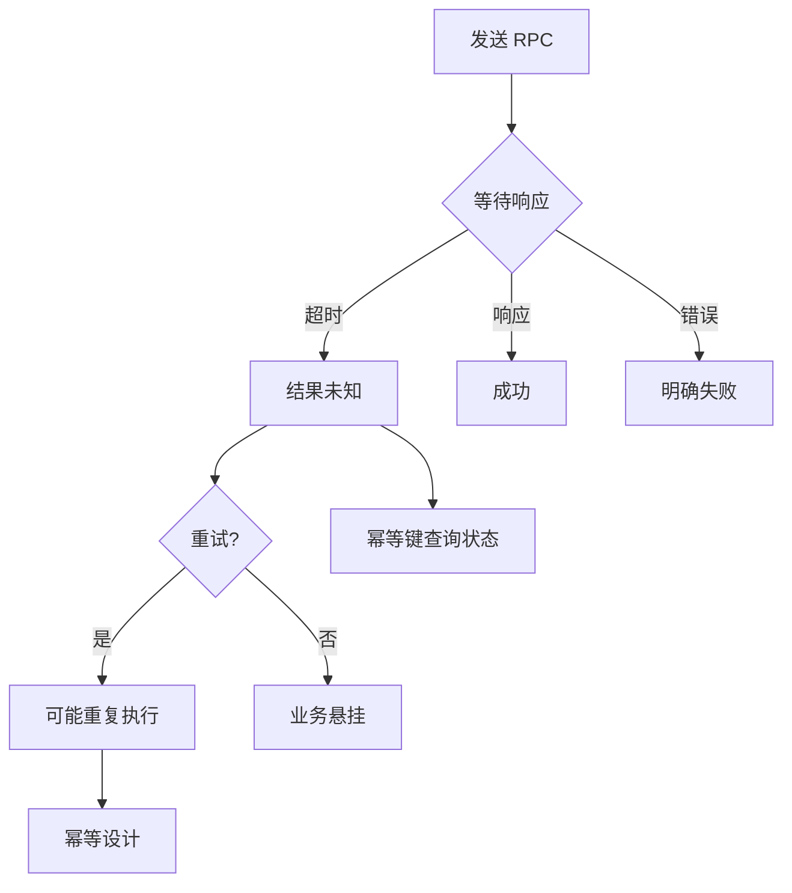
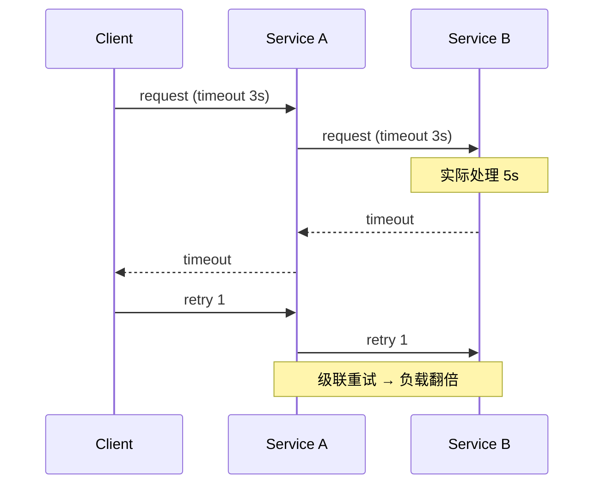
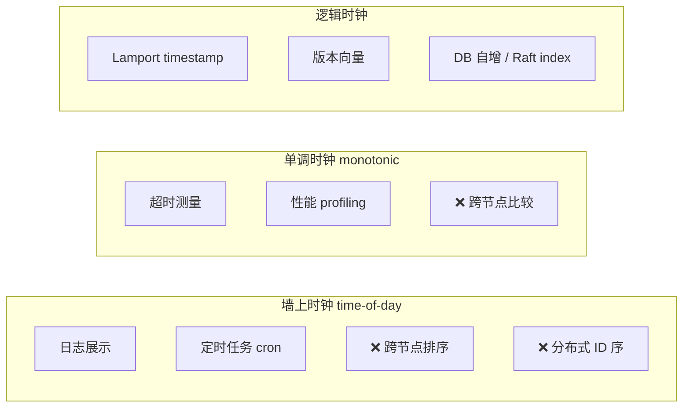
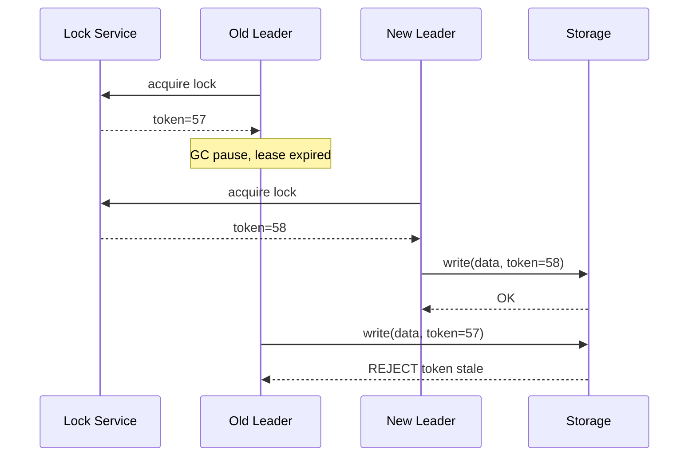

---
aliases:
  - DDIA第8章
tags:
  - DDIA
  - 章节精读
  - 分布式故障
---

# 第 08 章：分布式系统的麻烦

> 本章目标：建立分布式**不可假设**清单——网络、时钟、进程都会说谎；为第 9 章共识与第 11 章流处理中的超时/乱序设计打底。

## 本章在全书中的位置

Part II 收尾。第 5–7 章在**理想网络**下讨论复制、分区、事务；本章撕掉这层假设，说明真实分布式里**部分失效**才是常态。第 9 章在此之上讨论一致性与共识；第 11 章的乱序、水印与本章时钟问题一脉相承。

## 初学者先抓住一句话

单机程序可以假设「要么成功要么抛异常」；分布式里 **部分失效** 是常态，**超时不能证明任何事**。

## 核心概念定义

详见 [[05-概念定义详解#分布式故障]]。

| 概念 | 一句话 |
|---|---|
| Partial failure | 系统一部分工作、一部分不工作，且状态不确定 |
| Unbounded delay | 网络延迟无理论上界，不能靠固定超时断定死亡 |
| Fencing token | 单调递增租约号，存储拒绝过期 leader 的写 |
| FLP impossibility | 异步网络中，允许一节点崩溃则确定性共识不可能 |
| Byzantine fault | 节点可任意恶意或错误行为，最难模型 |

---

## 故障与部分失效

### 正式定义

**部分失效（Partial failure）**：分布式系统中，**不确定**某次操作是仍在进行、已失败还是已成功；不存在全局共享内存与统一失败信号。

详见 [[05-概念定义详解#部分失效 Partial failure]]。

### 整台失效 vs 部分失效

| 类型 | 表现 | 处理难度 | 典型手段 |
|---|---|---|---|
| 整台机器宕机 | 进程消失、端口不通 | 相对容易 | 健康检查摘除、故障转移 |
| 进程崩溃 | 节点消失，TCP 可检测 | 中等 | 心跳、租约、复制 |
| **慢响应 / 丢包 / 半开连接** | 节点「活着」但不响应 | **最难** | 超时、幂等、熔断、对账 |
| 进程暂停（GC） | 逻辑上活着，实际停转 | 极易误判 | 单调时钟测间隔、fencing |
| 时钟跳变 | 时间倒退或跳跃 | 排序/租约错乱 | 逻辑时钟、版本号 |

### 为什么部分失效危险

```text
客户端 ──RPC──▶ 服务 A ──RPC──▶ 服务 B
                    │
              超时！但 B 可能已写入
```

- 客户端重试 → **重复提交**（扣款两次）。
- 协调者超时 → **脑裂**（两个 leader 同时写）。
- 负载均衡摘除慢节点 → **请求丢失**（连接已建立但未完成）。

### 示例：支付超时

```text
T0: 用户发起支付，请求到达支付服务
T1: 支付服务调用银行接口，银行扣款成功
T2: 响应在网络中丢失
T3: 客户端 30s 超时，显示「支付失败」
T4: 用户点击重试 → 第二次扣款
```

**正解**：幂等键（`idempotency-key`）、对账任务、状态机（`PENDING → SUCCESS/FAILED`）。

---

## 不可靠的网络

### 延迟无上限（Unbounded delay）

- **定义**：网络不保证最大延迟；排队、路由震荡、交换机 buffer 溢出均可导致秒级甚至更长延迟。
- **推论**：不能把「3 秒无响应 = 节点死亡」当作定理；太短误杀，太长用户等待。

| 假设（错误） | 现实 |
|---|---|
| 发送即到达 | 可能缓冲、重传、乱序 |
| 固定 RTT | 随负载剧烈波动 |
| TCP 连接 = 应用可用 | 应用可能死锁、线程池满 |
| 超时 = 失败 | 可能只是慢，操作或已完成 |

### TCP 能检测什么、不能检测什么

| TCP 机制 | 能检测 | 不能检测 |
|---|---|---|
| 连接 reset / FIN | 对端进程关闭或拒绝 | 应用层逻辑挂起 |
| 重传超时 | 网络丢包（Eventually） | 对端处理慢 |
| Keepalive | 对端主机长时间无响应 | JVM Full GC 暂停（进程仍在） |
| TLS 握手超时 | 证书/网络问题 | 业务线程阻塞 |

**关键**：TCP 保证**字节流按序送达**（在连接存活前提下），**不保证** RPC 语义上的「请求-响应完成」。

### 超时（Timeout）问题

详见 [[05-概念定义详解#超时 Timeout]]。

| 问题 | 说明 |
|---|---|
| 无法区分原因 | 网络慢、进程暂停、节点宕机、GC 四者表现相同 |
| 重复请求 | 超时后重试，第一次可能已成功 |
| 级联超时 | A 等 B、B 等 C，延迟叠加引发重试风暴 |
| 过早放弃 | 误杀慢节点，加剧热点 |

**设计模式**：

```text
超时 + 有限重试 + 指数退避 + 抖动
+ 幂等键 + 熔断器 + 舱壁隔离
+ 异步化（返回 202 + 轮询/Webhook）
```

### 网络分区（Network partition）

- 节点两两间部分可达、部分不可达；不是「全断」，而是**拓扑分裂**。
- 与 CAP 相关：分区时必须在**一致性与可用性**间做选择（第 9 章细讲）。

---

## 不可靠的时钟

### 两种时钟

| 时钟类型 | API 示例 | 用途 | 陷阱 |
|---|---|---|---|
| **墙上时钟** Time-of-day | `System.currentTimeMillis()` | 日志时间戳、人类可读 | NTP 同步可**跳变**（前进/后退） |
| **单调时钟** Monotonic | `System.nanoTime()` | 测间隔、超时 | **不能跨节点**比较先后 |

### 时钟偏移（Clock skew）

```text
节点 A 时钟：12:00:05.000
节点 B 时钟：12:00:04.200   ← 慢 800ms

若用墙上时钟排序事件：
  B 上后发生的事件可能时间戳更早 → 因果颠倒
```

**禁止**：用墙上时钟做分布式**事件排序**、**唯一 ID 序**（雪花 ID 需处理回拨）、**租约过期**的唯一依据。

**推荐**：逻辑时钟（Lamport）、版本向量、数据库自增序列、Raft log index。

### 进程暂停（Process pause）

| 原因 | 典型时长 | 后果 |
|---|---|---|
| JVM Full GC（STW） | 数百 ms ~ 数秒 | 心跳超时、租约过期 |
| 虚拟机冻结 | 不定 | 被集群判定死亡 |
| 磁盘 thrashing | 秒级 | RPC 超时、锁超时 |
| 操作系统抢占 | 毫秒~秒 | 延迟尖刺 |

**与网络延迟的区别**：从其他节点看，**进程暂停与网络延迟无法区分**——都是「一段时间没有响应」。

### 示例：分布式锁 + GC

```text
T0: 节点 A 获得 Redis 锁，lease = 30s
T1: A 进入 Full GC，STW 40s
T2: lease 过期，节点 B 获得锁
T3: A 的 GC 结束，仍以为自己持有锁，继续写 MinIO
T4: A 与 B 同时写 → 数据损坏
```

**解法预告**：[[05-概念定义详解#Fencing Token]] —— 存储层校验单调递增的 **fencing token**（第 9 章详述）。

---

## 知识、真相与谎言

### 系统模型

| 模型 | 假设 | 算法可行性 |
|---|---|---|
| **同步** | 消息延迟有上界、时钟漂移有界 | 更强保证可能 |
| **部分同步** | 大部分时间同步，偶发长延迟 | 实用共识（Raft、Paxos） |
| **异步** | 无延迟上界、无时钟 | FLP：确定性共识不可能 |

工程实践多在**部分同步**假设下设计，并容忍偶发违反。

### FLP 不可能性结果

- **陈述**（Fischer-Lynch-Paterson, 1985）：在**异步**网络模型中，若允许**至少一个节点崩溃**，则不存在**确定性**的分布式共识算法总能终止。
- **含义**：不能指望「完美算法」在所有异步条件下既安全又活锁自由；实际系统靠**超时、选主、故障检测器**把异步「近似」为部分同步。
- **不是**说共识做不了——Raft/Paxos 在**部分同步**下可行。

详见 [[05-概念定义详解#共识 Consensus]]。

### 拜占庭故障（Byzantine faults）

| 模型 | 节点行为 | 典型场景 |
|---|---|---|
| 崩溃故障 Crash-stop | 停止或正常 | 数据中心、微服务 |
| 遗漏故障 Omission | 丢消息 | 网络不可靠 |
| **拜占庭 Byzantine** | **任意**错误甚至恶意 | 区块链、军事系统 |

- 需要 **3f+1** 节点才能容忍 **f** 个拜占庭节点（PBFT 等）。
- 一般企业系统**不假设**拜占庭；若内网被攻破，优先网络隔离与审计。

### Fencing Token 入门

- **问题**：租约/锁过期后，旧 leader 仍可能写入（**僵尸 leader**）。
- **机制**：每次授予锁时发放单调递增 token（如 ZooKeeper 的 zxid、etcd 的 revision）；存储在写入时校验 `token > last_seen_token`，否则拒绝。
- **要点**：fencing 必须在**资源端**（存储、DB）执行，不能只在锁服务侧。

```text
Lock service: grant lock, token=57
Storage: write(key, val, fencing_token=57)  → OK
Lock expires, new leader gets token=58
Old leader: write(key, val', fencing_token=57) → REJECTED
```

---

## 实践准则

```text
1. 不要依赖跨节点墙上时钟排序业务事件
2. 超时后：重试可能 duplicate → 需要幂等键
3. 健康检查 + 优雅下线 + 连接 draining
4. 监控：延迟分布（p99）、丢包、GC 日志、时钟偏移
5. 混沌测试：网络分区、延迟注入、进程冻结
6. 关键写路径：版本号 / fencing token，而非仅靠租约
```

## 架构设计检查清单

- [ ] 分布式锁是否无 fencing，过期 leader 仍写 S3/DB？
- [ ] 是否用 `System.currentTimeMillis()` 做订单号/排序？
- [ ] RPC 超时是否引发级联重试风暴？
- [ ] JVM Full GC 是否导致注册中心误判下线？
- [ ] 超时后业务是否有幂等键或对账补偿？
- [ ] 是否区分 monotonic（测间隔）与 time-of-day（展示）？

## 与 Java 后端

| 组件 | 关联本章主题 | 注意点 |
|---|---|---|
| **Resilience4j** | 超时、熔断、重试、舱壁 | 重试需幂等；退避加抖动 |
| **雪花 ID** | 墙上时钟 | 时钟回拨抛异常或等待 |
| **Redisson 锁** | 租约、watchdog | 关键资源加 storage-side fencing |
| **K8s probe** | 进程暂停误判 | liveness 阈值 > 最长 GC |
| **gRPC deadline** | 级联超时 | 传递剩余 deadline，勿每层重置 |
| **Hystrix（遗留）** | 舱壁隔离 | 线程池隔离 vs 信号量 |

---

## 常见误区

| 误区 | 正解 |
|---|---|
| 「有超时就不会 hung」 | 超时只放弃等待，不撤销已发出的副作用 |
| 「TCP 可靠所以 RPC 可靠」 | 应用层仍可能阻塞、重复、乱序 |
| 「NTP 同步了时钟就安全」 | 仍可能跳变；排序用逻辑时钟 |
| 「FLP 说明共识无用」 | FLP 限异步模型；工程用部分同步 + 选主 |
| 「内网网络可靠」 | 交换机、DNS、iptables 均可制造分区 |
| 「分布式锁 = 互斥」 | 无 fencing 时锁过期后互斥失效 |

---

## 书中目录与小节映射

| 书中章节 | 核心主题 | 本笔记对应节 |
|---|---|---|
| **8.1 故障与部分失效** | 部分失效定义 | [[#故障与部分失效]] |
| **8.2 不可靠的网络** | 延迟无界、超时 | [[#不可靠的网络]] |
| **8.3 不可靠的时钟** | 墙上 vs 单调时钟 | [[#不可靠的时钟]] |
| **8.4 知识、真相与谎言** | 系统模型、FLP、拜占庭 | [[#知识、真相与谎言]] |
| **8.5 本章小结** | 实践准则 | [[#实践准则]] |

**阅读顺序建议**：部分失效（建立直觉）→ 网络超时 → 时钟/GC → 系统模型与 FLP → fencing。本章是第 9 章共识的「为什么不能假设理想网络」的前传。

---

## 书中案例 — GPS、时钟与网络延迟

### 案例 1：GPS 时间与事件排序（书中）

多节点用 GPS 授时的墙上时钟为事件打 timestamp，试图建立全局顺序：

```text
Node A (GPS): event E1 @ 12:00:00.000
Node B (GPS): event E2 @ 11:59:59.950  ← 实际后发生，时间戳更早

若 LWW 合并: E2 被 E1 覆盖 → 因果颠倒
```

**教训**：即使 NTP/GPS 同步，**跨节点墙上时钟不可用于排序**；用逻辑时钟、版本号、数据库序列。

### 案例 2：网络延迟无界 — 请求丢失与重复

```text
Client ──POST /pay──▶ LB ──▶ Server A
                              │
                         处理成功，写 DB
                              │
                         响应包在网络中缓冲 60s
Client 30s 超时 → 重试 POST /pay → 双扣
```

**书中要点**：发送方**无法区分**「慢」与「死」；TCP ACK 只证明字节到达，不证明业务完成。

### 案例 3：进程暂停 vs 网络延迟 — 分布式锁失效

```text
T0:  A 获 Redis 锁 lease=30s
T1:  A Full GC STW 45s
T2:  lease 过期，B 获锁
T3:  A 醒来，以为仍持锁，写 S3/MinIO
T4:  A 与 B 双写 → 损坏
```

与 [[#示例：分布式锁 + GC]] 相同；解法见 fencing token。

### 案例 4：跨数据中心 RTT（书中）

```text
同 AZ:    RTT ~0.5ms
跨 AZ:    RTT ~1-5ms
跨 Region: RTT ~50-200ms

同步复制若等跨 Region 多数派 ACK → 写延迟 = RTT
→ 复制策略必须与延迟预算匹配（第 5 章半同步/异步权衡）
```

---

## 机制深度专题

### 部分失效决策空间



### 超时与重试风暴



### 时钟类型与适用场景



### Fencing Token 完整流程



---

## 算法与流程

### 超时 + 重试 + 幂等 标准流程

```text
1. Client 生成 idempotency_key（UUID）
2. 发送 request + idempotency_key
3. Server:
   a. 查 idempotency 表：key 存在且已完成 → 返回缓存结果
   b. 不存在 → 执行业务 + 写 idempotency 记录 + 返回
4. Client 超时:
   a. 指数退避 + 抖动后重试（同一 idempotency_key）
   b. 或异步：返回 202 + poll / webhook
5. 对账任务：扫描 PENDING 超过 T 的订单，查下游真实状态
```

### 健康检查与误判流程

```text
Heartbeat 每 1s，timeout 30s，连续 3 次失败 → 标记 DOWN

风险:
  - Full GC 40s → 3 次心跳丢失 → 误判 DOWN → 流量切走 → 恢复后双写
  - 网络分区 → 脑裂

缓解:
  - liveness 阈值 > max_gc_pause + network_jitter
  - 用 fencing 而非仅靠 lease
  - 优雅下线: deregister → drain connections → shutdown
```

### Lamport 逻辑时钟（入门）

```text
每个节点维护 counter L
本地事件: L = L + 1
发送消息: 附带 L
接收消息: L = max(L_local, L_msg) + 1

若 A → B（因果），则 L(A) < L(B)
反之 L(A) < L(B) 不能推断因果（需向量时钟）
```

### Failover 与 FLP 的关系

```text
异步模型: 无超时上界 → 无法区分 crash 与 slow → FLP 证明无确定性共识

工程绕过:
  1. 假设部分同步（大多数时间延迟有界）
  2. 用超时作故障检测器（可能误判）
  3. 选主 + epoch + quorum（第 9 章 Raft）
  4. 接受偶发误判，用 fencing 修复
```

---

## 与具体产品对照

| 产品/组件 | 本章关联 | 实践要点 |
|---|---|---|
| **Resilience4j** | 超时、重试、熔断 | `@Retry` 仅用于幂等；`waitDuration` + jitter |
| **gRPC** | deadline 传播 | `context.withDeadlineAfter` 逐层递减 |
| **K8s probe** | 进程暂停误判 | liveness 阈值 > GC；readiness 与 liveness 分离 |
| **Redisson** | 分布式锁 lease | watchdog 续期；**关键写仍需 storage fencing** |
| **Snowflake ID** | 墙上时钟 | 回拨检测抛异常或 wait |
| **ZooKeeper / etcd** | fencing token 源 | zxid / revision 作 token |
| **MinIO / S3** | 条件写 | `If-Match` / version 作 fencing |
| **Seata** | 全局事务超时 | 超时后分支状态需补偿，非简单回滚 |

### Java 超时配置对照

```java
// RestTemplate — 连接 vs 读取超时分离
factory.setConnectTimeout(1000);
factory.setReadTimeout(3000);

// gRPC — deadline 必须传递
stub.withDeadlineAfter(2, SECONDS).call();

// Resilience4j — 重试 + 熔断组合
Retry.of("pay", RetryConfig.custom()
    .maxAttempts(3)
    .waitDuration(Duration.ofMillis(500))
    .intervalFunction(IntervalFunction.ofExponentialBackoff())
    .build());
```

### Seata 与部分失效

```text
TM 发起 @GlobalTransactional
RM 分支注册 → 本地 commit → 等 TC 全局 commit

若 TM 与 TC 间网络分区:
  - 分支已 commit，全局状态未知 → 需 timeout rollback / 人工对账
  - 与「超时不能证明失败」同一类问题
```

---

## 深度 FAQ

**Q1：超时后请求到底成功没有？**  
A：**不知道**。这是部分失效核心。必须幂等 + 状态查询 + 对账，不能假设失败。

**Q2：TCP 可靠传输为何不够？**  
A：TCP 保证连接内字节有序送达；不保证应用处理完成、不保证 RPC 语义、不保证连接存活时应用未死锁。

**Q3：NTP 同步后能否用 `currentTimeMillis()` 排序？**  
A：不能作为唯一依据。NTP 可能步进调整（跳变）；应用层排序用逻辑时钟或 DB 序列。

**Q4：`nanoTime()` 能跨 JVM 比较吗？**  
A：不能。仅适合单 JVM 内测间隔；跨节点比较无意义。

**Q5：FLP 是否说明 Raft 无用？**  
A：否。FLP 限**异步**模型；Raft 在**部分同步**下工作，用超时作故障检测（可能误判，靠 epoch 修复）。

**Q6：拜占庭故障需要关心吗？**  
A：一般内网只需 crash-stop。区块链、开放网络需 3f+1 与 PBFT；企业系统优先网络隔离。

**Q7：分布式锁 + lease 够吗？**  
A：不够。GC/暂停可导致 lease 过期后旧 holder 仍写；必须 **storage-side fencing token**。

**Q8：重试多少次合适？**  
A：有限次（3–5）+ 指数退避 + 抖动；配合熔断防重试风暴。非幂等操作禁止盲目重试。

**Q9：跨 AZ 同步复制延迟如何估？**  
A：写 RTT ≈ 2× 跨 AZ RTT + 处理；100ms RTT → 写延迟 200ms 级，需业务接受或改异步。

**Q10：混沌工程应测什么？**  
A：网络分区、延迟注入（tc/netem）、进程 freeze（SIGSTOP）、时钟跳变、随机 kill pod；验证超时/幂等/fencing。

---

## 设计模式与反模式

### 推荐模式

| 模式 | 场景 | 要点 |
|---|---|---|
| **幂等键** | 支付、下单 | 唯一 key + 状态表 |
| **状态机** | 异步订单 | PENDING→SUCCESS/FAILED |
| **对账补偿** | 超时悬挂 | 定时扫 + 人工介入 |
| **Fencing token** | Leader 选举后写 | 存储校验 token |
| **Deadline 传递** | gRPC 链 | 递减剩余时间 |
| **舱壁隔离** | 慢依赖 | 独立线程池/连接池 |
| **优雅下线** | 发布/缩容 | drain → deregister |
| **逻辑时钟排序** | 事件溯源 | Lamport / version |

### 反模式

| 反模式 | 后果 | 替代 |
|---|---|---|
| 超时 = 失败并回滚 | 实际已成功 | 查询 + 对账 |
| 无幂等重试 POST | 双扣双订 | idempotency_key |
| 墙上时钟做 LWW | 丢写 | 版本向量 / 单主 |
| 分布式锁无 fencing | 双写损坏 | storage 校验 token |
| 每层重置 timeout | 级联 hung | deadline 传递 |
| liveness 阈值过短 | GC 误判 | 阈值 > max GC |
| 「内网不会分区」 | 交换机故障脑裂 | quorum + fencing |

---

## 本章练习

1. 画出「支付超时 + 重试导致双扣」的时序图，并标注幂等键应插入的位置。
2. 列举你项目中 3 处使用墙上时钟的地方，评估时钟回拨风险。
3. 解释为何 Full GC 40s 会导致 Redis 锁保护下的双写；fencing token 如何阻断。
4. 对比同步、部分同步、异步三种系统模型，说明 Raft 属于哪一种假设。
5. 设计一次混沌实验：对某服务注入 5s 网络延迟，观察调用链超时与重试行为。
6. 画出 GPS 时钟导致 LWW 因果颠倒的时序图，改用 Lamport 时钟如何改善。
7. 设计跨 3 层微服务的 gRPC deadline 分配（总 3s，如何逐层切分）。
8. 编写 K8s liveness/readiness 探针参数，假设 max GC=10s。
9. 对比 Redisson 锁与 ZooKeeper 锁在 fencing 支持上的差异。
10. Seata 全局事务超时后，各分支状态可能是什么？补偿流程如何设计？

---

## 阅读检查

- [ ] 能定义部分失效，并举例与整台宕机的区别
- [ ] 能说明 TCP 可靠性与 RPC 可靠性的差距
- [ ] 能解释超时后为何需要幂等
- [ ] 能区分墙上时钟与单调时钟的适用场景
- [ ] 能描述进程暂停如何破坏分布式锁
- [ ] 能简述 FLP 结论及其工程含义
- [ ] 能说明 fencing token 解决什么问题
- [ ] 能画出部分失效「结果未知」决策树
- [ ] 能解释 GPS/墙上时钟不能做跨节点排序
- [ ] 能描述指数退避 + 抖动防重试风暴
- [ ] 能说明 Lamport 时钟基本规则
- [ ] 能设计幂等键 + 对账的标准流程

---

## 本章小结

- 分布式复杂性来自**部分失效**与**不确定性**，不是「更多机器」那么简单。
- 网络延迟无界、TCP 不能替代应用语义；**超时不是失败证明**。
- 时钟与进程暂停是 bug 温床；用**版本号/逻辑时钟/fencing** 代替墙上时钟排序。
- 为「重复、乱序、延迟、暂停」设计，而非假设理想网络。
- 下一章：在这些麻烦之上，讨论**一致性保证与共识算法**的代价与边界。

## 相关笔记

- [[05-概念定义详解#分布式故障]]
- [[09-第09章-一致性与共识]]
- [[03-事务一致性与分布式共识]]
- [[05-第05章-复制]]
