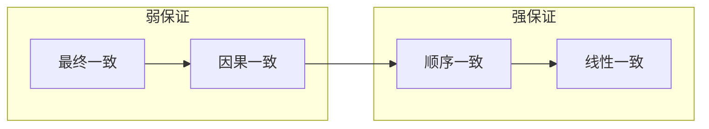
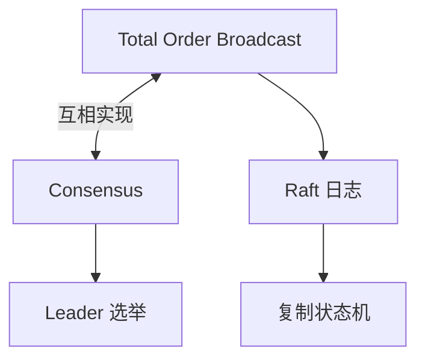
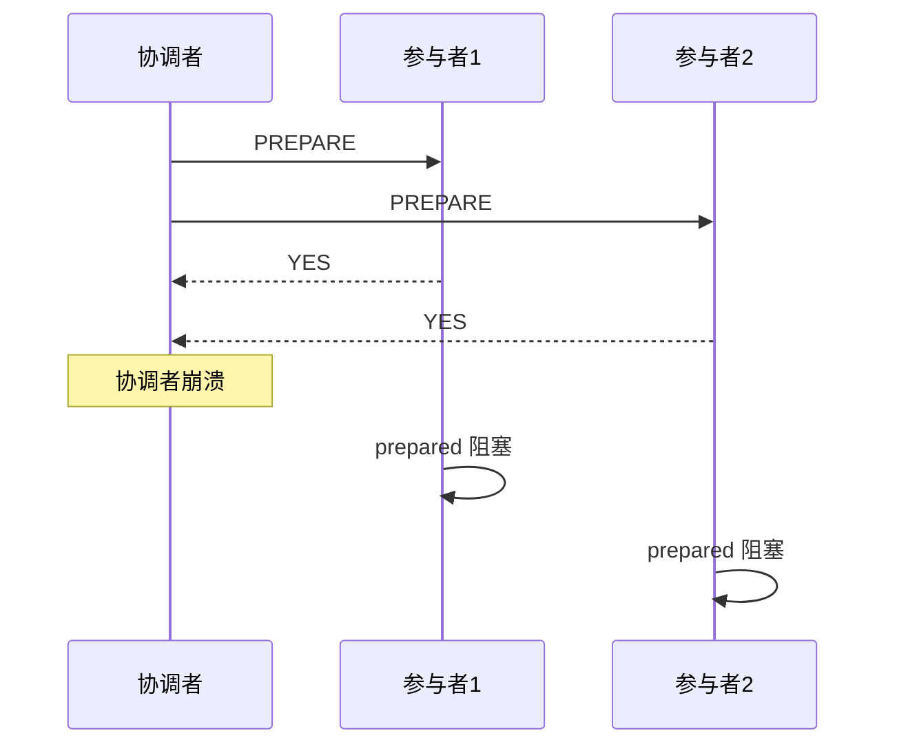
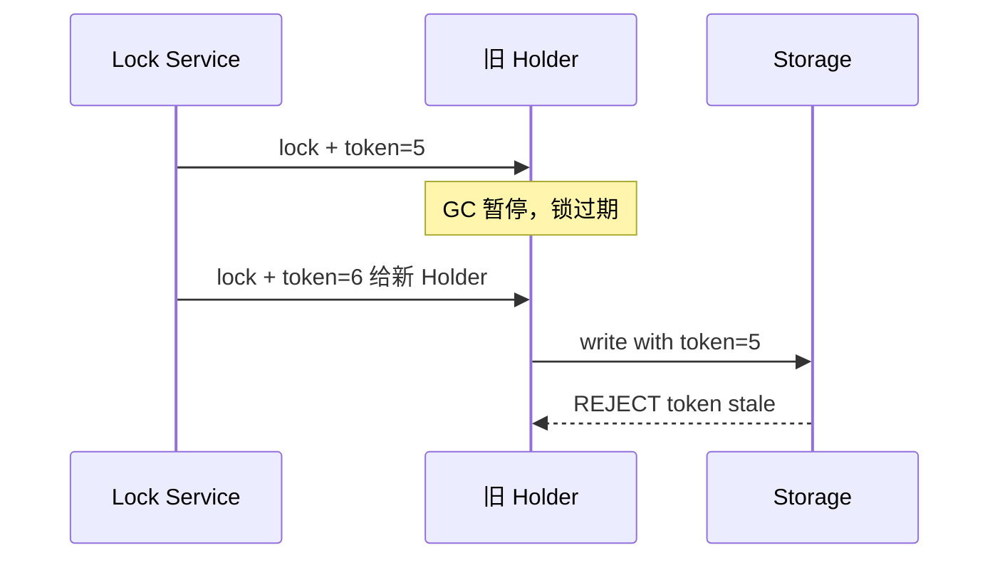
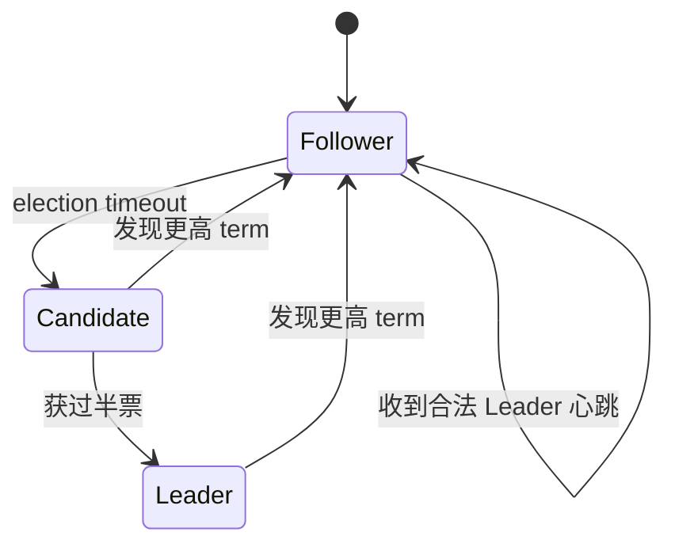

---
aliases:
  - DDIA第9章
tags:
  - DDIA
  - 章节精读
  - 一致性
  - 共识
---

# 第 09 章：一致性与共识

> 本章目标：理解**线性一致性**等保证的代价，掌握 **2PC、Raft、Total order broadcast** 的机制与边界，能在架构评审中说清「要什么级别的一致、付什么代价」。

## 本章在全书中的位置

Part II 高潮。第 8 章说明分布式**不可靠**；本章回答：在不可靠之上，我们还能承诺什么**顺序与一致**？复制（第 5 章）、事务（第 7 章）、流处理（第 11 章）中的一致语义均与本章挂钩。

## 初学者先抓住一句话

**共识**让多个节点对单一决定达成一致；**强一致**很贵，多数业务在 **因果/最终一致** 上更划算。

## 核心概念定义

详见 [[05-概念定义详解#一致性级别]]、[[05-概念定义详解#分布式事务]]、[[05-概念定义详解#共识 Consensus]]。

| 概念 | 一句话 |
|---|---|
| Linearizability | 所有操作像在单副本上按实时顺序执行 |
| Sequential consistency | 所有节点看到相同全局顺序（不必实时） |
| Causal consistency | 仅保证有因果关系的操作顺序 |
| Total order broadcast | 可靠、全序、无丢地广播消息（等价于共识） |
| Consensus | 多节点对单一值达成一致 |
| Epoch | Leader 任期编号，用于 fencing 与日志连续性 |

---

## 一致性保证谱系

### 正式定义对照

| 级别 | 正式含义 | 读者看到什么 | 典型代价 |
|---|---|---|---|
| **最终一致** | 停止写入后，各副本最终收敛相同 | 可能长时间读到旧值 | 低延迟、高可用 |
| **因果一致** | 若 op B 依赖 op A，则所有节点先见 A 再见 B | 无因果关系的写可乱序 | 中等；需版本向量或分区序 |
| **顺序一致** | 所有节点对**所有**操作看到同一全序 | 顺序一致但可能非实时 | 需全序广播 |
| **线性一致** | 顺序一致 + **实时性**：读必见最新已完成的写 | 像单副本 | 高延迟、分区时牺牲可用性 |

详见 [[05-概念定义详解#线性一致性 Linearizability]]。

### 线性一致性（Linearizability）

**定义**：在操作生效的时间点上，存在一个全局顺序，且该顺序与**实时**先后一致——若写 W 在读 R 开始前完成，则 R 必须返回 W 的结果。

**典型用途**：

- 分布式锁、领导者选举
- 唯一性约束（「用户名唯一」）
- 库存扣减（强竞争资源）

**代价**：

| 维度 | 影响 |
|---|---|
| 延迟 | 常需多数派确认或走协调者 |
| 可用性 | 网络分区时，为保持线性一致可能拒绝服务 |
| 吞吐 | 全局串行化热点 |

**不是默认目标**：大多数读多写少的展示型数据用最终一致 + 缓存即可。

### 顺序一致 vs 因果一致

| 对比 | 顺序一致 | 因果一致 |
|---|---|---|
| 无关节点写 | 全局同一顺序 | 可不同顺序 |
| 实现难度 | 需 total order | 单分区有序 + 因果跟踪 |
| 典型系统 | ZooKeeper 线性一致读 | Cassandra 因果+（有限） |

**因果一致例子**：

```text
Alice 发帖 P1
Bob 回复 P1 发评论 C1（因果依赖 P1）

所有用户必须先看到 P1 再看到 C1
但 Alice 发 P2 与 Bob 发 C2 若无因果，可任意顺序
```

---

## 顺序保证与广播

### 单分区顺序

- Kafka **分区内**、单 DB **主库日志**天然提供**全序**。
- 扩展吞吐靠**更多分区**，但**跨分区无全局序**。

### Total order broadcast（全序广播）

**定义**：满足以下三条的消息广播：

1. **可靠性**：无故障节点最终收到每条消息
2. **全序**：所有节点以相同顺序投递
3. **无丢**：不重复、不遗漏（在共识语义下）

**等价性**：Total order broadcast 与 **共识（Consensus）** 可互相实现——这是第 9 章的理论核心。

| 用途 | 说明 |
|---|---|
| 复制日志 | Raft 日志即全序广播 |
| 数据库事务日志 | 所有副本按同序重放 |
| 分布式锁 / 选主 | 决定「谁在先」 |

### 版本向量与并发检测

- 多主、无主复制时，用**版本向量**判断两写是**因果**还是**并发**。
- 并发冲突需应用合并（LWW、CRDT、人工解决）。

详见 [[05-概念定义详解#Vector Clock（冲突检测）]]。

---

## 分布式事务与共识

### 两阶段提交 2PC

详见 [[05-概念定义详解#2PC Two-Phase Commit]]。

**阶段**：

```text
Phase 1 — Prepare（投票）
  协调者 → 参与者：「能否提交？」
  参与者：写 prepare 记录，投票 YES/NO

Phase 2 — Commit / Abort（决定）
  协调者：根据全员 YES 发 COMMIT，否则 ABORT
  参与者：执行并释放资源
```

| 角色 | 职责 |
|---|---|
| 协调者 Coordinator | 发起投票、做最终决定 |
| 参与者 Participant | 本地 prepare、等待决定 |

**问题**：

| 问题 | 说明 |
|---|---|
| **阻塞** | 协调者崩溃后，参与者处于 prepared 状态，**阻塞等待**（持有锁） |
| **单点** | 协调者故障影响全局 |
| **性能** | 两轮 RTT + 磁盘 fsync，跨库极慢 |
| **运维** | 启发式提交（heuristic commit）风险高，生产禁用 |

**XA**：2PC 的工业标准接口（JTA、`XAResource`）；跨异构 DB 仍少见，**慎用长事务 2PC**。

### 三阶段提交 3PC（了解）

- 在 2PC 上增加 **CanCommit** 预阶段 + **超时机制**，试图减少阻塞。
- 理论在协调者故障时仍可推进，但**网络分区下仍无法完美**；工业界几乎被 **Saga / TCC / Outbox** 取代。
- 考试知道「3PC 试图解决 2PC 阻塞，但不实用」即可。

### Saga

详见 [[05-概念定义详解#Saga]]。

```text
T1 下单 → T2 扣库存 → T3 支付 → T4 发货
失败时：C3 退款 ← C2 恢复库存 ← C1 取消订单（补偿）
```

| 对比 2PC | Saga |
|---|---|
| 全局锁 | 无；每步本地事务 |
| 一致语义 | 最终一致 |
| 补偿 | 可能无法物理撤销（需业务设计） |
| 适用 | 长流程微服务 |

---

## 共识算法 Raft 概览

详见 [[05-概念定义详解#共识 Consensus]]。

### 角色与任期

| 角色 | 行为 |
|---|---|
| Follower | 被动响应 RPC |
| Candidate | 选举超时后拉票 |
| Leader | 唯一接受客户端写；复制日志到 Follower |

### 核心流程

```text
1. 选举：任期 term 递增，过半投票当选 Leader
2. 日志复制：客户端写 → Leader append → 并行复制 Follower
3. 提交：过半副本持久化 → commit index 推进 → 应用到状态机
4. 安全：已提交的日志不会被覆盖；Leader 完整性
```

### Epoch / Term 编号

- **Term（任期）**：单调递增的 leader 代数；每次新选举 term+1。
- **作用**：
  - 区分过时 leader 的消息（低 term 拒绝）
  - 作为 **fencing token** 的语义基础（etcd revision、ZK zxid 类似）
  - 保证日志连续性：新 leader 必须包含之前所有已提交日志

### 与复制的关系

- Raft 日志 = **复制状态机** 的输入；所有节点按同序 apply → 相同状态。
- 应用：etcd、Consul、TiKV PD、RocketMQ DLedger。

### 性能与边界

| 优点 | 局限 |
|---|---|
| 易理解、易实现 | 写需过半确认，跨地域延迟高 |
| 强一致读（lease read） | 热点写受限于单 leader |
| 成员变更有规约 | 不适合极高吞吐写（需分片） |

---

## 分布式锁

### 基本要求

- **互斥**：同一时刻只有一个持有者
- **容错**：节点故障后锁最终可释放
- **无死锁**：租约过期可重新获取

### 常见实现

| 实现 | 机制 | 风险 |
|---|---|---|
| Redis `SET NX EX` | 键 + TTL | TTL 过期 + 进程暂停 → 双持 |
| ZooKeeper 临时顺序节点 | session 断开释放 | 会话抖动 |
| etcd lease + revision | 租约 + 单调 revision | 需 storage fencing |
| 数据库 `SELECT FOR UPDATE` | 行锁 | 单点 DB、性能 |

### Fencing 与锁

第 8 章问题：锁过期后旧 holder 仍写。

```text
正确模式：
  1. Lock service 发放 lock + fencing_token（单调）
  2. 客户端写存储时携带 token
  3. 存储拒绝 token ≤ last_token 的写
```

**没有 storage-side fencing 的分布式锁不是真正的互斥**。

---

## 架构设计检查清单

- [ ] 是否把「强一致」写进 SLA 但未测延迟成本？
- [ ] 跨 5 个服务的 2PC 是否可改为 Saga + 对账？
- [ ] 分布式 ID 是否依赖可回拨时钟？
- [ ] Leader 选举与业务写是否共用 epoch/fencing 认知？
- [ ] 跨分区业务是否误要求全局线性一致？
- [ ] 分布式锁是否配合 storage fencing？

---

## 与 Java 后端

| 技术 | 本章关联 | 要点 |
|---|---|---|
| **Seata AT** | 近似 2PC + undo log | 理解超时、回滚失败 |
| **Seata TCC** | 业务层补偿 | Try-Confirm-Cancel 幂等 |
| **RocketMQ 事务消息** | 半消息 + 回查 | 本地消息表模式 |
| **Outbox + Debezium** | 本地事务写 Outbox | 异步投递，最终一致 |
| **etcd / Nacos** | Raft 选主与配置 | 理解选举延迟 |
| **Curator InterProcessMutex** | ZK 分布式锁 | 配合存储校验 |
| **JTA / Atomikos** | XA 2PC | 跨库慎用 |

---

## 常见误区

| 误区 | 正解 |
|---|---|
| CAP = 三选二简单标签 | 应讨论具体一致模型与延迟 |
| 线性一致 = 最好 | 贵；多数场景因果/最终即可 |
| 2PC = 分布式事务标准答案 | 阻塞、慢；Saga/Outbox 更常见 |
| Raft = 万能 | 单 leader 写扩展性有限 |
| Redis 锁足够安全 | 必须 storage fencing |
| 共识 = 一致性 | 共识解决「商定一个值」；一致是读保证谱系 |

---

## 本章练习

1. 用**寄存器读写**例子说明线性一致：写 x=1 完成后，后续读必须见 1。
2. 画出 2PC 成功与协调者崩溃两种时序，标出参与者阻塞点。
3. 对比 Saga 与 2PC：何时补偿不可逆？举例（发货后）。
4. 说明 Raft 中 term 如何防止双 leader 同时提交冲突日志。
5. 设计库存扣减：线性一致 vs 乐观锁 + 对账，各适合什么 QPS？

---

## 阅读检查

- [ ] 能定义线性一致并举例（锁、唯一约束）
- [ ] 能区分顺序一致、因果一致、最终一致
- [ ] 能解释 total order broadcast 与共识的等价性
- [ ] 能列出 2PC 两阶段及阻塞问题
- [ ] 能简述 Raft 选举与日志复制
- [ ] 能说明 epoch/term 在 fencing 中的作用
- [ ] 能解释为何分布式锁需要 storage-side fencing

---

## 本章小结

- CAP 简化论争；实际在分区时做**细粒度权衡**（哪种读、哪种写）。
- **线性一致**贵而美；默认应问「是否真的需要实时全局序」。
- **共识**是复制状态机与全序广播的基础；**Raft** 是工程首选教材算法。
- **2PC** 强但阻塞；**Saga/Outbox** 适合微服务长事务。
- **分布式锁** 必须配合 **fencing token** 才可靠。
- 设计从「业务能否接受旧读/重试/对账」倒推一致级别。

---

## 书中目录与小节映射

| 书中章节 | 英文标题 | 本笔记对应小节 | 精读重点 |
|---|---|---|---|
| 9.1 | Consistency Guarantees | 一致性保证谱系 | 从最终一致到线性一致的谱系与代价 |
| 9.2 | Linearizability | 线性一致性 | 寄存器模型、GPS 围栏、唯一约束 |
| 9.3 | Ordering Guarantees | 顺序保证与广播 | 单分区序、total order broadcast |
| 9.4 | Broadcast Protocols | 顺序保证与广播 | 全序广播与共识等价性 |
| 9.5 | Distributed Transactions and Consensus | 分布式事务与共识 | 2PC、3PC、Saga |
| 9.6 | Fault-Tolerant Consensus | Raft 概览 | 选举、日志复制、安全性 |
| 9.7 | Membership and Coordination | 分布式锁 | 锁、fencing、ZooKeeper/etcd |

**阅读顺序建议**：先读 9.1–9.2 建立「要什么保证」，再读 9.3–9.4 理解「顺序从哪来」，最后 9.5–9.7 落到工程机制（2PC/Raft/锁）。

---

## 书中案例

### 案例 1：GPS 围栏与线性一致性（9.2）

**场景**：用户手机 GPS 坐标写入分布式存储；围栏服务读取坐标判断是否越界。

```text
T1: 写 GPS = (lat, lng) 在围栏内
T2: 围栏服务读 GPS → 应看到 T1 的结果（若 T1 已完成）

若读不到最新写：
  → 用户已离开围栏，系统仍认为在内 → 误报警或漏报警
```

| 维度 | 说明 |
|---|---|
| 为何需要线性一致 | 读必须在写完成后返回最新值；顺序一致不够（可能非实时） |
| 若用最终一致 | 短暂窗口内围栏判断错误，需业务容忍或二次确认 |
| 工程映射 | etcd/ZooKeeper 存围栏状态；读走 quorum 或 lease read |

**设计 takeaway**：「读是否必须见刚完成的写」是线性一致判定的试金石。

### 案例 2：Raft 复制状态机（9.6）

**场景**：配置中心（如 etcd）存储 `config/key=value`，多节点复制。

```text
Client → Leader: PUT /config/timeout=30
Leader append log entry → 并行复制 Follower
过半持久化 → commit index 推进 → 各节点 apply 到状态机
Follower 只读（或 lease read）→ 返回 timeout=30
```

| 步骤 | 一致性含义 |
|---|---|
| 日志复制 | total order broadcast：所有节点同序 |
| 过半 commit | 已提交条目不会被覆盖 |
| apply | 状态机确定性 → 各副本状态相同 |

**与第 5 章复制对比**：Raft 是**强一致复制 + 共识**的完整协议，而非异步主从。

### 案例 3：2PC 跨库转账（9.5）

**场景**：账户 A（DB1）扣款、账户 B（DB2）入账，需原子提交。

```text
协调者                    DB1 (A)              DB2 (B)
  |── PREPARE ──────────→|                      |
  |── PREPARE ────────────────────────────────→|
  |←── YES ──────────────|                      |
  |←── YES ───────────────────────────────────|
  |── COMMIT ───────────→|                      |
  |── COMMIT ────────────────────────────────→|
```

**协调者崩溃窗口**：两库均 YES 后协调者宕机 → 参与者 prepared 阻塞 → 需人工或启发式（生产禁用）。

**Java 映射**：Seata AT 用 undo log 近似；XA 用 `XAResource` 真 2PC，跨库慎用。

---

## 机制深度专题

### 专题 A：线性一致 vs 顺序一致 vs 因果一致



| 模型 | 实时性 | 全局序 | 典型实现 |
|---|---|---|---|
| 最终一致 | 无 | 无 | 异步复制、Gossip |
| 因果一致 | 部分 | 因果链内 | 版本向量、分区序 |
| 顺序一致 | 无 | 全序 | total order broadcast |
| 线性一致 | 有 | 全序 + 实时 | quorum 读、ZK/etcd |

### 专题 B：Total Order Broadcast ↔ 共识等价



**直觉**：若所有节点对「下一条消息是什么」能共识，则自然得到全序广播；反之，全序广播可用来选主（第一条消息定 leader）。

### 专题 C：2PC 阻塞与 Saga 补偿



Saga 用**正向步骤 + 补偿**替代全局 prepare，牺牲原子性换可用性。

### 专题 D：Fencing Token 完整链路



---

## 算法与流程

### Raft 选举流程（详）

```text
初始：所有节点为 Follower，election timeout 随机 [150ms, 300ms]

Follower 超时未收到 Leader 心跳：
  1. term ← term + 1，转为 Candidate
  2. 自投票，并行 RequestVote RPC
  3. 获过半票 → 成为 Leader，发心跳
  4. 否则等待新 term 或新 Leader

RequestVote 规则：
  - 若对方 term 更大 → 降级 Follower，投票给对方
  - 若对方 log 不如自己新 → 拒绝（保证已提交日志不丢）
  - 每 term 最多投一票
```



### Raft 日志复制流程（详）

```text
1. Client 写请求 → 仅 Leader 接受
2. Leader append 本地 log[index]=entry, term=current
3. 并行 AppendEntries → Follower
4. Follower 若 term/index 连续 → 追加并 ACK
5. Leader 收到过半 ACK → commitIndex = index
6. 各节点 apply log[commitIndex] 到状态机
7. 响应 Client

Follower 日志冲突：Leader 强制 Follower 删除冲突后缀，从 Leader 复制
```

### 2PC 两阶段状态机

```text
参与者状态：
  INIT → PREPARED (收到 PREPARE 且投票 YES)
  PREPARED → COMMITTED (收到 COMMIT)
  PREPARED → ABORTED (收到 ABORT)
  INIT → ABORTED (收到 ABORT 或 PREPARE 失败)

危险状态：PREPARED + 协调者未知 → 阻塞，无法单方面 COMMIT/ABORT
```

---

## 产品对照

| 产品 | 本章机制 | 一致/共识模型 | 典型用途 | 注意点 |
|---|---|---|---|---|
| **etcd** | Raft | 线性一致（quorum 读） | K8s 选主、配置、分布式锁 | 跨地域写延迟高 |
| **ZooKeeper** | Zab（类 Paxos） | 顺序一致 / 线性一致读 | 协调、锁、注册 | session 与临时节点 |
| **Consul** | Raft | 强一致 KV | 服务发现、KV | 与 etcd 场景重叠 |
| **TiKV / PD** | Raft 分片 |  per-key 线性一致 | 分布式 SQL 元数据 | 分片 + Raft |
| **Kafka** | ISR + Leader | 分区内顺序（非全局线性一致） | 日志、CDC 管道 | 勿与共识混为一谈 |
| **Seata** | AT/TCC/Saga | AT 近似 2PC；Saga 最终一致 | 微服务分布式事务 | AT 需 undo log |
| **Redis Redlock** | 多实例锁 | 非线性一致（Martin 批评） | 轻量锁 | 必须 storage fencing |

### etcd vs ZooKeeper 选型速查

| 维度 | etcd | ZooKeeper |
|---|---|---|
| 协议 | Raft（易理解） | Zab |
| 数据模型 | KV + watch | 树形 znode |
| 客户端 | gRPC，云原生主流 | Curator 生态成熟 |
| 读 | quorum / serializable | sync / async |

### Java 生态对照

| 组件 | 产品 | 本章关联 |
|---|---|---|
| Curator | ZK | InterProcessMutex、fencing |
| jetcd | etcd | Lease、Txn、Watch |
| Seata | AT/TCC/Saga | 2PC 替代方案 |
| RocketMQ | 事务消息 | 半消息 + 回查 ≈ 本地消息表 |

---

## 深度 FAQ

**Q1：线性一致和「强一致」是一回事吗？**

不是。「强一致」口语模糊，可能指顺序一致、因果一致或线性一致。评审时应写清：**线性一致（Linearizability）** 还是 **顺序一致（Sequential consistency）**。

**Q2：Raft 能保证线性一致读吗？**

默认 Follower 读可能 stale。线性一致读需：**quorum 读**（ReadIndex/LeaseRead）或 **只从 Leader 读**。etcd 的 `serializable` vs `linearizable` 即此区别。

**Q3：2PC 和 XA 什么关系？**

XA 是 2PC 的工业标准接口（JTA、`javax.transaction`）。语义相同：prepare → commit/abort，协调者阻塞问题仍在。

**Q4：Saga 补偿失败怎么办？**

补偿本身可能失败（网络、业务规则）。需：**补偿幂等**、**人工介入队列**、**对账 job** 兜底。发货后无法物理撤销是经典不可逆补偿。

**Q5：Total order broadcast 和 Kafka 分区序一样吗？**

Kafka **分区内**全序类似 total order 的一个 shard；**跨分区无全局序**。全局 total order 需单分区或额外协调（如 Kafka 事务 + 单 coordinator，仍有边界）。

**Q6：Redis 分布式锁为什么不够？**

锁过期 + 进程 STW → 双 holder。除非存储端校验 **fencing token**（单调递增），否则无法阻止 stale writer。

**Q7：共识和复制有什么区别？**

**复制**：把数据拷贝到多节点。**共识**：多节点对**单一值或顺序**达成一致。Raft 同时解决复制 + 共识 + 选主。

**Q8：CAP 下线性一致怎么选？**

分区时：要线性一致通常牺牲 **可用性**（少数派不可写/不可线性读）。实际用 **PACELC**：分区时选 C 还是 A；正常时选延迟还是一致。

**Q9：3PC 能替代 2PC 吗？**

理论上减少阻塞，但网络分区下仍无法完美；工业界几乎不用。知道「试图用超时解决 2PC 阻塞但不实用」即可。

**Q10：epoch/term 和业务版本号能混用吗？**

可以配合：term 用于 **fencing 过时 leader**；业务 version 用于 **乐观锁**。勿用可回拨时钟作 fencing token。

---

## 设计模式与反模式

### 推荐模式

| 模式 | 场景 | 要点 |
|---|---|---|
| **Quorum 读 + Leader 写** | 配置、元数据 | etcd 模式；读走 linearizable |
| **Saga + 对账** | 长流程微服务 | 每步本地事务；补偿 + 定时对账 |
| **Outbox + CDC** | 跨系统一致 | 单写 DB；异步传播 |
| **Fencing Token** | 分布式锁 + 存储 | lock 服务发 token；存储拒绝旧 token |
| **Lease Read** | 降低 quorum 读开销 | Leader 租约期内本地读（需时钟假设） |
| **Idempotent Retry** | 共识客户端 | 同一 request id 重试不重复执行 |

### 反模式

| 反模式 | 后果 | 替代 |
|---|---|---|
| 全 API 线性一致 | 延迟爆炸、分区不可用 | 按接口标注一致级别 |
| 跨 5 服务 XA 2PC | 阻塞、运维噩梦 | Saga / TCC / Outbox |
| Redis 锁无 fencing | 双写、数据损坏 | etcd lease + storage token |
| 把 Kafka 当共识 | 误解交付语义 | 选 etcd/ZK 做协调 |
| 启发式提交 prepared 2PC | 脑裂、数据不一致 | 人工 + 固定流程，生产禁用 |
| 单分区 Kafka 求全局序 | 吞吐瓶颈 | 按 key 分区 + 业务接受局部序 |

---

## 追加练习

6. **寄存器序列**：画出 write(x=1) → read → write(x=2) → read 的线性一致合法/非法返回值组合。
7. **Raft 脑裂**：3 节点集群分区为 [1+1] vs [1]，为何不会双 Leader 同时 commit 冲突条目？（term + 过半）
8. **2PC 时序**：协调者在 Phase 2 只发 COMMIT 给 P1、崩溃，P2 一直 prepared——运维如何检测与处理？
9. **Saga 设计**：电商下单→扣库存→支付→发货，列出每步补偿及「补偿不可逆」步骤。
10. **Fencing 实现**：设计 MySQL 表 `resources(id, value, last_token)`，写出拒绝 stale token 的 UPDATE 伪 SQL。
11. **一致级别标注**：给「用户资料展示」「库存扣减」「点赞计数」三个 API 选一致级别并说明理由。
12. **etcd 读**：对比 `serializable` 与 `linearizable` 读在分区场景下的行为差异。

---

## 追加阅读检查

- [ ] 能用 GPS 围栏例子说明为何需要线性一致
- [ ] 能复述 Raft 选举的 term 与 RequestVote 规则
- [ ] 能画出 2PC prepared 阻塞状态
- [ ] 能说明 total order broadcast 与共识为何等价
- [ ] 能对比 etcd linearizable 读与 Follower 直接读
- [ ] 能设计带 fencing token 的锁 + 存储写入流程
- [ ] 能列举 Saga 三种补偿失败兜底手段
- [ ] 能解释 PACELC 与 CAP 的关系

## 相关笔记

- [[05-概念定义详解#一致性级别]]
- [[05-概念定义详解#分布式事务]]
- [[08-第08章-分布式系统的麻烦]]
- [[05-第05章-复制]]
- [[03-事务一致性与分布式共识]]
