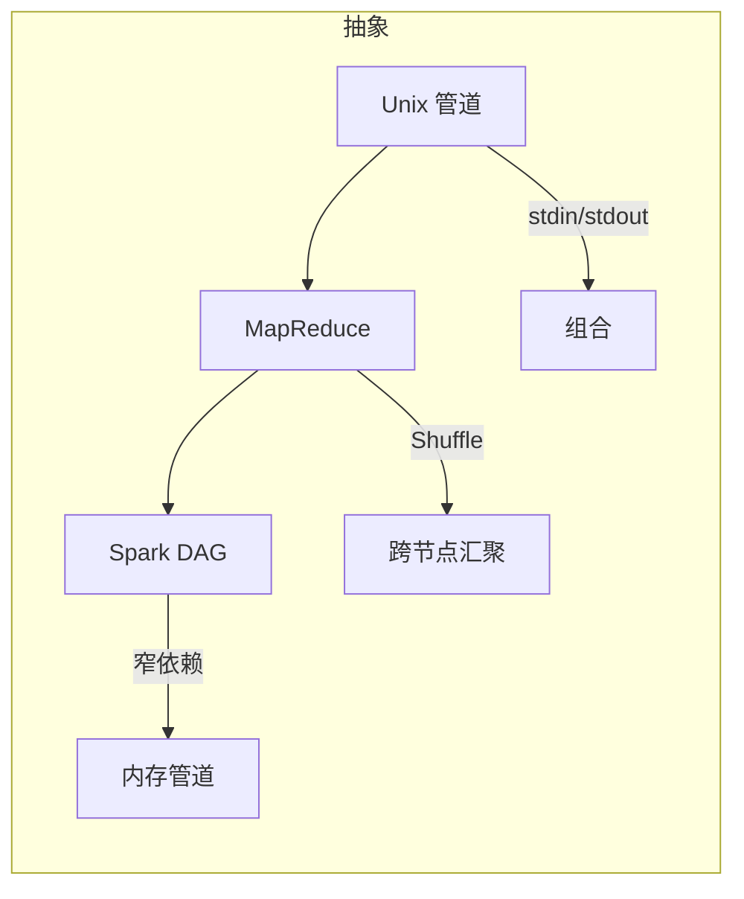
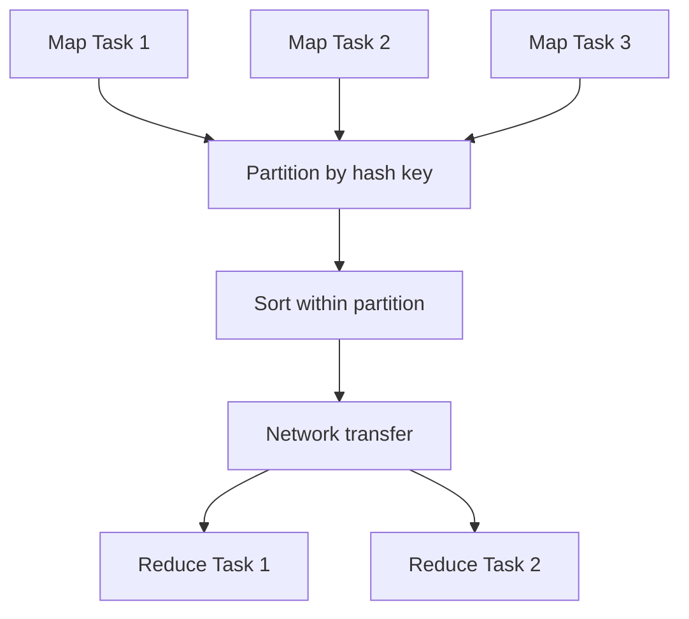
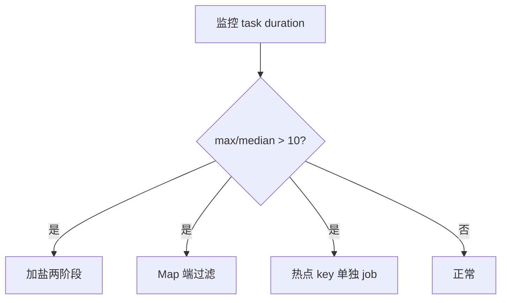
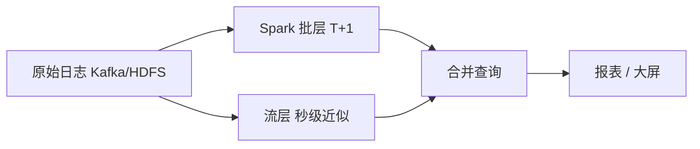
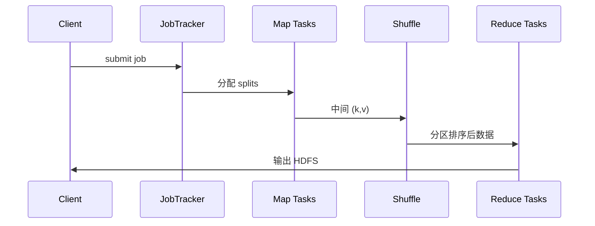

---
aliases:
  - DDIA第10章
tags:
  - DDIA
  - 章节精读
  - 批处理
---

# 第 10 章：批处理

> 本章目标：理解**大规模离线计算**的设计哲学——Unix 管道、MapReduce、HDFS、数据倾斜与 Spark DAG；能判断何时批处理优于流处理。

## 本章在全书中的位置

Part III 开端。前九章聚焦**在线系统**（请求-响应）；本章转向**有界数据集**的高吞吐离线计算。第 11 章流处理处理无界流；第 12 章将批、流统一为数据集成叙事。

## 初学者先抓住一句话

**批处理**处理有界数据集，追求**高吞吐**而非毫秒延迟；输出常是 **衍生数据**（报表、索引、特征）。

## 核心概念定义

详见 [[05-概念定义详解#批处理]]、[[05-概念定义详解#物化视图 Materialized View]]。

| 概念 | 一句话 |
|---|---|
| Batch processing | 对**有界**输入运行一次（或周期性）计算 |
| MapReduce | Map → Shuffle → Reduce 三阶段分布式计算模型 |
| Shuffle | 按 key 分区、排序、跨节点传输的中间阶段 |
| Data skew | 某些 key 数据量远超其他，导致热点 Reduce |
| Combiner | Map 端预聚合，减少 Shuffle 数据量 |
| Materialized view | 预计算并存储查询结果，源变时增量更新 |

---

## Unix 工具链的启示

### 设计哲学

```bash
# 统计访问日志 Top 10 IP
cat access.log \
  | awk '{print $1}' \
  | sort \
  | uniq -c \
  | sort -nr \
  | head -10
```

| 原则 | 含义 | MapReduce 对应 |
|---|---|---|
| **stdin/stdout 管道** | 程序组合，无需中间文件 | Shuffle 连接 Map 与 Reduce |
| **不可变输入** | 不修改源文件，输出新文件 | HDFS 块只追加 |
| **重新运行** | 同样输入 + 同样命令 = 同样输出 | 幂等 job 重跑 |
| **分而治之** | 每工具做一件事 | Map 与 Reduce 职责分离 |

### 与分布式批处理的映射

```text
Unix:  进程 A | 进程 B | 进程 C     （单机管道）
MR:    Map₁…Mapₙ → Shuffle → Reduce₁…Reduceₘ  （跨机）
Spark: 算子 DAG，尽量内存管道，少物化
```

**关键洞察**：批处理的力量来自**简单抽象 + 自动并行 + 容错重试**，不是来自单机性能。

---

## MapReduce 模型

详见 [[05-概念定义详解#MapReduce]]。

### 三阶段

```text
Input（大文件，HDFS 分片）
  ↓
Map：每分片并行，输出 (key, value) 中间对
  ↓
Shuffle：按 key 哈希分区 → 排序 → 传送到 Reduce 节点
  ↓
Reduce：同 key 聚合，写 Output
```

### 机制表

| 阶段 | 输入 | 输出 | 并行度 | 瓶颈 |
|---|---|---|---|---|
| **Map** | 输入分片（如 128MB） | `(k, v)*` | 分片数 | CPU、本地读 |
| **Shuffle** | 各 Map 中间结果 | 按 key 分区排序 | 分区数 | **网络 + 磁盘 IO** |
| **Reduce** | 单分区内同 key 数据 | 最终结果 | Reduce 任务数 | 热点 key |

### 示例：词频统计 Word Count

```text
Map:    "hello world" → [(hello,1), (world,1)]
Shuffle: hello → [1,1,1], world → [1,1]
Reduce: hello → 3, world → 2
```

### 容错

- Map/Reduce 任务失败 → **重新调度**到其他节点。
- 中间结果写本地磁盘（非 HDFS），Reduce 拉取。
- **确定性 Map/Reduce 函数**保证重试结果一致。

---

## HDFS 与存储层

### HDFS 要点

| 组件 | 职责 |
|---|---|
| NameNode | 元数据、目录树、块位置 |
| DataNode | 存储实际块（默认 128MB） |
| 复制因子 | 默认 3，机架感知 |

**与 MapReduce 协作**：

- 计算**靠近数据**（调度 Map 到存有块的节点）。
- 大文件**顺序读**吞吐高；**不适合**低延迟随机读写。

### 局限

| 优点 | 局限 |
|---|---|
| 容错、高吞吐顺序读 | 不适合 OLTP 随机写 |
| 与 MR 深度集成 | NameNode 元数据内存瓶颈（联邦缓解） |
| 廉价磁盘 | 小文件过多损害性能 |

---

## 数据倾斜（Data Skew）

### 定义

某些 **key** 的数据量远超其他 key，导致单个 Reduce 任务耗时远超同伴，**拖垮整个 job**。

### 典型场景

| 场景 | 热点 key | 后果 |
|---|---|---|
| 用户行为分析 | `user_id = 0`（未登录） | 单 Reduce OOM |
| 电商统计 | 爆款 SKU | Reduce 数小时 |
| 日志清洗 | `status = ERROR` 极少但集中 | 可选优化 |

### 解法

| 方法 | 机制 |
|---|---|
| **加盐 Salting** | `key' = hash(key + random_salt)` 打散，Reduce 后再二次聚合 |
| **Combiner** | Map 端预聚合（见下） |
| **自定义分区** | 热点 key 单独分区 + 多任务处理 |
| **过滤前置** | Map 端过滤无效 key |
| **两阶段聚合** | 局部聚合 → 全局聚合 |

### Combiner

- **定义**：在 Map 端对**同 key** 做**预聚合**的 Reduce 本地化版本。
- **要求**：聚合函数满足**结合律与交换律**（count、sum、max 可以；median 不行）。
- **效果**：减少 Shuffle 网络传输量。

```text
无 Combiner: Map 输出 1 亿条 (user_id, 1)
有 Combiner: Map 输出 100 万条 (user_id, partial_sum)  → Shuffle 轻 100 倍
```

---

## 物化视图（Materialized Views）

详见 [[05-概念定义详解#物化视图 Materialized View]]。

### 定义与动机

- **问题**：交互式分析反复扫描 PB 级原始日志，太慢。
- **解法**：批处理**预聚合**写入物化表/视图；查询打物化层。

| 类型 | 例子 | 更新方式 |
|---|---|---|
| 全量重算 | 每日 DWS 汇总表 | 分区 overwrite |
| 增量更新 | 滚动 7 日 UV | 只处理新分区 |
| Lambda 批层 | 修正速度层近似 | T+1 覆盖实时误差 |

### 与 OLTP 隔离

```text
❌ 在业务库跑 SELECT COUNT(*) 全表扫描
✅  ETL 到数仓 → 物化聚合 → BI 查汇总表
```

---

## MapReduce 之后：Dataflow 引擎

### Spark DAG

| 对比 MR | Spark |
|---|---|
| 每阶段写磁盘 | **内存**（或溢写磁盘）管道 |
| 仅 Map-Reduce | 任意 **DAG** 算子（map/filter/join/groupBy） |
| 迭代慢（每轮落盘） | 迭代内存缓存 `RDD`/`DataFrame` |
| 交互查询弱 | 支持 SQL、MLlib |

```text
Spark 逻辑计划：
  read → filter → map → groupBy → join → collect
         └──────── DAG 调度 ────────┘
  尽量 stage 内流水线，stage 间 Shuffle
```

### 其他引擎

| 引擎 | 特点 |
|---|---|
| **FlumeJava** | Google 内部 MR 优化，组合子 |
| **Tez** | Hortonworks，DAG on YARN |
| **Flink Batch** | 与流统一引擎，批是有界流 |
| **Presto/Trino** | 交互式 MPP 查询，非典型 MR |

---

## 批处理 vs 流处理：何时选谁

| 维度 | 批处理 | 流处理 |
|---|---|---|
| 数据 | **有界**（历史全量） | **无界**（持续到达） |
| 延迟 | 分钟~小时~天 | 毫秒~秒 |
| 正确性 | 重跑分区即可修正 | 需幂等、水印、状态 |
| 成本 | 吞吐高、单位成本低 | 常驻计算、状态存储贵 |
| 典型输出 | 报表、训练集、索引全量重建 | 实时大屏、风控、CDC 同步 |

### Lambda 与 Kappa（预告第 11、12 章）

| 架构 | 思路 |
|---|---|
| **Lambda** | 速度层（流）+ 批层（修正）双轨 |
| **Kappa** | 一切用流；历史用**重放日志**补算 |

**实践**：金融报表 T+1 用批；实时风控用流；**同一逻辑**可用 Flink 批流 API 统一。

---

## 架构设计检查清单

- [ ] 是否在 OLTP 库直接跑全表扫描报表？
- [ ] 批任务是否幂等、可重跑（分区 `INSERT OVERWRITE`）？
- [ ] 输出是否写回在线库拖垮业务？
- [ ] 数据血缘是否可追溯（哪批 job 产出哪张表）？
- [ ] 是否监控 Reduce 倾斜（最长 task vs 平均）？
- [ ] 物化视图更新策略是否文档化（全量 vs 增量）？

---

## 与 Java 后端

| 技术 | 用途 | 要点 |
|---|---|---|
| **Spark Java API** | ETL、特征工程 | 优先 DataFrame/Dataset API |
| **Spring Batch** | 企业内 chunk 批处理 | Reader-Processor-Writer |
| **数仓分层** | ODS → DWD → DWS → ADS | T+1 与业务库物理隔离 |
| **Sqoop / DataX** | DB → HDFS 导入 | 增量字段、分片并行 |
| **Hive / Iceberg** | 表格式 + SQL | 分区、ACID、时间旅行 |

---

## 常见误区

| 误区 | 正解 |
|---|---|
| 批 = 过时 | T+1 报表、ML 训练仍主力 |
| MR 已死无价值 | Shuffle 思想仍在；理解倾斜仍关键 |
| Spark 全内存不会 OOM | 宽依赖 Shuffle + collect 仍会爆 |
| Combiner 总是开启 | 仅结合律聚合可用 |
| 批输出直接写主库 | 应写衍生存储或通过 CDC 同步 |

---

## 本章练习

1. 用 **Word Count** 手画 Map、Shuffle、Reduce 数据流。
2. 假设 `user_id=0` 占 30% 流量，设计加盐两阶段聚合方案。
3. 列举你司 3 个批 job：输入、输出、是否幂等、失败重跑策略。
4. 对比 Spark `groupByKey` 与 `reduceByKey` 对 Shuffle 的影响。
5. 同一「日活统计」需求，何时用批、何时用流、何时 Lambda？

---

## 阅读检查

- [ ] 能解释 Unix 管道与 MR 的对应关系
- [ ] 能描述 Map、Shuffle、Reduce 各自职责
- [ ] 能说明 HDFS 为何适合批、不适合 OLTP
- [ ] 能定义数据倾斜并给出两种解法
- [ ] 能说明 Combiner 的前提条件
- [ ] 能解释物化视图在批处理中的角色
- [ ] 能对比批与流的选型维度

---

## 本章小结

- 批处理是**衍生数据**的主渠道之一；与在线系统应**物理隔离**。
- **MapReduce** 思想（分而治之 + Shuffle）仍有效；工程多用 **Spark DAG**。
- **数据倾斜**是生产最常见性能杀手；加盐 + Combiner + 两阶段聚合。
- **物化视图**用空间换时间，是数仓核心模式。
- 批与流非对立：有界用批、无界用流，**Lambda/Kappa** 统一叙事见第 11–12 章。

---

## 书中目录与小节映射

| 书中章节 | 英文标题 | 本笔记对应小节 | 精读重点 |
|---|---|---|---|
| 10.1 | Batch Processing with Unix Tools | Unix 工具链的启示 | 管道、不可变、重跑 |
| 10.2 | MapReduce and Distributed Filesystems | MapReduce 模型、HDFS | 三阶段、容错、计算靠近数据 |
| 10.3 | Beyond MapReduce | Dataflow 引擎 | Spark DAG、迭代、内存管道 |
| 10.4 | Graphs and Batch Processing | （概要） | 图批处理、Pregel 思想 |
| 10.5 | Materialization of Views | 物化视图 | 预聚合、衍生数据、Lambda 批层 |

**阅读顺序建议**：10.1 建立哲学 → 10.2 掌握 MR 机制 → 10.3 理解现代引擎 → 10.5 连接数仓与第 12 章集成叙事。

---

## 书中案例

### 案例 1：Word Count 词频统计（10.2）

**经典 MapReduce 示例**，贯穿全书理解 Shuffle。

```text
输入分片 1: "hello world hello"
输入分片 2: "hello batch"

Map 输出:
  分片1 → (hello,1), (world,1), (hello,1)
  分片2 → (hello,1), (batch,1)

Shuffle（按 key 哈希分区 + 排序）:
  hello → [1,1,1,1]
  world → [1]
  batch → [1]

Reduce:
  hello → 4
  world → 1
  batch → 1
```

| 阶段 | 本例要点 |
|---|---|
| Map | 本地并行，输出中间 (k,v) |
| Shuffle | **最贵**；同 key 汇聚到同一 Reduce |
| Reduce | 聚合；函数需确定性以支持重试 |

**Combiner 优化**：Map 端预聚合 `(hello,2)` 再 Shuffle，网络量减半。

### 案例 2：数据倾斜 Data Skew（10.2 / 生产实践）

**场景**：按 `user_id` 统计点击，未登录用户 `user_id=0` 占 30% 流量。

```text
Reducer #3 分到 user_id=0 的全部记录 → 10 亿条
其他 Reducer 各 100 万条 → job 99% 时间卡在 #3
```

| 现象 | 根因 | 解法 |
|---|---|---|
| 单 Reduce 极慢 | 哈希分区 + 热点 key | 加盐打散 |
| OOM | 单 key 数据超内存 | 两阶段聚合 + 自定义分区 |
| 进度 99% 停住 | straggler | 监控 max task duration |

**加盐两阶段方案**：

```text
Phase 1 Map: key' = (user_id, salt)  salt ∈ [0, 99]  → 100 个 Reduce 分担
Phase 1 Reduce: 局部 sum
Phase 2 Map: key = user_id only
Phase 2 Reduce: 全局 sum
```

### 案例 3：物化视图与日汇总（10.5）

**场景**：PB 级访问日志，BI 反复查「日 UV / PV」。

```text
❌ 每次 SELECT COUNT(DISTINCT user_id) FROM raw_log WHERE date='2026-07-01'
✅  夜间 Spark job: raw_log → INSERT OVERWRITE dws_daily_uv PARTITION(dt='2026-07-01')
    白天 BI 查 dws_daily_uv（毫秒级）
```

与第 12 章 **derived data** 一致：汇总表是真相日志的投影，可重建。

---

## 机制深度专题

### 专题 A：Unix 管道 → MapReduce → Spark DAG 演进



| 代际 | 中间物化 | 容错 | 迭代 |
|---|---|---|---|
| Unix | 可选文件 | 进程重跑 | 慢 |
| MR | 每阶段落盘 | 任务重试 | 极慢 |
| Spark | Stage 间 Shuffle | lineage 重算 | RDD cache |

### 专题 B：Shuffle 机制解剖



**瓶颈**：磁盘 spill + 网络带宽 + 单 Reduce 热点。优化方向：Combiner、合理分区数、广播小表 join。

### 专题 C：数据倾斜检测与治理



### 专题 D：批层在 Lambda 中的位置



批层负责**精确修正**速度层误差，见第 11–12 章。

---

## 算法与流程

### MapReduce 三阶段完整流程

```text
Job 提交:
  1. InputFormat 切分 → InputSplit 列表
  2. 调度 Map 到 DataNode 本地（机架感知）
  3. Map: map(k,v) → emit (k',v')* 写本地 spill 文件
  4. Combiner（可选）在 spill 合并前预聚合
  5. Partitioner: partition = hash(k') % numReducers
  6. Shuffle: Merge sort → 按 partition 传输到 Reduce 节点
  7. Reduce: reduce(k', [v']) → 写 OutputFormat
  8. 失败 Map/Reduce → 重调度到其他节点，确定性保证结果一致
```



### 加盐两阶段聚合算法

```text
输入: 记录 (user_id, click_count)

Stage 1:
  map: emit ((user_id, random_salt), click_count)  salt ∈ [0, N-1]
  reduce: local_sum per (user_id, salt)

Stage 2:
  map: emit (user_id, local_sum)
  reduce: global_sum per user_id

不变量: sum(Stage2) = sum(原始) 当 Stage1 覆盖所有 salt
```

### Spark Stage 划分规则

```text
窄依赖（map/filter/mapPartitions）→ 同一 Stage 流水线
宽依赖（groupByKey/reduceByKey/join）→ Stage 边界，触发 Shuffle

优化: reduceByKey 优于 groupByKey（Map 端 combine）
      broadcast join 小维表避免 Shuffle
```

---

## 产品对照

| 产品 | 本章角色 | 核心抽象 | 倾斜/容错 | Java API |
|---|---|---|---|---|
| **Hadoop MR** | MR 原教旨 | Map-Shuffle-Reduce | 慢但稳 | MapReduce API（旧） |
| **Spark** | DAG 批引擎 | RDD/DataFrame, Stage | AQE 倾斜 join | Spark Java/Scala |
| **Hive** | SQL on MR/Spark | 分区表、INSERT OVERWRITE | 分区裁剪 | JDBC/Beeline |
| **Iceberg / Delta** | 表格式 | ACID、时间旅行 | 增量批 | Spark/Flink connector |
| **Spring Batch** | 企业 chunk 批 | Reader-Processor-Writer | 断点续跑 | `@EnableBatchProcessing` |
| **Flink Batch** | 统一引擎批模式 | 有界流 | 与流同语义 | Flink DataSet/API |
| **Presto/Trino** | 交互分析 | MPP 查询 | 非典型 MR | JDBC |

### Spark 生产对照表

| 场景 | 推荐 API | 避免 |
|---|---|---|
| ETL | DataFrame + SQL | 低层 RDD 随意 keyBy |
| 大 join | broadcast / AQE skew join | 两张大表 cartesian |
| 写数仓 | `INSERT OVERWRITE` 分区 | 逐行 INSERT |
| 迭代 ML | cache 中间 RDD | 每轮全 Shuffle |

### 数仓分层（Java 后端常见）

```text
ODS（贴源）→ DWD（明细）→ DWS（汇总）→ ADS（应用）
         ↑ 批 job 每日/每小时          ↑ 物化视图
         与 OLTP 物理隔离
```

---

## 深度 FAQ

**Q1：MapReduce 已死，还要学吗？**

要。**Shuffle 按 key 汇聚**的思想存在于 Spark、Flink、Hive  everywhere。生产问题（倾斜、straggler）根因仍在 Shuffle。

**Q2：Combiner 和 Reduce 有什么区别？**

Combiner 是 Map 端**可选**预聚合，Reduce 是**必须**的最终聚合。Combiner 要求结合律+交换律；Reduce 输入已是同 key 全集。

**Q3：为什么 Spark 比 MR 快？**

内存管道减少中间落盘；DAG 多算子融合；迭代可 cache。但宽依赖 Shuffle 仍是瓶颈。

**Q4：数据倾斜和热点 key 是一回事吗？**

本质相同：某 key（或分区）数据量远超均匀假设。解法：打散、过滤、单独处理、自定义 Partitioner。

**Q5：批 job 为什么要幂等？**

失败重跑、数据修正、Lambda 批层覆盖速度层——都要求**同样输入 + 同样逻辑 = 同样输出**。`INSERT OVERWRITE` 分区是常见手段。

**Q6：HDFS 适合 OLTP 吗？**

不适合。大块顺序读、高延迟；NameNode 元数据内存限制。OLTP 用 PostgreSQL/MySQL；批读 HDFS/OSS。

**Q7：物化视图和缓存有什么区别？**

物化视图是**持久化**的预计算结果（表/分区）；缓存易失、容量有限。物化视图是数仓核心，缓存是在线读加速。

**Q8：Spring Batch 和 Spark 怎么选？**

Spring Batch：**百万级**行、Chunk 事务、与 Spring 集成、DB 导出导入。Spark：**TB+**、集群并行、复杂 transform/join。

**Q9：Flink Batch 和 Spark Batch？**

Flink 批是有界流，与流**语义统一**；Spark 批是独立优化路径。选型看团队栈与是否批流一体。

**Q10：批输出能写回在线主库吗？**

慎写。大批量 UPDATE 拖垮 OLTP。应写**衍生存储**或通过 CDC/消息异步同步；或专用只读副本。

---

## 设计模式与反模式

### 推荐模式

| 模式 | 场景 | 要点 |
|---|---|---|
| **分区幂等覆盖** | 日批 | `INSERT OVERWRITE` 按 dt 分区 |
| **ODS→DWD→DWS 分层** | 数仓 | 血缘清晰，下游只依赖上层 |
| **Combiner / combineByKey** | 可结合聚合 | 减轻 Shuffle |
| **加盐两阶段聚合** | 热点 key | 先打散再汇总 |
| **计算靠近数据** | HDFS | 调度 Map 到本地块 |
| **血缘 + 重跑文档** | 运维 | 输入输出表、SLA、负责人 |

### 反模式

| 反模式 | 后果 | 替代 |
|---|---|---|
| OLTP 库跑全表扫描报表 | 锁表、延迟飙升 | ETL 到数仓 |
| 单 Reduce（分区数=1） | 无并行 | 合理 `numPartitions` |
| groupByKey 大 Shuffle | OOM、慢 | reduceByKey / aggregateByKey |
| 无幂等裸 INSERT | 重跑重复数据 | OVERWRITE 或 merge |
| 忽视 straggler 监控 | job 假完成 | max/median task 告警 |
| 小文件海量进 HDFS | NameNode 压力 | 合并小文件 |

---

## 追加练习

6. **Word Count 扩展**：输入 3 个分片、2 个 Reducer，手画每条中间记录落在哪个 Reduce。
7. **倾斜量化**：1000 个 Reduce，999 个 1 分钟完成，1 个 3 小时——估算 job 总时长由谁决定？
8. **Combiner 合法性**：median、avg、count、sum 哪些能作 Combiner？说明理由。
9. **Spark Stage**：`read → filter → map → groupBy → join → count` 画 Stage 切分点。
10. **物化设计**：设计「近 7 日滚动 UV」增量更新策略（全量 vs 增量分区）。
11. **Spring Batch**：设计 JDBC Reader 分片并行读 1 亿行，如何保证不重复不遗漏？
12. **Lambda 批层**：速度层多算 0.1% UV，批层如何 T+1 修正？产品如何展示？

---

## 追加阅读检查

- [ ] 能完整复述 Word Count 的 Map-Shuffle-Reduce 数据流
- [ ] 能设计加盐两阶段解决 user_id=0 倾斜
- [ ] 能解释 Combiner 的前提条件与局限
- [ ] 能对比 groupByKey 与 reduceByKey 的 Shuffle 差异
- [ ] 能说明 HDFS 块大小与「计算靠近数据」
- [ ] 能画出 Spark 窄/宽依赖与 Stage 关系
- [ ] 能列举批 job 幂等三种实现
- [ ] 能说明物化视图在 Lambda 架构中的角色

## 相关笔记

- [[05-概念定义详解#批处理]]
- [[11-第11章-流处理]]
- [[12-第12章-数据系统的未来]]
- [[03-批处理流处理与数据集成]]
