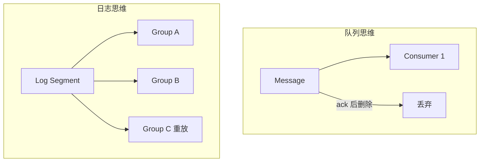
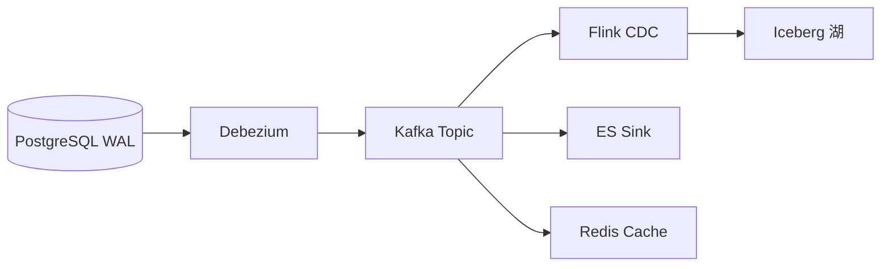
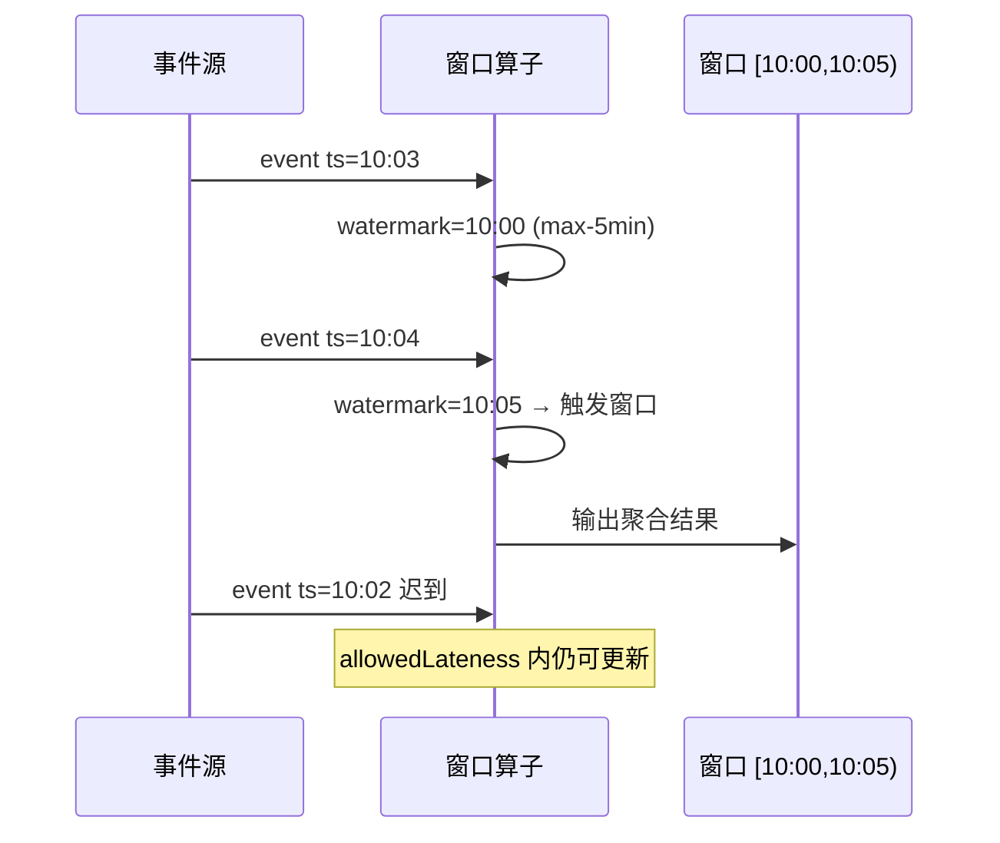
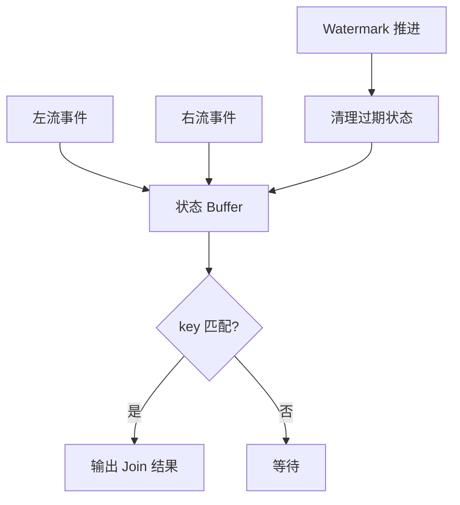
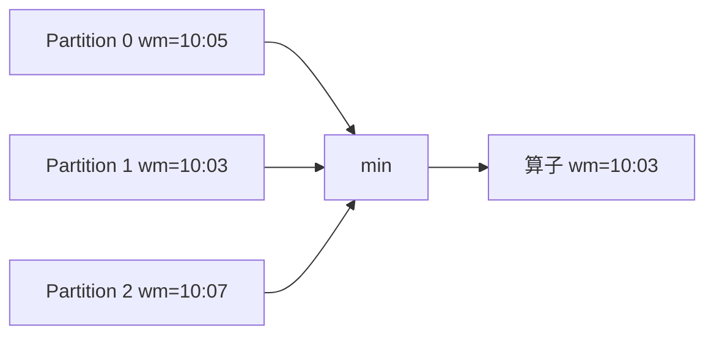

---
aliases:
  - DDIA第11章
tags:
  - DDIA
  - 章节精读
  - 流处理
---

# 第 11 章：流处理

> 本章目标：理解**事件流**作为一等公民——日志 vs 队列、Kafka 分区与消费者组、CDC、事件溯源、水印与窗口、交付语义与流式 Join。

## 本章在全书中的位置

Part III 核心。第 10 章批处理处理**有界**数据；本章处理**无界**事件流。第 12 章将日志、CDC、流统一为「分拆数据库 + 数据集成」架构。

## 初学者先抓住一句话

**日志（Log）** 是持久、追加、分区的事件序列；**流处理**是对无界日志的持续计算。

## 核心概念定义

详见 [[05-概念定义详解#流处理]]。

| 概念 | 一句话 |
|---|---|
| Event stream | 持久、追加、可分区的不可变事件序列 |
| Consumer group | 组内竞争消费分区，组间独立进度 |
| CDC | 捕获数据库事务日志中的变更 |
| Event sourcing | 状态由事件折叠得出，事件链为真相 |
| Watermark | 事件时间进度估计，用于触发窗口计算 |
| Processing time | 算子实际处理时刻；与事件时间可能脱节 |

---

## 传递事件流：日志 vs 队列

详见 [[05-概念定义详解#日志 vs 队列]]。

### 对比表

| 维度 | 传统消息队列（RabbitMQ） | 日志 Broker（Kafka） |
|---|---|---|
| 消息生命周期 | 消费后**删除**或 ack 丢弃 | **保留**（按时间/大小），可重放 |
| 消费者模型 | 竞争消费，单消费者处理 | **Consumer group**，组内分摊分区 |
| 顺序 | 队列 FIFO（单队列） | **分区内**有序 |
| 典型用途 | **任务分发**、RPC 解耦 | **数据集成**、事件溯源、CDC 管道 |
| 回溯 | 难 | **重置 offset** 即可重放 |

### 设计含义

```text
队列思维：消息是「待办任务」，处理完就扔
日志思维：事件是「事实记录」，可衍生多个独立消费者
```

**衍生多视图**：同一份 `order-events` 主题，可被搜索索引、数仓、风控、通知四个 consumer group 各自消费，互不影响。

---

## Kafka 分区与消费者组

### 分区（Partition）

| 属性 | 说明 |
|---|---|
| 分区内顺序 | 保证；跨分区**无**全局序 |
| 并行度 | 分区数 ≈ 消费并行上限 |
| Key 路由 | 相同 key → 同分区，保证 per-key 顺序 |
| 热点 | 分区数过少或 key 倾斜 → 瓶颈 |

```text
Topic: orders (6 partitions)
  partition 0: [e1, e4, e7, …]
  partition 1: [e2, e5, …]
  …
```

### Consumer Group

| 规则 | 说明 |
|---|---|
| 组内 | 每个分区**同一时刻只分配给一个** consumer |
| 组间 | 各组**独立 offset**，互不影响 |
| Rebalance | 成员增减时重新分配分区（短暂停顿） |
| 伸缩 | consumer 数 ≤ 分区数才有意义；多则空闲 |

### 示例：订单流多下游

```text
Topic: order-events
  ├─ Group: search-indexer   → 更新 Elasticsearch
  ├─ Group: warehouse-sync → 更新分析库
  └─ Group: notification     → 发短信
```

**误用**：为全局顺序把全部消息塞**单分区** → 吞吐瓶颈。

---

## 数据库与流

### 变更数据捕获 CDC

详见 [[05-概念定义详解#CDC]]。

**定义**：读取数据库**事务日志**（MySQL binlog、PostgreSQL WAL），转为事件流发布到 Kafka。

| 对比双写 | CDC |
|---|---|
| 应用写 DB + 写 ES | 应用**只写 DB** |
| 不一致窗口、难回滚 | 日志为单一真相延伸 |
| 业务代码耦合 | 基础设施层集成 |

```text
MySQL → Canal/Debezium → Kafka → Flink/Consumer → ES/Redis/数仓
```

**要点**：CDC 事件应包含**足够元数据**（schema、主键、事务 id、op 类型）。

### 事件溯源 Event Sourcing

详见 [[05-概念定义详解#事件溯源 Event Sourcing]]。

**定义**：应用状态 = `fold(事件序列)`；**当前行不是真相**，事件链才是。

| 优点 | 缺点 |
|---|---|
| 完整审计、时间旅行 | 查询需物化视图或快照 |
| 多视图重放 | Schema 演化复杂 |
| 与 CQRS 天然配合 | 事件存储容量增长 |

```text
传统：UPDATE accounts SET balance=150 WHERE id=1
溯源：Event{Deposit, account=1, amount=50, ts=…}
      当前余额 = sum(deposits) - sum(withdrawals)
```

### 流表对偶（Stream-Table Duality）

- **表**：当前状态的快照
- **流**：表上发生的变更
- CDC 把**表**变成**流**；物化把**流**折叠成**表**

---

## 时间与窗口

### 事件时间 vs 处理时间

| 类型 | 定义 | 风险 |
|---|---|---|
| **Event time** | 事件实际发生时刻（业务时间戳） | 需处理乱序 |
| **Processing time** | 算子处理该事件的系统时刻 | 简单但不精确 |
| **Ingestion time** | 进入系统时刻 | 折中 |

```text
事件时间 10:00 的记录，因网络延迟 10:05 才到达
  → 用处理时间会算进 10:05 的窗口（错误）
  → 用事件时间 + watermark 算进 10:00 窗口（正确）
```

### Watermark（水印）

**定义**：`watermark(t)` 表示「事件时间 ≤ t 的事件**大致**已到齐」的估计。

| 策略 | 说明 |
|---|---|
| 固定延迟 | `watermark = max_event_time - allowed_lateness` |
| 空闲检测 | 分区无新事件时推进 watermark |
| 副作用 | 过早推进 → 丢迟到数据；过晚 → 延迟高 |

### 窗口类型

| 窗口 | 机制 | 适用 |
|---|---|---|
| **滚动 Tumbling** | 固定长度、不重叠，如每 5 分钟 | 固定周期统计 |
| **滑动 Sliding** | 固定长度、按步长滑动 | 移动平均 |
| **会话 Session** | 间隙超时合并，如 30min 无活动则关闭 | 用户会话分析 |
| **全局 Global** | 单窗口全数据（需自定义触发） | 有限状态监控 |

```text
滚动 [0,5) [5,10) [10,15)
滑动 窗口 10min，步长 1min → 大量重叠窗口
会话  事件间隙 > 30min → 新会话
```

---

## 交付语义（Delivery Semantics）

详见 [[05-概念定义详解#交付语义]]。

| 语义 | 含义 | 实现要点 |
|---|---|---|
| **At-most-once** | 可能丢，不重复 | 先提交 offset 再处理 |
| **At-least-once** | 不丢，可能重复 | 先处理再提交 offset + **幂等** |
| **Exactly-once** | 端到端恰好一次 | 事务性 offset + 幂等写入 + 去重 |

### 端到端 Exactly-once 难点

```text
消费 Kafka → 处理 → 写 DB + 提交 offset
  崩溃点任意 → 需 Kafka 事务 + DB 事务同一原子边界
  或 幂等写 + 外部去重表
```

**工程现实**：**at-least-once + 幂等** 最常见；宣称 exactly-once 需厘清边界（仅算子内 vs 端到端）。

### 引擎对比

| 引擎 | 强项 |
|---|---|
| **Flink** | 事件时间、状态、exactly-once 语义成熟 |
| **Kafka Streams** | 轻量、与 Kafka 深度集成 |
| **Spark Structured Streaming** | 微批、与 Spark 生态统一 |

---

## 流式 Join

### Join 类型

| 类型 | 说明 | 挑战 |
|---|---|---|
| **流-流** | 两路事件在窗口内匹配 | 需缓存两侧状态、watermark 对齐 |
| **流-表** | 流与维表（或 CDC 表）关联 | 维表更新如何反映 |
| **表-表** | 批思维，较少纯流 | — |

### 流-流 Join 机制

```text
左流: click_events
右流: payment_events
Join key: order_id
窗口: 1 小时内

状态: 缓存左右两侧 1 小时内未匹配事件
Watermark 推进 → 过期状态清理
```

| 问题 | 解法 |
|---|---|
| 迟到事件 | 允许 lateness 或侧输出 |
| 状态膨胀 | TTL、RocksDB 增量快照 |
| 无界状态 | 窗口必须有界 |

### 流-表 Join（维表关联）

```text
orders 流 JOIN products 维表（CDC 维护）
  维表更新 → 后续订单用新价格（或版本化）
```

---

## 架构设计检查清单

- [ ] 是否应用双写 DB + ES 无补偿？
- [ ] 消费者是否幂等（业务键 dedup）？
- [ ] 消息是否可重放做灾备或新视图？
- [ ] 全局顺序是否误用单分区 Kafka 成为瓶颈？
- [ ] 窗口用事件时间还是处理时间？是否配置 watermark？
- [ ] Consumer rebalance 是否导致重复消费？有死信队列吗？

---

## 与 Java 后端

| 技术 | 场景 | 要点 |
|---|---|---|
| **Kafka** | 事件总线 | 分区规划、ISR、事务生产者 |
| **RocketMQ** | 顺序消息、事务消息 | 与 Kafka 模型差异 |
| **Canal / Debezium** | MySQL binlog → MQ | schema 变更、初始快照 |
| **Transactional Outbox** | 同库写业务 + outbox | Poller 发 MQ，避免双写 |
| **Flink CDC** | 实时入湖入仓 | changelog 流 |
| **Spring Cloud Stream** | 绑定 MQ 抽象 | binder 配置交付语义 |

---

## 常见误区

| 误区 | 正解 |
|---|---|
| 流 = 小批量 | 无界、乱序、状态语义完全不同 |
| Kafka 消息必达 | 取决于 acks、ISR、生产者重试 |
| Exactly-once 免费 | 端到端很贵；常 at-least-once + 幂等 |
| 处理时间够用 | 乱序场景结果错误 |
| 单分区保全局序 | 牺牲扩展性；应用层用 key 局部序 |
| CDC 取代应用校验 | CDC 是集成手段，不变量仍在服务内 |

---

## 本章练习

1. 画 Kafka 3 分区 + 2 consumer 同组的分配图；若增至 4 consumer 呢？
2. 对比双写与 CDC：写出不一致窗口与恢复步骤。
3. 用**会话窗口**描述电商用户「浏览→下单」分析需求。
4. 设计 at-least-once 消费者的幂等表结构（业务键 + 处理状态）。
5. 流-流 Join 1 小时窗口：左右 watermark 不同步会怎样？

---

## 阅读检查

- [ ] 能对比日志与队列的消费模型
- [ ] 能解释分区与消费者组规则
- [ ] 能说明 CDC 如何解决双写
- [ ] 能区分事件时间与处理时间
- [ ] 能描述 watermark 的作用与风险
- [ ] 能列举三种窗口类型及适用场景
- [ ] 能对比三种交付语义及工程实现
- [ ] 能说明流-流 Join 为何需要状态与窗口

---

## 本章小结

- 流不是「小批处理」，而是**无界、乱序、有状态**的不同系统语义。
- **日志**思维支持重放与多视图；**CDC** 是微服务数据同步的成熟模式。
- **事件时间 + watermark + 窗口** 是正确实时聚合的基础。
- **Exactly-once** 是目标，工程上常 **at-least-once + 幂等**。
- 流式 **Join** 需显式管理状态与水印，不能照搬 SQL Join 直觉。

---

## 书中目录与小节映射

| 书中章节 | 英文标题 | 本笔记对应小节 | 精读重点 |
|---|---|---|---|
| 11.1 | Transmitting Event Streams | 日志 vs 队列 | 持久日志、重放、多消费者 |
| 11.2 | Databases and Streams | CDC、事件溯源 | binlog、流表对偶 |
| 11.3 | Processing Streams | 时间与窗口、交付语义 | watermark、窗口、EOS |
| 11.4 | Reasoning About Time | 时间与窗口 | 事件时间 vs 处理时间 |
| 11.5 | Stream Joins | 流式 Join | 流-流、流-表、状态 |
| 11.6 | Fault Tolerance | 交付语义 | checkpoint、幂等、事务 |

**阅读顺序建议**：11.1–11.2 建立「日志 + CDC」→ 11.3–11.4 掌握时间与 watermark → 11.5–11.6 Join 与容错。

---

## 书中案例

### 案例 1：Kafka 日志与多 Consumer Group（11.1）

**场景**：订单事件流 `order-events`，搜索、数仓、通知三个下游。

```text
Topic: order-events (6 partitions, retention 7d)

Consumer Group A (search):  6 consumers → 每分区 1 consumer → 写 ES
Consumer Group B (warehouse): 3 consumers → 各管 2 分区 → Flink 入湖
Consumer Group C (notify):    1 consumer → 6 分区轮询 → 发短信

各 Group offset 独立；同一条消息被三个 Group 各消费一次
```

| 设计点 | 说明 |
|---|---|
| 日志保留 | 新 Group 可从 earliest 重放建索引 |
| 分区内序 | 同 `order_id` 路由同分区保序 |
| 误用 | 单分区求全局序 → 吞吐瓶颈 |

### 案例 2：CDC 替代双写（11.2）

**场景**：订单写 PostgreSQL，需同步 Elasticsearch。

```text
❌ 双写:
   Service → PostgreSQL OK
   Service → ES FAIL  → 不一致，难补偿

✅ CDC:
   Service → PostgreSQL only
   Debezium 读 WAL → Kafka order-changelog
   ES Consumer Group → 幂等 upsert by order_id
```

| CDC 事件字段 | 用途 |
|---|---|
| `op` (c/u/d) | insert/update/delete |
| `before` / `after` | 变更前后镜像 |
| `source.ts_ms` | 源端事务时间 |
| schema / primary key | 幂等键与演化 |

**初始快照**：Debezium snapshot 全表 → 再追增量 WAL，新下游可同样流程接入。

### 案例 3：流-流 Join 点击与支付（11.5）

**场景**：1 小时内同 `order_id` 的 click 与 payment 关联分析转化。

```text
左流: click_events  (order_id, ts)
右流: payment_events (order_id, amount, ts)
Join: order_id 相等 AND |click.ts - payment.ts| < 1h

状态: 缓存两侧 1h 窗口内未匹配事件
Watermark: max(left_wm, right_wm) 推进 → 过期状态删除
迟到: allowedLateness 或侧输出到 late_topic
```

**Watermark 不同步**：一侧 wm 超前 → 另一侧事件被误判「过期」丢弃 → 需对齐策略或 `interval join`。

---

## 机制深度专题

### 专题 A：日志 vs 队列思维



### 专题 B：CDC 管道架构



### 专题 C：Watermark 与窗口触发



### 专题 D：流-流 Join 状态生命周期



---

## 算法与流程

### Watermark 生成与传播

```text
单源:
  watermark = max(event_time_seen) - max_out_of_orderness

多源 / 多分区:
  算子 watermark = min(上游各分区 watermark)  // 保守，避免丢事件

窗口触发:
  when watermark >= window_end → 触发计算并输出

allowedLateness:
  watermark 已过后仍接受迟到事件 → 更新已发出结果（需 retractions 或 upsert sink）
```



### At-least-once 消费流程

```text
loop:
  1. poll 一批 records
  2. 处理业务逻辑（写 DB / 发下游）
  3. commit offset（手动或 auto）

崩溃 between 2-3 → 重消费 → 需幂等（业务键 dedup 表 / UPSERT）
```

### Exactly-once（Flink 算子内概览）

```text
1. Checkpoint barrier 对齐（或 unaligned）
2. 状态 + offset 快照到 durable storage
3. 失败恢复：从 checkpoint 重启，状态与 offset 一致
4. 端到端 EOS：还需 Sink 事务（两阶段 commit）或幂等写
```

### 流-流 Interval Join 伪算法

```text
state: Map<joinKey, List<LeftEvent>>, Map<joinKey, List<RightEvent>>

onLeft(e):
  buffer left[e.key]
  for r in right[e.key] where |e.ts - r.ts| < interval:
    emit join(e, r)
  on watermark advance: evict left/right where ts < wm - interval
```

---

## 产品对照

| 产品 | 本章角色 | 核心能力 | 交付语义 | Java 集成 |
|---|---|---|---|---|
| **Kafka** | 日志 Broker | 分区、ISR、Consumer Group | at-least-once（配置 acks） | kafka-clients |
| **Debezium** | CDC | PG/MySQL binlog → Kafka | 至少一次 + 幂等 sink | Quarkus/Spring |
| **Flink** | 流引擎 | 事件时间、状态、CEP | checkpoint EOS | Flink Java API |
| **Kafka Streams** | 轻量流 | 与 Kafka 深度集成 | processing guarantee 配置 | kafka-streams |
| **Canal** | MySQL CDC | binlog 解析 | 至少一次 | Client adapter |
| **RocketMQ** | 国产 MQ | 顺序消息、事务消息 | 与 Kafka 模型差异 | spring-rockermq |
| **Flink CDC** | 入湖入仓 | changelog 流 | checkpoint | SQL connector |

### Kafka 生产参数对照

| 参数 | 影响 | 推荐意识 |
|---|---|---|
| `acks=all` |  durability | 配合 min.insync.replicas |
| `enable.idempotence` | 生产者去重 | 配合事务 |
| `isolation.level=read_committed` | 读事务消息 | EOS 链路 |
| 分区数 | 并行上限 | 按 key 倾斜评估 |

### Debezium vs Canal

| 维度 | Debezium | Canal |
|---|---|---|
| 源库 | PG/MySQL/Mongo/SQL Server… | 主 MySQL |
| 输出 | Kafka Connect | Kafka/自定义 |
| 快照 | 内置 | 支持 |
| 生态 | Red Hat / 云原生 | 阿里系常见 |

---

## 深度 FAQ

**Q1：Kafka 是消息队列还是日志？**

DDIA 视角是**日志**：持久、可重放、多独立消费者组。RabbitMQ 更像任务队列（消费后删除）。

**Q2：Consumer rebalance 有什么问题？**

组内成员变化 → 分区重分配 → **stop-the-world** 暂停消费 → 重复消费风险。Kafka 增量 cooperative rebalance、Flink 算子状态迁移需关注。

**Q3：CDC 会丢变更吗？**

WAL 位点持久化、Debezium offset 存 Kafka/DB。下游 lag 过大 + WAL 回收可能丢——需监控 lag 与 retention。

**Q4：事件时间和处理时间何时选哪个？**

**业务统计**（日活、计费）→ 事件时间 + watermark。**运维监控**（吞吐、延迟）→ 处理时间可接受。

**Q5：Watermark 设太大/太小？**

太大 → 窗口触发晚、延迟高。太小 → 迟到数据被丢。用 **allowedLateness** + 侧输出平衡。

**Q6：Exactly-once 端到端真的存在吗？**

Flink + Kafka 事务 + JDBC 两阶段可接近；**外部系统**（HTTP、ES）常降级为 at-least-once + 幂等。评审时问清边界。

**Q7：流-表 Join 维表更新怎么处理？**

**版本化维表**（CDC changelog）或 **TTL 缓存**；订单关联「下单时刻商品价格」需 temporal join（Flink interval join / AS OF）。

**Q8：Transactional Outbox 和 CDC 关系？**

Outbox：**应用写**同库 outbox 表；CDC 读 outbox 或业务表 WAL → Kafka。都是**单写真相源**模式。

**Q9：Event Sourcing 和 CDC 区别？**

ES：**应用主动** append 领域事件为真相。CDC：**基础设施**捕获 DB 行变更。可结合：ES 写 PG + CDC 同步读模型。

**Q10：单分区保序够用吗？**

同 **business key** 同分区即可；全局序几乎总不必要且有害。用 key 路由 + 业务接受局部序。

---

## 设计模式与反模式

### 推荐模式

| 模式 | 场景 | 要点 |
|---|---|---|
| **Transactional Outbox** | 微服务发事件 | 同库事务写业务 + outbox |
| **CDC 单写** | DB → 搜索/缓存 | 应用只写 DB |
| **幂等 Consumer** | at-least-once | 业务键 dedup / UPSERT |
| **Key 分区有序** | 订单生命周期 | order_id → 同分区 |
| **Schema Registry** | Avro/Protobuf | 前后向兼容 |
| **Dead Letter Queue** |  poison message | 失败 N 次进 DLQ 人工 |
| **allowedLateness** | 乱序 | 窗口后仍收迟到 |

### 反模式

| 反模式 | 后果 | 替代 |
|---|---|---|
| 应用双写 DB+ES | 不一致 | CDC / Outbox |
| 单分区 Kafka | 吞吐上限 | 按 key 分区 |
| 处理时间做计费 | 结果错误 | 事件时间 |
| 无界流-流 Join | 状态 OOM | 有限窗口 + watermark |
| auto commit 先 offset | 丢消息 | 处理后手动 commit |
| 忽视 rebalance | 重复/漏消费 | 幂等 + 监控 |

---

## 追加练习

6. **Consumer Group**：6 分区、2 consumer → 画分配；增至 7 consumer 呢？（空闲 consumer）
7. **CDC 演练**：写出 Debezium 一条 update 事件的 JSON 字段含义。
8. **Watermark 计算**：max_out_of_orderness=5min，已见事件最大 ts=10:20，当前 watermark？
9. **迟到事件**：窗口 [10:00,10:05)，wm=10:05 已触发，10:04 事件到达——Flink allowedLateness=2min 时如何处理？
10. **幂等表 DDL**：设计 `processed_events(event_id PK, processed_at)` 配合 INSERT IGNORE。
11. **流-流 Join**：左 wm=10:00，右 wm=10:10，interval=1h——何时可 evict 左流 09:00 的事件？
12. **EOS 边界**：画出 Kafka→Flink→MySQL 端到端 EOS 需要哪几步事务配合。

---

## 追加阅读检查

- [ ] 能对比 Kafka 日志与 RabbitMQ 队列的消费模型
- [ ] 能说明 CDC 如何解决双写不一致
- [ ] 能解释 Consumer Group rebalance 与幂等需求
- [ ] 能计算简单 watermark 与窗口触发条件
- [ ] 能区分 tumbling / sliding / session 窗口
- [ ] 能描述流-流 Join 的状态与 evict 条件
- [ ] 能对比 at-most / at-least / exactly-once 实现代价
- [ ] 能列举 Debezium 事件关键字段及用途

## 相关笔记

- [[05-概念定义详解#流处理]]
- [[10-第10章-批处理]]
- [[12-第12章-数据系统的未来]]
- [[03-批处理流处理与数据集成]]
- [[04-常见场景技术选型速查]]
