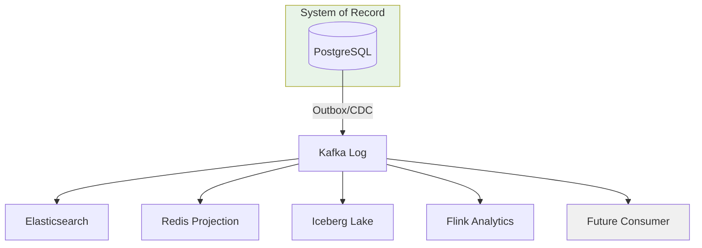
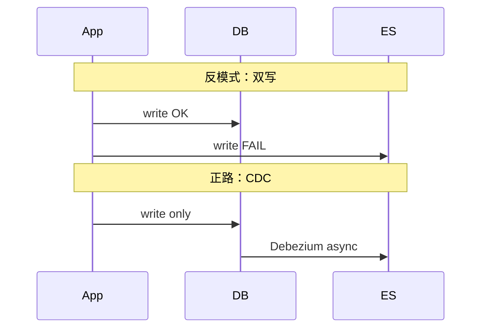
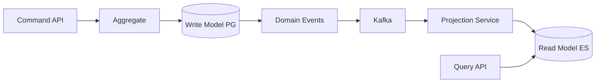
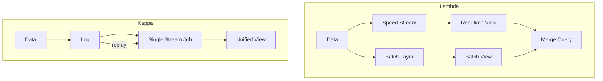
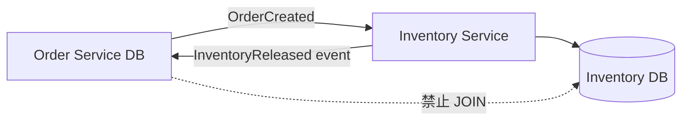
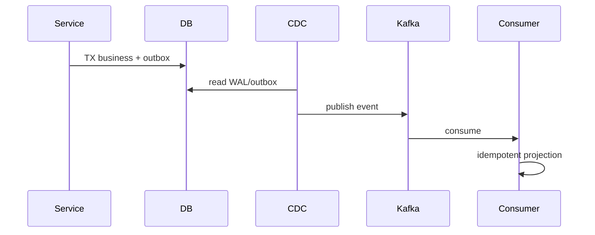

---
aliases:
  - DDIA第12章
tags:
  - DDIA
  - 章节精读
  - 数据集成
---

# 第 12 章：数据系统的未来

> 本章目标：把全书收束为 **「分拆数据库 + 数据集成 + 正确性」** 的架构观；理解 System of Record、衍生数据、Lambda/Kappa、CQRS、微服务数据所有权，并与 DDD 对齐。

## 本章在全书中的位置

全书终章。第 1–9 章构建在线数据系统基础；第 10–11 章批流计算；本章回答：**多个专用系统如何组成一个逻辑整体**，以及架构师的**技术伦理**责任。

## 初学者先抓住一句话

**没有一个系统适合所有工作负载**；用 **组合专用存储 + 统一数据流** 替代单一万能数据库。

## 核心概念定义

详见 [[05-概念定义详解#数据集成]]、[[05-概念定义详解#Unbundling the Database]]。

| 概念 | 一句话 |
|---|---|
| System of Record | 某数据的权威真相源，其他皆为副本 |
| Derived data | 由真相源通过转换/聚合得到的数据 |
| Unbundling | 拆开 RDBMS 能力，各用专用引擎 |
| CQRS | 写模型与读模型分离，可不同存储与形状 |
| Lambda architecture | 速度层（流）+ 批层（修正）双轨 |
| Kappa architecture | 一切以流为主，历史靠重放 |

---

## 数据集成问题

### 核心矛盾

同一份业务数据往往要出现在：

```text
PostgreSQL（事务）
  → Redis（缓存）
  → Elasticsearch（搜索）
  → Kafka（事件）
  → 数仓（分析）
  → 特征库（ML）
```

**问题**：如何**一致地**、**可验证地**保持同步？

### 反模式 vs 正路

| 反模式 | 后果 | 正路 |
|---|---|---|
| 应用**双写** DB + ES | 部分成功、难对账 | **单写** + CDC/Outbox |
| 点对点 ETL 蜘蛛网 | N×N 集成、难运维 | **日志** 为中心总线 |
| 隐式 Schema | 上下游版本撕裂 | Schema Registry + 契约测试 |
| 共享数据库微服务 | 耦合、无法独立演化 | **每服务自有数据** |

### System of Record 与 Derived Data

详见 [[05-概念定义详解#System of Record]]。

| 术语 | 定义 | 例子 |
|---|---|---|
| **System of Record** | 该数据的**唯一权威来源** | 订单服务的 `orders` 表 |
| **Derived data** | 从真相源**派生**的副本或视图 | ES 中的订单搜索文档、Redis 缓存 |
| **物化视图** | 预计算的衍生查询结果 | 日销售汇总表 |

```text
真相源写一次 → 日志/CDC 传播 → 各衍生系统异步更新
查询打衍生层；写只打真相源
```

**关键认知**：ES/Redis 里的不是「另一份真相」，而是**可重建的投影**；丢了可从日志重放。

---

## 分拆数据库 Unbundling the Database

详见 [[05-概念定义详解#Unbundling the Database]]。

### 传统 RDBMS 打包的能力

| 能力 | 传统单体 DB | 分拆后 |
|---|---|---|
| 事务存储 | InnoDB/PostgreSQL | **保留在 OLTP** |
| 二级索引 | B+Tree | ES、OpenSearch |
| 缓存 | Buffer pool | Redis、Memcached |
| 复制 | 主从 | Kafka、CDC |
| 全文搜索 | 有限 | Elasticsearch |
| 分析 | 勉强 | Snowflake、Iceberg、ClickHouse |
| 流处理 | 无 | Flink、Kafka Streams |

### 参考架构

```text
┌─────────────────────────────────────────────────┐
│  Order Service（System of Record: PostgreSQL）   │
└────────────────────┬────────────────────────────┘
                     │ Outbox / CDC
                     ▼
              ┌──────────────┐
              │    Kafka     │  ← 集成总线
              └──────┬───────┘
       ┌─────────────┼─────────────┬──────────────┐
       ▼             ▼             ▼              ▼
  Search Sync    Cache Warmer   Warehouse ETL   Fraud Stream
  (ES)           (Redis)        (Iceberg)       (Flink)
```

### 代价（诚实面对）

| 收益 | 代价 |
|---|---|
| 各组件最优 | 运维复杂度上升 |
| 独立扩展 | 一致语义变**最终** |
| 技术选型自由 | 调试链路变长 |
| 故障隔离 | 需要可观测性、血缘、重放能力 |

---

## Lambda 与 Kappa 架构

### Lambda

```text
                    ┌─ 速度层（Storm/Flink）─→ 实时视图（近似）
原始数据 ── Kafka ─┤
                    └─ 批层（Spark）───────→ 批视图（精确）
                              ↓
                         合并查询层
```

| 层 | 职责 | 延迟 |
|---|---|---|
| 速度层 | 低延迟近似 | 秒级 |
| 批层 | 全量修正、覆盖误差 | T+1 或小时 |
| 服务层 | 合并两层结果 | — |

**适用**：需要**低延迟展示**又要求**最终精确**（如广告报表）。

### Kappa

```text
一切数据 → Kafka 日志 → 流处理（Flink）
历史重算：新部署 consumer group，从 offset=earliest 重放
```

| 对比 Lambda | Kappa |
|---|---|
| 两套代码（批+流） | **一套**流逻辑 |
| 批修正简单 | 重放成本高、状态复杂 |
| 成熟 | 需强大日志保留与流引擎 |

**趋势**：Flink 批流一体、Iceberg 增量使 **Kappa + 湖仓** 更可行；Lambda 仍常见于遗留数仓。

---

## 将事情做正确（Correctness）

### 端到端论证

不能只说「最终一致」——需能回答：

- 用户下单后，搜索、缓存、报表**最晚多久**一致？
- 失败后**如何检测**不一致？**如何修复**（重放 offset、对账 job）？
- 新消费者上线，能否从日志**完整重建**视图？

### 可验证数据流原则

| 原则 | 实践 |
|---|---|
| 单写真相源 | Outbox / CDC |
| 不可变日志 | Kafka 保留、压缩 |
| Schema 版本化 | Avro + Schema Registry |
| 确定性转换 | 同样事件 → 同样衍生结果 |
| 可重放 | 新索引全量从日志构建 |

### 测试策略

- **确定性仿真**：事件序列 replay 到测试环境。
- **属性测试**：聚合函数结合律、幂等性。
- **对账 job**：真相源 COUNT vs 衍生层 COUNT。
- **混沌**：停 consumer、删 ES 索引、验证重放恢复。

---

## CQRS 与微服务数据所有权

### CQRS（Command Query Responsibility Segregation）

**定义**：**写模型**（命令、业务不变量）与**读模型**（查询、展示）分离，可使用不同存储与结构。

```text
写：OrderAggregate → PostgreSQL（规范化）
读：OrderListView  → Elasticsearch（反规范化、可搜索）
同步：领域事件 → Kafka → 投影服务更新读模型
```

| 收益 | 成本 |
|---|---|
| 读写独立扩展 | 最终一致窗口 |
| 读模型贴合 UI | 投影逻辑、版本管理 |
| 与 Event Sourcing 配合 | 调试复杂度 |

### 微服务数据所有权

| 规则 | 说明 |
|---|---|
| **每服务私有数据库** | 禁止跨服务 SQL JOIN |
| **API 或事件集成** | 需要他服数据 → 调用 API 或订阅事件 |
| **读模型复制** | 可本地物化他服数据的**副本**（衍生） |
| **真相归属清晰** | 每个实体只有一个 SoR |

```text
❌ OrderService JOIN InventoryService 的共享表
✅ OrderService 订阅 InventoryReleased 事件，本地维护可用库存投影
```

---

## 与领域驱动设计 DDD

### 限界上下文与数据

| DDD 概念 | DDIA 对应 |
|---|---|
| **限界上下文** | 服务边界 + 独立 Schema / SoR |
| **聚合** | 事务边界；一次命令修改一个聚合 |
| **领域事件** | Kafka 上的集成事件；CDC 的另一种形态 |
| **防腐层 ACL** | 翻译外部模型，不泄漏内部结构 |
| **上下文映射** | 事件、API、共享内核（慎用） |

详见 [[实现领域驱动设计]] 第 13 章（上下文集成）。

```text
采购上下文 ──PurchaseOrderCreated──▶ 库存上下文
                （领域事件，非共享表）
```

### 与供应链案例对齐

[[00-新采购服务替换方案总览]] 中的双轨迁移、Outbox、CDC 与本章叙事一致：

- 新服务拥有采购 SoR
- 旧系统通过事件/CDC 同步
- 读模型供报表与搜索

---

## 做正确的事情（Ethics）

架构师责任不止 **uptime**：

| 议题 | 架构决策影响 |
|---|---|
| **数据保留** | 日志无限保留 vs GDPR 删除权 |
| **隐私** | PII 是否进入 Kafka？脱敏在哪层？ |
| **算法偏见** | 特征管线是否放大历史歧视 |
| **监控滥用** | 员工/用户行为追踪边界 |
| **环境成本** | 批重算 vs 增量；存储冗余 |

**原则**：默认最小收集、可审计用途、用户可删除、团队知晓数据血缘。

---

## 架构设计检查清单

- [ ] 每个微服务是否**拥有自己的数据**，禁止跨库 JOIN？
- [ ] 跨服务查询是否通过 API / 物化读模型而非共享表？
- [ ] 是否有**单一真相源**与明确的衍生链路图？
- [ ] 新存储引入是否解决单一痛点，而非重复造轮子？
- [ ] Lambda/Kappa 选型是否文档化？重放策略是否可执行？
- [ ] CQRS 读模型延迟是否在产品 SLA 内？
- [ ] 数据伦理：PII 流向是否合规？

---

## 与 Java 后端

| 模式 | 实现 |
|---|---|
| **Transactional Outbox** | 同库 `outbox` 表 + Debezium / 自研 Poller |
| **Spring Domain Events** | 聚合发布 → 转 Kafka 集成事件 |
| **Axon Framework** | ES + CQRS 框架 |
| **微服务独立库** | 每服务一个 schema / 实例 |
| **GraphQL BFF** | 聚合多服读模型，不 JOIN 后端库 |
| **Contract Testing** | Pact 保证事件 schema 兼容 |

---

## 常见误区

| 误区 | 正解 |
|---|---|
| 微服务 = 拆 API 不拆库 | 数据所有权才是边界 |
| CQRS 必须上 Event Sourcing | CQRS 可只用不同读库 |
| 最终一致 = 不用管 | 需量化延迟与对账 |
| 上 Kafka 就集成了 | 还需 schema、幂等、监控 |
| Kappa 消灭批处理 | 有界全量分析仍常用批 |
| 衍生数据可当真相写 | 写必须回 SoR |

---

## 本章练习

1. 画你司核心实体的 SoR 与衍生数据血缘图（至少 4 个节点）。
2. 将一处「双写 DB+ES」改为 Outbox+CDC，列出迁移步骤。
3. 同一指标用 Lambda 与 Kappa 各画架构简图，对比运维成本。
4. 选一个限界上下文，说明其聚合、SoR、对外领域事件。
5. 列举一条数据流中的 PII 字段，设计脱敏与删除策略。

---

## 阅读检查

- [ ] 能定义 System of Record 与 derived data
- [ ] 能解释 unbundling 的收益与代价
- [ ] 能对比 Lambda 与 Kappa
- [ ] 能说明 CQRS 与 Event Sourcing 的关系（可独立）
- [ ] 能阐述微服务数据所有权三条规则
- [ ] 能将限界上下文与 SoR 对应
- [ ] 能列举两项数据伦理架构决策

---

## 本章小结

- 未来是 **专用组件 + 集成管道**，不是更大的一体机 DB。
- **真相源单写 + 日志传播 + 衍生可重放** 是可验证正确性的核心。
- **Lambda/Kappa** 是批流关系的两种组织方式，非宗教之争。
- **CQRS + 领域事件** 连接微服务与 DDD；禁止共享数据库。
- 正确性来自 **可验证的数据流**；伦理来自 **对数据用途的主动负责**。
- 全书闭环：可靠性（第 1 章）→ 存储复制事务（2–7）→ 分布式麻烦与共识（8–9）→ 批流（10–11）→ **集成与分拆**（本章）。

---

## 书中目录与小节映射

| 书中章节 | 英文标题 | 本笔记对应小节 | 精读重点 |
|---|---|---|---|
| 12.1 | Data Integration | 数据集成问题 | SoR、derived data、反模式 |
| 12.2 | Unbundling Databases | 分拆数据库 | 专用引擎、参考架构 |
| 12.3 | Designing for Correctness | 将事情做正确 | 可验证数据流、测试 |
| 12.4 | End-to-End Argument | 端到端论证 | 不能只说「最终一致」 |
| 12.5 | Tools and Means for Derived Data | Lambda/Kappa | 批流双轨 vs 流统一 |
| 12.6 | Unbundling Continued | CQRS、微服务 | 数据所有权 |
| 12.7 | Doing the Right Thing | 伦理 | 隐私、保留、偏见 |

**阅读顺序建议**：12.1–12.2 建立 unbundling 世界观 → 12.3–12.4 正确性论证 → 12.5–12.6 架构模式 → 12.7 伦理收束。

---

## 书中案例

### 案例 1：Unbundling the Database（12.2）

**Martin Kleppmann 核心愿景**：传统 RDBMS 打包了 OLTP、索引、缓存、复制、搜索、分析——**没有一个引擎擅长所有负载**。

```text
单体 RDBMS 能力          →  分拆后
─────────────────────────────────────
事务行存储 InnoDB        →  PostgreSQL（SoR）
二级索引                 →  Elasticsearch
Buffer pool 缓存         →  Redis
主从复制                 →  Kafka + CDC
全文搜索                 →  OpenSearch
OLAP                     →  Iceberg + Trino
流计算                   →  Flink
```

**参考架构**（见本笔记「分拆数据库」节）：Order Service 写 PG → Outbox/CDC → Kafka → ES/Redis/湖/Flink。

| 收益 | 代价 |
|---|---|
| 各取所长 | 运维与调试复杂度 |
| 独立扩展 | 一致语义变最终 |
| 故障隔离 | 需血缘、重放、对账 |

### 案例 2：Martin 的可验证数据流愿景（12.3–12.4）

**论点**：不能只说「最终会一致」——必须能**端到端论证**：

```text
1. 真相源是谁？（单写）
2. 变更如何传播？（不可变日志 / CDC）
3. 转换是否确定性？（同样事件 → 同样衍生）
4. 能否重放重建？（新 consumer group from earliest）
5. 不一致如何检测修复？（对账 job、offset 重放）
```

**测试**：事件序列 replay 到测试环境 → 衍生视图应与生产一致。

### 案例 3：Lambda vs Kappa 同一指标（12.5）

**需求**：实时大屏 UV（秒级）+ 财务日报 UV（精确）。

**Lambda**：

```text
Kafka raw clicks
  ├─ Flink 速度层 → Redis 近实时 UV（近似）
  └─ Spark 批层 T+1 → Hive dws_uv（精确）
合并 API：大屏读 Redis，报表读 Hive
```

**Kappa**：

```text
Kafka raw clicks → Flink 统一逻辑
  实时：正常 consumer
  历史修正：新 deployment + offset=earliest 重放（成本高）
  或 Iceberg 增量 + 同一 Flink SQL
```

| 选型 | 何时 |
|---|---|
| Lambda | 遗留数仓、批修正成熟、两套团队 |
| Kappa | Flink 批流一体、日志长期保留、团队统一 |

---

## 机制深度专题

### 专题 A：Unbundling 架构全景



### 专题 B：双写 vs 单写 + CDC



### 专题 C：CQRS 读写分离



### 专题 D：Lambda 与 Kappa 对比



### 专题 E：微服务数据所有权



---

## 算法与流程

### Outbox + CDC 发布流程

```text
BEGIN TRANSACTION;
  UPDATE orders SET status='PAID' WHERE id=?;
  INSERT INTO outbox (aggregate_id, event_type, payload, created_at)
    VALUES (?, 'OrderPaid', ?, now());
COMMIT;

Debezium/Poller 读 outbox → 发 Kafka → 标记已发送 / 删 outbox
下游 Consumer 幂等处理 OrderPaid
```



### 对账修复流程

```text
1. 定时 job: COUNT(*) SoR vs COUNT(*) derived
2. 差异超阈值 → 告警
3. 修复选项:
   a. 重放 Kafka topic from offset T
   b. 全量 snapshot CDC + 增量
   c. 分区 INSERT OVERWRITE 批修正
4. 记录血缘与修复 runbook
```

### CQRS 读模型投影算法

```text
on Event e:
  switch e.type:
    OrderCreated → ES.index(e.orderId, doc_from(e))
    OrderPaid    → ES.update(e.orderId, {status: PAID})
    OrderCancelled → ES.delete(e.orderId)

幂等: 投影带 last_event_id / version，忽略旧版本
```

### Kappa 重放决策树

```text
逻辑变更需重算历史？
  ├─ 是 → 新 consumer group + earliest（或 Iceberg 时间旅行 + Flink）
  └─ 否 → 仅部署新版本，状态兼容

状态过大？
  ├─ 是 → RocksDB incremental checkpoint / 状态清理策略
  └─ 否 → 直接重放
```

---

## 产品对照

| 产品/模式 | 本章角色 | 与 Martin 愿景对齐点 |
|---|---|---|
| **Kafka** | 集成总线 | 不可变 log、多 consumer、重放 |
| **Debezium** | CDC | 单写 DB，日志传播 |
| **Flink** | 流 + 批统一 | Kappa、derived 实时聚合 |
| **Iceberg / Delta** | 湖仓表格式 | 批流共享存储、时间旅行 |
| **Elasticsearch** | 读模型 / 搜索 | derived data，可重建 |
| **Redis** | 读缓存投影 | 非 SoR，丢可重建 |
| **Axon Framework** | CQRS + ES | 领域事件一等公民 |
| **Schema Registry** | 契约 | Avro 演化，防 schema 撕裂 |
| **Pact** | 契约测试 | 事件/API 兼容性 |

### 集成模式选型表

| 需求 | 推荐 | 避免 |
|---|---|---|
| 服务间异步 | Kafka + 领域事件 | 共享 DB |
| DB→搜索 | Debezium CDC | 双写 ES |
| 读模型延迟 <1s | Flink/KStreams 投影 | 同步跨库 JOIN |
| T+1 报表 | Spark + Iceberg | OLTP 扫表 |
| 新下游接入 | 新 Consumer Group 重放 | 点对点拷贝 |

### Java 后端落地对照

| 模式 | 典型栈 | 本章节 |
|---|---|---|
| Outbox | Spring + Debezium | 12.1, 12.3 |
| CQRS | Axon / 自研投影 | 12.6 |
| BFF 读聚合 | GraphQL 调多服 API | 12.6 |
| 契约 | Pact + Avro Registry | 12.3 |

---

## 深度 FAQ

**Q1：Unbundling 是不是「微服务拆数据库」？**

 broader：不仅是微服务，而是**按工作负载选引擎**（OLTP/搜索/分析/流），用**日志集成**。微服务数据所有权是其中一环。

**Q2：Derived data 丢了怎么办？**

从 Kafka/WAL **重放**重建。若 log retention 不够 → 需归档到 OSS + Iceberg 长期保留。

**Q3：CQRS 是否必须 Event Sourcing？**

否。CQRS 只是读写模型分离；写 PG + 发 Kafka 事件更新 ES 即可，不必存事件链为真相。

**Q4：Lambda 两套代码怎么维护？**

痛点真实。Flink SQL 批流一体、Materialized Table 缓解；或速度层仅近似、批层 authoritative。

**Q5：最终一致延迟如何写进 SLA？**

量化：**P99 投影 lag < 30s**；对账 job 每日零差异。产品文案避免裸「最终一致」。

**Q6：GraphQL BFF 能 JOIN 后端库吗？**

BFF 应调**各服 API 或读模型**，禁止直连他服 DB。否则耦合与 unbundling 背道而驰。

**Q7：GDPR 删除权 vs Kafka 不可变 log？**

**Compaction**、**加密 + 密钥销毁**、** tombstone 事件**、限制 PII 进 log。架构层默认最小 PII。

**Q8：System of Record 可以有多个吗？**

**每个实体**只有一个 SoR。订单属 Order Service，库存属 Inventory Service——不是多个真相写同一字段。

**Q9：Kappa 消灭批处理了吗？**

没有。**有界全量**分析、历史归档扫描仍常用 Spark/Iceberg 批；Kappa 是**组织哲学**不是批的灭绝。

**Q10：Martin 与 DDD 关系？** 限界上下文 = 服务边界 + SoR；领域事件 = 集成事件；防腐层 = 不泄漏内部模型。见本笔记 DDD 节。

---

## 设计模式与反模式

### 推荐模式

| 模式 | 场景 | 要点 |
|---|---|---|
| **Single Writer SoR** | 每实体 | 写只打权威库 |
| **Log-based Integration** | 多下游 | Kafka 中心总线 |
| **Transactional Outbox** | 可靠发事件 | 同库事务 |
| **Deterministic Projection** | CQRS | 同事件序列 → 同读模型 |
| **Reconciliation Job** | 运维 | SoR vs derived 对账 |
| **Schema Evolution** | 长期 | Registry + 兼容测试 |
| **Anti-Corruption Layer** | 跨上下文 | 翻译外部 DTO |

### 反模式

| 反模式 | 后果 | 替代 |
|---|---|---|
| 共享数据库微服务 | 无法独立演化 | 每服私有 DB |
| 双写 DB+ES/Redis | 不一致 | CDC/Outbox |
| 衍生层当 SoR 写 | 真相分裂 | 写回 SoR |
| N×N 点对点 ETL | 运维地狱 | Log 总线 |
| 无 retention 规划 | 无法重放 | 归档 + compaction |
| CQRS 无 lag SLA | 用户投诉 | 量化投影延迟 |
| PII 裸进 Kafka | 合规风险 | 脱敏后再入 log |

---

## 追加练习

6. **Unbundling 画布**：选「用户」实体，画 SoR（PG）+ 4 种 derived（ES/Redis/湖/推送）及 CDC 链路。
7. **Outbox 迁移**：现有双写 DB+ES，列 6 步迁移（加 outbox、Debezium、停双写、对账…）。
8. **Lambda SLA**：速度层 UV 误差 0.5%，批层 T+1 修正——产品文案与监控指标怎么写？
9. **Kappa 重放成本**：1TB/天日志保留 30 天，逻辑变更需全量重算——估算 Flink 资源与替代（Iceberg incremental）。
10. **DDD 映射**：采购上下文发布 `PurchaseOrderCreated`，库存上下文如何 ACL 翻译并更新本地投影？
11. **GDPR**：用户删号，列出 Kafka、ES、Iceberg、Redis 各层删除/ tombstone 策略。
12. **对账 runbook**：ES 订单数比 PG 少 100 条，写出排查树（lag、消费失败、过滤 bug、重放步骤）。

---

## 追加阅读检查

- [ ] 能用 Martin unbundling 图解释为何不用单体 DB 扛所有负载
- [ ] 能定义 SoR 与 derived data 并举例
- [ ] 能对比 Lambda 与 Kappa 运维与代码成本
- [ ] 能写出 Outbox+CDC 的 5 步数据流
- [ ] 能说明 CQRS 与 Event Sourcing 可独立使用
- [ ] 能列举微服务数据所有权三条规则
- [ ] 能设计对账 job 与重放修复流程
- [ ] 能列举两项 GDPR 相关的架构决策
- [ ] 能将限界上下文与 SoR 一一对应

## 相关笔记

- [[05-概念定义详解#数据集成]]
- [[11-第11章-流处理]]
- [[10-第10章-批处理]]
- [[04-架构设计决策清单]]
- [[04-常见场景技术选型速查]]
- [[01-Java后端与DDIA概念对照]]
- [[实现领域驱动设计]]
