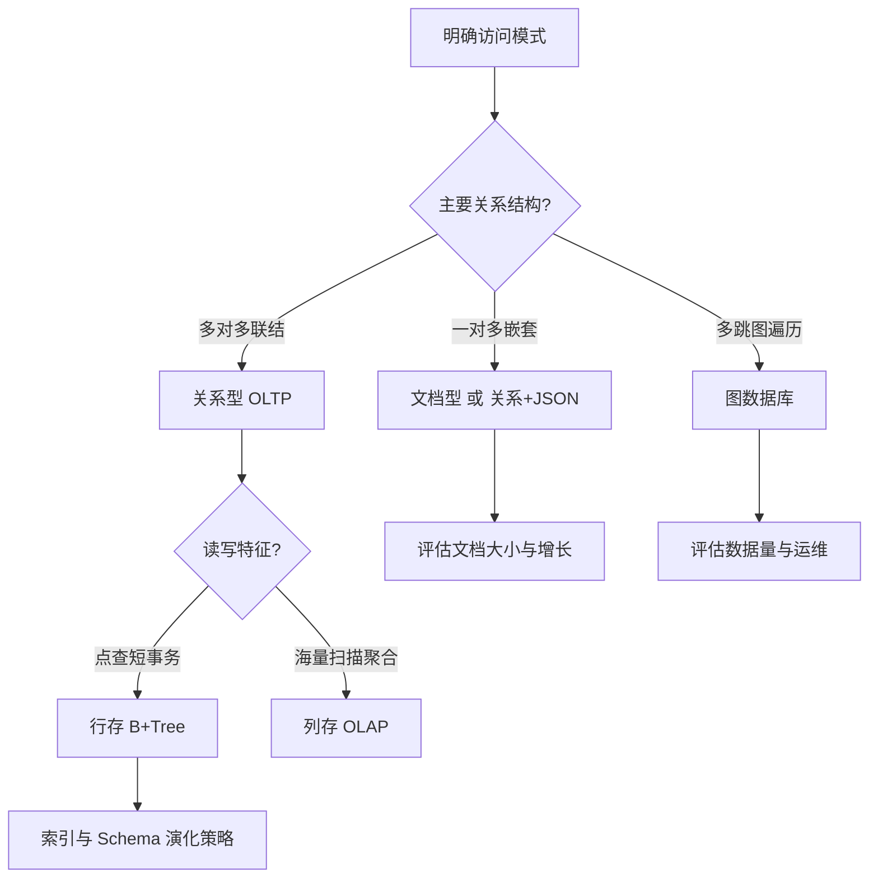

---
aliases:
  - DDIA数据模型与存储选型
tags:
  - DDIA
  - 主题复盘
---

# 数据模型与存储选型

> Part I 横向复盘（第 2–4 章）。做**新表、新库、新索引**前读此篇。

## 决策流程

## 模型选型矩阵

| 访问模式 | 推荐 | 慎用 |
|---|---|---|
| 订单+明细+多表报表 | MySQL/PostgreSQL | Mongo 强行嵌套 |
| 用户配置、JSON 扩展字段 | PG JSONB / MySQL JSON | 无 Schema 失控 |
| 全文搜索、 facet | Elasticsearch | ES 当主库 |
| 时序指标 | TSDB / ClickHouse | MySQL 亿行单表 |
| 缓存热点 | Redis | Redis 持久化当唯一源 |

## 存储引擎与场景

| 场景 | 引擎倾向 | 原因 |
|---|---|---|
| 电商 OLTP | InnoDB | 事务、二级索引 |
| 写密集日志 | LSM（RocksDB/Cassandra） | 顺序写 |
| BI 报表 | ClickHouse / StarRocks | 列存压缩 |
| 搜索 | Lucene/ES 倒排 | 全文与聚合 |

## Schema 演化（第 4 章）

| 变更类型 | 推荐做法 |
|---|---|
| 加可选字段 | 加列 nullable / 默认值 |
| 改字段语义 | 新列 + 双写 + 迁移 |
| 拆表 | 应用层聚合或视图过渡 |
| 跨服务 | Protobuf/Avro + 契约测试 |

## 设计评审必问

1. **真相源**是哪个库？其他是衍生吗？
2. 未来 3 年数据量级？是否需要分区前置？
3. 读路径是否 95% 可索引覆盖？
4. 报表是否走 OLAP，与 OLTP 隔离？

## 章节回链

- [[02-第02章-数据模型与查询语言]]
- [[03-第03章-存储与检索]]
- [[04-第04章-编码与演化]]
