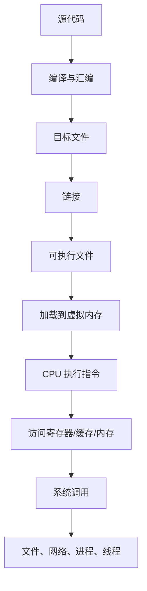

# 深入理解计算机系统核心概念总览

这组笔记提炼自《深入理解计算机系统》第 3 版，目标不是复刻原书，而是把其中对 Java 后端工程师最有价值的底层概念整理成 Obsidian 知识网络。

## 这本书到底讲什么

一句话：

> 程序不是凭空运行的，它会经过编译、链接、加载、执行、访存、I/O、网络、并发等一整套系统机制。

从 Java 工程师视角看，这本书帮助你回答这些问题：

- `int`、`long`、浮点数为什么会溢出或失真？
- JVM 最终生成的机器码大概怎样运行？
- 为什么缓存命中率会影响接口延迟？
- 进程、线程、虚拟内存、文件描述符到底是什么？
- 网络连接为什么本质上也是文件描述符？
- 并发 bug 为什么不是简单加锁就能解决？
- GC、堆、页表、缺页、内存映射之间有什么关系？

## 核心主线

这条链路可以理解为：

- 程序结构：代码如何表示数据和控制逻辑。
- 执行机制：CPU、寄存器、指令、流水线如何执行。
- 存储机制：缓存、主存、虚拟内存如何支撑程序运行。
- 系统接口：进程、I/O、网络、并发如何连接程序与操作系统。

## 笔记目录

- [[01-计算机系统漫游]]
- [[02-信息的表示和处理]]
- [[03-程序的机器级表示]]
- [[04-处理器体系结构]]
- [[05-优化程序性能]]
- [[06-存储器层次结构]]
- [[07-链接]]
- [[08-异常控制流]]
- [[09-虚拟内存]]
- [[10-系统级IO]]
- [[11-网络编程]]
- [[12-并发编程]]
- [[13-Java工程师关联索引]]
- [[14-核心术语索引]]

## 推荐学习顺序

第一遍不要追求所有细节都懂，先建立地图：

1. 先读 [[01-计算机系统漫游]]，建立全局链路。
2. 再读 [[02-信息的表示和处理]]，补齐位、整数、浮点数基础。
3. 读 [[03-程序的机器级表示]] 和 [[04-处理器体系结构]]，理解代码如何变成指令。
4. 读 [[05-优化程序性能]] 和 [[06-存储器层次结构]]，理解性能优化的底层原因。
5. 读 [[07-链接]]、[[08-异常控制流]]、[[09-虚拟内存]]，理解程序为什么能被操作系统管理。
6. 最后读 [[10-系统级IO]]、[[11-网络编程]]、[[12-并发编程]]，连接后端开发日常工作。

## Java 工程师学习重点

最值得反复理解的不是汇编细节，而是这些模型：

- 信息模型：一切数据最终都是位，语义来自上下文。
- 执行模型：程序由指令驱动，CPU 不理解高级语言。
- 内存模型：越靠近 CPU 越快越贵，越远越慢越大。
- 抽象模型：操作系统把硬件抽象为进程、虚拟内存、文件。
- 性能模型：大多数性能问题最终都和数据移动、等待、同步有关。

## 和 Java 的关系

Java 程序虽然运行在 JVM 上，但 JVM 本身仍然运行在操作系统和硬件之上：

- Java 字节码不是终点，JIT 会生成机器码。
- Java 对象在堆中，堆最终映射到虚拟内存页。
- `synchronized`、`volatile`、线程调度都离不开 CPU 和操作系统。
- `Socket`、`FileInputStream`、NIO 底层都关联文件描述符和系统调用。
- GC 暂停、缺页、缓存失效、上下文切换都可能影响线上延迟。

所以这本书不是“C 语言书”，而是理解现代程序运行底座的书。
