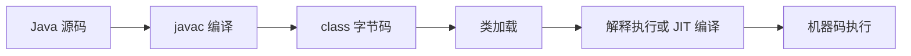

# 计算机系统漫游

本章的作用是建立全局地图：一个看似简单的程序，背后会穿过编译系统、处理器、缓存、主存、磁盘、操作系统和网络。

## 核心问题

程序从源代码到运行结果，中间到底发生了什么？

以一个打印字符串的程序为例，完整链路大致是：


## 重要概念

### 信息就是位加上下文

计算机底层只保存和处理 0/1 位模式。某一串位到底是整数、浮点数、字符、指令还是地址，取决于解释它的上下文。

例如同样的 `01000001`：

- 作为 ASCII 字符，可以表示 `A`。
- 作为无符号整数，可以表示 `65`。
- 作为机器指令的一部分，又可能有完全不同的含义。

这也是学习计算机系统的第一条原则：

> 位模式本身没有语义，语义来自解释规则。

### 程序需要被翻译

高级语言不能直接被 CPU 执行。程序通常要经过：

- 预处理：展开头文件、宏等。
- 编译：把高级语言转成汇编。
- 汇编：把汇编转成可重定位目标文件。
- 链接：把多个目标文件和库合并为可执行文件。

Java 程序也类似，只是路径不同：



### CPU 的基本执行模型

处理器反复做三件事：

1. 从内存取指令。
2. 解释指令含义。
3. 执行指令并更新程序计数器。

关键部件：

- `PC`：程序计数器，指向下一条要执行的指令。
- 寄存器：CPU 内部极快的小容量存储。
- `ALU`：算术逻辑单元，负责计算。
- 主存：保存正在运行的程序和数据。

### 指令集架构和微体系结构

这两个概念容易混：

- 指令集架构，简称 ISA：规定机器指令“看起来是什么、语义是什么”。
- 微体系结构：CPU 内部“如何实现这些指令”。

类比 Java：

- JVM 字节码规范类似 ISA。
- HotSpot、GraalVM 对字节码的具体执行和优化类似微体系结构。

### 高速缓存至关重要

程序运行时会不断移动数据：

- 磁盘到内存。
- 内存到缓存。
- 缓存到寄存器。
- 寄存器再参与计算。

真正的计算通常很快，慢的是数据搬运。缓存利用局部性原理，把近期可能访问的数据放在更靠近 CPU 的地方。

### 存储器层次结构

典型层次：

```text
寄存器
L1 Cache
L2 Cache
L3 Cache
主存 DRAM
SSD/磁盘
远程存储/网络
```

越靠上：

- 越快。
- 越小。
- 越贵。

越靠下：

- 越慢。
- 越大。
- 越便宜。

性能优化经常不是“减少代码行数”，而是“让数据更容易命中上层存储”。

### 操作系统提供三个核心抽象

操作系统把复杂硬件抽象成程序更容易使用的对象：

- 进程：对 CPU、寄存器、程序执行流的抽象。
- 虚拟内存：对主存和地址空间的抽象。
- 文件：对 I/O 设备的抽象。

这三个抽象是后面章节的主线。

### Amdahl 定律

性能优化有上限。系统整体加速受限于不能被优化的部分。

如果一个接口 80% 时间在数据库，20% 时间在应用层，那么你把应用层优化到无限快，整体也最多提升到原来的 1.25 倍左右。

这提醒我们：

- 先定位瓶颈。
- 优化占比大的路径。
- 不要在低占比路径上过度优化。

## Java 工程师关联

- JVM 也是普通进程，需要操作系统调度。
- Java 对象存在堆里，堆最终还是虚拟内存的一部分。
- `File`、`Socket`、`Process` 都是操作系统抽象在 Java 中的映射。
- 接口性能经常受缓存、I/O、上下文切换、系统调用影响。
- 理解系统层，能帮助你判断问题在 JVM、OS、CPU、磁盘还是网络。

## 本章一句话

程序运行不是“代码直接变结果”，而是源代码经过翻译、加载、执行、访存、I/O 等系统机制共同完成的过程。

相关笔记：[[02-信息的表示和处理]]、[[03-程序的机器级表示]]、[[09-虚拟内存]]
