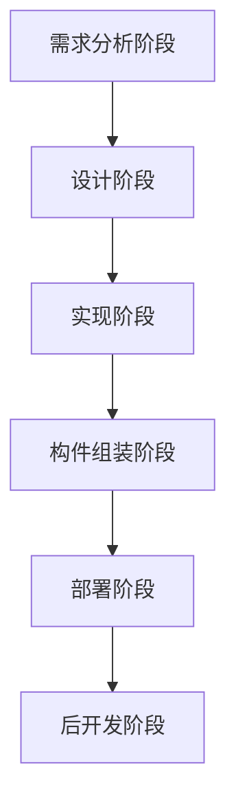

# 5.2.2. 软件架构设计与生命周期

> 本节要点来自课件「软件架构设计与生命周期」。**SA** 指软件架构（Software Architecture）。上级：[[5.2. 软件架构的概念]]。

各阶段与 **SA** 的关系可概括为自上而下贯穿开发与演化过程；其中**设计阶段**是 SA 研究关注得**最早、也最多**的阶段（课件以红框强调）。

### 各阶段要点

| 阶段 | 与 SA 相关的要点 |
| --- | --- |
| **需求分析阶段** | **模型转换**关注两点：如何根据**需求模型**构建 **SA 模型**；**模型转换可追溯**。 |
| **设计阶段** | SA 研究关注得最早、最多的阶段；涉及 **ADL**、**4+1 视图** 等。 |
| **实现阶段** | 课件流程含该阶段，右侧未附单独说明。 |
| **构件组装阶段** | 在**较高层次**上实现系统，**高效**。 |
| **部署阶段** | **SA 为部署提供高层视图**指导。 |
| **后开发阶段** | **动态软件体系结构**（内部执行与外部请求导致变化）；**体系结构恢复与重建**。 |
