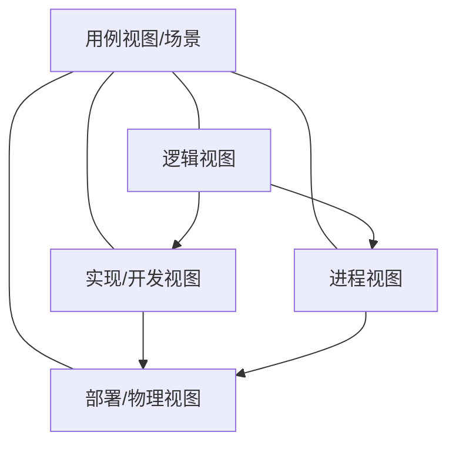

# 5.2.4. 软件架构4+1视图

> 本节要点来自课件「“4+1” 视图」。上级：[[5.2. 软件架构的概念]]。

### 视角与视图

从**不同的视角**来检查系统，因此会形成**不同的视图**（同一架构的多面描述）。

### 五种视图一览

中心的 **「+1」** 为**用例视图（场景）**，与其余四视图重叠、衔接，起到**驱动与统一**架构描述的作用；四视图之间课件用箭头勾连（如逻辑指向实现与进程，实现与进程再指向部署等）。

| 视图 | 主要干系人 | 关注点 | 典型元素 / 关键词（课件强调） |
| --- | --- | --- | --- |
| **逻辑视图** | 最终用户 | **功能需求** | **类与对象** |
| **实现 / 开发视图** | 程序员 | **实现细节** | **配置、装配** |
| **进程视图** | 系统集成人员 | **运行期行为** | **性能、可伸缩、吞吐率、并发** |
| **部署 / 物理视图** | 系统工程人员 | **物理布局与部署** | **发布、安装、拓扑结构** |
| **用例视图 / 场景（+1）** | 分析人员、测试人员 | 以用例与场景**贯穿、校验**其余视图 | 位于模型中心，连接四视图 |

### 结构示意（与课件布局对应）

