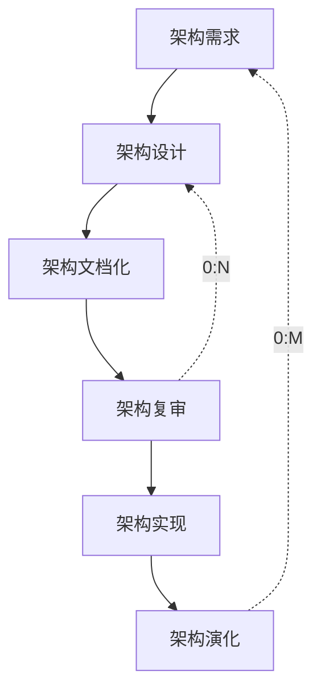

# 5.3.2. ABSD宏观过程与旁注

> 本节要点来自课件「基于架构的软件开发方法 - 开发过程」及主图旁注整理。上级：[[5.3. 基于架构的软件开发方法]]。

### 开发过程

#### 阶段顺序（主线）

1. **架构需求** → 2. **架构设计** → 3. **架构文档化** → 4. **架构复审** → 5. **架构实现** → 6. **架构演化**

#### 反馈回路（课件虚线）

- **架构复审** → **架构设计**：可重复 **0:N** 次（复审不通过则回到设计修正）。
- **架构演化** → **架构需求**：可重复 **0:M** 次（演化后重新梳理或调整架构需求）。

#### 课件流程图排版（Excalidraw / 临摹对照）

与课件主图一致时可按下面摆线（逻辑与上节 Mermaid 相同，仅补充**左右侧走向**）：

- **主线**：六个矩形自上而下排列，相邻步骤之间用**向下实线箭头**连接。
- **0:M**（**架构演化** → **架构需求**）：**虚线**从最下框**左侧**出发，沿主链**左侧**上行回到最上框**左侧**，旁注 **0:M**。
- **0:N**（**架构复审** → **架构设计**）：**虚线**从第四框**右侧**出发，沿主链**右侧**上行回到第二框**右侧**，旁注 **0:N**。
- 主图在「架构文档化」「架构复审」旁常有**右侧旁注**（见下文「主图右侧旁注」）；只画结构时可省略，备考建议与流程框一并整理。

#### 主图右侧旁注（文档化 / 复审）

> **说明**：课件图经助手转述时**未得到右侧小字的可靠 OCR**。下列表述来自与软考体系一致的常见教材归纳，**语义上**多对应幻灯片该位置；若与你讲义**逐字不一致**，请把原句复制发我，可再改成完全一致版。

**架构文档化（旁注常见要点）**

- 文档是系统演化各阶段中，设计与开发人员的**通信媒介**；也是为**验证**架构设计，并在必要时**提炼或修改**设计而进行预先分析的**基础**。
- 文档化过程的主要输出常写为：**架构规格说明**；以及用于说明/验证需求与质量相关内容的 **质量设计说明书**（不同教材对第二份文件名表述略有出入，亦有写作「测试体系结构需求的质量设计说明书」者）。

**架构复审（旁注常见要点）**

- **目的**：**标识潜在风险**，**及早发现**架构（体系结构）设计中的**缺陷和错误**。

#### 课件归纳

1. ABSD 能较好地**支持软件重用**。
2. ABSD 是**自顶向下**、**递归细化**的方法。
3. 软件系统的体系结构经该方法**逐级细化**，直至能导出**软件构件**与**类**。
