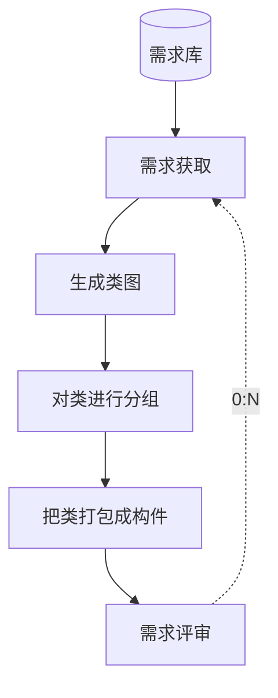
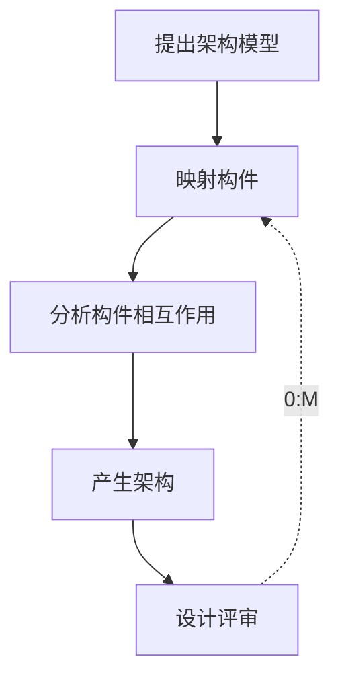

# 5.3.3. 架构需求与架构设计过程

> 课件「基于架构的软件开发方法 - 开发过程」中，对宏观六步里的 **架构需求**、**架构设计** 的展开。上级：[[5.3. 基于架构的软件开发方法]]。

宏观六步中的 **「架构需求」**、**「架构设计」** 在课件中进一步拆成左右两条子过程（中间以竖线分隔示意）。

**架构需求过程**（侧重从需求到构件标识）

- 数据来源：**需求库** → **需求获取**
- **标识构件**（课件虚线框内子步骤，顺序执行）：
  1. **生成类图**
  2. **对类进行分组**
  3. **把类打包成构件**
- **需求评审** → 虚线反馈 **0:N** → **需求获取**（可迭代多轮）

**架构设计过程**（侧重模型、映射与架构产出）

1. **提出架构模型**
2. **映射构件**
3. **分析构件相互作用**
4. **产生架构**
5. **设计评审** → 虚线反馈 **0:M** → **映射构件**（可迭代多轮）

> 注意：此处子过程上的 **0:N**（需求评审→需求获取）与 **0:M**（设计评审→映射构件），与 [[5.3.2. ABSD宏观过程与旁注]] 中**宏观六步**反馈（**架构复审→架构设计（0:N）**、**架构演化→架构需求（0:M）**）是**不同粒度**的课件标注；答题时以题干对应图形或章节为准。
