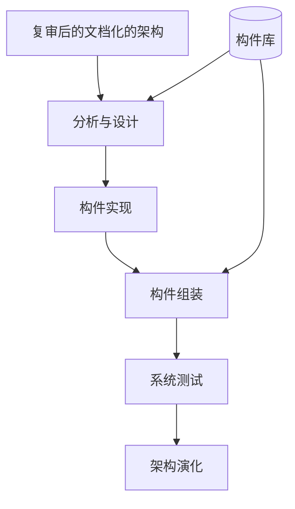
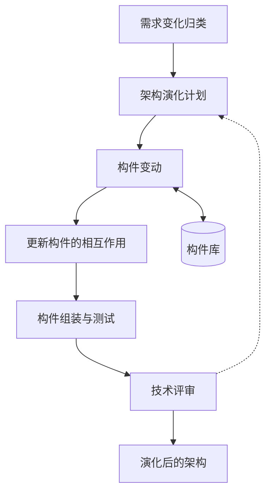

# 5.3.4. 架构实现与架构演化过程

> 课件中对宏观六步里的 **架构实现**、**架构演化** 的展开（左右两列）。上级：[[5.3. 基于架构的软件开发方法]]。

宏观六步中的 **「架构实现」**、**「架构演化」** 在本张课件中拆为**左右两列**：左为 **架构实现过程**（虚线红框），右为 **架构演化过程**；**两列之间**课件标有 **0:N**（与 [[5.3.2. ABSD宏观过程与旁注]]、[[5.3.3. 架构需求与架构设计过程]] 中的 **0:N / 0:M** 标注**不是同一处**；**做题以本图为准**）。

**左列：架构实现过程**

- **输入（顶端）**：**复审后的文档化的架构**。
- **主流程（自上而下）**：
  1. **分析与设计**（课件中该框有红框强调）
  2. **构件实现**（课件中该框有红框强调）
  3. **构件组装**
  4. **系统测试**
- **输出（底端）**：**架构演化**（表示实现阶段结束后进入演化相关活动，并与右列衔接）。
- **构件库**：位于列的**右侧**；有箭头指向 **分析与设计**，另有箭头指向 **构件组装**（从库取构件/支撑组装）。

**右列：架构演化过程**

- **主流程（自上而下）**：
  1. **需求变化归类**
  2. **架构演化计划**
  3. **构件变动**
  4. **更新构件的相互作用**
  5. **构件组装与测试**
  6. **技术评审**
- **结果（底端）**：**演化后的架构**。
- **构件库**：在 **构件变动** 一侧与库为**双向**关系（取用/回写或同步构件等，按教材理解即可）。
- **反馈（虚线）**：**技术评审** → **架构演化计划**（评审不通过或需调整计划时回到第 2 步迭代）。

**两列关系（课件）**

- 左列整体为 **架构实现过程**，右列为 **架构演化过程**；图中央对两列标 **0:N**（表示实现结果与演化活动之间的衔接方式，具体定义以讲义/教材为准）。
