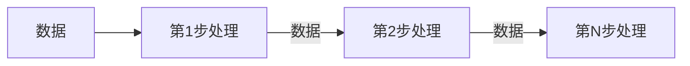

# 5.4. 软件架构风格

## 5.4.1. 软件架构风格——总概

> 本节要点来自课件「软件架构风格」。

**定义（课件）**：架构风格定义了用于描述系统的**术语表**和一组**指导构建系统的规则**。

### 五大架构风格与子风格（课件表）

| 五大架构风格 | 子风格 |
| --- | --- |
| **数据流风格**（Data Flow） | **批处理**（Batch Sequential）、**管道-过滤器**（Pipes and Filters） |
| **调用/返回风格**（Call/Return） | **主程序/子程序**（Main Program and Subroutine）、**面向对象**（Object-oriented）、**分层架构**（Layered System） |
| **独立构件风格**（Independent Components） | **进程通信**（Communicating Processes）、**事件驱动系统（隐式调用）**（Event system） |
| **虚拟机风格**（Virtual Machine） | **解释器**（interpreter）、**规则系统**（Rule-based System） |
| **以数据为中心**（Data-centered） | **数据库系统**（Database System）、**黑板系统**（Blackboard System）、**超文本系统**（Hypertext System） |

## 5.4.2. 软件架构风格——数据流风格

> 本节要点来自课件「软件架构风格 - 数据流风格」。

### 结构示意（课件流程图）

数据依次经过多步处理；**相邻步骤之间传递的是「数据」**；各步串联体现 **分步处理**。

**数据驱动（课件旁注）**：**前一步的处理结果是后一步的输入内容**（即 **数据驱动**）。

### 特点与实例（课件表）

| 优点 | 缺点 | 典型实例 |
| --- | --- | --- |
| 1. **松耦合**【高内聚-低耦合】 | 1. **交互性**较差 | 传统编译器 |
| 2. 良好的**重用性** / **可维护性** | 2. **复杂性**较高 | 网络报文处理 |
| 3. **可扩展性**【标准接口适配】 | 3. **性能**较差（每个过滤器都需要**解析与合成**数据） | |
| 4. 良好的**隐蔽性** | | |
| 5. **支持并行** | | |

## 5.4.3. 软件架构风格——调用返回风格

## 5.4.4. 软件架构风格——独立构件风格

## 5.4.5. 软件架构风格——事件管理器工作机制

## 5.4.6. 软件架构风格——虚拟机风格

## 5.4.7. 软件架构风格——解释器风格的构成及各部分职能

## 5.4.8. 软件架构风格——规则系统风格的构成及各部分职能

## 5.4.9. 软件架构风格——仓库风格

## 5.4.10. 软件架构风格——闭环风格

## 5.4.11. 软件架构风格——C2风格

## 5.4.12. 软件架构风格——习题讲解1

## 5.4.13. 软件架构风格——习题讲解2

## 5.4.14. 软件架构风格——MDA

## 5.4.15. 软件架构复用
